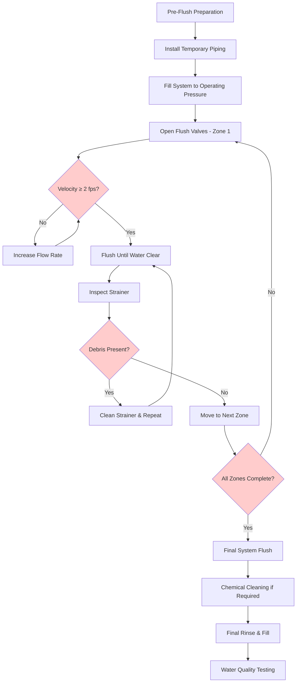
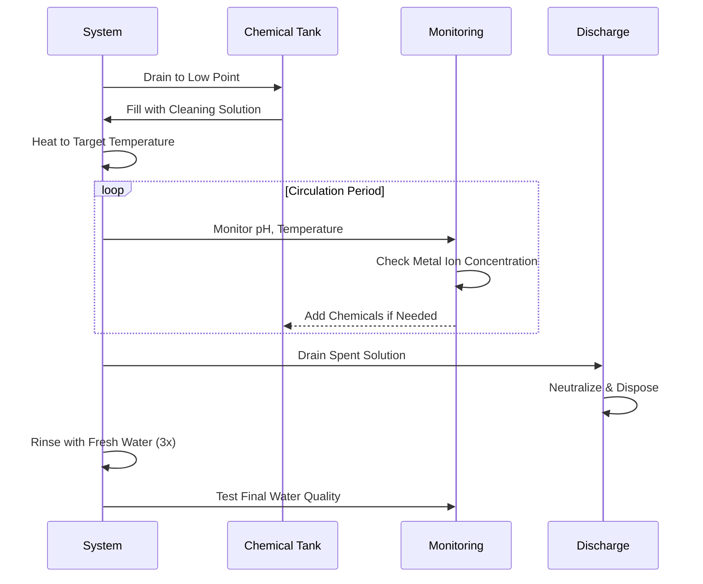

## System Flushing Requirements

Proper flushing of hydronic systems removes construction debris, pipe scale, welding slag, flux residue, and other contaminants that can damage equipment, reduce heat transfer efficiency, and compromise system performance. System flushing is a critical commissioning activity that must be performed before equipment startup and final balancing.

## Flushing Velocity Criteria

### Minimum Velocity Requirements

The fundamental requirement for effective system flushing is achieving sufficient water velocity to mobilize and transport debris:

| System Type | Minimum Flushing Velocity | Target Velocity |
|-------------|---------------------------|-----------------|
| Chilled water | 2.0 fps | 3.0-4.0 fps |
| Hot water | 2.0 fps | 3.0-4.0 fps |
| Condenser water | 2.5 fps | 4.0-5.0 fps |
| Large diameter mains (>6 in) | 2.5 fps | 4.0 fps |

**Physics basis:** The minimum 2-3 fps velocity requirement derives from the drag force needed to mobilize typical construction debris. At velocities below 2 fps, particles settle in horizontal piping and low-velocity zones, while velocities above 3 fps provide turbulent flow (Re > 4000 for typical pipe sizes) that scours pipe walls and maintains particles in suspension.

### Flow Rate Calculations

To achieve target flushing velocities, calculate required flow rates:

**Q = V × A × 449 gpm**

Where:
- Q = flow rate (gpm)
- V = velocity (fps)
- A = pipe cross-sectional area (ft²)
- 449 = conversion factor (gpm/fps·ft²)

For circular pipes: A = π × (D/12)² / 4, where D is pipe inside diameter in inches.

**Example:** For 6-inch Schedule 40 pipe (ID = 6.065 in):
- A = 0.0200 ft²
- For 3.0 fps: Q = 3.0 × 0.0200 × 449 = 26.9 gpm

## Flushing Procedures

### Pre-Flushing Preparation

**Equipment protection measures:**

1. Isolate all terminal equipment including coils, heat exchangers, control valves, and pumps
2. Remove or bypass pump impellers (install temporary spools if necessary)
3. Close automatic control valves or remove actuators
4. Remove differential pressure sensing lines or close isolation valves
5. Install temporary jumpers around isolation valves as needed
6. Verify all strainers are clean with 20-mesh startup screens installed

### Flushing Sequence

### Systematic Flushing Process

**Zone-by-zone approach:**

1. **Divide system into flushable zones** based on available flow capacity and isolation valve locations
2. **Begin with mains and risers** flushing from highest elevation to drainage points
3. **Progress to branch circuits** flushing individual loops sequentially
4. **Maintain minimum velocity** continuously during flushing operations
5. **Monitor effluent clarity** at discharge points using visual inspection
6. **Document each zone** including flow rates, duration, and observed conditions

### Flush Duration

Continue flushing each zone until:
- Discharge water runs visibly clear for minimum 15 minutes
- Strainer screens show minimal debris accumulation
- Turbidity readings stabilize below 10 NTU
- No visible particulates in collected samples

Typical duration: 30-90 minutes per zone depending on pipe size and initial contamination levels.

## Chemical Cleaning Procedures

### When Chemical Cleaning is Required

Chemical cleaning becomes necessary when:
- Systems contain excessive mill scale, rust, or corrosion products
- Flushing alone cannot achieve acceptable cleanliness
- Equipment manufacturers specify chemical cleaning
- Systems have been in service and require rehabilitation

### Cleaning Agent Selection

| Contaminant Type | Recommended Cleaner | Concentration | Temperature |
|------------------|---------------------|---------------|-------------|
| Mill scale, rust | Inhibited acid | 5-15% | 120-150°F |
| Grease, oil | Alkaline detergent | 2-5% | 140-180°F |
| Biological growth | Biocide + dispersant | Per manufacturer | 70-90°F |
| Mixed deposits | Sequential treatment | Varies | Varies |

**Critical considerations:**

1. **Material compatibility:** Verify cleaner compatibility with all system materials including metals, gaskets, and coatings
2. **Inhibitor requirements:** Use corrosion inhibitors in acid cleaning formulations to prevent base metal attack
3. **Neutralization:** Plan for proper neutralization and disposal of spent cleaning solutions
4. **Contact time:** Follow manufacturer recommendations for circulation time (typically 4-24 hours)

### Chemical Cleaning Protocol

**Post-cleaning requirements:**

1. Thoroughly rinse system with fresh water until pH returns to 7.0-8.5
2. Perform final flush at design velocities
3. Test water chemistry for residual cleaning agents
4. Add corrosion inhibitors and treatment chemicals
5. Document all cleaning activities and test results

## Strainer Inspection and Cleaning

### Inspection Frequency

**During flushing operations:**
- Initial inspection: After first 15 minutes of flushing
- Subsequent inspections: Every 30 minutes until debris accumulation ceases
- Final inspection: After achieving clear discharge

**Post-startup period:**
- Daily inspections for first week
- Weekly inspections for first month
- Monthly inspections until debris stabilizes

### Strainer Analysis

Examine collected debris for:

1. **Type identification:** Welding slag, pipe scale, sand, metal shavings, thread sealant
2. **Quantity assessment:** Document volume and distribution
3. **Source determination:** Trace debris origin to identify problem areas
4. **Size characterization:** Large particles indicate inadequate upstream filtration

**Corrective actions based on findings:**

- Heavy slag accumulation: Additional flushing of welded areas
- Continuous fine debris: Install finer mesh strainers temporarily
- Specific debris types: Targeted cleaning of identified problem zones
- Ongoing accumulation: Extended flushing period or chemical cleaning

### Permanent Strainer Installation

After completing system flushing:

1. Replace coarse startup screens (20 mesh) with permanent screens (40-60 mesh)
2. Install blowdown assemblies on large strainers for online cleaning
3. Verify differential pressure gauges are operational
4. Set alarm points at 5-7 psid for automatic notification
5. Establish routine inspection and cleaning schedule

## Water Quality Testing

### Post-Flush Water Analysis

Verify system cleanliness through laboratory testing:

| Parameter | Acceptance Criteria | Test Method |
|-----------|---------------------|-------------|
| Turbidity | < 10 NTU | Nephelometric |
| Total suspended solids | < 25 mg/L | Gravimetric |
| pH | 7.0-9.5 | Electrode |
| Iron | < 1.0 mg/L | Colorimetric |
| Copper | < 0.5 mg/L | Colorimetric |
| Chlorides | < 100 mg/L | Titration |

### Treatment Chemical Addition

After achieving acceptable water quality:

1. Add corrosion inhibitors per manufacturer recommendations
2. Adjust pH to optimal range (typically 8.0-9.0 for steel systems)
3. Establish biocide program for open systems
4. Add glycol if antifreeze protection required
5. Document baseline water chemistry for ongoing monitoring

## Documentation Requirements

**Comprehensive flushing records must include:**

- System schematic showing flushing zones and sequence
- Flow rates and calculated velocities for each zone
- Flushing duration and total water volume used
- Strainer inspection findings with photographs
- Water quality test results (pre and post flushing)
- Chemical cleaning procedures and material safety data
- Equipment isolation and restoration procedures
- Sign-off by commissioning authority and owner representative

This documentation becomes part of the permanent facility O&M manual and provides baseline data for future system maintenance.

## Standards and References

- **ASHRAE Handbook - HVAC Systems and Equipment, Chapter 43:** Provides detailed guidance on water treatment and system preparation
- **ASHRAE Guideline 0-2019:** Commissioning process requirements including system flushing verification
- **ASHRAE Guideline 3-2012:** Quality installation verification of HVAC systems
- **NEBB Procedural Standards:** Testing, adjusting, and balancing of environmental systems
- **ASTM D2777:** Standard practice for water-formed deposits in closed cooling water systems

---

**Related Topics:**
- Hydronic Systems Testing overview
- Pump Performance Testing
- Flow Measurement Procedures
- Water Treatment Programs
