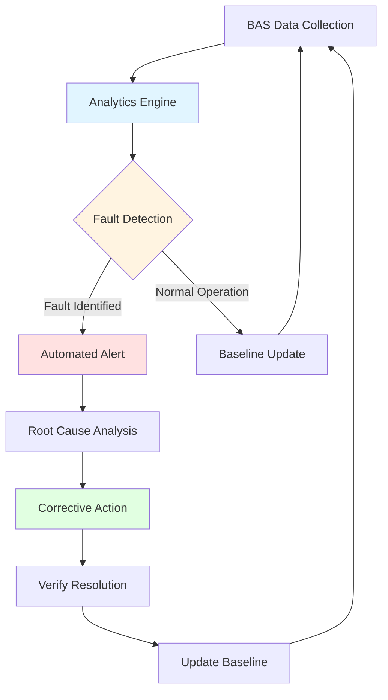
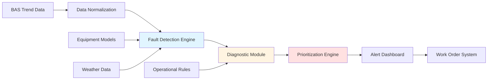
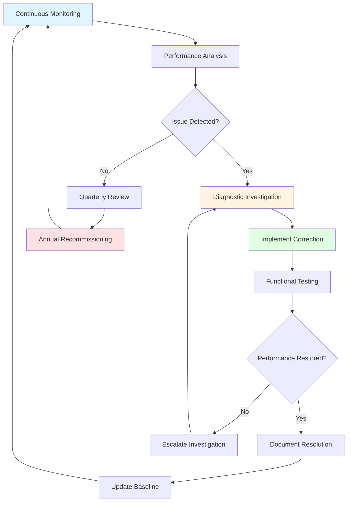

# Ongoing Commissioning and Building Performance

Ongoing commissioning (OCx) represents the systematic process of maintaining, improving, and optimizing building system performance throughout the operational life of a facility. Unlike initial commissioning that verifies new or renovated systems meet design intent, ongoing commissioning addresses performance degradation, operational drift, and changing building requirements that occur over time.

## Continuous Commissioning Framework

Continuous commissioning extends beyond reactive troubleshooting to proactive performance optimization. ASHRAE Guideline 0.2 defines ongoing commissioning as "a process that maintains and improves building performance over time by identifying and correcting system deficiencies and optimizing system operation."

**Core OCx Activities:**

- Systematic performance trending and analysis
- Periodic functional testing of critical sequences
- Energy consumption benchmarking against baselines
- Operator training and knowledge transfer
- Documentation updates reflecting operational changes
- Measurement and verification of efficiency improvements

The continuous nature differentiates OCx from periodic recommissioning events. Performance monitoring occurs continuously through building automation systems, with formal reviews conducted quarterly or annually depending on facility complexity and criticality.

## Monitoring-Based Commissioning

Monitoring-based commissioning (MBCx) leverages automated data collection from building management systems to identify performance issues without manual testing. This approach transforms commissioning from periodic event-driven activities to continuous data-driven optimization.

**MBCx Implementation Phases:**

1. **Data Point Identification** - Select critical system parameters representing performance indicators (supply air temperature, chiller efficiency, zone temperatures, damper positions)

2. **Baseline Establishment** - Collect performance data during verified optimal operation, establishing expected ranges for comparison

3. **Rule Development** - Create fault detection rules based on physical relationships, control sequences, and equipment characteristics

4. **Automated Monitoring** - Continuously compare real-time data against baselines and physical limits

5. **Alert Generation** - Notify operators when deviations exceed thresholds, prioritizing issues by energy impact and comfort consequences

## Fault Detection and Diagnostics

Fault detection and diagnostics (FDD) systems automate the identification and diagnosis of equipment and control system problems. FDD represents the analytical core of monitoring-based commissioning, applying algorithms to detect operational deviations.

### FDD Methodologies

**Rule-Based Detection** applies expert knowledge encoded as logical rules. Example rules include:

- If outdoor air temperature < 55°F and economizer damper > 50% open, then economizer stuck fault
- If supply air temperature - zone temperature setpoint > 3°F for > 30 minutes, then cooling capacity fault
- If chiller kW/ton > baseline by 15%, then condenser fouling or refrigerant charge issue

**Statistical Methods** identify deviations from expected performance using regression models, statistical process control, or machine learning algorithms trained on historical data patterns.

**Physical Model-Based Approaches** compare measured performance against first-principles thermodynamic models, detecting degradation in heat transfer coefficients, pump efficiency, or fan performance.

### Common Fault Categories

| Fault Type | Detection Method | Impact |
|------------|------------------|---------|
| Stuck dampers/valves | Position vs. command deviation | Energy waste, comfort issues |
| Sensor drift/failure | Cross-correlation, range limits | False alarms, improper control |
| Simultaneous heating/cooling | Energy flow analysis | Energy waste |
| Economizer lockout | Outdoor air fraction vs. conditions | Missed free cooling |
| Schedule overrides | Runtime vs. occupancy schedule | Unnecessary operation |
| Control loop hunting | High-frequency oscillation detection | Equipment wear, instability |

### FDD System Architecture

Effective FDD implementation requires calibrated inputs, validated fault rules, and integration with maintenance workflows. False positive rates must remain low to maintain operator confidence and prevent alert fatigue.

## Ongoing Commissioning Process Flow

The systematic OCx process follows a cyclic pattern of monitoring, analysis, correction, and verification:

**Monthly Activities:**
- Review FDD alerts and trends
- Verify sensor calibration on critical points
- Check control sequence operation
- Analyze energy consumption patterns

**Quarterly Activities:**
- Conduct functional performance tests on critical systems
- Update seasonal setpoints and schedules
- Review operator logs for recurring issues
- Benchmark energy performance against targets

**Annual Activities:**
- Comprehensive system functional testing
- Recalibrate sensors and meters
- Update control sequences for efficiency
- Training refresher for operators
- Documentation updates

## Building Analytics and Performance Metrics

Building analytics platforms aggregate data from multiple sources, providing comprehensive performance insights beyond individual system monitoring.

**Key Performance Indicators:**

- Energy Use Intensity (EUI) - kBTU/sq ft/year compared to baseline and peer buildings
- System efficiency metrics - kW/ton for chillers, fan power per CFM, boiler efficiency
- Comfort metrics - percentage of occupied hours meeting temperature and humidity setpoints
- Equipment runtime hours - tracking maintenance intervals and lifecycle planning
- Demand response capability - available load shed capacity during peak events

Advanced analytics identify optimization opportunities through:

- Load profile analysis revealing scheduling inefficiencies
- Equipment staging optimization reducing cycling losses
- Setpoint reset strategies based on actual loads
- Predictive maintenance using performance degradation trends

## Seasonal Recommissioning

Seasonal transitions require systematic verification that control sequences respond appropriately to changing outdoor conditions and load profiles.

**Spring Transition Checklist:**
- Verify economizer activation at proper outdoor temperatures
- Test chilled water system startup and sequencing
- Adjust ventilation rates for increased outdoor air usage
- Disable heating systems and verify lockout controls
- Check humidity control changeover to dehumidification mode

**Fall Transition Checklist:**
- Verify heating system operation and safety interlocks
- Test boiler sequencing and outdoor reset controls
- Reduce outdoor air to minimum ventilation rates
- Activate humidification systems where applicable
- Verify freeze protection sequences for air-cooled equipment

## Implementation Considerations

Successful ongoing commissioning requires organizational commitment beyond technical tools.

**Staffing Requirements:**
- Dedicated commissioning authority or energy manager
- Building operator training on OCx principles
- Access to controls specialists for sequence modifications
- Integration with maintenance and capital planning teams

**Technology Infrastructure:**
- Building automation system with comprehensive trending capability (15-minute intervals minimum)
- FDD software integrated with BAS data
- Energy metering at system and whole-building levels
- Cloud-based analytics for multi-building portfolios

**Cost-Benefit Analysis:**

Studies document OCx delivers 5-20% energy savings with payback periods of 1-3 years. Beyond direct energy savings, benefits include extended equipment life, reduced emergency repairs, improved comfort, and maintained system efficiency over time.

ASHRAE Guideline 0.2 provides detailed implementation procedures, establishing industry standards for ongoing commissioning programs. Building analytics and automated FDD systems reduce labor requirements while improving detection speed and accuracy, making continuous optimization economically viable for facilities of all sizes.

Ongoing commissioning transforms building operation from reactive maintenance to proactive performance management, ensuring systems maintain design intent and adapt to evolving operational requirements throughout their service life.
