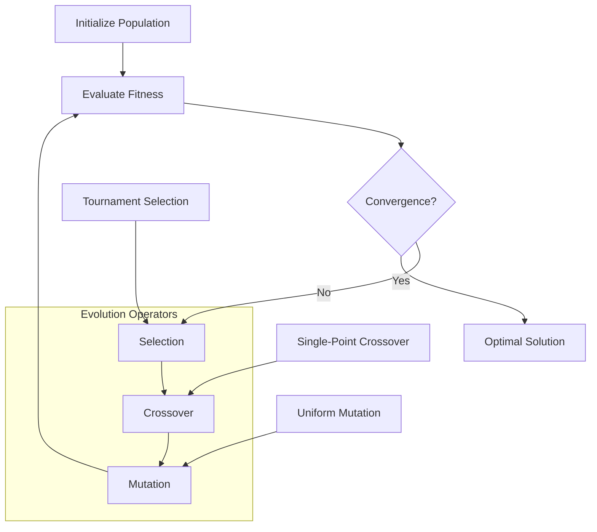
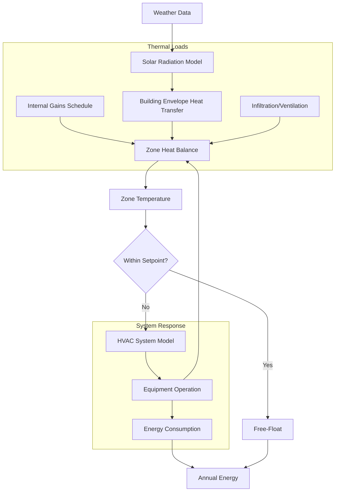

# Computational Methods in HVAC Research

Computational methods transform HVAC engineering from empirical practice to quantitative science. Numerical techniques solve governing equations for heat transfer, fluid flow, and mass transport that define system behavior. Advanced algorithms optimize designs, predict performance, and enable virtual prototyping before physical construction. These methods accelerate innovation while reducing development costs and improving energy efficiency.

## Fundamental Governing Equations

HVAC systems obey conservation laws for mass, momentum, energy, and species. Computational methods discretize and solve these partial differential equations across spatial and temporal domains.

### Conservation of Mass

For compressible flow with species transport:

$$
\frac{\partial \rho}{\partial t} + \nabla \cdot (\rho \mathbf{u}) = S_m
$$

Where $\rho$ is density (kg/m³), $\mathbf{u}$ is velocity vector (m/s), and $S_m$ represents source terms from infiltration, ventilation, or moisture generation.

### Conservation of Momentum

The Navier-Stokes equations govern fluid motion:

$$
\frac{\partial (\rho \mathbf{u})}{\partial t} + \nabla \cdot (\rho \mathbf{u} \mathbf{u}) = -\nabla p + \nabla \cdot \boldsymbol{\tau} + \rho \mathbf{g} + \mathbf{F}
$$

Where $p$ is pressure (Pa), $\boldsymbol{\tau}$ is the viscous stress tensor, $\mathbf{g}$ is gravitational acceleration (9.81 m/s²), and $\mathbf{F}$ represents body forces.

### Conservation of Energy

The energy equation couples thermal and flow fields:

$$
\frac{\partial (\rho h)}{\partial t} + \nabla \cdot (\rho \mathbf{u} h) = \nabla \cdot (k \nabla T) + \nabla \cdot (\mathbf{u} \cdot \boldsymbol{\tau}) + S_h
$$

Where $h$ is enthalpy (J/kg), $k$ is thermal conductivity (W/m·K), $T$ is temperature (K), and $S_h$ includes radiation, viscous dissipation, and internal heat generation.

### Species Conservation

Moisture and contaminant transport follow:

$$
\frac{\partial (\rho Y_i)}{\partial t} + \nabla \cdot (\rho \mathbf{u} Y_i) = \nabla \cdot (D_i \nabla Y_i) + S_i
$$

Where $Y_i$ is mass fraction of species i, $D_i$ is diffusion coefficient (m²/s), and $S_i$ represents generation or removal rates.

## Numerical Discretization Methods

### Finite Difference Method (FDM)

FDM approximates derivatives on structured grids. For transient heat conduction in building materials, the Crank-Nicolson implicit scheme provides unconditional stability:

$$
\frac{T_i^{n+1} - T_i^n}{\Delta t} = \frac{\alpha}{2} \left[ \frac{T_{i+1}^{n+1} - 2T_i^{n+1} + T_{i-1}^{n+1}}{\Delta x^2} + \frac{T_{i+1}^n - 2T_i^n + T_{i-1}^n}{\Delta x^2} \right]
$$

Where $\alpha$ is thermal diffusivity (m²/s), superscript n denotes time level, and subscript i represents spatial node.

**Applications:**
- Wall thermal response calculations
- Response factor generation for load calculation
- Duct and pipe heat loss analysis
- Ground heat exchanger modeling

### Finite Volume Method (FVM)

FVM enforces conservation over control volumes. The discretized energy equation integrates over cell volume V:

$$
\int_V \frac{\partial (\rho h)}{\partial t} dV + \int_S (\rho \mathbf{u} h) \cdot d\mathbf{A} = \int_S (k \nabla T) \cdot d\mathbf{A} + \int_V S_h dV
$$

FVM naturally handles complex geometries and non-uniform grids while preserving conservation properties.

**Applications:**
- Computational fluid dynamics (CFD) simulations
- Air distribution system analysis
- Heat exchanger performance modeling
- Combustion and chemical reaction systems

### Finite Element Method (FEM)

FEM uses variational principles and shape functions to approximate solutions. The weak form minimizes residuals over trial function spaces. For structural-thermal coupling in ductwork:

$$
[K_{th}]\{T\} + [C_{th}]\{\dot{T}\} = \{F_{th}\} + [K_{ts}]\{u\}
$$

Where $[K_{th}]$ is thermal conductance, $[C_{th}]$ is thermal capacitance, $\{F_{th}\}$ represents thermal loads, and $[K_{ts}]\{u\}$ couples temperature to structural displacement.

**Applications:**
- Thermal bridge analysis in building envelopes
- Radiant heating/cooling panel design
- Thermal stress in equipment components
- Phase change material (PCM) integration

## Turbulence Modeling

HVAC flows exhibit turbulence characterized by Reynolds numbers exceeding 2300 for internal flows. Direct numerical simulation (DNS) resolves all scales but requires computational resources scaling as Re³. Practical engineering relies on turbulence models.

### Reynolds-Averaged Navier-Stokes (RANS)

RANS decomposes flow variables into mean and fluctuating components. The k-ε model solves transport equations for turbulent kinetic energy k and dissipation rate ε:

$$
\frac{\partial (\rho k)}{\partial t} + \nabla \cdot (\rho \mathbf{u} k) = \nabla \cdot \left[ \left( \mu + \frac{\mu_t}{\sigma_k} \right) \nabla k \right] + P_k - \rho \varepsilon
$$

$$
\frac{\partial (\rho \varepsilon)}{\partial t} + \nabla \cdot (\rho \mathbf{u} \varepsilon) = \nabla \cdot \left[ \left( \mu + \frac{\mu_t}{\sigma_\varepsilon} \right) \nabla \varepsilon \right] + C_{1\varepsilon} \frac{\varepsilon}{k} P_k - C_{2\varepsilon} \rho \frac{\varepsilon^2}{k}
$$

Where $\mu_t = \rho C_\mu k^2 / \varepsilon$ is turbulent viscosity and $P_k$ represents production of turbulence.

**Model Comparison:**

| Model | Computational Cost | Accuracy | Best Application |
|-------|-------------------|----------|------------------|
| k-ε Standard | Low | Moderate | General room airflow |
| k-ε RNG | Low | Good | Recirculation zones |
| k-ω SST | Moderate | Excellent | Boundary layers, jets |
| Reynolds Stress (RSM) | High | Excellent | Swirling flows, rotation |
| Large Eddy Simulation (LES) | Very High | Highest | Unsteady phenomena |

### Wall Functions vs. Near-Wall Resolution

Wall treatment significantly impacts solution accuracy. Low-Reynolds number models resolve the viscous sublayer (y⁺ < 5) but require fine grids. Wall functions bridge the viscous layer using logarithmic profiles (30 < y⁺ < 300), reducing computational requirements.

The dimensionless wall distance is:

$$
y^+ = \frac{\rho u_\tau y}{\mu}
$$

Where $u_\tau = \sqrt{\tau_w / \rho}$ is friction velocity and $\tau_w$ is wall shear stress.

## Optimization Algorithms

HVAC system design involves multi-objective optimization balancing energy consumption, thermal comfort, indoor air quality, and cost.

### Gradient-Based Optimization

For differentiable objective functions, gradient methods efficiently locate local optima. The sequential quadratic programming (SQP) algorithm solves:

$$
\min_{x} f(x) \quad \text{subject to} \quad g_i(x) \leq 0, \quad h_j(x) = 0
$$

By iteratively solving quadratic subproblems using Hessian approximations.

**Applications:**
- Equipment sizing optimization
- Control parameter tuning
- Duct and pipe network design
- Heat exchanger geometry optimization

### Genetic Algorithms (GA)

Population-based stochastic search explores the design space without gradient information. GA mimics biological evolution through selection, crossover, and mutation operations.

**Applications:**
- Multi-zone VAV system optimization
- Plant equipment scheduling
- Renewable energy system sizing
- Retrofit strategy selection

### Particle Swarm Optimization (PSO)

PSO updates particle positions and velocities based on individual and global best solutions:

$$
v_i^{k+1} = w v_i^k + c_1 r_1 (p_i - x_i^k) + c_2 r_2 (p_g - x_i^k)
$$

$$
x_i^{k+1} = x_i^k + v_i^{k+1}
$$

Where $w$ is inertia weight, $c_1$ and $c_2$ are cognitive and social parameters, $r_1$ and $r_2$ are random numbers, $p_i$ is particle best, and $p_g$ is global best.

**Applications:**
- Control strategy optimization
- Energy storage operation scheduling
- Building thermal zone configuration
- HVAC system topology design

## Building Energy Simulation

Whole-building energy models integrate envelope thermal response, HVAC systems, internal gains, and weather data through coupled differential-algebraic equations.

### Zone Heat Balance Method

The zone air heat balance accounts for all energy flows:

$$
\rho V c_p \frac{dT_{zone}}{dt} = \sum Q_{surf} + Q_{inf} + Q_{vent} + Q_{int} + Q_{HVAC}
$$

Where:
- $\rho V c_p \frac{dT_{zone}}{dt}$ = zone thermal capacitance (W)
- $\sum Q_{surf}$ = convective heat transfer from all surfaces (W)
- $Q_{inf}$ = infiltration heat gain/loss (W)
- $Q_{vent}$ = ventilation heat gain/loss (W)
- $Q_{int}$ = internal gains from occupants, lights, equipment (W)
- $Q_{HVAC}$ = HVAC system heating/cooling (W)

### Radiant Time Series (RTS) Method

ASHRAE's RTS method converts instantaneous heat gains to cooling loads through time-series response factors. The radiant component of internal gains distributes to surfaces, then releases to zone air with time delay:

$$
Q_{load,t} = \sum_{i=0}^{23} Q_{gain,t-i} \cdot r_i
$$

Where $r_i$ are radiant time factors based on building construction and furnishings.

### Simulation Workflow

## Machine Learning Applications

Machine learning algorithms complement physics-based models by identifying patterns in operational data and accelerating computationally expensive simulations.

### Supervised Learning for Performance Prediction

Artificial neural networks (ANNs) approximate complex input-output relationships. For chiller performance prediction:

$$
\text{COP} = f_{ANN}(T_{chw,out}, T_{cw,in}, \dot{Q}_{cooling}, PLR)
$$

Where the network is trained on manufacturer data or operational measurements to predict coefficient of performance based on operating conditions.

**Applications:**
- Equipment performance curves
- Fault detection and diagnostics
- Energy consumption forecasting
- Thermal comfort prediction

### Reinforcement Learning for Control

Q-learning and deep reinforcement learning (DRL) optimize control policies through trial-and-error interaction with building environments. The agent learns an optimal policy $\pi^*$ that maximizes cumulative reward:

$$
Q^*(s,a) = \max_\pi \mathbb{E} \left[ \sum_{t=0}^\infty \gamma^t r_t \mid s_0=s, a_0=a \right]
$$

Where $s$ is state (zone temperatures, outdoor conditions), $a$ is action (equipment on/off, setpoints), $r_t$ is reward (negative of energy cost and comfort penalty), and $\gamma$ is discount factor.

**Applications:**
- Model predictive control (MPC)
- Demand response optimization
- Multi-zone temperature control
- Energy storage dispatch

### Surrogate Modeling

High-fidelity CFD and FEM simulations require hours to days per design iteration. Surrogate models trained on design of experiments (DOE) data enable real-time optimization. Gaussian process regression provides uncertainty quantification:

$$
y(x) = \mathcal{GP}(\mu(x), k(x,x'))
$$

Where $\mu(x)$ is mean function and $k(x,x')$ is kernel function defining spatial correlation.

**Applications:**
- CFD-based design optimization
- Calibration of building energy models
- Uncertainty quantification
- Parametric sensitivity analysis

## Validation and Verification

ASHRAE Guideline 14 and Standard 140 establish protocols for model validation.

### Verification Tests

Code verification ensures correct implementation of governing equations:

1. **Mass balance**: Verify conservation for closed systems
2. **Energy balance**: Check first law compliance within tolerance
3. **Analytical solutions**: Compare to exact solutions for simplified cases
4. **Grid independence**: Demonstrate solution convergence with mesh refinement
5. **Time step independence**: Verify temporal discretization adequacy

### Validation Metrics

Model predictions are compared against measured data using statistical metrics:

**Mean Bias Error (MBE):**

$$
\text{MBE} = \frac{\sum_{i=1}^n (y_{sim,i} - y_{meas,i})}{\sum_{i=1}^n y_{meas,i}} \times 100\%
$$

ASHRAE Guideline 14 requires MBE within ±10% for hourly calibration, ±5% for monthly.

**Coefficient of Variation of Root Mean Square Error (CV-RMSE):**

$$
\text{CV-RMSE} = \frac{\sqrt{\frac{1}{n}\sum_{i=1}^n (y_{sim,i} - y_{meas,i})^2}}{\bar{y}_{meas}} \times 100\%
$$

ASHRAE Guideline 14 requires CV-RMSE within 30% for hourly, 15% for monthly calibration.

## Computational Resources and Performance

### Hardware Considerations

| Analysis Type | Typical Grid Size | RAM Requirement | CPU Time | Recommended Hardware |
|---------------|------------------|-----------------|----------|---------------------|
| Building Energy (Annual) | Zone-level | 1-4 GB | Minutes | Desktop CPU |
| CFD Steady RANS | 10⁵-10⁶ cells | 8-32 GB | Hours | Workstation |
| CFD Transient RANS | 10⁶-10⁷ cells | 32-128 GB | Days | Multi-core server |
| LES | 10⁷-10⁸ cells | 128-512 GB | Weeks | HPC cluster |
| Optimization (GA 100 gen) | Variable | 4-16 GB | Hours-Days | Parallel cluster |

### Parallel Computing

Domain decomposition enables parallel solution on distributed memory systems. Speedup follows Amdahl's law:

$$
S(p) = \frac{1}{(1-f) + \frac{f}{p}}
$$

Where $p$ is number of processors and $f$ is fraction of code that is parallelizable. Typical CFD achieves 70-90% parallel efficiency for well-decomposed problems.

## Software Ecosystem

### Commercial Platforms

- **EnergyPlus**: DOE's flagship building energy simulation engine
- **ANSYS Fluent/CFX**: Industry-standard CFD packages
- **COMSOL Multiphysics**: Coupled FEM for multi-physics problems
- **IES-VE**: Integrated building performance simulation
- **TRNSYS**: Transient system simulation with extensive libraries

### Open-Source Tools

- **OpenFOAM**: General-purpose CFD framework
- **FreeCAD + CfdOF**: Parametric CAD with CFD integration
- **Modelica/OpenModelica**: Equation-based modeling language
- **Python (SciPy, NumPy, TensorFlow)**: Custom algorithm development
- **Julia**: High-performance technical computing

## Best Practices

**Model Development:**
1. Start simple, add complexity incrementally
2. Verify each component before coupling
3. Document all assumptions and simplifications
4. Maintain version control for model files

**Simulation Execution:**
1. Perform sensitivity analysis on key parameters
2. Check convergence criteria rigorously
3. Monitor residuals and conservation errors
4. Save intermediate results for debugging

**Results Interpretation:**
1. Validate against analytical solutions or measurements
2. Assess physical plausibility of all results
3. Quantify uncertainty in predictions
4. Report computational cost and efficiency

## Future Directions

Emerging computational methods integrate physics-based and data-driven approaches. Hybrid models combine first-principles equations with machine learning for improved accuracy and reduced computational cost. Cloud-based simulation platforms democratize access to high-performance computing. Digital twins continuously update models with operational data, enabling real-time optimization and predictive maintenance.

The integration of computational methods with building information modeling (BIM) creates seamless workflows from design through operation. Automated model generation, parametric studies, and optimization loops accelerate sustainable building design while ensuring compliance with energy codes and performance targets.

---

**References:**
- ASHRAE Handbook—Fundamentals, Chapter 19: Energy Estimating and Modeling Methods
- ASHRAE Guideline 14: Measurement of Energy, Demand, and Water Savings
- ASHRAE Standard 140: Standard Method of Test for the Evaluation of Building Energy Analysis Computer Programs
- Patankar, S.V. (1980). Numerical Heat Transfer and Fluid Flow. Hemisphere Publishing Corporation.
