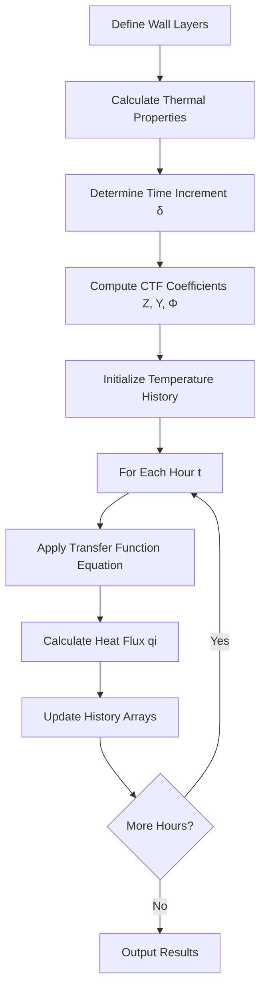

## Overview

Transfer functions represent a fundamental computational method for calculating transient heat conduction through building assemblies and HVAC components. Developed and standardized by ASHRAE, this technique transforms complex partial differential equations governing heat flow into algebraic relationships that enable efficient calculation of time-varying heat transfer through multi-layer constructions.

The transfer function method accounts for thermal storage effects in building materials, providing accurate heat gain and loss predictions that reflect the dampening and time-lag characteristics of thermal mass.

## Mathematical Foundation

### Governing Heat Equation

One-dimensional transient heat conduction through a plane wall follows Fourier's law:

$$\frac{\partial^2 T}{\partial x^2} = \frac{1}{\alpha} \frac{\partial T}{\partial t}$$

Where:
- T = temperature (°F or °C)
- x = distance through material (ft or m)
- t = time (hr)
- α = thermal diffusivity = k/(ρcp) (ft²/hr or m²/hr)
- k = thermal conductivity
- ρ = density
- cp = specific heat

### Transfer Function Form

The ASHRAE transfer function methodology expresses heat flux at the interior surface as:

$$q_i(t) = \sum_{j=0}^{n_z} Z_j \cdot T_{o,t-j\delta} - \sum_{j=1}^{n_z} Y_j \cdot T_{i,t-j\delta} - \sum_{j=1}^{n_q} \Phi_j \cdot q_{i,t-j\delta}$$

Where:
- qi(t) = current hour heat flux at inside surface (Btu/hr·ft² or W/m²)
- Zj = outside surface conduction transfer function coefficients
- Yj = cross transfer function coefficients
- Φj = flux transfer function coefficients
- To,t-jδ = outside surface temperature j hours ago
- Ti,t-jδ = inside surface temperature j hours ago
- qi,t-jδ = inside surface heat flux j hours ago
- δ = time increment (typically 1 hour)

## Conduction Transfer Function Coefficients

### CTF Properties

Transfer function coefficients exhibit specific mathematical properties:

| Property | Relationship | Physical Meaning |
|----------|--------------|------------------|
| Steady-state | ΣZj - ΣYj = U | Overall U-factor |
| Sum of Φ | ΣΦj = 1.0 | Energy conservation |
| Coefficient decay | Φj → 0 as j increases | Finite thermal memory |
| Time lag | Peak Zj occurs at j > 0 | Thermal storage delay |

### Coefficient Calculation

ASHRAE provides coefficients through:

1. **Root-finding method** - Solves characteristic equation of wall assembly
2. **State-space approach** - Matrix formulation of thermal network
3. **Laplace transform** - Frequency domain solution with numerical inversion
4. **Tabulated values** - Pre-calculated coefficients in ASHRAE Handbook Fundamentals Chapter 18

## Response Factor Method

### Response Factor Definition

Response factors represent the unit response at the inside surface to a triangular pulse excitation at the outside surface:

$$q_i(t) = \sum_{j=0}^{\infty} X_j \cdot T_{o,t-j\delta} - \sum_{j=0}^{\infty} Y_j \cdot T_{i,t-j\delta}$$

Response factors (Xj, Yj) relate to transfer function coefficients but extend to infinite terms. In practice, coefficients beyond 30-50 hours become negligible.

### Common Time Constants

Thermal response characteristics by construction type:

| Construction | Time Constant | Peak Response Lag |
|--------------|---------------|-------------------|
| Light-frame wood | 2-4 hours | 1-2 hours |
| Brick veneer wall | 4-8 hours | 3-5 hours |
| Concrete block | 6-12 hours | 4-8 hours |
| Heavy concrete | 10-20 hours | 8-15 hours |
| Earth-contact | 30+ hours | 20+ hours |

## Implementation Procedure

### Calculation Steps

### History Term Management

Transfer functions require storing previous values:

- **Temperature history**: Ti,t-1, Ti,t-2, ..., Ti,t-nz
- **Flux history**: qi,t-1, qi,t-2, ..., qi,t-nq
- **Outdoor temperature**: To,t, To,t-1, ..., To,t-nz

Proper initialization prevents startup transients affecting results.

## Application to HVAC Load Calculations

### Cooling Load Temperature Difference Method

ASHRAE's Cooling Load Temperature Difference (CLTD) values derive from transfer function calculations:

$$q_{roof} = U \cdot A \cdot CLTD$$

Where CLTD incorporates:
- Solar radiation absorption
- Thermal mass time lag
- Interior-exterior temperature difference
- Time of day variation

### Radiant Time Series Method

Modern load calculation procedures (ASHRAE Handbook Fundamentals Chapter 18) use transfer functions to:

1. Calculate instantaneous conduction heat gains
2. Convert radiant heat gains to cooling loads using room transfer functions
3. Account for thermal storage in building mass and contents

## Comparison with Other Methods

| Method | Accuracy | Speed | Thermal Mass | Application |
|--------|----------|-------|--------------|-------------|
| Transfer functions | High | Fast | Complete | Detailed loads |
| Finite difference | Highest | Slowest | Complete | Research |
| Finite element | Highest | Very slow | Complete | Complex geometry |
| Steady-state | Low | Fastest | None | Preliminary sizing |
| CLTD/CLF | Medium | Fast | Simplified | Manual calculations |

## Advantages and Limitations

### Advantages

- Computationally efficient for repetitive calculations
- Exact solution to 1-D heat equation for layered assemblies
- Captures thermal mass effects accurately
- Standardized methodology across industry
- Suitable for hourly energy simulation programs

### Limitations

- Requires linear boundary conditions (constant coefficients)
- Limited to one-dimensional heat flow
- Multi-dimensional effects (thermal bridges) need separate treatment
- Coefficient calculation complexity for unusual constructions
- Assumption of constant material properties with temperature

## Standards and References

### ASHRAE Standards

- **ASHRAE Handbook - Fundamentals, Chapter 18**: Heat Transfer - Transfer function methodology and coefficients
- **ASHRAE Standard 140**: Method of Test for Building Energy Simulation - Validation procedures
- **ASHRAE Handbook - Fundamentals, Chapter 19**: Energy Estimating Methods - Application to load calculations

### Software Implementation

Major HVAC software packages implementing transfer functions:

- DOE-2 and eQUEST - Response factor approach
- EnergyPlus - Conduction transfer function module
- TRACE 700 - Modified transfer function method
- Carrier HAP - Radiant time series with transfer functions

## Practical Considerations

### Coefficient Accuracy

Verify transfer function coefficients satisfy:

$$U = \frac{\sum Z_j - \sum Y_j}{1 - \sum \Phi_j}$$

This check ensures coefficients properly represent the assembly's steady-state thermal resistance.

### Time Step Selection

One-hour time steps work well for most building applications. Shorter time steps (15-minute) improve accuracy for:

- High-frequency temperature variations
- Lightweight constructions with short time constants
- Peak load determination in critical applications

Transfer functions remain the computational backbone of modern HVAC load calculation methods, providing the essential link between building physics and practical engineering calculations.
