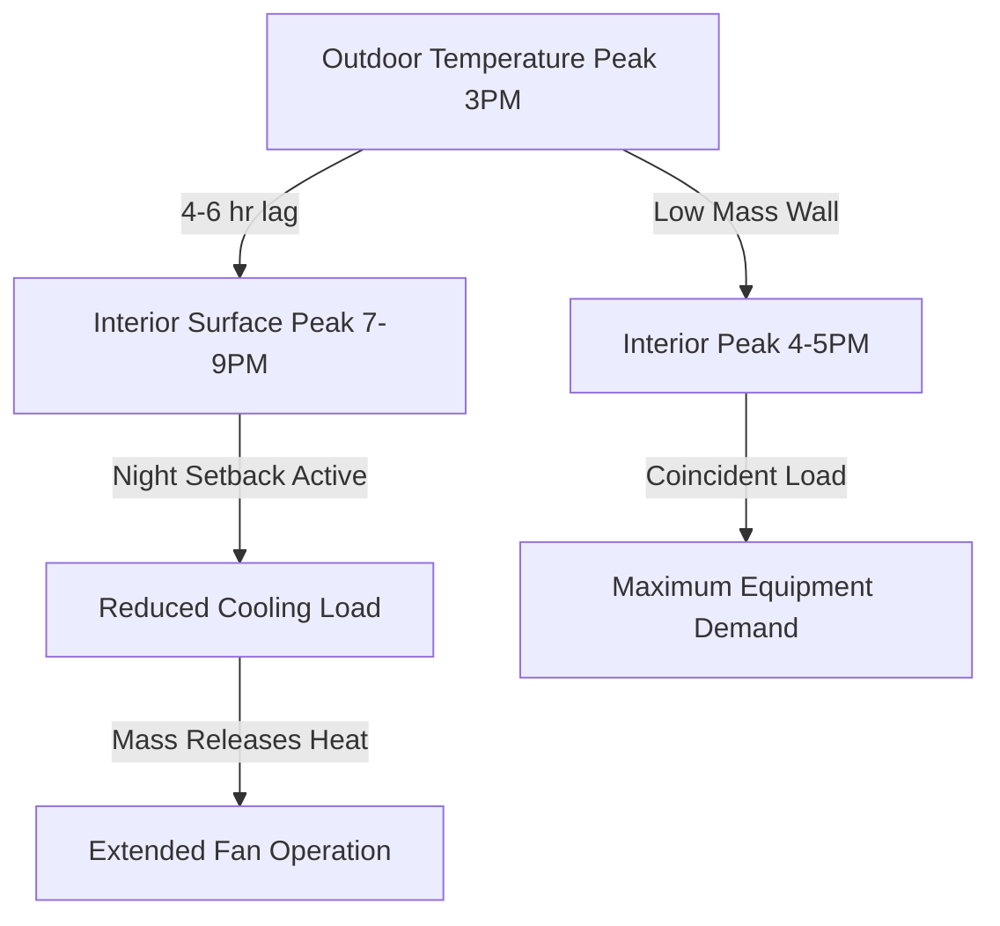

## Overview

ASHRAE transfer function methodology represents the standard approach for dynamic building load calculations in engineering practice. The method converts transient heat transfer through building envelope components into discrete time-domain calculations suitable for hourly load analysis and equipment sizing.

The fundamental transfer function equation relates heat flux at the interior surface to temperature histories at both surfaces:

$$q_i(\theta) = \sum_{j=0}^{n_z} Z_j \cdot T_{o,\theta-j\delta} - \sum_{j=1}^{n_z} Z_j \cdot T_{i,\theta-j\delta}$$

Where $q_i(\theta)$ represents interior surface heat flux at time $\theta$, $Z_j$ are transfer function coefficients, and $T_{o}$ and $T_{i}$ denote outdoor and indoor surface temperatures at time intervals $\delta$ (typically 1 hour).

## Residential Building Applications

Transfer functions provide accurate cooling load predictions for residential structures with varying thermal mass characteristics. The methodology accounts for:

**Lightweight Construction**
- Wood frame walls with minimal thermal mass
- Rapid thermal response to outdoor temperature swings
- Limited heat storage effects requiring fewer transfer function terms
- Typical coefficient series length: 4-6 terms

**Medium Thermal Mass**
- Brick veneer or masonry wall systems
- Moderate heat storage capacity
- Time lag between peak solar gain and interior heat transfer: 2-4 hours
- Coefficient series length: 8-12 terms

The cooling load calculation procedure combines conduction transfer functions with radiation time series (RTS) coefficients:

$$Q_{cool}(\theta) = Q_{cond}(\theta) + Q_{sol}(\theta) + Q_{int}(\theta) + Q_{inf}(\theta)$$

Each component incorporates time-dependent transfer functions that capture thermal storage effects in building mass.

## Commercial Building Analysis

Commercial buildings present complex load calculation requirements due to variable occupancy, diverse internal gains, and sophisticated envelope assemblies.

| Building Type | Thermal Mass | Typical Z-Terms | Peak Lag (hrs) |
|---------------|--------------|-----------------|----------------|
| Office - Light | Low | 6-8 | 1-2 |
| Office - Heavy | High | 12-18 | 4-6 |
| Retail | Low-Medium | 8-10 | 2-3 |
| Institutional | High | 14-20 | 5-8 |
| Data Center | Very Low | 4-6 | 0-1 |

**Internal Gain Distribution**

Transfer functions distribute instantaneous internal heat gains across multiple time steps based on radiant-convective split and surface thermal mass:

$$Q_{rad,\theta} = \sum_{j=0}^{n_r} r_j \cdot q_{int,\theta-j\delta}$$

Where $r_j$ represents radiant time series coefficients derived from building thermal mass characteristics. High thermal mass buildings exhibit significant heat storage, reducing instantaneous cooling loads while extending load duration.

## Climate-Specific Implementations

### Hot-Dry Climates

Desert environments create extreme diurnal temperature swings (20-30°F), making thermal mass effects critical:

- High outdoor temperatures (95-115°F) during afternoon hours
- Rapid nighttime cooling (65-75°F)
- Significant conductive heat gain during peak hours
- Delayed heat release from thermal mass after sunset

Transfer function analysis reveals optimal wall constructions for these conditions:

The time lag provided by high thermal mass construction shifts peak cooling loads away from afternoon equipment demand peaks, reducing required capacity by 15-25% compared to lightweight construction.

## Variable Occupancy Buildings

Educational facilities, assembly spaces, and commercial buildings with intermittent use require specialized transfer function application:

**Thermal Pulldown Analysis**

After unoccupied periods with temperature setback, the cooling system must remove heat stored in building thermal mass:

$$Q_{pulldown} = Q_{steady} + \frac{C_{mass} \cdot \Delta T}{\Delta \theta}$$

Where $C_{mass}$ represents effective thermal capacitance of room surfaces and $\Delta T$ is the temperature recovery requirement. Transfer functions calculate time-dependent heat extraction rates during pulldown.

**Precooling Strategies**

High thermal mass buildings benefit from precooling during off-peak hours:

1. Reduce indoor temperature 3-5°F below setpoint
2. Store "coolth" in structural mass
3. Allow temperature drift during occupied hours
4. Reduce peak cooling load by 20-30%

Transfer function analysis determines optimal precooling duration and setpoint adjustment based on wall, floor, and ceiling thermal mass.

## High Thermal Mass Buildings

Structures with significant concrete, masonry, or earth-coupled elements require extended transfer function series:

**Coefficient Determination**

Heavy construction generates transfer functions with 18-24 terms spanning 24 hours of thermal history. The z-transfer function for a 12-inch concrete wall demonstrates this complexity:

$$Z = [0.189, 0.143, 0.098, 0.067, 0.045, 0.031, ..., 0.002]$$

Each coefficient represents the fraction of heat gain at a specific past hour that contributes to current interior surface heat flux.

**Applications**

- Underground structures and earth-sheltered buildings
- Historic masonry buildings
- Thermal energy storage systems
- Radiant heating/cooling systems with structural mass

The methodology accurately predicts thermal behavior for design conditions and enables optimization of control strategies that leverage thermal mass for load shifting and demand reduction.

## Equipment Sizing Considerations

Transfer function results inform HVAC equipment selection through:

**Peak Load Determination**
- Hourly load profiles reveal true coincident peak
- Diversity factors between zones properly calculated
- Safety factors applied to transfer function predictions: 1.10-1.15

**Part-Load Performance**
- Load distribution throughout operating hours
- Equipment cycling analysis for variable capacity systems
- Energy recovery potential from thermal mass charging/discharging

ASHRAE Standard 183 provides guidance on applying transfer function methodology to equipment sizing decisions, ensuring adequate capacity while avoiding oversizing that degrades part-load efficiency and humidity control.

## Implementation Standards

ASHRAE Handbook—Fundamentals Chapter 18 establishes transfer function calculation procedures and coefficient databases for common construction assemblies. Software implementations must validate against hand calculation examples to ensure numerical stability and accuracy across diverse building configurations and climate conditions.
