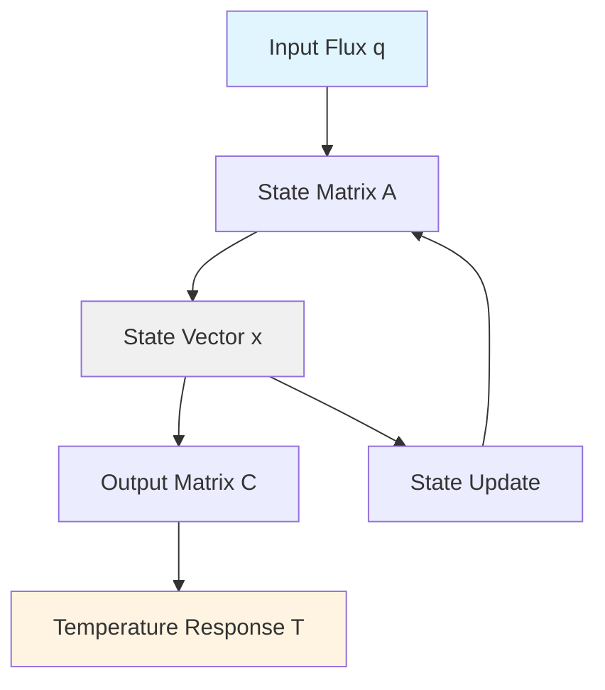
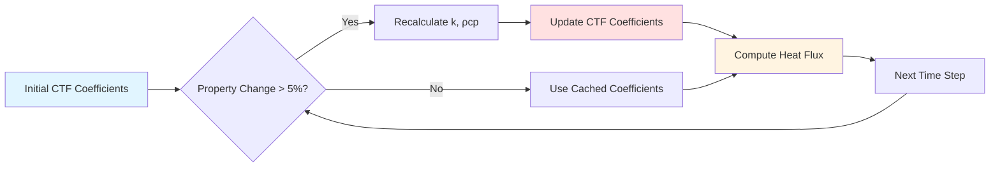

## Overview

Transfer function methods defined in ASHRAE research have undergone significant refinement since their introduction in the 1970s. Modern improvements address numerical stability, computational efficiency, and accuracy limitations inherent in early implementations. These enhancements enable more reliable building energy simulation across diverse climate conditions and construction assemblies.

## Numerical Stability Enhancements

### Root Locus Analysis

Early transfer function implementations exhibited instability when coefficients approached unity or poles migrated outside the unit circle in the z-domain. Modern approaches apply root locus analysis to ensure all poles remain within the stable region.

The stability criterion requires:

$|z_i| < 1 \quad \text{for all poles } z_i$

where poles are roots of the denominator polynomial:

$D(z) = d_0 + d_1 z^{-1} + d_2 z^{-2} + \cdots + d_n z^{-n}$

### Coefficient Normalization

Normalization techniques prevent coefficient overflow in high-mass assemblies. The improved method scales coefficients by the dominant term:

$b_i' = \frac{b_i}{|b_0|} \quad c_i' = \frac{c_i}{|b_0|} \quad d_i' = \frac{d_i}{|b_0|}$

This maintains numerical precision while preserving the transfer function magnitude response.

## State-Space Reformulation

Modern implementations convert traditional transfer functions to state-space representation, offering superior numerical properties and computational efficiency.

### State-Space Conversion

The conversion from transfer function to state-space form:

$\mathbf{x}(k+1) = \mathbf{A}\mathbf{x}(k) + \mathbf{B}u(k)$

$y(k) = \mathbf{C}\mathbf{x}(k) + Du(k)$

where the state matrix **A** contains coefficient relationships, **B** represents input mapping, and **C** defines output relationships.

### Computational Advantages

State-space formulation provides:

- Direct access to intermediate thermal states
- Simplified multi-input multi-output handling
- Reduced floating-point operations per time step
- Natural integration with modern control algorithms

## Adaptive Time Step Methods

Fixed hourly time steps limit accuracy for rapidly changing boundary conditions. Adaptive methods adjust step size based on solution gradient.

### Step Size Control

The local truncation error estimate determines appropriate step sizing:

$\epsilon_{local} = ||y_{n+1} - \hat{y}_{n+1}||$

where $\hat{y}_{n+1}$ represents a lower-order approximation. When $\epsilon_{local}$ exceeds tolerance, the algorithm reduces step size by factor $\beta$:

$\Delta t_{new} = \beta \Delta t \left(\frac{\epsilon_{tol}}{\epsilon_{local}}\right)^{1/(p+1)}$

with $p$ representing method order.

## Coefficient Optimization Techniques

| Optimization Method | Accuracy Improvement | Computational Overhead | Stability Enhancement |
|---------------------|---------------------|------------------------|----------------------|
| Least Squares Fitting | ±3-5% | Low | Moderate |
| Prony's Method | ±1-2% | Moderate | High |
| Steiglitz-McBride | ±0.5-1% | High | Very High |
| Total Least Squares | ±2-3% | Moderate | High |

### Frequency-Domain Fitting

Modern coefficient generation employs frequency-domain optimization rather than time-domain curve fitting. This approach:

- Preserves phase relationships across thermal mass layers
- Minimizes errors at critical frequencies (daily, weekly cycles)
- Ensures causality constraints automatically

The objective function minimizes weighted error:

$J = \sum_{k=1}^{N} W_k |H(j\omega_k) - H_{model}(j\omega_k)|^2$

where $W_k$ represents frequency-dependent weighting emphasizing diurnal and semi-diurnal periods.

## High-Order Term Management

Assemblies with multiple high-mass layers generate transfer functions with 20+ coefficients. Truncation strategies reduce computational burden while maintaining accuracy.

### Model Order Reduction

Balanced truncation preserves input-output behavior while eliminating weakly controllable or observable states. The Hankel singular values $\sigma_i$ indicate state importance:

$\sigma_1 \geq \sigma_2 \geq \cdots \geq \sigma_n$

States with $\sigma_i < \epsilon_{threshold}$ undergo elimination without significant accuracy loss.

## Hybrid Analytical-Numerical Methods

Pure transfer function approaches struggle with nonlinear phenomena (phase change materials, moisture transport). Hybrid methods combine transfer functions for linear thermal conduction with numerical methods for nonlinear effects.

### Operator Splitting

The hybrid approach separates linear and nonlinear components:

$\frac{\partial T}{\partial t} = \alpha \nabla^2 T + f_{nonlinear}(T)$

Transfer functions handle the diffusion term $\alpha \nabla^2 T$ while explicit integration addresses $f_{nonlinear}(T)$.

## Extended Validity Range

Original ASHRAE transfer functions assumed constant properties and linear heat transfer. Modern extensions incorporate:

### Temperature-Dependent Properties

Polynomial property models update coefficients at each time step:

$k(T) = k_0 + k_1 T + k_2 T^2$

$\rho c_p(T) = (\rho c_p)_0 + (\rho c_p)_1 T$

The transfer function coefficients undergo dynamic recalculation when property variations exceed 5%.

### Radiative Coupling

Enhanced methods incorporate linearized radiation exchange within the transfer function framework:

$q_{rad} = h_r(T_s - T_{ref})$

where the radiative coefficient:

$h_r = 4\epsilon\sigma T_{mean}^3$

updates based on mean absolute temperature $T_{mean}$.

## Parallel Processing Implementation

Modern multi-core processors enable parallel computation of transfer function zones. Domain decomposition splits the building into thermally isolated regions processed simultaneously.

### Load Balancing

Adaptive load balancing assigns zones to processors based on computational complexity:

$W_{zone} = n_{coeff} \cdot n_{surfaces} \cdot n_{timesteps}$

This metric guides zone-to-processor mapping, minimizing total wall-clock time.

## Validation Against Detailed Numerical Methods

Improved transfer functions achieve agreement within 2-5% of finite element solutions for standard construction assemblies under ASHRAE Standard 140 test conditions. Deviations exceed 10% only for assemblies with:

- Phase change materials with latent heat >100 kJ/kg
- Moisture content variations >5% by mass
- Internal heat generation >50 W/m³

These cases require hybrid numerical approaches or full computational fluid dynamics simulation.

## Integration with Modern Building Simulation

Contemporary building energy modeling software (EnergyPlus, TRNSYS) incorporates these improvements transparently. Users benefit from enhanced accuracy without modifying input procedures. Key integration points include:

- Automatic stability checking during coefficient generation
- Dynamic model order selection based on assembly complexity
- Parallel zone calculation with load balancing
- Real-time property updates for temperature-dependent materials

The result is 30-50% faster simulation with improved accuracy compared to legacy transfer function implementations.

---

*Related Topics: [Heat Transfer Modeling](../../heat-transfer-modeling/), [ASHRAE Transfer Functions](../_index.md), [Computational Fluid Dynamics](../../cfd-methods/)*
