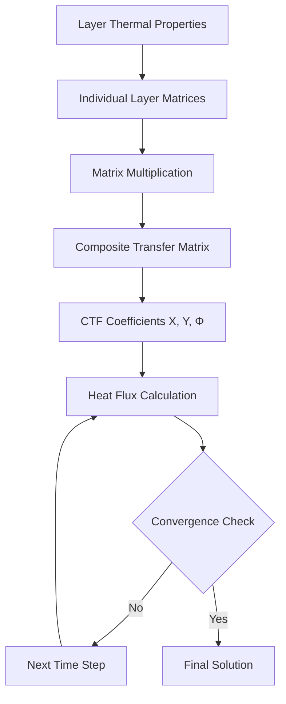

# Transfer Function Methodology for Heat Transfer

The ASHRAE transfer function method represents a fundamental approach to calculating transient heat transfer through multilayer building assemblies. This methodology transforms the partial differential equations governing heat conduction into algebraic equations solvable through discrete time-series analysis.

## Physical Basis

Heat conduction through building envelopes follows Fourier's law in one dimension:

$$q_x = -k \frac{\partial T}{\partial x}$$

For transient conditions with thermal storage, the heat equation becomes:

$$\frac{\partial T}{\partial t} = \alpha \frac{\partial^2 T}{\partial x^2}$$

where thermal diffusivity α = k/(ρc). Direct solution of this equation for multilayer assemblies with time-varying boundary conditions proves computationally intensive. Transfer functions provide an efficient alternative.

## Z-Transform Foundation

The transfer function method employs z-transform notation to represent the relationship between surface temperatures and heat flux as a ratio of polynomials:

$$\frac{q(z)}{T(z)} = \frac{b_0 + b_1 z^{-1} + b_2 z^{-2} + ... + b_n z^{-n}}{1 + a_1 z^{-1} + a_2 z^{-2} + ... + a_m z^{-m}}$$

The z^{-1} operator represents a time delay of one calculation interval (typically 1 hour for load calculations). This formulation converts the continuous heat transfer problem into a discrete recursive equation.

## Conduction Transfer Functions

For a multilayer wall, the heat flux at the interior surface relates to current and past temperature histories through conduction transfer functions (CTFs):

$$q_{ki} = \sum_{j=0}^{n_z} X_j T_{o,k-j\delta} - \sum_{j=0}^{n_z} Y_j T_{i,k-j\delta} + \sum_{j=1}^{n_q} \Phi_j q_{i,k-j\delta}$$

where:
- q_{ki} = conduction heat flux at interior surface at time k
- T_o = outdoor surface temperature
- T_i = indoor surface temperature
- X_j, Y_j = cross and inside CTF coefficients
- Φ_j = flux CTF coefficients
- δ = time interval

## CTF Coefficient Calculation

The coefficients X, Y, and Φ derive from the thermal properties of each layer through state-space methods or Laplace transform inversion. For a single homogeneous layer of thickness L:

$$X_0 = Y_0 = \frac{k}{L} \cdot \frac{2\gamma}{1+\gamma^2}$$

$$\Phi_1 = \frac{1-\gamma^2}{1+\gamma^2}$$

where γ represents the thermal decay:

$$\gamma = \exp\left(-\sqrt{\frac{\omega \rho c}{k}} \cdot L\right)$$

For multilayer assemblies, matrix multiplication of individual layer transfer matrices produces composite coefficients.

## Coefficient Properties

Physical requirements constrain CTF coefficients:

| Property | Requirement | Physical Meaning |
|----------|-------------|------------------|
| Sum of X | Equals U-value | Steady-state conductance |
| Sum of Y | Equals U-value | Energy conservation |
| Sum of Φ | Equals zero | No energy creation |
| Stability | \|Φ_j\| < 1 | Bounded response |

These constraints ensure thermodynamic consistency and numerical stability.

## Radiant Time Series Integration

ASHRAE load calculation procedures combine CTFs with radiant time series (RTS) factors to account for radiative and convective splits. Solar radiation absorbed at interior surfaces does not immediately become cooling load; thermal mass delays conversion:

$$q_{load,k} = \sum_{j=0}^{n} r_j q_{rad,k-j\delta}$$

The r_j coefficients depend on zone construction class (lightweight, medium, heavyweight) and represent the fraction of radiant energy from j hours previous that becomes load in the current hour.

## Computational Implementation

The recursive nature enables efficient computation:

1. **Initialize**: Store temperature and flux histories for required time steps
2. **Update**: Calculate current heat flux using CTF equation
3. **Store**: Save current values for subsequent iterations
4. **Advance**: Increment time step and repeat

Memory requirements scale with the number of terms (typically 3-6 for walls, more for heavy thermal mass).

## Validation Requirements

ASHRAE Standard 140 provides test cases for validating transfer function implementations. Acceptable methods must match analytical solutions for simple cases within 1% and inter-model agreement within defined tolerance bands for complex geometries.

## Advantages Over Alternative Methods

**Transfer functions versus finite difference:**

| Aspect | Transfer Functions | Finite Difference |
|--------|-------------------|-------------------|
| Computational speed | Fast (pre-calculated) | Slower (runtime calc) |
| Accuracy | Exact for linear systems | Grid-dependent |
| Memory | Low (few coefficients) | High (full nodal array) |
| Flexibility | Fixed geometry | Variable geometry |

**Transfer functions versus response factors:**

Response factors require convolution integrals at each time step, while transfer functions employ direct recursive calculation, reducing computation by orders of magnitude for long simulations.

## Limitations and Extensions

The classical CTF method assumes:
- One-dimensional heat transfer
- Linear material properties (constant k, ρ, c)
- Homogeneous layers
- No moisture transport
- No phase change

Extensions addressing these limitations include temperature-dependent coefficients, two-dimensional correction factors, and coupled heat-moisture models that modify effective thermal properties based on local conditions.

## Implementation in ASHRAE Standards

ASHRAE Handbook—Fundamentals Chapter 18 provides detailed CTF coefficient tables for common constructions. The Heat Balance Method (HBM) in Standard 90.1 Appendix G employs transfer functions as the core conduction calculation engine, demonstrating their continued relevance in modern building energy analysis.

The methodology balances computational efficiency with physical accuracy, making it the foundation for hourly load calculation procedures used worldwide in commercial HVAC system design.
