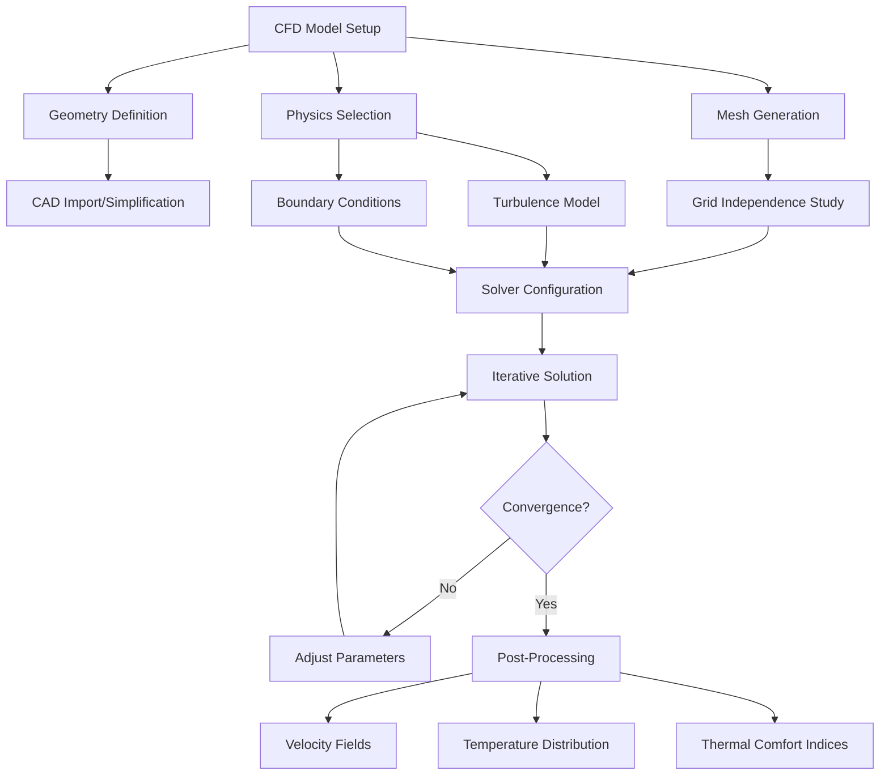
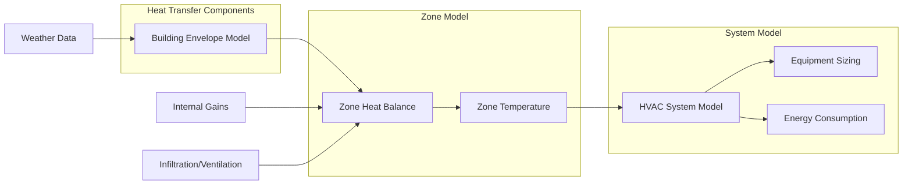

# Heat Transfer Modeling in HVAC Systems

Heat transfer modeling forms the computational foundation for modern HVAC design, enabling engineers to predict thermal behavior, optimize system performance, and validate designs before physical implementation. These numerical methods solve the fundamental heat transfer equations that govern conduction, convection, and radiation in building environments and mechanical systems.

## Fundamental Heat Transfer Modes

### Conduction

Heat conduction through solid materials follows Fourier's law:

$$q = -kA\frac{dT}{dx}$$

Where:
- $q$ = heat transfer rate (W)
- $k$ = thermal conductivity (W/m·K)
- $A$ = cross-sectional area (m²)
- $\frac{dT}{dx}$ = temperature gradient (K/m)

For transient conduction, the heat equation governs temporal and spatial temperature distribution:

$$\frac{\partial T}{\partial t} = \alpha \nabla^2 T$$

Where $\alpha = \frac{k}{\rho c_p}$ is thermal diffusivity (m²/s).

### Convection

Convective heat transfer at fluid-solid boundaries is expressed by Newton's law of cooling:

$$q = hA(T_s - T_\infty)$$

Where:
- $h$ = convective heat transfer coefficient (W/m²·K)
- $T_s$ = surface temperature (K)
- $T_\infty$ = fluid bulk temperature (K)

The convective coefficient depends on flow regime, fluid properties, and geometry, typically characterized by dimensionless numbers (Nusselt, Reynolds, Prandtl).

### Radiation

Thermal radiation between surfaces follows the Stefan-Boltzmann law:

$$q = \varepsilon \sigma A (T_1^4 - T_2^4)$$

Where:
- $\varepsilon$ = emissivity
- $\sigma$ = Stefan-Boltzmann constant (5.67×10⁻⁸ W/m²·K⁴)
- $T$ = absolute temperature (K)

For complex enclosures, view factors and multi-surface radiation exchange require numerical solution.

## Finite Difference Method (FDM)

The finite difference method discretizes the spatial domain into a grid and approximates derivatives using algebraic expressions. For one-dimensional transient conduction, the explicit forward-time central-space (FTCS) scheme yields:

$$\frac{T_i^{n+1} - T_i^n}{\Delta t} = \alpha \frac{T_{i+1}^n - 2T_i^n + T_{i-1}^n}{\Delta x^2}$$

Where superscript $n$ denotes time level and subscript $i$ denotes spatial location.

**Advantages:**
- Simple implementation
- Computationally efficient for regular geometries
- Direct solution for explicit schemes

**Limitations:**
- Stability constraints (Fourier number $Fo = \alpha \Delta t / \Delta x^2 \leq 0.5$ for explicit schemes)
- Difficulty handling irregular geometries
- Lower accuracy on coarse grids

**HVAC Applications:**
- Wall thermal response analysis
- Thermal energy storage modeling
- Heat exchanger transient performance
- Ground-coupled heat pump simulations

## Finite Element Method (FEM)

FEM divides the domain into elements and uses variational principles to minimize energy functionals. The weak form of the heat equation is solved over each element, yielding a global system of equations:

$$[K]\{T\} + [C]\{\dot{T}\} = \{F\}$$

Where $[K]$ is the conductance matrix, $[C]$ is the capacitance matrix, and $\{F\}$ is the load vector.

**Advantages:**
- Handles complex geometries with irregular boundaries
- Higher-order accuracy through shape functions
- Natural treatment of boundary conditions

**HVAC Applications:**
- Building envelope thermal bridging analysis
- Radiant panel heating/cooling design
- Thermal stress analysis in equipment
- Phase change material (PCM) integration studies

## Computational Fluid Dynamics (CFD)

CFD solves the coupled Navier-Stokes equations for fluid flow and energy transport. The conservation equations for mass, momentum, and energy form the foundation:

**Continuity:**
$$\frac{\partial \rho}{\partial t} + \nabla \cdot (\rho \mathbf{u}) = 0$$

**Momentum:**
$$\frac{\partial (\rho \mathbf{u})}{\partial t} + \nabla \cdot (\rho \mathbf{u} \mathbf{u}) = -\nabla p + \nabla \cdot \boldsymbol{\tau} + \rho \mathbf{g}$$

**Energy:**
$$\frac{\partial (\rho h)}{\partial t} + \nabla \cdot (\rho \mathbf{u} h) = \nabla \cdot (k \nabla T) + S_h$$

Turbulence modeling (k-ε, k-ω SST, LES) captures turbulent transport critical for HVAC flows.

**HVAC Applications:**
- Indoor air distribution analysis
- Thermal comfort assessment (PMV/PPD)
- Ventilation effectiveness evaluation
- Equipment airflow optimization
- Contamination transport modeling

## Building Thermal Simulation

Whole-building energy simulation integrates multiple heat transfer modes with HVAC system models and weather data. The energy balance for a building zone is:

$$\sum Q_{conduct} + \sum Q_{convect} + \sum Q_{radiant} + Q_{infiltration} + Q_{internal} = Q_{HVAC} + \frac{dU}{dt}$$

**Key Modeling Approaches:**

| Method | Time Step | Spatial Resolution | Typical Use |
|--------|-----------|-------------------|-------------|
| Response Factor | 1 hour | Zone-level | Annual energy analysis |
| CTF (Conduction Transfer Function) | 15 min - 1 hour | Surface-level | Load calculations |
| Finite Difference | 1 min - 1 hour | Multi-layer walls | Transient analysis |
| FEM | Variable | High detail | Thermal bridging |
| CFD | Seconds - minutes | Cell-level | Airflow patterns |

## Validation and Verification

ASHRAE Standard 140 (Standard Method of Test for the Evaluation of Building Energy Analysis Computer Programs) provides test cases for validating simulation tools. Verification ensures:

- Mass and energy conservation
- Grid independence
- Time step independence
- Boundary condition implementation

Experimental validation against measured data from test chambers or monitored buildings establishes model accuracy for real-world applications.

## Software Tools

Common platforms implementing these methods:

- **EnergyPlus/DOE-2**: Finite difference building simulation
- **TRNSYS**: Modular transient system simulation
- **IDA ICE**: Equation-based detailed dynamic simulation
- **ANSYS Fluent/CFX**: General-purpose CFD
- **COMSOL Multiphysics**: Coupled FEM simulation
- **OpenFOAM**: Open-source CFD framework

## Practical Considerations

**Model Complexity vs. Accuracy:**
- Simplified models suffice for many design calculations
- Detailed CFD required for critical comfort zones or complex geometries
- Validation data determines appropriate fidelity level

**Computational Resources:**
- FDM/FEM building simulations: minutes to hours
- Steady-state CFD: hours to days
- Transient CFD: days to weeks
- High-performance computing enables parametric studies

**Boundary Condition Sensitivity:**
- Convective coefficients significantly impact results
- ASHRAE Fundamentals Chapter 25 provides correlations
- Measured data improves accuracy for critical applications

## Conclusion

Heat transfer modeling provides quantitative tools for HVAC system design and optimization. Selection of appropriate numerical methods depends on problem physics, required accuracy, and computational resources. Integration of these techniques with experimental validation delivers reliable predictions supporting energy-efficient, comfortable building environments.

---

**References:**
- ASHRAE Handbook—Fundamentals, Chapter 4: Heat Transfer
- ASHRAE Handbook—Fundamentals, Chapter 19: Energy Estimating and Modeling Methods
- ASHRAE Standard 140: Standard Method of Test for the Evaluation of Building Energy Analysis Computer Programs
