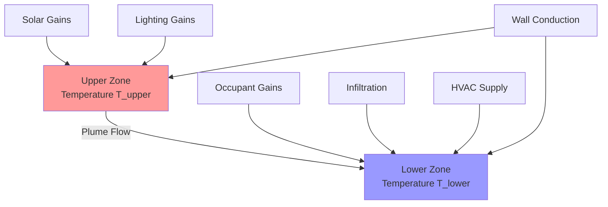
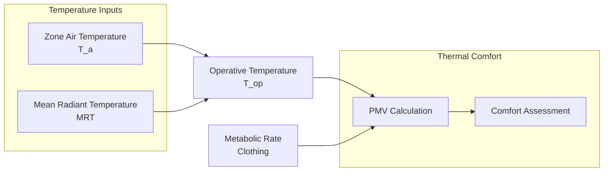

# Temperature Modeling for HVAC Systems

Temperature modeling predicts spatial and temporal temperature distributions in conditioned spaces, enabling accurate load calculations, comfort analysis, and control system design. These models range from simplified single-zone representations to detailed multi-dimensional distributions accounting for stratification, thermal mass, and localized effects.

## Zone Temperature Models

### Single-Node Model

The fundamental zone model treats the entire space as a single node with uniform temperature. The energy balance equation is:

$$m c_p \frac{dT_z}{dt} = \sum Q_{walls} + Q_{infiltration} + Q_{internal} + Q_{solar} - Q_{HVAC}$$

Where:
- $m$ = zone air mass (kg)
- $c_p$ = specific heat of air (1006 J/kg·K)
- $T_z$ = zone air temperature (°C)
- $Q$ = heat transfer rates (W)

This model assumes instantaneous mixing and uniform temperature throughout the zone. While simplified, it provides accurate predictions for well-mixed spaces and forms the basis for most building energy simulation programs.

**Applicability:**
- Commercial spaces with forced-air systems
- Residential spaces with central HVAC
- Preliminary design calculations
- Annual energy analysis

**Limitations:**
- Cannot predict temperature gradients
- Overpredicts mixing in stratified spaces
- Underestimates peak loads in high-ceiling areas

### Two-Node Stratification Model

For spaces with significant height or weak mixing, a two-node model captures vertical stratification:

$$m_{upper} c_p \frac{dT_{upper}}{dt} = Q_{upper} + \dot{m}_{plume} c_p (T_{lower} - T_{upper})$$

$$m_{lower} c_p \frac{dT_{lower}}{dt} = Q_{lower} - \dot{m}_{plume} c_p (T_{lower} - T_{upper})$$

The plume mass flow rate $\dot{m}_{plume}$ depends on heat source strength and geometry. For a point source:

$$\dot{m}_{plume} = 0.071 Q^{1/3} z^{5/3}$$

Where $Q$ is the convective heat output (W) and $z$ is height above source (m).

**Applications:**
- Warehouse and high-bay facilities
- Atrium and multi-story spaces
- Displacement ventilation systems
- Underfloor air distribution (UFAD)

### Multi-Node Network Models

Complex geometries require multiple interconnected nodes with airflow between zones:

$$m_i c_p \frac{dT_i}{dt} = \sum Q_{conduct,i} + \sum_{j} \dot{m}_{ij} c_p (T_j - T_i) + Q_{internal,i} + Q_{HVAC,i}$$

Airflow rates $\dot{m}_{ij}$ between nodes are calculated using pressure network analysis or specified based on ventilation design.

## Temporal Temperature Dynamics

### Time Constant Analysis

The thermal time constant characterizes how quickly zone temperature responds to disturbances:

$$\tau = \frac{m c_p}{UA}$$

Where:
- $UA$ = overall thermal conductance (W/K)
- $\tau$ = time constant (seconds)

For a step change in heat input, temperature evolves as:

$$T_z(t) = T_{ss} + (T_0 - T_{ss}) e^{-t/\tau}$$

**Typical Time Constants:**

| Building Type | Insulation | Time Constant |
|---------------|------------|---------------|
| Lightweight residential | Moderate | 1-3 hours |
| Heavy masonry | High | 6-12 hours |
| Modern office | Good | 3-6 hours |
| Industrial warehouse | Poor | 0.5-2 hours |

These values guide thermostat setback strategies and equipment sizing for pull-down conditions.

### Response Factor Method

For periodic loads, temperature response is modeled using transfer functions. The periodic room transfer function (PRTF) relates cooling load to temperature swing:

$$\Delta T_z = \frac{q_{periodic}}{\text{PRTF}}$$

The PRTF depends on:
- Envelope thermal mass
- Ventilation rate
- Internal mass
- Zone time constant

ASHRAE provides tabulated PRTF values for common construction types (ASHRAE Handbook—Fundamentals, Chapter 18).

## Spatial Temperature Distribution

### Vertical Temperature Gradient

Temperature stratification in occupied zones impacts both comfort and energy consumption. The gradient can be approximated as:

$$\frac{dT}{dz} = \frac{q_h}{k_h A_f}$$

Where:
- $q_h$ = total convective heat gain to upper zone (W)
- $k_h$ = effective vertical conductance (W/K)
- $A_f$ = floor area (m²)

Displacement ventilation systems intentionally create gradients of 2-4°C from floor to ceiling. Mixing systems target gradients below 1°C per meter of height.

**Stratification Metrics:**

The stratification factor quantifies the degree of vertical temperature variation:

$$SF = \frac{T_{1.7m} - T_{0.1m}}{T_{exhaust} - T_{supply}}$$

Values approaching 1.0 indicate strong stratification (displacement flow), while values near 0 indicate complete mixing.

### Radial Temperature Distribution

Near diffusers and heat sources, radial temperature variations occur. The throw of a jet is defined as the distance to where centerline velocity drops to 0.5 m/s. Within the throw distance, temperature decay follows:

$$\frac{T - T_\infty}{T_0 - T_\infty} = K \frac{A_0^{0.5}}{x}$$

Where $K$ is a diffuser-specific constant, $A_0$ is effective outlet area, and $x$ is distance from diffuser.

## Thermal Comfort Temperature Models

### Operative Temperature

Operative temperature combines air temperature and mean radiant temperature:

$$T_{op} = \frac{h_c T_a + h_r \overline{T_r}}{h_c + h_r}$$

For typical indoor conditions with air speeds below 0.2 m/s, this simplifies to:

$$T_{op} \approx \frac{T_a + \overline{T_r}}{2}$$

Comfort models based on ASHRAE Standard 55 use operative temperature as the primary thermal variable.

### PMV/PPD Temperature Relationship

The Predicted Mean Vote (PMV) depends on operative temperature through the heat balance equation:

$$PMV = f(M, I_{cl}, T_{op}, v_a, RH)$$

For sedentary office conditions (1.2 met, 0.5 clo):
- PMV = 0 (neutral) occurs at $T_{op} \approx 23.5°C$
- Acceptable range (|PMV| < 0.5): 22.5-25.5°C
- Temperature drift rate: ΔT/Δt < 2°C/hour

## Surface Temperature Models

### Interior Surface Temperature

Interior surface temperatures govern radiant exchange and condensation risk. For a multi-layer wall, the interior surface temperature under quasi-steady conditions is:

$$T_{si} = T_z - \frac{q_{wall}}{h_i}$$

Where $h_i$ is the interior surface heat transfer coefficient (W/m²·K). ASHRAE Standard values:

| Surface Orientation | Natural Convection | Forced Convection |
|---------------------|-------------------|-------------------|
| Vertical wall | 3.1 | 8.3 |
| Horizontal (heat flow up) | 4.1 | 9.3 |
| Horizontal (heat flow down) | 0.9 | 6.1 |

For radiant systems, surface temperature directly determines heat transfer:

$$q_{radiant} = h_r A (T_{surface} - T_a) + h_c A (T_{surface} - T_a)$$

Radiant ceiling panels typically operate at 15-20°C for cooling and 30-40°C for heating.

### Exterior Surface Temperature

Exterior surface temperature depends on solar radiation, convection, and long-wave radiation:

$$T_{so} = T_{outdoor} + \frac{\alpha I_{solar} - \varepsilon \sigma (T_{so}^4 - T_{sky}^4)}{h_o}$$

The sol-air temperature concept simplifies this to:

$$T_{sol-air} = T_{outdoor} + \frac{\alpha I_{solar}}{h_o} - \frac{\varepsilon \Delta R}{h_o}$$

Where $\Delta R$ is the long-wave radiation correction (typically 3.9 W/m² for horizontal surfaces).

## Coupled Temperature-Humidity Models

Temperature and humidity interact through latent heat effects and psychrometric processes. The coupled energy and moisture balances are:

$$m c_p \frac{dT_z}{dt} = Q_{sensible} + \dot{m}_v h_{fg}$$

$$V \frac{d(\rho_v)}{dt} = \dot{m}_{v,sources} - \dot{m}_{v,removal}$$

Where $\dot{m}_v$ is moisture addition/removal rate and $h_{fg}$ is latent heat of vaporization (2501 kJ/kg at 0°C).

The sensible heat ratio (SHR) characterizes the temperature-humidity coupling:

$$SHR = \frac{Q_{sensible}}{Q_{sensible} + Q_{latent}}$$

## Model Selection Guidelines

| Application | Recommended Model | Spatial Resolution | Time Step |
|-------------|------------------|-------------------|-----------|
| Annual energy analysis | Single-node | Zone-level | 1 hour |
| Comfort assessment | Multi-node or CFD | Sub-zone | 15 min |
| Load calculations | Single-node + PRTF | Zone-level | 1 hour |
| Stratified spaces | Two-node minimum | Upper/lower | 5-15 min |
| Radiant systems | Multi-surface model | Surface-level | 5-15 min |
| Underfloor air distribution | Multi-node vertical | Floor, occupied, ceiling | 5-15 min |
| Thermal storage analysis | Multi-node + mass | Material layers | 5-60 min |

## Validation and Uncertainty

Temperature model validation requires comparison with measured data. Key measurement considerations:

**Sensor Placement:**
- Air temperature: breathing height (1.1-1.7 m), away from direct radiation
- Surface temperature: thermocouples or infrared measurement
- Multiple sensors required for stratified spaces (floor, 1.1 m, 1.7 m, ceiling)

**Uncertainty Sources:**
- Infiltration rates: ±50% without tracer gas testing
- Internal gains: ±20% for occupancy and plug loads
- Material properties: ±10-30% for thermal mass
- Convection coefficients: ±30-50% for natural convection

Monte Carlo analysis quantifies prediction uncertainty by sampling parameter distributions. Typical zone temperature prediction uncertainty is ±1-2°C for calibrated models, ±2-4°C for uncalibrated design models.

## Implementation in Building Simulation

Modern building simulation programs implement these temperature models with varying sophistication:

- **EnergyPlus**: Single-node with optional room air models (cross-ventilation, displacement, UFAD)
- **TRNSYS**: User-configurable multi-node network models
- **IDA ICE**: Multi-node with detailed stratification modeling
- **ESP-r**: Integrated CFD for detailed temperature distribution

Selection depends on required accuracy, computational resources, and available validation data.

## Conclusion

Temperature modeling encompasses a spectrum of approaches from simple single-node representations to detailed spatial distributions. The appropriate model complexity depends on application requirements, space characteristics, and available computational resources. Proper application of these models, validated against measured data, enables accurate prediction of thermal comfort, energy consumption, and system performance throughout the design and operation lifecycle.

---

**References:**
- ASHRAE Handbook—Fundamentals, Chapter 18: Nonresidential Cooling and Heating Load Calculations
- ASHRAE Standard 55: Thermal Environmental Conditions for Human Occupancy
- ASHRAE Standard 140: Standard Method of Test for the Evaluation of Building Energy Analysis Computer Programs
