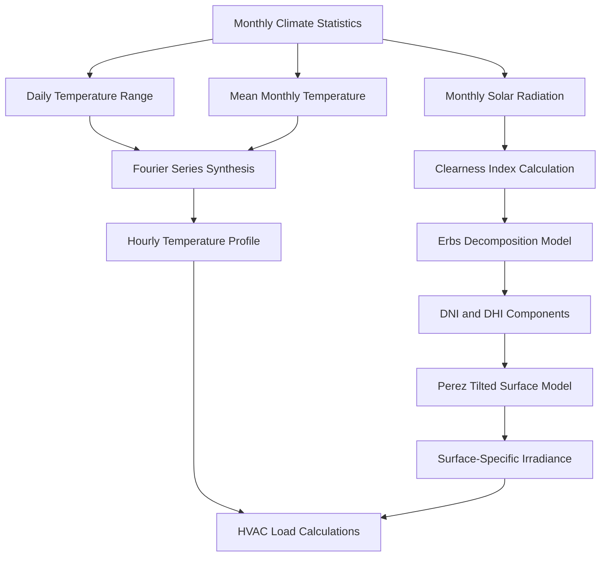

## Fundamental Principles

Climate data modeling transforms long-term meteorological observations into design parameters for HVAC system sizing and energy analysis. The process synthesizes hourly profiles from monthly statistics, enabling engineers to predict thermal loads under representative weather conditions.

ASHRAE Research Project RP-1453 established standardized methods for generating Typical Meteorological Year (TMY) datasets, which form the foundation for contemporary building energy simulation. These datasets combine physical radiation models with statistical sampling techniques to represent multi-decade climate patterns in a single annual sequence.

## Temperature Profile Generation

Hourly dry-bulb temperature synthesis employs Fourier series approximations that capture diurnal variation:

$$
T(h) = T_{avg} + \Delta T_{daily} \cdot \cos\left(\frac{2\pi(h - h_{max})}{24}\right)
$$

where $T_{avg}$ represents the daily mean temperature, $\Delta T_{daily}$ denotes the diurnal temperature range, $h$ indicates the hour of day, and $h_{max}$ specifies the hour of maximum temperature (typically 15:00 local solar time).

For enhanced accuracy, higher-order harmonics correct the simplified cosine approximation:

$$
T(h) = T_{avg} + \sum_{n=1}^{N} A_n \cos\left(\frac{2\pi n(h - \phi_n)}{24}\right)
$$

The amplitude coefficients $A_n$ and phase angles $\phi_n$ derive from regression analysis of multi-year hourly observations. Three harmonics typically provide 95% accuracy for mid-latitude locations.

## Solar Radiation Modeling

Solar radiation calculations require decomposition of global horizontal irradiance (GHI) into direct normal irradiance (DNI) and diffuse horizontal irradiance (DHI) components. The clearness index $K_t$ quantifies atmospheric transmittance:

$$
K_t = \frac{GHI}{I_0 \cos\theta_z}
$$

where $I_0$ represents the extraterrestrial normal irradiance (1367 W/m²) and $\theta_z$ denotes the solar zenith angle calculated from latitude, declination, and hour angle.

### Decomposition Models

The Erbs correlation separates beam and diffuse radiation based on clearness index:

**For $K_t \leq 0.22$:**

$$
\frac{DHI}{GHI} = 1.0 - 0.09K_t
$$

**For $0.22 < K_t \leq 0.80$:**

$$
\frac{DHI}{GHI} = 0.9511 - 0.1604K_t + 4.388K_t^2 - 16.638K_t^3 + 12.336K_t^4
$$

**For $K_t > 0.80$:**

$$
\frac{DHI}{GHI} = 0.165
$$

Direct normal irradiance follows from geometric relationships:

$$
DNI = \frac{GHI - DHI}{\cos\theta_z}
$$

## Radiation on Tilted Surfaces

The Perez anisotropic diffuse model calculates irradiance on tilted surfaces, accounting for circumsolar brightening and horizon brightening effects:

$$
I_{tilt} = DNI \cos\theta + DHI \left[(1-F_1)\frac{1+\cos\beta}{2} + F_1\frac{a}{b} + F_2\sin\beta\right] + GHI \rho_g\frac{1-\cos\beta}{2}
$$

where:
- $\theta$ = angle of incidence on tilted surface
- $\beta$ = surface tilt angle from horizontal
- $\rho_g$ = ground reflectance (typically 0.2)
- $F_1$, $F_2$ = empirical coefficients from Perez lookup tables
- $a/b$ = solid angle ratio for circumsolar region

## Humidity Modeling

Relative humidity exhibits inverse correlation with temperature during diurnal cycles. The psychrometric relationship maintains constant dew point temperature during dry periods:

$$
RH(h) = 100 \cdot \frac{P_{ws}(T_{dp})}{P_{ws}(T(h))}
$$

where $P_{ws}$ represents the saturation vapor pressure calculated using the Magnus-Tetens approximation:

$$
P_{ws}(T) = 610.78 \exp\left(\frac{17.27T}{T + 237.3}\right)
$$

Temperature $T$ and dew point $T_{dp}$ are expressed in degrees Celsius, yielding saturation pressure in Pascals.

## Design Day Development

ASHRAE Standard 169 defines climate zones based on heating and cooling degree days, establishing thermal design criteria. Design days represent extreme conditions for equipment sizing:

| Design Condition | Percentile | Application |
|-----------------|-----------|-------------|
| Cooling 0.4% | 99.6th | Peak cooling load |
| Cooling 1.0% | 99.0th | Standard design |
| Cooling 2.0% | 98.0th | Energy analysis |
| Heating 99.6% | 0.4th | Peak heating load |
| Heating 99.0% | 1.0th | Standard design |

The percentile values indicate the frequency with which actual conditions exceed design parameters over a multi-year period.

## Typical Meteorological Year Construction

TMY datasets employ the Finkelstein-Schafer statistical method to select representative months from long-term records. The selection process minimizes cumulative distribution function differences for key parameters:

$$
FS = \frac{1}{N}\sum_{i=1}^{N}\left|\delta_i\right|
$$

where $\delta_i$ represents the difference in cumulative distribution at data point $i$ between candidate month and long-term statistics. Weighting factors emphasize variables critical to HVAC performance: dry-bulb temperature (50%), dew point (15%), and global horizontal radiation (35%).

## Model Validation Metrics

Climate model accuracy assessment employs standardized statistical measures. Mean bias error (MBE) quantifies systematic deviation:

$$
MBE = \frac{1}{N}\sum_{i=1}^{N}(M_i - O_i)
$$

Root mean square error (RMSE) captures overall prediction accuracy:

$$
RMSE = \sqrt{\frac{1}{N}\sum_{i=1}^{N}(M_i - O_i)^2}
$$

where $M_i$ denotes modeled values and $O_i$ represents observed measurements. ASHRAE Guideline 14 specifies acceptable calibration tolerances: MBE within ±10% and RMSE below 30% for monthly energy predictions.

## Comparison of Climate Data Sources

| Data Source | Temporal Resolution | Spatial Resolution | Update Frequency | Primary Application |
|-------------|-------------------|-------------------|------------------|---------------------|
| TMY3 | Hourly | Station-specific | Static (1991-2005) | Standard design |
| CWEC | Hourly | 145 Canadian locations | Decadal | Canadian buildings |
| IGDG | Hourly | Global grid (0.1°) | Annual | International projects |
| AMY | Hourly | Station-specific | Annual | Actual year analysis |
| Future TMY | Hourly | Climate model output | Scenario-based | Climate adaptation |

## Climate Change Adaptation

Future climate projections modify historical datasets using delta methods or morphing techniques. The shift morphing approach adjusts monthly mean temperatures:

$$
T_{future}(h) = T_{TMY}(h) + \Delta T_{monthly}
$$

where $\Delta T_{monthly}$ derives from General Circulation Models under specified greenhouse gas concentration pathways (RCP 4.5, RCP 8.5).

Stretch morphing preserves extreme value statistics by scaling about the monthly mean:

$$
T_{future}(h) = T_{monthly,mean} + \alpha(T_{TMY}(h) - T_{monthly,mean})
$$

The scaling factor $\alpha$ adjusts variance to match projected climate conditions, maintaining physical consistency in diurnal patterns while reflecting anticipated climate trends.

Climate data modeling enables evidence-based HVAC system design by translating complex meteorological phenomena into engineering parameters. Proper application of these computational methods ensures equipment operates efficiently across the full range of anticipated environmental conditions.