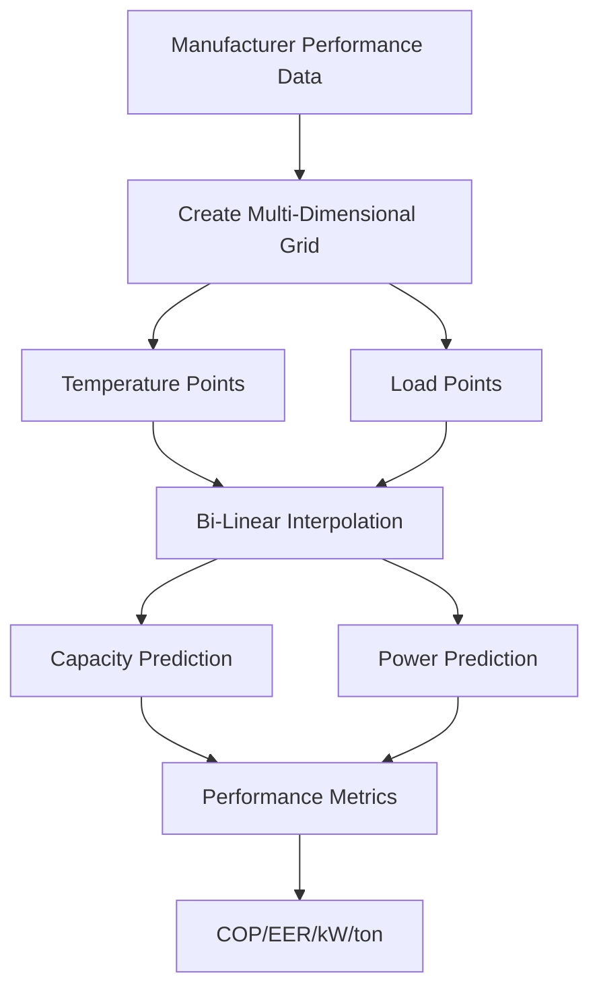

## Overview

Empirical equipment models represent HVAC component performance through regression-based correlations derived from manufacturer data or experimental measurements. These models prioritize computational speed and ease of implementation over first-principles accuracy, making them essential for annual energy simulations, control optimization, and rapid design iterations.

The fundamental approach fits polynomial equations or lookup tables to measured performance data, capturing equipment behavior across operating ranges without solving conservation equations.

## Polynomial Performance Models

### Chiller Capacity and Power Models

Manufacturers provide capacity and power consumption as functions of evaporator water temperature, condenser water temperature, and part-load ratio. The standard bi-quadratic form models full-load capacity:

$$Q_{available} = Q_{rated} \cdot \left( a_0 + a_1 T_{chw,leaving} + a_2 T_{chw,leaving}^2 + a_3 T_{cw,entering} + a_4 T_{cw,entering}^2 + a_5 T_{chw,leaving} T_{cw,entering} \right)$$

Where:
- $Q_{available}$ = Available cooling capacity at operating conditions (tons or kW)
- $Q_{rated}$ = Rated capacity at ARI conditions (44°F/85°F)
- $T_{chw,leaving}$ = Chilled water leaving temperature (°F or °C)
- $T_{cw,entering}$ = Condenser water entering temperature (°F or °C)
- $a_0...a_5$ = Regression coefficients from manufacturer data

Power consumption follows a similar bi-quadratic relationship multiplied by a part-load factor:

$$P = P_{rated} \cdot f_{cap}(T_{chw}, T_{cw}) \cdot f_{PLR}(PLR)$$

The part-load ratio function typically uses a cubic polynomial:

$$f_{PLR}(PLR) = b_0 + b_1 PLR + b_2 PLR^2 + b_3 PLR^3$$

### Coefficient Determination

Regression coefficients derive from least-squares fitting to manufacturer catalog data. ASHRAE Standard 205 specifies standardized performance map formats that facilitate coefficient extraction. The process involves:

1. **Data collection** - Extract capacity and power data across temperature and load ranges
2. **Normalization** - Convert absolute values to ratios relative to rated conditions
3. **Regression analysis** - Fit polynomial coefficients minimizing sum of squared errors
4. **Validation** - Verify model predictions against withheld data points

Coefficient accuracy directly impacts annual energy predictions. High-quality fits achieve R² > 0.995 across the operating envelope.

## Equipment-Specific Empirical Models

### Air-Cooled Chiller Models

Air-cooled equipment requires outdoor dry-bulb temperature as the independent variable rather than condenser water temperature. The capacity modifier becomes:

$$Q_{available} = Q_{rated} \cdot f_{cap}(T_{chw,leaving}, T_{odb})$$

Entering air temperature affects both heat rejection and compressor efficiency. Many models incorporate separate curves for different ambient conditions to capture non-linear degradation at extreme temperatures.

### Boiler Efficiency Curves

Boiler thermal efficiency varies with firing rate and return water temperature. The empirical relationship:

$$\eta = c_0 + c_1 PLR + c_2 PLR^2 + c_3 T_{hw,return}$$

Modern condensing boilers exhibit strong temperature dependence, requiring return water temperature as an explicit variable. Non-condensing boilers show weaker temperature effects but stronger part-load penalties.

### Heat Pump Performance Maps

Heat pumps require four separate correlations to capture heating and cooling modes at varying temperatures:

| Operating Mode | Capacity Function | Power Function |
|----------------|-------------------|----------------|
| Cooling | $f(T_{db,indoor}, T_{db,outdoor})$ | $f(T_{db,indoor}, T_{db,outdoor}, PLR)$ |
| Heating | $f(T_{db,indoor}, T_{db,outdoor})$ | $f(T_{db,indoor}, T_{db,outdoor}, PLR)$ |

Defrost cycles introduce additional complexity in heating mode. Advanced models include defrost frequency and duration as functions of outdoor temperature and humidity.

## Performance Map Interpolation

When polynomial fits introduce unacceptable errors, lookup tables with interpolation provide higher fidelity. Bi-linear or tri-linear interpolation between tabulated points maintains manufacturer data accuracy while enabling continuous operation point evaluation.

## Model Validation and Uncertainty

### Comparison of Empirical Approaches

| Model Type | Computational Speed | Accuracy | Data Requirements | Extrapolation Risk |
|------------|---------------------|----------|-------------------|-------------------|
| Bi-quadratic polynomial | Fastest | ±3-5% | Moderate | High |
| Cubic polynomial | Fast | ±2-4% | Moderate | Very High |
| Lookup table + interpolation | Moderate | ±1-2% | High | Extreme |
| Neural network | Slow | ±1-3% | Very High | Moderate |

### Extrapolation Limitations

Empirical models fail when operating conditions exceed the training data range. Extrapolation beyond manufacturer-tested conditions produces non-physical results. Conservative practice limits application to:

- Chilled water: 38-50°F leaving temperature
- Condenser water: 60-95°F entering temperature
- Part-load ratio: 0.10-1.00 (below minimum stability limit)

Operating outside these bounds requires first-principles models or consultation with manufacturer engineering.

## Integration with Building Simulation

Building energy programs (EnergyPlus, TRACE, eQuest) implement equipment libraries using empirical curves. Users select equipment types and provide:

- Rated capacity at standard conditions
- Manufacturer curve coefficients (or default curves)
- Minimum part-load ratio
- Auxiliary power (pumps, fans, controls)

The simulation engine calls performance functions at each timestep, passing current temperatures and required loads. Returned capacity and power values integrate into the system energy balance.

ASHRAE Standard 140 (Building Energy Simulation Test) validates empirical model implementations through comparative testing against analytical solutions and measured data.

## Advanced Calibration Techniques

Measured building data enables calibration of empirical coefficients to actual installed performance. The process adjusts default curves to match observed energy consumption:

$$\min \sum_{i=1}^{n} \left( P_{measured,i} - P_{model,i}(\mathbf{c}) \right)^2$$

Where $\mathbf{c}$ represents the coefficient vector. Constraints ensure physical plausibility (positive power, decreasing efficiency with increasing load for most equipment).

Calibrated models reduce prediction errors from 15-25% (default curves) to 5-10% (site-specific curves), improving optimization and fault detection applications.

## Limitations and Alternative Approaches

Empirical models cannot predict performance under novel operating strategies or equipment modifications. They interpolate existing data without understanding underlying thermodynamic processes. Applications requiring extrapolation, equipment design optimization, or refrigerant alternative evaluation require physics-based or hybrid approaches.

The trade-off between computational efficiency and physical fidelity determines model selection for each application. Annual energy analysis favors empirical speed, while detailed design and research applications justify first-principles complexity.
