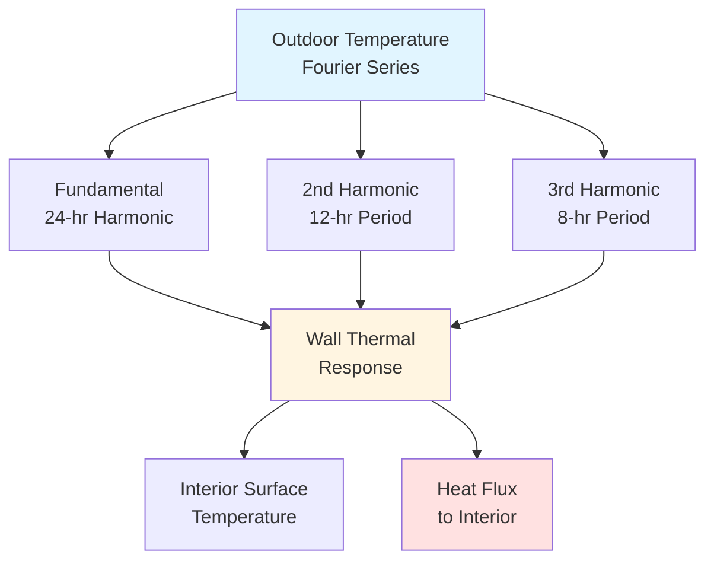
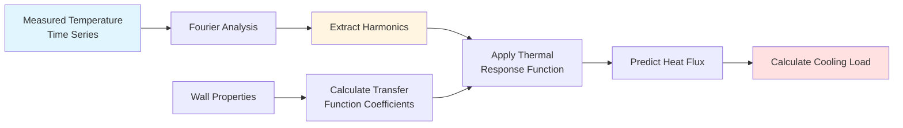

## Fundamentals of Fourier Temperature Analysis

Fourier series decomposition transforms periodic temperature variations into constituent harmonic components, enabling analytical solutions for building thermal response. This mathematical approach converts complex daily and seasonal temperature cycles into manageable sine and cosine functions that directly relate to heat transfer physics.

The technique proves particularly valuable for modeling outdoor air temperature fluctuations, ground temperature variations, and cyclic internal loads. Fourier analysis reveals the frequency content of temperature signals, identifying which time scales dominate thermal behavior and therefore which thermal masses matter most for system response.

## Mathematical Foundation

### Basic Fourier Series Expression

Any periodic temperature function T(t) with period P can be represented as:

$$T(t) = T_{mean} + \sum_{n=1}^{\infty} [A_n \cos(n\omega t) + B_n \sin(n\omega t)]$$

where:
- $T_{mean}$ = time-averaged temperature
- $\omega = 2\pi/P$ = fundamental angular frequency (rad/hr)
- $A_n$, $B_n$ = Fourier coefficients for the nth harmonic

The Fourier coefficients are calculated from temperature data:

$$A_n = \frac{2}{P} \int_0^P T(t) \cos(n\omega t) \, dt$$

$$B_n = \frac{2}{P} \int_0^P T(t) \sin(n\omega t) \, dt$$

For discrete hourly temperature data, the integrals become summations over the measurement period.

### Alternative Amplitude-Phase Form

The Fourier series can be rewritten in amplitude-phase notation:

$$T(t) = T_{mean} + \sum_{n=1}^{\infty} C_n \cos(n\omega t - \phi_n)$$

where:
- $C_n = \sqrt{A_n^2 + B_n^2}$ = amplitude of nth harmonic
- $\phi_n = \arctan(B_n/A_n)$ = phase angle of nth harmonic

This form directly reveals temperature swing amplitudes and timing, crucial for peak load calculations.

## Application to HVAC Systems

### Sol-Air Temperature Modeling

ASHRAE Fundamentals uses Fourier series to represent sol-air temperature, which combines outdoor air temperature with solar radiation effects:

$$T_{sol-air}(t) = T_{oa,mean} + \sum_{n=1}^{N} C_n \cos(n\omega t - \phi_n)$$

Typically, 3-4 harmonics (N=3 or 4) capture 95% of the temperature variation energy for daily cycles. The first harmonic represents the fundamental 24-hour cycle, while higher harmonics capture morning warm-up rates and evening cooldown asymmetries.

### Wall Heat Transfer Response

For a wall subjected to periodic outdoor temperature variations, the heat flux through the wall also becomes periodic. The thermal response function relates input temperature harmonics to output heat flux:

$$q(t) = \sum_{n=1}^{N} |Y_n| C_n \cos(n\omega t - \phi_n - \psi_n)$$

where:
- $|Y_n|$ = magnitude of thermal admittance at frequency $n\omega$
- $\psi_n$ = phase lag introduced by wall thermal mass

Each harmonic experiences different attenuation and time delay, with high-frequency components (rapid temperature changes) attenuated more strongly than low-frequency components (slow temperature drift).

## Harmonic Comparison for Daily Cycles

| Harmonic | Period (hrs) | Physical Meaning | Typical Amplitude | Attenuation Factor* |
|----------|--------------|------------------|-------------------|---------------------|
| n=1 | 24 | Daily cycle | 8-12°F | 0.3-0.5 |
| n=2 | 12 | Day/night asymmetry | 2-4°F | 0.1-0.2 |
| n=3 | 8 | Morning warmup rate | 1-2°F | 0.05-0.1 |
| n=4 | 6 | Solar transients | 0.5-1°F | 0.02-0.05 |

*Through 8-inch concrete wall

## Ground Temperature Modeling

The annual ground temperature variation follows a damped sinusoid with depth. Fourier analysis of surface temperature propagates into the ground according to:

$$T(z,t) = T_{mean} + C_1 e^{-z/d} \cos(\omega t - z/d)$$

where:
- $z$ = depth below surface (ft)
- $d = \sqrt{2\alpha/\omega}$ = damping depth (ft)
- $\alpha$ = soil thermal diffusivity (ft²/hr)

At depth $z = d$, the temperature amplitude decreases to 37% of surface amplitude. At $z = 3d$ (approximately 10-15 ft for annual cycles), temperature remains essentially constant at $T_{mean}$.

## Practical Implementation

### Harmonic Selection Criteria

The number of harmonics required depends on application accuracy needs:

- **Simplified design calculations**: 1-2 harmonics (fundamental daily cycle only)
- **Standard cooling load calculations**: 3-4 harmonics per ASHRAE recommendations
- **Detailed thermal comfort analysis**: 5-8 harmonics to capture transient effects
- **Research-grade simulation**: 10+ harmonics until convergence criteria met

### Truncation Error Analysis

The root-mean-square error between actual temperature T(t) and N-term approximation:

$$RMSE = \sqrt{\frac{1}{P} \int_0^P [T(t) - T_N(t)]^2 \, dt}$$

For outdoor air temperature in moderate climates, N=4 typically yields RMSE < 1°F.

## Advantages and Limitations

**Advantages:**
- Analytical solutions for periodic problems eliminate numerical time-stepping
- Physical insight into thermal response at different time scales
- Efficient computation for systems with linear thermal properties
- Natural connection to frequency-domain transfer functions

**Limitations:**
- Applies only to periodic or quasi-periodic phenomena
- Assumes linear thermal properties (constant conductivity, no phase change)
- Requires sufficient historical data to determine coefficients
- Non-periodic transients (weather fronts, equipment cycling) require other methods

## Integration with ASHRAE Methods

ASHRAE Standard 140 includes test cases with sinusoidal boundary conditions specifically for validating Fourier-based calculation methods. The Radiant Time Series Method (RTSM) in ASHRAE Fundamentals Chapter 18 employs Fourier concepts through periodic response factors.

Transfer function methods for cooling load calculations use z-transform representations that directly connect to Fourier series through discrete-time frequency analysis. Modern building energy simulation tools incorporate Fourier techniques within their conduction transfer function algorithms.

## Validation and Convergence

Model validation compares Fourier series predictions against measured data or detailed finite-difference solutions. Key metrics include:

- Peak temperature prediction error (should be < 2°F for N ≥ 3)
- Phase shift accuracy (within 30 minutes for daily cycles)
- Energy balance closure over complete periods (< 1% error)

Convergence testing increments N until additional harmonics contribute less than a specified threshold to total heat transfer, typically 1% of the fundamental harmonic contribution.

---

*This content provides foundational knowledge for HVAC engineers implementing analytical temperature models. Fourier series methods remain valuable tools for understanding periodic thermal phenomena and validating numerical simulation results.*
