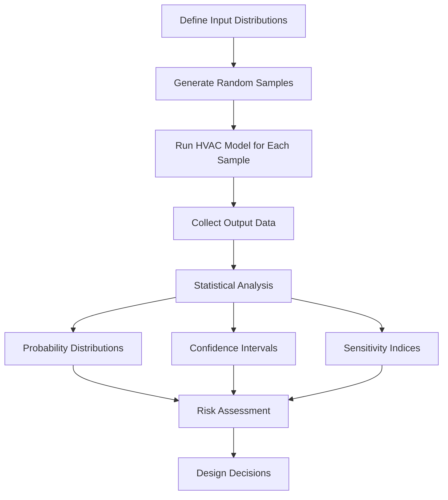
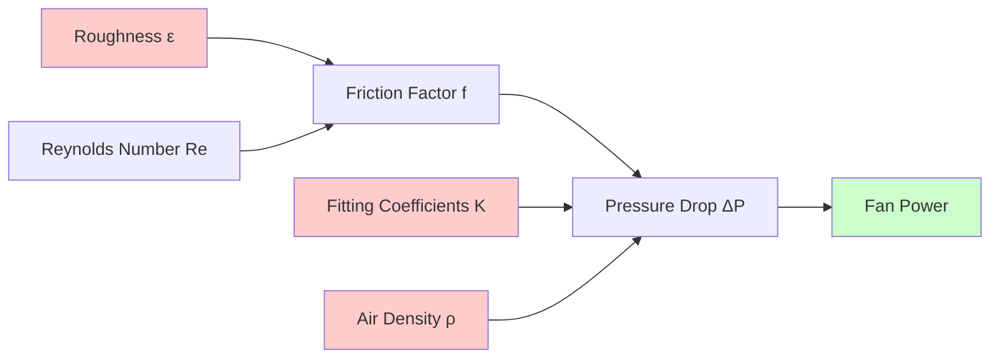

## Fundamentals of Uncertainty in HVAC Systems

Uncertainty quantification (UQ) addresses the variability and lack of precision inherent in HVAC system modeling, design, and performance prediction. Sources of uncertainty include measurement error, material property variation, occupancy patterns, weather data, and model simplifications. Quantifying these uncertainties enables risk-informed decision making and robust system design.

HVAC uncertainty falls into two categories:

- **Aleatory uncertainty**: Inherent randomness (weather variability, occupancy schedules, equipment degradation)
- **Epistemic uncertainty**: Lack of knowledge (model form error, parameter estimation error, measurement limitations)

ASHRAE Research Project RP-1051 established frameworks for uncertainty analysis in HVAC applications, emphasizing the importance of propagating input uncertainties through simulation models to characterize output distributions.

## Mathematical Framework

### Uncertainty Propagation

For a general HVAC model $y = f(x_1, x_2, ..., x_n)$ where $x_i$ are input parameters with uncertainties, the output uncertainty is propagated through:

$$
\sigma_y^2 = \sum_{i=1}^{n} \left(\frac{\partial f}{\partial x_i}\right)^2 \sigma_{x_i}^2 + 2\sum_{i=1}^{n-1}\sum_{j=i+1}^{n} \frac{\partial f}{\partial x_i}\frac{\partial f}{\partial x_j}\rho_{ij}\sigma_{x_i}\sigma_{x_j}
$$

where $\sigma_y$ is output standard deviation, $\sigma_{x_i}$ are input standard deviations, and $\rho_{ij}$ are correlation coefficients between inputs.

### First-Order Second-Moment Method

For linear or mildly nonlinear systems, the first-order approximation provides efficient uncertainty estimates:

$$
\mu_y \approx f(\mu_{x_1}, \mu_{x_2}, ..., \mu_{x_n})
$$

$$
\sigma_y^2 \approx \sum_{i=1}^{n} \left(\frac{\partial f}{\partial x_i}\bigg|_{\mu_x}\right)^2 \sigma_{x_i}^2
$$

This method applies to heat transfer calculations where $Q = UA\Delta T$ with uncertainties in $U$, $A$, and $\Delta T$.

## Monte Carlo Simulation Methods

Monte Carlo simulation generates random samples from input probability distributions, evaluates the model for each sample, and builds output probability distributions through statistical analysis.

### Implementation Steps

1. **Parameter identification**: Identify uncertain inputs (occupancy loads, infiltration rates, equipment efficiency)
2. **Distribution assignment**: Assign probability distributions (normal, uniform, lognormal) based on data or expert judgment
3. **Sample generation**: Use Latin Hypercube Sampling (LHS) for efficient stratified sampling
4. **Model execution**: Run building energy simulation or equipment model for each sample
5. **Statistical processing**: Calculate mean, standard deviation, percentiles, and confidence intervals

### Convergence Criteria

The number of samples $N$ required for convergence depends on the desired confidence level and acceptable error:

$$
N \geq \left(\frac{z_{\alpha/2} \cdot \sigma}{\epsilon \cdot \mu}\right)^2
$$

where $z_{\alpha/2}$ is the critical value (1.96 for 95% confidence), $\epsilon$ is relative error tolerance, and $\mu$, $\sigma$ are estimated mean and standard deviation.

## Sensitivity Analysis Techniques

### Local Sensitivity Analysis

Local sensitivity coefficients quantify the rate of change of outputs with respect to inputs at a nominal operating point:

$$
S_i = \frac{\partial y}{\partial x_i}\bigg|_{x_0} \cdot \frac{x_{i,0}}{y_0}
$$

This normalized coefficient indicates the percentage change in output per percentage change in input $i$.

### Global Sensitivity Analysis

Variance-based methods decompose output variance into contributions from each input:

$$
V(Y) = \sum_{i} V_i + \sum_{i} \sum_{j>i} V_{ij} + ... + V_{1,2,...,n}
$$

The first-order Sobol indices measure main effects:

$$
S_i = \frac{V_{X_i}(E_{X_{\sim i}}(Y|X_i))}{V(Y)}
$$

Total-effect indices capture main effects plus all interactions:

$$
S_{T_i} = \frac{E_{X_{\sim i}}(V_{X_i}(Y|X_{\sim i}))}{V(Y)} = 1 - \frac{V_{X_{\sim i}}(E_{X_i}(Y|X_{\sim i}))}{V(Y)}
$$

## Comparison of UQ Methods

| Method | Computational Cost | Accuracy | Applicability | Key Advantage |
|--------|-------------------|----------|---------------|---------------|
| Analytical Propagation | Very Low | Low-Medium | Linear models | Closed-form solutions |
| First-Order Second-Moment | Low | Medium | Mildly nonlinear | Fast estimates |
| Monte Carlo | High | High | Universal | Simple implementation |
| Latin Hypercube Sampling | Medium | High | Universal | Efficient sampling |
| Polynomial Chaos Expansion | Medium-High | Very High | Smooth models | Surrogate model creation |
| Kriging/Gaussian Process | High | Very High | Expensive models | Adaptive sampling |

## HVAC-Specific Applications

### Cooling Load Uncertainty

Building cooling loads exhibit significant uncertainty from:
- Internal gains (occupancy density ±30%, equipment loads ±20%)
- Infiltration rates (0.1-0.5 ACH variation)
- Solar heat gain coefficients (±10% manufacturing tolerance)
- Wall U-values (±15% from installation quality)

Example propagation for peak cooling load $Q_{peak}$:

$$
Q_{peak} = Q_{solar} + Q_{internal} + Q_{infiltration} + Q_{conduction}
$$

Monte Carlo analysis typically shows peak load standard deviation of 12-18% of nominal value, leading to sizing factors between 1.10-1.25 for 90% confidence that capacity exceeds load.

### Equipment Performance Uncertainty

Heat pump coefficient of performance varies with:
- Ambient temperature measurement (±0.5°C)
- Refrigerant charge (±5% affects COP by ±3%)
- Airflow rate (±10% typical, ±5% COP impact)
- Fouling factors (0.00009-0.00018 m²·K/W uncertainty)

Combined uncertainty in annual energy consumption typically ranges from 8-15% for residential systems and 6-10% for commercial systems with better monitoring.

### Airflow Network Uncertainty

Pressure drop calculations through ductwork involve uncertainties in:
- Duct roughness (15-20% variation in friction factor)
- Fitting loss coefficients (±25% from geometry variations)
- Air density (±2% from temperature/humidity)

## Measurement Uncertainty Standards

ASHRAE Standard 41 series provides measurement uncertainty guidelines:

- **Standard 41.1**: Temperature measurement (±0.2°C for calibrated sensors)
- **Standard 41.2**: Humidity measurement (±2% RH)
- **Standard 41.5**: Airflow measurement (±2-5% with proper instrumentation)
- **Standard 41.6**: Mass flow measurement (±1-3% for refrigerant flow)

Combined measurement uncertainty for energy flows typically achieves ±5-8% when following standard protocols.

## Practical Implementation Guidelines

### Building Energy Modeling

For annual energy simulations:
1. Identify 10-15 key uncertain parameters (infiltration, internal gains, schedules, HVAC efficiency)
2. Use Latin Hypercube Sampling with 500-1000 samples
3. Report median, 25th/75th percentiles, and 90% confidence intervals
4. Perform sensitivity analysis to identify dominant parameters
5. Focus calibration efforts on high-sensitivity parameters

### Equipment Sizing Decisions

Risk-based sizing accounts for load uncertainty:
- Design for 80th percentile load (20% exceedance probability)
- Add capacity margin based on consequence of under-sizing
- Critical applications: 90-95th percentile design point
- Standard comfort cooling: 75-85th percentile acceptable

### Calibration and Model Updating

Bayesian methods update parameter distributions as measurement data becomes available:

$$
p(\theta|D) = \frac{p(D|\theta)p(\theta)}{p(D)}
$$

where $p(\theta|D)$ is the posterior distribution, $p(D|\theta)$ is likelihood, $p(\theta)$ is prior distribution, and $p(D)$ is evidence.

This framework reduces epistemic uncertainty as operational data refines model parameters, improving prediction accuracy for retrofit analysis and operational optimization.

## Software Tools and Implementation

Modern building simulation platforms incorporate uncertainty quantification:

- **EnergyPlus with jEPlus**: Parametric analysis and Monte Carlo simulation
- **TRNSYS with TRNOPT**: Optimization with uncertainty
- **IDA-ICE**: Built-in uncertainty and sensitivity modules
- **Python-based tools**: SALib for sensitivity analysis, PyMC for Bayesian inference

These tools enable practitioners to move beyond deterministic predictions toward probabilistic performance assessment, aligning design decisions with project risk tolerance and performance requirements.
