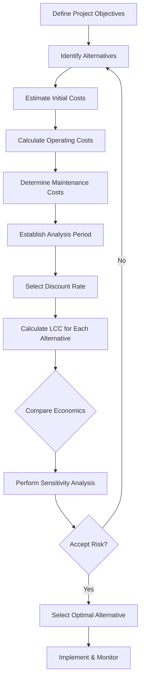
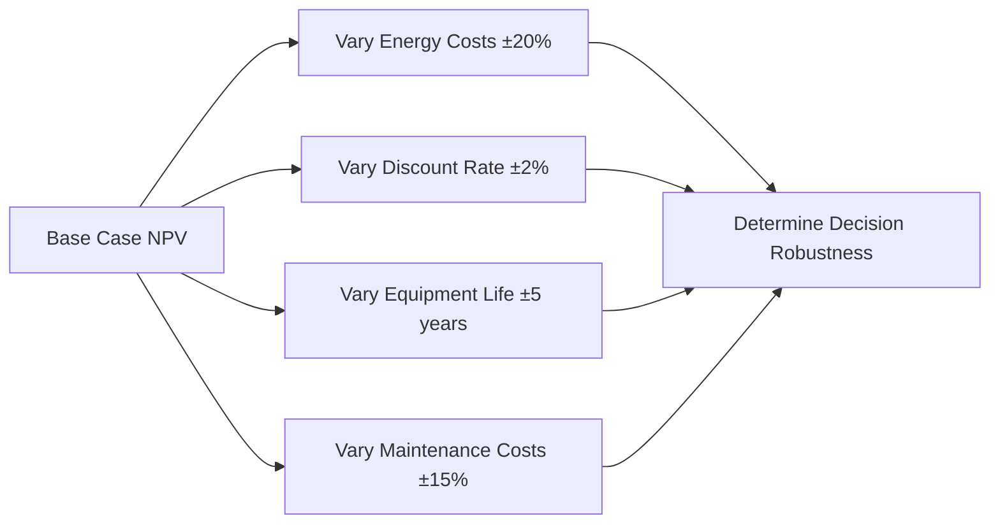

# Economic Analysis of HVAC Systems

Economic analysis provides the quantitative framework for evaluating HVAC system investments, comparing alternatives, and optimizing design decisions. Proper economic evaluation accounts for initial capital costs, operating expenses, maintenance requirements, and equipment life expectancy to determine the most cost-effective solution over the system's operational lifetime.

## Fundamental Economic Metrics

### Life Cycle Cost Analysis (LCCA)

Life cycle cost represents the total cost of owning and operating an HVAC system from installation through end-of-life. The fundamental LCCA equation incorporates all cash flows over the analysis period:

$$LCC = C_i + \sum_{t=1}^{N} \frac{C_{o,t} + C_{m,t} + C_{r,t}}{(1+d)^t} - \frac{S}{(1+d)^N}$$

Where:
- $C_i$ = Initial capital cost (\$)
- $C_{o,t}$ = Operating cost in year $t$ (\$/year)
- $C_{m,t}$ = Maintenance cost in year $t$ (\$/year)
- $C_{r,t}$ = Replacement cost in year $t$ (\$)
- $S$ = Salvage value (\$)
- $d$ = Discount rate (decimal)
- $N$ = Analysis period (years)

ASHRAE 90.1 Appendix G provides economic analysis guidelines for energy efficiency measures, recommending analysis periods of 15-25 years for commercial HVAC systems.

### Net Present Value (NPV)

NPV quantifies the present worth of future cash flows, enabling direct comparison between alternatives with different cost profiles:

$$NPV = -C_i + \sum_{t=1}^{N} \frac{CF_t}{(1+d)^t}$$

Where $CF_t$ represents net cash flow (savings minus costs) in year $t$. Positive NPV indicates economic viability; higher NPV identifies the superior alternative among competing options.

### Simple and Discounted Payback Period

Simple payback period (SPP) calculates years to recover initial investment without considering time value of money:

$$SPP = \frac{C_i}{S_{annual}}$$

Where $S_{annual}$ = annual cost savings (\$/year).

Discounted payback period (DPP) accounts for discount rate, providing more realistic recovery timeline:

$$\sum_{t=1}^{DPP} \frac{S_t}{(1+d)^t} = C_i$$

## Energy Cost Calculations

Energy costs typically dominate HVAC operating expenses. Annual energy cost derives from equipment power consumption, operating hours, and utility rates:

$$C_{energy} = P \times h \times r \times (1 - \eta_{recovery})$$

Where:
- $P$ = Average power demand (kW)
- $h$ = Annual operating hours (hours/year)
- $r$ = Blended electric rate (\$/kWh)
- $\eta_{recovery}$ = Energy recovery fraction (decimal)

**Example Calculation:**

Compare two air handling units serving a 50,000 ft² office building:

| Parameter | Standard AHU | High-Efficiency AHU |
|-----------|--------------|---------------------|
| Initial Cost | \$125,000 | \$185,000 |
| Fan Power | 45 kW | 32 kW |
| Cooling Capacity | 150 tons | 150 tons |
| Annual Operating Hours | 4,380 h | 4,380 h |
| Electric Rate | \$0.11/kWh | \$0.11/kWh |
| Expected Life | 20 years | 20 years |

Annual energy cost (Standard): $45 \text{ kW} \times 4,380 \text{ h} \times \$0.11/\text{kWh} = \$21,681$

Annual energy cost (High-Eff): $32 \text{ kW} \times 4,380 \text{ h} \times \$0.11/\text{kWh} = \$15,410$

Annual savings: $\$21,681 - \$15,410 = \$6,271$

Simple payback: $(\$185,000 - \$125,000) / \$6,271 = 9.6 \text{ years}$

## Economic Decision Framework

## Demand Charges and Utility Rate Structures

Commercial electric rates typically include demand charges based on peak kW draw during billing period. Total monthly electric cost:

$$C_{total} = C_{energy} + C_{demand} + C_{fixed}$$

$$C_{total} = (kWh \times r_e) + (kW_{peak} \times r_d) + C_f$$

Where:
- $r_e$ = Energy rate (\$/kWh)
- $r_d$ = Demand rate (\$/kW)
- $C_f$ = Fixed monthly charge (\$/month)

Peak demand reduction through load shifting, thermal storage, or demand-controlled ventilation provides substantial economic benefit. A 10 kW peak reduction at \$15/kW demand charge saves \$1,800 annually.

## Maintenance Cost Modeling

Maintenance costs escalate with equipment age. Realistic modeling incorporates escalation factors:

$$C_{m,t} = C_{m,0} \times (1 + e)^t$$

Where:
- $C_{m,0}$ = Initial maintenance cost (\$/year)
- $e$ = Escalation rate (typically 2-4% annually)
- $t$ = Years from installation

## Comparison of Economic Analysis Methods

| Method | Advantages | Limitations | Best Application |
|--------|-----------|-------------|------------------|
| Simple Payback | Easy to calculate and understand | Ignores time value of money | Quick screening of alternatives |
| Discounted Payback | Accounts for discount rate | Ignores cash flows beyond payback | Projects with liquidity concerns |
| NPV | Considers all cash flows, time value | Requires accurate discount rate | Comparing mutually exclusive projects |
| Internal Rate of Return (IRR) | Independent of discount rate | Multiple solutions possible | Single project go/no-go decisions |
| Savings-to-Investment Ratio (SIR) | Shows return per dollar invested | Doesn't indicate project scale | Limited budget allocation |

## Discount Rate Selection

Discount rate reflects opportunity cost of capital and project risk. ASHRAE recommends:

- **Government projects**: Use Office of Management and Budget (OMB) rates (historically 3-7%)
- **Private sector**: Weighted average cost of capital (WACC), typically 8-12%
- **High-risk projects**: Add risk premium of 2-5%

Real discount rate (inflation-adjusted):

$$d_{real} = \frac{d_{nominal} - i}{1 + i}$$

Where $i$ = inflation rate (decimal).

## Sensitivity Analysis

Economic decisions involve uncertain future parameters. Sensitivity analysis quantifies impact of parameter variation on decision outcomes:

Parameters with greatest impact on decision warrant additional investigation or risk mitigation strategies.

## Energy Efficiency Incentives

Many utilities and government programs offer rebates, tax credits, or accelerated depreciation for high-efficiency HVAC equipment:

- **Utility rebates**: \$50-500 per ton for high-efficiency equipment
- **Federal tax credits**: Up to 30% of installed cost (subject to legislative changes)
- **Accelerated depreciation**: Modified Accelerated Cost Recovery System (MACRS) allows faster write-off

Include incentives in LCCA as reduction to initial cost:

$$C_{i,net} = C_i - R_{utility} - T_{credit}$$

## Practical Application: Chiller Replacement Analysis

A facility evaluates replacing a 200-ton, 0.85 kW/ton chiller with a 0.52 kW/ton high-efficiency model:

**Current chiller annual energy:**
$$E = 200 \text{ tons} \times 0.85 \text{ kW/ton} \times 2,500 \text{ h/year} = 425,000 \text{ kWh/year}$$

**Proposed chiller annual energy:**
$$E = 200 \text{ tons} \times 0.52 \text{ kW/ton} \times 2,500 \text{ h/year} = 260,000 \text{ kWh/year}$$

**Annual savings:** $165,000 \text{ kWh} \times \$0.10/\text{kWh} = \$16,500/\text{year}$

**NPV calculation** (15-year analysis, 6% discount rate, \$180,000 installed cost):

$$NPV = -\$180,000 + \sum_{t=1}^{15} \frac{\$16,500}{(1.06)^t} = -\$180,000 + \$160,186 = -\$19,814$$

Negative NPV suggests project is not economically justified unless utility rebates, demand charge savings, or other benefits are included.

## Conclusion

Rigorous economic analysis transforms HVAC system selection from subjective preference to data-driven decision-making. Life cycle cost analysis, properly executed with realistic inputs and appropriate discount rates, identifies the optimal balance between initial investment and long-term operating costs. Engineers must consider all cost components—energy, demand charges, maintenance, and replacements—over the full analysis period while accounting for uncertainty through sensitivity analysis. ASHRAE 90.1 and building energy codes increasingly mandate economic analysis for demonstrating code compliance alternative paths, making these skills essential for modern HVAC design practice.
