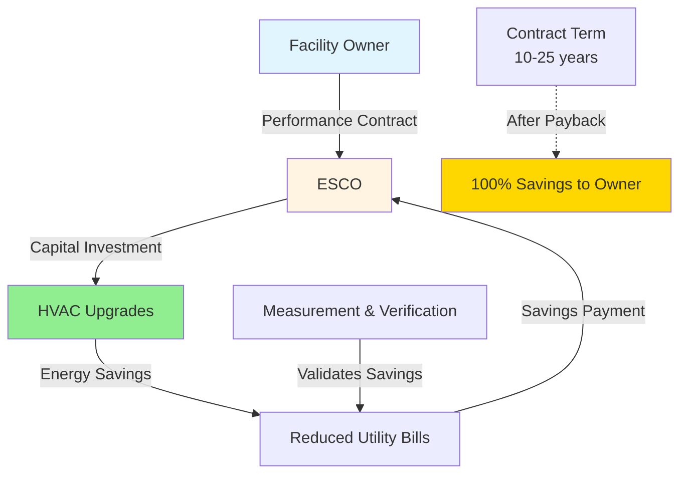
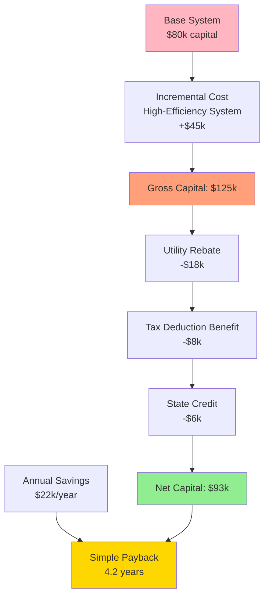

## Economic Incentive Framework

Economic incentives reduce the effective capital cost of high-efficiency HVAC equipment, improving project economics and shortening payback periods. These mechanisms address the first-cost barrier that prevents adoption of energy-efficient technologies despite favorable life-cycle economics.

The net capital investment after incentives becomes:

$$C_{net} = C_{capital} - R_{utility} - T_{credit} - D_{accel} - G_{grant}$$

where $C_{capital}$ represents gross capital cost, $R_{utility}$ utility rebates, $T_{credit}$ tax credits, $D_{accel}$ accelerated depreciation present value benefit, and $G_{grant}$ grant funding.

Effective payback period incorporating incentives:

$$PBP_{eff} = \frac{C_{net}}{S_{annual}} = \frac{C_{capital} - \sum I_i}{\Delta E \times c_e + \Delta M}$$

where $I_i$ represents individual incentives, $\Delta E$ annual energy savings (kWh/yr), $c_e$ energy cost ($/kWh), and $\Delta M$ annual maintenance savings.

## Utility Rebate Programs

Electric and gas utilities offer rebates to reduce peak demand, defer generation capacity investments, and meet regulatory energy savings mandates. Rebate structures vary by utility service territory and regulatory framework.

### Prescriptive Rebates

Prescriptive programs provide fixed incentives for installing qualifying equipment meeting minimum efficiency thresholds:

**Typical cooling equipment rebates:**

| Equipment Type | Efficiency Threshold | Rebate Level |
|---------------|---------------------|--------------|
| Packaged rooftop units | IEER ≥ 16.0 | $150-300/ton |
| Air-cooled chillers | IPLV ≥ 14.0 EER | $200-400/ton |
| Water-cooled chillers | IPLV ≥ 0.60 kW/ton | $300-600/ton |
| VRF systems | IEER ≥ 14.0 | $200-350/ton |
| Premium motors | NEMA Premium efficiency | $10-25/hp |

Prescriptive rebates offer administrative simplicity but may not reflect actual energy savings in specific applications.

### Custom Performance Rebates

Custom programs compensate actual measured or modeled energy savings, typically at $0.08-0.25/kWh first-year savings. The incentive calculation:

$$R_{custom} = \Delta E_{annual} \times r_{kwh} \times f_{cap}$$

where $r_{kwh}$ is the rebate rate ($/kWh), and $f_{cap}$ represents program cap factor (typically 0.3-0.5 of project cost).

Energy savings require engineering analysis per protocols such as ASHRAE Guideline 14 or International Performance Measurement and Verification Protocol (IPMVP).

## Federal Tax Incentives

### Section 179D Commercial Buildings Energy Efficiency Tax Deduction

Section 179D provides tax deductions for energy-efficient commercial building systems. For HVAC improvements meeting prescribed energy savings thresholds:

**Deduction structure (post-2023 Inflation Reduction Act):**

- Base deduction: $0.50-$1.00/ft² for 25% energy cost reduction
- Maximum deduction: $5.00/ft² for 50% energy cost reduction

The deduction value scales linearly between thresholds:

$$D_{179D} = A_{floor} \times \left(\$2.50 + \$0.10 \times \left(\frac{E_{save} - 25\%}{1\%}\right)\right)$$

for savings percentages between 25% and 50%, where $A_{floor}$ is building floor area (ft²) and $E_{save}$ is percentage energy cost reduction versus ASHRAE 90.1 baseline.

### Investment Tax Credit (ITC)

The ITC applies to qualifying energy property including solar thermal systems, geothermal heat pumps, and combined heat and power (CHP) systems:

$$T_{ITC} = C_{qualified} \times r_{credit}$$

where $C_{qualified}$ is the basis of qualified property and $r_{credit}$ ranges from 6% to 30% depending on system type, capacity, and prevailing wage requirements.

## Accelerated Depreciation

### Modified Accelerated Cost Recovery System (MACRS)

Standard HVAC equipment depreciates over 39 years for real property or 5-7 years for personal property. Bonus depreciation provisions allow immediate expensing of qualifying improvements.

Present value benefit of accelerated depreciation:

$$D_{accel} = C_{capital} \times \tau_{corp} \times \left(\sum_{t=1}^{n_1} \frac{d_t^{accel}}{(1+r)^t} - \sum_{t=1}^{n_2} \frac{d_t^{standard}}{(1+r)^t}\right)$$

where $\tau_{corp}$ is corporate tax rate, $d_t$ represents depreciation fraction in year $t$, and $r$ is discount rate.

For 100% bonus depreciation, the immediate benefit equals $C_{capital} \times \tau_{corp}$, effectively reducing net capital cost by 21% for corporations at current federal rates.

## State and Local Incentives

### State Tax Credits

State-level incentives vary widely. Common structures include:

- **Income tax credits** - 10-25% of equipment cost for high-efficiency systems
- **Sales tax exemptions** - exemption from state sales tax on qualifying equipment
- **Property tax abatements** - reduced assessed value for green building improvements

### Local Utility Programs

Municipal utilities and cooperatives often provide enhanced incentive levels exceeding investor-owned utility programs. Some programs cover 40-60% of incremental cost for premium efficiency equipment.

## Energy Savings Performance Contracts (ESPC)

ESPCs enable infrastructure upgrades with no upfront capital investment. Energy service companies (ESCOs) finance, install, and maintain equipment, recovering costs from guaranteed energy savings.

### ESPC Economics

The ESCO payment stream derives from contractually guaranteed savings:

$$P_{ESCO,t} = \min(S_{guaranteed,t}, S_{actual,t})$$

where $S_{guaranteed,t}$ represents guaranteed savings and $S_{actual,t}$ actual measured savings in year $t$. The ESCO bears performance risk; shortfalls require cash true-up payments to the owner.

Typical ESPC structure allocates 70-90% of projected savings to debt service and ESCO fees during the contract term. Post-contract, 100% of savings accrue to the facility owner.

## Measurement and Verification

Incentive programs requiring performance verification typically reference IPMVP protocols. The four primary M&V options trade measurement rigor against cost:

| Option | Method | Application | Cost |
|--------|--------|-------------|------|
| A | Retrofit isolation - key parameters measured | Individual equipment with measurable savings | Low |
| B | Retrofit isolation - all parameters measured | Systems with sub-metering | Medium |
| C | Whole facility | Small projects in simple buildings | Low |
| D | Calibrated simulation | Complex systems, multiple ECMs | High |

Measurement uncertainty propagates through savings calculations:

$$U_{savings} = \sqrt{U_{baseline}^2 + U_{post}^2 + U_{adjustment}^2}$$

where $U$ represents uncertainty in baseline energy use, post-retrofit consumption, and non-routine adjustments.

## Incentive Stacking and Limitations

### Stackability Rules

Multiple incentives can often combine, but coordination requires careful analysis:

- Utility rebates + federal tax deductions: Generally stackable
- Tax credits + accelerated depreciation: Credit may reduce depreciable basis
- State credits + federal credits: Usually stackable with basis adjustments

### Program Caps

Common limitations include:

- Maximum incentive as percentage of project cost (30-50% typical)
- Per-customer annual caps ($50,000-500,000 common for commercial)
- Technology-specific allocations and waitlists
- Budget exhaustion mid-program year

## Incentive Impact on Project Economics

## Strategic Incentive Optimization

Maximizing incentive value requires:

1. **Timing coordination** - align projects with program years and budget cycles
2. **Pre-approval** - secure utility and grant commitments before procurement
3. **Documentation** - maintain rigorous records for compliance verification
4. **Professional assistance** - engage incentive specialists for complex applications
5. **Portfolio approach** - bundle projects to meet minimum thresholds or maximize tiers

The effective after-incentive cost of energy efficiency measures frequently achieves payback periods under 3 years, transforming projects from marginal to highly attractive investments.

## References

- ASHRAE Guideline 14: Measurement of Energy, Demand, and Water Savings
- International Performance Measurement and Verification Protocol (IPMVP)
- Database of State Incentives for Renewables & Efficiency (DSIRE)
- Internal Revenue Code Section 179D
- Energy Policy Act (EPAct) provisions for commercial buildings
