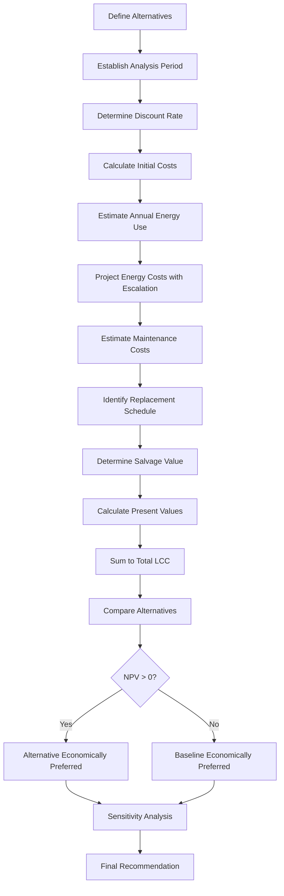

# Life Cycle Cost Analysis (LCCA) for HVAC Systems

Life Cycle Cost Analysis (LCCA) provides a systematic methodology for evaluating the total economic impact of HVAC system alternatives over their entire service life. This approach extends beyond initial capital costs to incorporate energy consumption, maintenance expenditures, replacement components, and salvage value, enabling objective comparison of design options with different cost structures.

## Fundamental LCCA Equation

The total life cycle cost represents the present value of all costs incurred over the analysis period:

$$LCC = C_i + \sum_{t=1}^{N} \frac{C_{o,t} + C_{m,t} + C_{r,t}}{(1+d)^t} - \frac{S_N}{(1+d)^N}$$

Where:
- $C_i$ = Initial capital cost (equipment, installation, commissioning)
- $C_{o,t}$ = Operating costs in year $t$ (primarily energy)
- $C_{m,t}$ = Maintenance and repair costs in year $t$
- $C_{r,t}$ = Replacement costs in year $t$
- $S_N$ = Salvage value at end of analysis period
- $d$ = Discount rate (real or nominal)
- $N$ = Analysis period (years)
- $t$ = Year index

## Discount Rate Selection

The discount rate reflects the time value of money and opportunity cost of capital. ASHRAE Standard 90.1 Appendix G references federal guidelines suggesting real discount rates of 3-7% for energy-related investments.

**Real vs. Nominal Rates:**

Real discount rate removes inflation effects:

$$d_{real} = \frac{1 + d_{nominal}}{1 + i} - 1$$

Where $i$ = inflation rate.

For constant-dollar analysis (recommended for HVAC), use real discount rates and express all costs in base-year dollars.

## Present Value Factors

### Single Payment Present Worth Factor (SPPWF)

Converts a future single cost to present value:

$$SPPWF = \frac{1}{(1+d)^t}$$

### Uniform Series Present Worth Factor (USPWF)

Converts annual recurring costs to present value:

$$USPWF = \frac{(1+d)^N - 1}{d(1+d)^N}$$

Applied when maintenance or energy costs remain constant annually.

## Energy Cost Escalation

Energy costs typically escalate differently than general inflation. The modified uniform present worth factor accounts for differential escalation:

$$USPWF_{mod} = \frac{1}{d-e} \left[1 - \left(\frac{1+e}{1+d}\right)^N\right]$$

Where $e$ = real energy escalation rate (energy inflation minus general inflation).

When $e = d$, the factor simplifies to $N$.

## Component Analysis

### Initial Capital Costs

Include all first costs:
- Equipment procurement (chillers, boilers, AHUs, controls)
- Installation labor and materials
- Electrical and piping connections
- Structural modifications
- Commissioning and startup
- Design and engineering fees
- Permits and regulatory compliance

### Operating Costs

Dominated by energy consumption:

$$C_{energy,annual} = \sum_{i} E_i \times UC_i$$

Where:
- $E_i$ = Annual energy consumption for utility $i$ (kWh, therms)
- $UC_i$ = Unit cost for utility $i$ ($/kWh, $/therm)

Consider demand charges for electric systems:

$$C_{electric} = \sum_{month} (kWh \times E_{rate} + kW_{peak} \times D_{rate})$$

### Maintenance and Repair Costs

Distinguish between:
- **Routine maintenance**: Periodic servicing (filters, belts, lubrication)
- **Predictive maintenance**: Condition-based interventions
- **Repairs**: Unscheduled component failures
- **Major overhauls**: Scheduled refurbishment (compressor rebuilds, retubes)

Estimate as percentage of initial cost (typically 2-6% annually for HVAC) or detailed task-based analysis.

### Replacement Costs

Components with service lives shorter than analysis period require replacement:

| Component | Typical Service Life | Replacement Cycle |
|-----------|---------------------|-------------------|
| Filters | 3-12 months | Annual |
| Belts | 2-5 years | Mid-life |
| Compressors | 15-20 years | Once in 25-year analysis |
| Heat exchangers | 20-30 years | End-of-life consideration |
| Controls | 10-15 years | Mid-life |
| Variable frequency drives | 10-15 years | Mid-life |

Present value of replacement:

$$PV_{replacement} = C_{replacement} \times \frac{1}{(1+d)^{t_{replace}}}$$

## Comparison Metrics

### Net Present Value (NPV)

Difference in LCC between alternatives:

$$NPV = LCC_{baseline} - LCC_{alternative}$$

Positive NPV indicates the alternative saves money over the analysis period.

### Savings-to-Investment Ratio (SIR)

$$SIR = \frac{\Delta PV_{savings}}{\Delta C_i}$$

Where:
- $\Delta PV_{savings}$ = Present value of operating cost savings
- $\Delta C_i$ = Additional initial investment

SIR > 1.0 indicates economically justified investment.

### Simple Payback Period (SPP)

$$SPP = \frac{\Delta C_i}{Annual\ Savings}$$

Quick screening metric; ignores time value of money and costs beyond payback.

### Discounted Payback Period (DPP)

Year when cumulative discounted savings equal additional investment. More accurate than SPP but still ignores benefits after payback.

## LCCA Process Flow

## Sensitivity Analysis

LCCA results depend on assumptions about future conditions. Test sensitivity to:

- **Discount rate**: ±2% variation
- **Energy escalation rate**: ±1-2% variation
- **Equipment life**: ±20% variation
- **Maintenance costs**: ±25% variation
- **Energy consumption**: ±10% variation (calibrated model uncertainty)

Present results showing break-even points where alternative preference changes.

## Standards and Guidelines

**ASHRAE references:**
- ASHRAE Guideline 0: The Commissioning Process (economic justification)
- ASHRAE Standard 90.1: Energy Standard for Buildings (cost-effectiveness methodology)
- ASHRAE Handbook—HVAC Applications, Chapter 37: Testing, Adjusting, and Balancing

**Federal standards:**
- NIST Handbook 135: Life-Cycle Costing Manual for the Federal Energy Management Program
- FEMP guidelines on discount rates (annually updated)
- 10 CFR 436: Federal building energy efficiency standards

## Practical Considerations

**Analysis period selection:**
- Match to building ownership horizon or equipment service life
- Federal facilities: 25 years typical
- Commercial buildings: 15-20 years common
- Lease situations: Lease term

**Common pitfalls:**
- Inconsistent cost basis (mixing current and future dollars)
- Omitting major replacement costs
- Underestimating maintenance requirements
- Ignoring demand charge impacts
- Neglecting commissioning costs
- Failure to account for comfort and productivity impacts

**Documentation requirements:**
Maintain clear records of:
- All cost data sources and dates
- Assumed escalation rates with justification
- Equipment performance specifications
- Analysis period rationale
- Discount rate selection basis

LCCA provides the rigorous economic framework required for defensible HVAC system selection, ensuring that initial cost advantages do not obscure long-term economic disadvantages and enabling optimization of total ownership costs.
