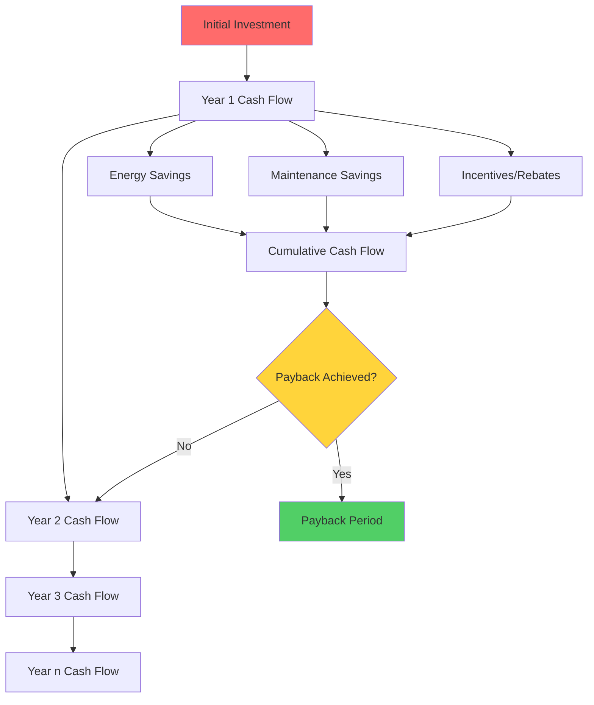
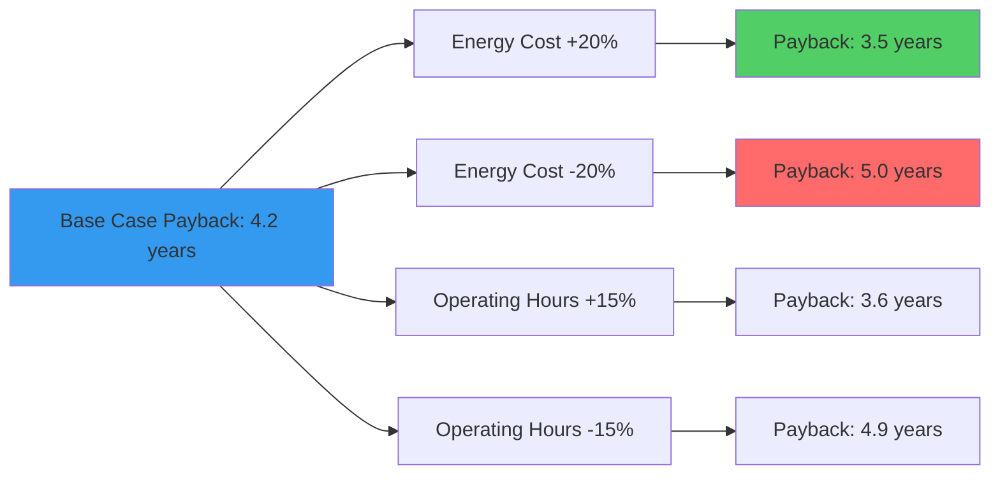

## Fundamental Payback Period Metrics

Payback period analysis quantifies the time required to recover initial HVAC system investment through operational savings. This economic metric directly influences equipment selection, retrofit decisions, and capital allocation strategies.

### Simple Payback Period

The simple payback period (SPP) represents the most straightforward investment evaluation method:

$$SPP = \frac{Initial\ Investment}{Annual\ Savings}$$

Where annual savings derives from reduced energy consumption, maintenance costs, and operational expenses. This calculation neglects the time value of money and assumes uniform annual savings.

**Example Calculation:**
- High-efficiency chiller investment: $125,000
- Annual energy savings: $28,000
- Reduced maintenance: $4,500
- Total annual savings: $32,500
- Simple payback: 125,000 ÷ 32,500 = 3.85 years

### Discounted Payback Period

The discounted payback period (DPP) accounts for the time value of money by discounting future cash flows to present value:

$$DPP = Year\ when\ \sum_{t=1}^{n} \frac{Cash\ Flow_t}{(1+r)^t} \geq Initial\ Investment$$

Where:
- r = discount rate (weighted average cost of capital)
- t = time period (years)
- n = equipment lifetime

This method provides more accurate economic assessment for capital-intensive HVAC projects where the cost of capital significantly impacts decision-making.

## Energy Savings Calculation Methodology

Accurate payback analysis requires precise quantification of energy savings through thermodynamic principles and operational data.

### Cooling System Efficiency Improvements

For chiller replacement or upgrades, energy savings calculations derive from efficiency differential:

$$Energy\ Savings = \frac{Cooling\ Load}{EER_{new}} \times Hours - \frac{Cooling\ Load}{EER_{existing}} \times Hours$$

$$Annual\ Cost\ Savings = Energy\ Savings \times Electricity\ Rate$$

Where EER (Energy Efficiency Ratio) represents cooling output (Btu/hr) per unit power input (W).

### Heating System Efficiency Analysis

Boiler or furnace replacement savings:

$$Fuel\ Savings = Annual\ Heating\ Load \times \left(\frac{1}{\eta_{existing}} - \frac{1}{\eta_{new}}\right)$$

Where η represents thermal efficiency (decimal form). The heating load calculation follows ASHRAE Standard 90.1 methodology accounting for envelope heat loss, infiltration, and ventilation requirements.

## Cash Flow Analysis Framework

## Comparative Payback Analysis

| HVAC Upgrade Type | Typical Investment | Annual Savings | Simple Payback | Discounted Payback (6%) |
|-------------------|-------------------|----------------|----------------|------------------------|
| Chiller Replacement (500 tons) | $450,000 | $75,000 | 6.0 years | 7.2 years |
| Variable Speed Drives (AHU) | $35,000 | $12,500 | 2.8 years | 3.1 years |
| Economizer Installation | $18,000 | $8,200 | 2.2 years | 2.4 years |
| Building Automation Upgrade | $125,000 | $32,000 | 3.9 years | 4.5 years |
| High-Efficiency Boiler | $85,000 | $22,000 | 3.9 years | 4.4 years |
| Energy Recovery Ventilator | $65,000 | $18,500 | 3.5 years | 4.0 years |

## Factors Affecting Payback Period

### Energy Cost Escalation

Future energy price increases reduce actual payback periods. The escalation-adjusted savings calculation:

$$Savings_t = Base\ Savings \times (1 + e)^t$$

Where e represents the annual energy cost escalation rate. ASHRAE Advanced Energy Design Guides recommend using regional utility rate forecasts for long-term projections.

### Maintenance Cost Differential

Modern high-efficiency equipment often requires less maintenance than aging systems. Quantify maintenance savings through:

- Reduced service frequency
- Lower refrigerant charge requirements
- Extended component lifespan
- Decreased emergency repair incidents

### Utility Incentive Programs

Many utilities offer rebates for high-efficiency HVAC equipment. These incentives directly reduce initial investment:

$$Adjusted\ Investment = Initial\ Cost - Utility\ Rebate - Tax\ Credits$$

## Sensitivity Analysis

Payback period calculations contain inherent uncertainty. Conduct sensitivity analysis varying:

1. **Energy prices**: ±20% range captures price volatility
2. **Operating hours**: Account for occupancy variations
3. **Equipment performance**: Consider degradation over time
4. **Discount rate**: Evaluate at different capital costs

## Decision Criteria and Thresholds

ASHRAE Standard 90.1 provides minimum efficiency requirements, but economic analysis determines optimal equipment selection. Typical organizational acceptance criteria:

- **Acceptable payback**: < 5 years for competitive projects
- **Preferred payback**: < 3 years for priority funding
- **Strategic payback**: < 10 years for infrastructure modernization

## Integration with Lifecycle Cost Analysis

Payback period serves as an initial screening tool but should integrate with comprehensive lifecycle cost analysis per ASHRAE Standard 189.1. Equipment with longer payback periods may still provide superior lifecycle value through extended service life and superior performance characteristics.

The net present value (NPV) method evaluates total economic impact:

$$NPV = \sum_{t=1}^{n} \frac{Savings_t}{(1+r)^t} - Initial\ Investment$$

Positive NPV indicates economically viable investment regardless of payback period duration.

## Practical Application Considerations

For accurate payback analysis:

1. **Baseline measurement**: Establish current energy consumption through utility data analysis or sub-metering
2. **Load profile analysis**: Account for seasonal and operational variations
3. **Performance verification**: Implement measurement and verification (M&V) protocols per ASHRAE Guideline 14
4. **Documentation**: Maintain records of assumptions, calculations, and data sources for future audits

Payback period analysis provides essential financial justification for HVAC capital investments, enabling data-driven decision-making that balances initial cost against long-term operational efficiency.
