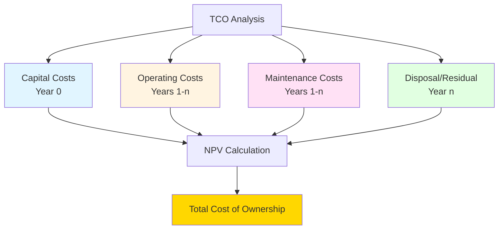
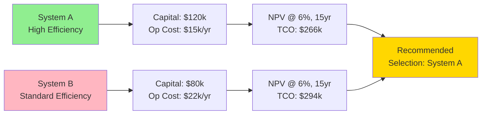

## Total Cost of Ownership Framework

Total Cost of Ownership (TCO) provides a comprehensive economic assessment of HVAC equipment over its entire service life. Unlike simple first-cost comparisons, TCO quantifies all cash flows from acquisition through disposal, enabling rational capital allocation decisions.

The complete TCO equation integrates all cost categories over the system lifetime:

$$TCO = C_{acq} + C_{inst} + \sum_{t=1}^{n} \frac{C_{op,t} + C_{maint,t}}{(1+r)^t} + \frac{C_{disp} - V_{resid}}{(1+r)^n}$$

where $C_{acq}$ represents acquisition costs, $C_{inst}$ installation costs, $C_{op,t}$ annual operating costs, $C_{maint,t}$ maintenance costs, $C_{disp}$ disposal costs, $V_{resid}$ residual value, $r$ discount rate, and $n$ system lifetime in years.

## Acquisition and Installation Costs

### Equipment Acquisition

Acquisition costs encompass all expenses to procure equipment ready for installation:

- **Base equipment costs** - manufacturer list price adjusted for volume discounts
- **Ancillary components** - controls, sensors, instrumentation, integration hardware
- **Shipping and handling** - freight, rigging, storage costs
- **Procurement overhead** - purchasing department allocation, vendor qualification

For packaged systems, acquisition costs typically range from $300-600/ton cooling capacity. Custom central plants require detailed component-level estimation.

### Installation Expenses

Installation labor and materials frequently exceed equipment costs for complex systems:

- **Labor costs** - field installation, pipe/duct connections, electrical work
- **Materials** - refrigerant piping, fittings, supports, insulation, electrical wiring
- **Crane and rigging** - equipment placement, rooftop lifts
- **Site preparation** - equipment pads, structural reinforcement, roof penetrations
- **Testing and commissioning** - functional performance testing per ASHRAE Guideline 1.1
- **Training** - operator instruction, documentation development

Installation cost as percentage of equipment cost varies widely:

| System Type | Installation/Equipment Ratio |
|-------------|------------------------------|
| Packaged rooftop units | 0.4 - 0.8 |
| Split DX systems | 0.6 - 1.2 |
| Chilled water central plant | 1.5 - 3.0 |
| VRF systems | 0.8 - 1.4 |

## Operating Energy Costs

Energy consumption dominates long-term TCO for most HVAC systems. Annual operating cost follows from thermodynamic efficiency and operating profile:

$$C_{op} = \frac{Q_{annual}}{EER} \times c_e \times \frac{1}{3.412}$$

where $Q_{annual}$ is annual cooling load (Btu/yr), $EER$ is energy efficiency ratio (Btu/Wh), and $c_e$ is electricity cost ($/kWh). The factor 3.412 converts kW to Btu/h.

### Load Factor Effects

Actual energy consumption depends critically on part-load operation. Systems operate at design load less than 1% of annual hours. The integrated part-load value (IPLV) or seasonal energy efficiency ratio (SEER) provides more realistic energy prediction:

$$E_{annual} = \sum_{i=1}^{8760} \frac{Q_{load,i}}{EER_{part}(PLR_i)}$$

where $PLR_i$ represents the part-load ratio for hour $i$ and $EER_{part}(PLR)$ is the efficiency function at part load.

High-efficiency equipment commands premium acquisition costs but delivers reduced operating costs. The economic crossover depends on energy pricing, operating hours, and load characteristics.

## Maintenance and Repair Costs

### Preventive Maintenance

Regular maintenance preserves efficiency and extends equipment life. ASHRAE recommends frequency-based on equipment type and operating environment:

**Annual maintenance cost approximation:**

$$C_{maint} = C_{labor} + C_{materials} + C_{overhead}$$

Typical maintenance costs range 2-4% of equipment replacement cost annually for mechanical systems, 1-2% for controls and electrical components.

### Repair and Replacement

Unscheduled repairs follow probabilistic failure patterns. Expected repair cost integrates failure probability with repair expense:

$$C_{repair,expected} = \sum_{j=1}^{m} P_{fail,j} \times C_{repair,j}$$

where $P_{fail,j}$ is the failure probability for component $j$ and $C_{repair,j}$ is the associated repair cost.

## Present Value Analysis

Time value of money requires discounting future costs to present value. The net present value (NPV) of all costs determines TCO:

### Discount Rate Selection

Discount rate selection fundamentally affects TCO calculations. Common approaches:

- **Weighted average cost of capital (WACC)** - reflects organization's financing cost
- **Internal hurdle rate** - organizational investment threshold
- **Risk-adjusted rate** - adds risk premium to risk-free rate

Higher discount rates favor low first-cost equipment; lower rates favor high-efficiency alternatives.

## Sensitivity Analysis

TCO calculations contain numerous uncertain parameters. Sensitivity analysis identifies critical variables:

$$\frac{\partial TCO}{\partial x_i} = \text{sensitivity to parameter } x_i$$

Parameters warranting sensitivity analysis:

- Energy price escalation rate
- Equipment lifetime
- Discount rate
- Maintenance cost trends
- Operating hours

## Comparative TCO Framework

## Disposal and Residual Value

End-of-life costs include:

- **Removal labor** - disconnection, rigging, demolition
- **Refrigerant recovery** - EPA-mandated reclamation per Section 608
- **Disposal fees** - landfill, recycling, hazardous material handling
- **Site restoration** - patching, sealing penetrations

Residual value offsets disposal costs for equipment with remaining useful life or salvage value. Typical residual values range 5-15% of original cost for standard HVAC equipment.

## References

- ASHRAE Guideline 1.1-2007: HVAC&R Technical Requirements for The Commissioning Process
- ASHRAE Standard 90.1: Energy Standard for Buildings Except Low-Rise Residential Buildings
- NIST Handbook 135: Life-Cycle Costing Manual for the Federal Energy Management Program
