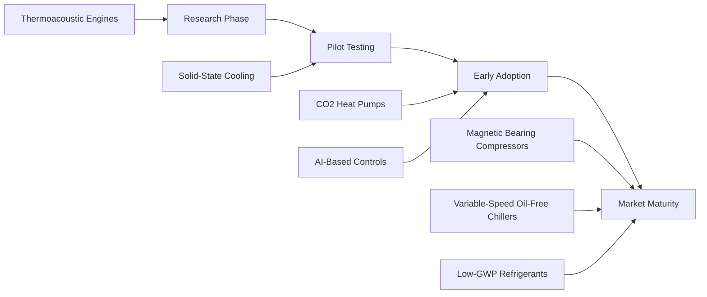

# Emerging HVAC Technologies

The HVAC industry undergoes continuous evolution driven by regulatory requirements, energy efficiency mandates, and technological advancement. Emerging technologies address fundamental thermodynamic challenges while reducing environmental impact and operational costs. This section examines cutting-edge developments that reshape climate control engineering.

## Thermodynamic Drivers of Innovation

Innovation in HVAC systems stems from three primary thermodynamic imperatives:

1. **Carnot Efficiency Improvement**: Reducing temperature lift between heat source and sink
2. **Exergy Destruction Minimization**: Eliminating irreversibilities in heat transfer and fluid flow
3. **Entropy Generation Reduction**: Optimizing processes to approach reversibility

The coefficient of performance (COP) for heating and cooling systems follows fundamental limits:

$$
\text{COP}_{\text{heating}} = \frac{T_{\text{hot}}}{T_{\text{hot}} - T_{\text{cold}}}
$$

$$
\text{COP}_{\text{cooling}} = \frac{T_{\text{cold}}}{T_{\text{hot}} - T_{\text{cold}}}
$$

Where temperatures are in absolute units (Kelvin). Emerging technologies approach these theoretical limits through advanced cycle modifications, improved heat exchangers, and intelligent controls.

## Technology Landscape

### Heat Pump Innovations

Advanced heat pump technologies leverage low-grade thermal energy sources and achieve higher temperature lifts through multi-stage compression, vapor injection, and novel working fluids. CO₂ transcritical cycles operate above the critical point (31.1°C, 7.38 MPa) to deliver high-temperature heating while maintaining favorable environmental characteristics (GWP = 1, ODP = 0).

Variable-speed compressors with magnetic bearings eliminate mechanical friction, reducing part-load power consumption by 30-50% compared to fixed-speed alternatives. The power requirement at part load follows:

$$
P = P_{\text{rated}} \left(\frac{Q}{Q_{\text{rated}}}\right)^n
$$

Where n ranges from 2.5-3.0 for variable-speed systems versus 1.0 for on/off control.

### Next-Generation Refrigerants

The transition from high-GWP hydrofluorocarbons (HFCs) to low-GWP alternatives follows regulatory timelines established by the Kigali Amendment. The technology landscape includes:

| Refrigerant Class | GWP Range | Primary Application | Key Characteristics |
|-------------------|-----------|---------------------|---------------------|
| HFOs (R-1234yf, R-1234ze) | < 10 | Chillers, heat pumps | Mildly flammable (A2L) |
| Natural Refrigerants (R-744, R-717) | 1-0 | Commercial refrigeration, industrial | Non-toxic or toxic, varied flammability |
| Hydrocarbon Blends (R-290, R-600a) | 3-20 | Small systems | Highly flammable (A3) |
| HFO/HFC Blends (R-454B, R-32) | 148-675 | Residential AC, heat pumps | Lower flammability than pure HCs |

Material compatibility, lubricant selection, and safety system design represent critical engineering considerations during refrigerant transitions.

### Intelligent Controls and AI Integration

Machine learning algorithms optimize HVAC operation by identifying patterns in building thermal response, occupancy, and weather data. Model Predictive Control (MPC) solves optimization problems continuously:

$$
\min_{u(t)} \int_{t_0}^{t_f} \left[ w_1 E(t) + w_2 |T_{\text{zone}} - T_{\text{setpoint}}|^2 \right] dt
$$

Subject to thermal balance constraints, equipment capacity limits, and demand response signals. Neural networks approximate complex building thermal dynamics faster than physics-based models, enabling real-time optimization.

### Advanced Thermal Storage

Phase change materials (PCMs) store latent heat at constant temperature during melting/solidification transitions. The energy storage density for a PCM with latent heat h_fg is:

$$
q = \rho \left[ c_p \Delta T + h_{fg} \right]
$$

Salt hydrates (Na₂SO₄·10H₂O) achieve melting points near 32°C with latent heats of 254 kJ/kg, suitable for building thermal mass augmentation. Ice storage systems shift cooling loads to off-peak hours, reducing demand charges while improving grid stability.

### Desiccant Dehumidification Technology

Solid and liquid desiccant systems decouple sensible and latent cooling, improving efficiency in high-humidity climates. The moisture removal rate follows mass transfer principles:

$$
\dot{m}_w = h_m A \rho_{\text{air}} (W_{\text{air}} - W_{\text{desiccant}})
$$

Where h_m is the mass transfer coefficient and W represents humidity ratio. Regeneration using low-grade heat (60-80°C) from solar thermal collectors or waste heat recovery enables cost-effective dehumidification.

## Technology Maturity Assessment

## Integration with Building Systems

Effective deployment of emerging technologies requires system-level integration addressing:

- **Electrical Infrastructure**: Variable frequency drives (VFDs) introduce harmonic distortion requiring power quality mitigation
- **Control Networks**: BACnet, Modbus, and proprietary protocols enable data exchange but create cybersecurity vulnerabilities
- **Hydronic Systems**: Variable-flow pumping, low-temperature distribution, and decoupling strategies optimize heat transfer
- **Energy Management**: Integration with building management systems (BMS) enables demand response and fault detection

## Performance Validation Standards

ASHRAE Standard 90.1 establishes minimum efficiency requirements for commercial equipment. Testing procedures defined in ANSI/AHRI standards ensure consistent performance ratings:

- **AHRI 550/590**: Water-chilling and heat pump water-heating packages
- **AHRI 340/360**: Commercial and industrial refrigeration
- **AHRI 210/240**: Unitary air-conditioning and heat pump equipment

Field verification through measurement and verification (M&V) protocols (ASHRAE Guideline 14, IPMVP) quantifies actual energy savings versus baseline predictions.

## Economic and Environmental Considerations

Technology adoption depends on total cost of ownership (TCO) analysis incorporating:

1. First cost (equipment, installation, commissioning)
2. Operating costs (energy, maintenance, refrigerant)
3. Lifecycle duration and replacement timing
4. Environmental compliance (carbon pricing, refrigerant taxes)

The levelized cost of energy (LCOE) provides comparison across competing technologies:

$$
\text{LCOE} = \frac{\sum_{t=1}^{n} \frac{C_t + O_t}{(1+r)^t}}{\sum_{t=1}^{n} \frac{E_t}{(1+r)^t}}
$$

Where C_t represents capital costs, O_t operating costs, E_t energy delivered, and r the discount rate over n years.

## Future Outlook

The convergence of electrification, decarbonization, and digitalization accelerates HVAC technology development. Solid-state cooling devices based on thermoelectric, magnetocaloric, and electrocaloric effects approach commercialization for niche applications. Grid-interactive efficient buildings (GEBs) coordinate HVAC operation with renewable energy generation and storage, transforming buildings from passive loads into active grid assets.

Regulatory frameworks increasingly mandate low-GWP refrigerants, high-efficiency equipment, and building decarbonization. Engineers must navigate this evolving landscape while maintaining fundamental priorities: thermal comfort, indoor air quality, reliability, and cost-effectiveness.
