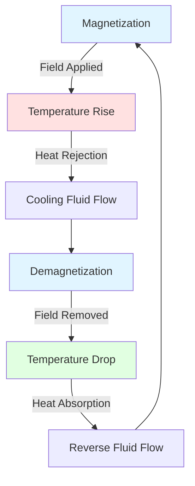

## Overview

Advanced refrigeration technologies represent evolutionary and revolutionary improvements beyond conventional vapor-compression systems. These innovations address energy efficiency, environmental impact, and application-specific performance through novel thermodynamic cycles, alternative working principles, and optimized system architectures.

## Transcritical CO2 Refrigeration

Transcritical cycles operate above the critical point of the refrigerant, fundamentally changing heat rejection characteristics. For CO2 (R-744), the critical point occurs at 31.1°C and 7.38 MPa, making transcritical operation practical for many applications.

### Thermodynamic Performance

The coefficient of performance for transcritical cycles depends on gas cooler effectiveness rather than condensing temperature:

$$
COP_{trans} = \frac{h_1 - h_4}{h_2 - h_1}
$$

Where:
- $h_1$ = evaporator outlet enthalpy
- $h_2$ = compressor discharge enthalpy
- $h_4$ = expansion valve inlet enthalpy

Gas cooler approach temperature significantly impacts performance. For transcritical CO2:

$$
\eta_{gc} = \frac{T_{amb} - T_{gc,out}}{T_{gc,in} - T_{amb}}
$$

Optimal discharge pressure varies with ambient conditions according to:

$$
P_{opt} = 2.778 - 0.0157 \cdot T_{gc,out}
$$

Where $P_{opt}$ is in MPa and $T_{gc,out}$ is in °C.

### System Characteristics

| Parameter | Subcritical R-404A | Transcritical CO2 |
|-----------|-------------------|-------------------|
| Operating Pressure | 1.5-3.0 MPa | 8.0-12.0 MPa |
| Discharge Temperature | 65-85°C | 90-140°C |
| Volumetric Capacity | 2,800 kJ/m³ | 22,000 kJ/m³ |
| GWP | 3,922 | 1 |
| Pressure Ratio | 3.5-5.0 | 2.5-3.5 |

## Ejector-Enhanced Refrigeration

Ejector cycles recover expansion work through momentum transfer, improving efficiency by 10-25% compared to conventional throttling. The ejector replaces or supplements the expansion valve, using high-pressure motive flow to compress low-pressure suction vapor.

### Ejector Performance Analysis

The entrainment ratio determines overall system benefit:

$$
\omega = \frac{\dot{m}_s}{\dot{m}_p}
$$

Where $\dot{m}_s$ is secondary (suction) flow and $\dot{m}_p$ is primary (motive) flow.

Ejector efficiency relates to pressure lift and entrainment:

$$
\eta_{ej} = \frac{\omega(h_{s,in} - h_{s,out}) + (h_{p,in} - h_{p,out})}{(h_{p,in} - h_{mix,ideal})}
$$

COP improvement from ejector integration:

$$
COP_{ejector} = COP_{basic} \cdot \left(1 + \frac{\omega \cdot P_{lift}}{W_{comp}}\right)
$$

### Design Considerations

Ejector geometry critically affects performance. The area ratio determines operating range:

$$
A_R = \frac{A_{nozzle,throat}}{A_{mixing,throat}}
$$

ASHRAE Research Project RP-1755 established design guidelines for ejector refrigeration systems, recommending area ratios between 0.4-0.8 for most applications.

## Magnetic Refrigeration

Magnetocaloric cooling exploits the temperature change in magnetic materials under varying magnetic fields. This solid-state technology eliminates refrigerants entirely, offering zero direct environmental impact.

### Magnetocaloric Effect

The adiabatic temperature change under magnetic field $H$ follows:

$$
\Delta T_{ad} = -\int_{H_0}^{H_1} \left(\frac{T}{C_H}\right) \left(\frac{\partial M}{\partial T}\right)_H dH
$$

Where:
- $T$ = absolute temperature
- $C_H$ = heat capacity at constant field
- $M$ = magnetization

For gadolinium near Curie temperature (294 K), field change from 0 to 2 Tesla produces:

$$
\Delta T_{ad} \approx 5-8 \text{ K}
$$

### Active Magnetic Regeneration

Practical magnetic cooling requires regeneration cycles:

Regenerator effectiveness determines cycle COP:

$$
\varepsilon_{reg} = \frac{T_{fluid,out} - T_{fluid,in}}{T_{solid} - T_{fluid,in}}
$$

Current magnetic refrigeration prototypes achieve COP values of 2-5 at temperature lifts of 20-30 K, comparable to vapor compression but with superior part-load efficiency.

## Thermoelectric Cooling

Peltier effect devices provide solid-state cooling through electron transport across dissimilar semiconductors. Applications include spot cooling, electronics thermal management, and specialized HVAC applications.

### Performance Fundamentals

Thermoelectric COP depends on figure of merit $ZT$:

$$
COP_{TE} = \frac{T_c \sqrt{1 + ZT} - T_h}{T_h - T_c} \cdot \frac{1}{1 + \sqrt{1 + ZT}}
$$

Where:
- $T_c$ = cold side temperature (K)
- $T_h$ = hot side temperature (K)
- $ZT$ = dimensionless figure of merit

Figure of merit combines material properties:

$$
ZT = \frac{S^2 \sigma T}{\kappa}
$$

Where $S$ is Seebeck coefficient, $\sigma$ is electrical conductivity, and $\kappa$ is thermal conductivity.

### Material Advances

| Material System | ZT Value | Temperature Range | Development Status |
|-----------------|----------|-------------------|-------------------|
| Bi₂Te₃ (conventional) | 0.8-1.0 | -50 to 200°C | Commercial |
| Skutterudites | 1.2-1.4 | 300-600°C | Prototype |
| Half-Heusler | 1.0-1.5 | 300-700°C | Research |
| Nanostructured PbTe | 1.5-2.2 | 400-700°C | Research |

ASHRAE Standard 116-2010 specifies testing methods for thermoelectric devices in HVAC applications.

## Two-Phase Ejector Systems

Advanced ejector configurations create two-phase flow expansion, recovering additional energy compared to vapor-only systems. The flash gas bypass ejector (FGBE) redirects vapor from the flash tank through a secondary compressor or ejector.

### Cycle Enhancement

For two-stage systems with flash gas management:

$$
COP_{FGBE} = \frac{Q_e}{\dot{m}_1 W_1 + \dot{m}_2 W_2}
$$

Where subscripts 1 and 2 denote low and high-stage compressors.

Efficiency improvement ranges from 8-15% depending on temperature lift and refrigerant properties.

## Cascade Refrigeration Innovations

Modern cascade systems employ optimized refrigerant pairings and enhanced heat exchanger designs for ultra-low temperature applications (-80 to -150°C).

### Optimal Cascade Temperature

The intermediate temperature that minimizes total work input:

$$
T_{cascade,opt} = \sqrt{T_{evap} \cdot T_{cond}}
$$

This geometric mean relationship applies when both stages use similar refrigerants with comparable efficiency characteristics.

## Thermoacoustic Refrigeration

Thermoacoustic systems convert acoustic power into thermal gradients through gas compression and expansion in standing waves. The primary advantage is elimination of moving parts and refrigerants.

### Acoustic Work Relationship

The time-averaged acoustic power through a regenerator:

$$
\dot{W}_{ac} = \frac{1}{2} \text{Re}\left[\tilde{p} \cdot \tilde{u}^* \cdot A\right]
$$

Where $\tilde{p}$ is pressure amplitude, $\tilde{u}$ is velocity amplitude, and $A$ is cross-sectional area.

## Stirling Cycle Refrigeration

Stirling refrigerators operate on a closed regenerative cycle with gas compression at ambient temperature and expansion at cold temperature. Applications include cryogenic cooling and specialized low-temperature systems.

### Ideal Stirling COP

For ideal Stirling cycle:

$$
COP_{Stirling} = \frac{T_c}{T_h - T_c}
$$

Practical systems achieve 30-40% of Carnot efficiency due to regenerator losses and heat transfer irreversibilities.

## Standards and Testing

ASHRAE Standard 34-2019 classifies refrigerants including emerging low-GWP options for advanced cycles. Performance testing follows AHRI Standard 540-2020 for positive displacement refrigerant compressors.

Advanced refrigeration technologies continue evolving toward higher efficiency, lower environmental impact, and expanded application ranges. Physics-based optimization combined with novel materials and cycle architectures drives ongoing performance improvements across all technology categories.
