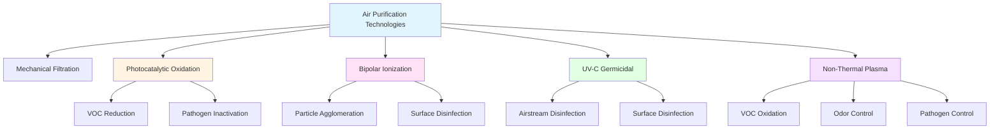

# Advanced Air Purification Technologies for HVAC Systems

Advanced air purification technologies extend beyond traditional mechanical filtration to address gaseous contaminants, pathogens, and submicron particles through active chemical and physical processes. These systems employ mechanisms including photocatalysis, ionization, ultraviolet irradiation, and plasma generation to neutralize or remove airborne contaminants.

## Photocatalytic Oxidation (PCO)

Photocatalytic oxidation uses UV light to activate titanium dioxide (TiO₂) catalyst surfaces, generating reactive oxygen species that oxidize organic compounds and inactivate microorganisms.

### PCO Reaction Mechanisms

The fundamental photocatalytic process occurs when photon energy exceeds the catalyst bandgap:

$$E_{photon} = h\nu \geq E_g$$

Where $E_g$ is the bandgap energy (3.2 eV for TiO₂ anatase), h is Planck's constant, and ν is photon frequency.

Electron-hole pair generation:

$$\text{TiO}_2 + h\nu \rightarrow e^- + h^+$$

Reactive oxygen species formation:

$$h^+ + \text{H}_2\text{O} \rightarrow \text{OH}^{\bullet} + \text{H}^+$$

$$e^- + \text{O}_2 \rightarrow \text{O}_2^{-\bullet}$$

The hydroxyl radical (OH•) is highly oxidative (E° = +2.8V) and degrades volatile organic compounds through successive oxidation reactions ultimately producing CO₂ and H₂O.

### PCO System Design Parameters

**UV Intensity Requirements:**

$$I = \frac{\Phi}{A}$$

Where Φ is radiant flux (W) and A is catalyst surface area (m²). Effective PCO systems require UV-A intensities of 1-10 mW/cm² at the catalyst surface.

**Residence Time:**

$$\tau = \frac{V}{Q}$$

Where V is reactor volume (m³) and Q is airflow rate (m³/s). Typical residence times range from 0.1 to 1.0 seconds depending on target contaminant concentration and removal efficiency requirements.

## Bipolar Ionization

Bipolar ionization systems generate equal quantities of positive and negative ions that attach to airborne particles and pathogens, facilitating agglomeration and microbial inactivation.

### Ion Generation Mechanisms

**Needlepoint Ionization:**

High voltage applied to sharp electrodes creates corona discharge, ionizing oxygen and water molecules:

$$\text{O}_2 + e^- \rightarrow \text{O}_2^- \text{  (negative ion)}$$

$$\text{H}_2\text{O} - e^- \rightarrow \text{H}_2\text{O}^+ \text{  (positive ion)}$$

Ion concentrations typically range from 10⁵ to 10⁶ ions/cm³ at the generation point, decreasing with distance according to:

$$N(x) = N_0 e^{-\beta x}$$

Where N₀ is initial ion concentration, β is the decay coefficient (typically 0.01-0.1 cm⁻¹), and x is distance from source.

### Particle Agglomeration

Ion attachment increases effective particle diameter, improving mechanical filtration efficiency:

$$d_{eff} = d_p + 2\delta$$

Where δ is the ionic diameter contribution (typically 1-10 nm per attached ion cluster). This shifts submicron particles into size ranges where inertial impaction becomes significant.

## UV-C Germicidal Irradiation (UVGI)

UV-C radiation (200-280 nm wavelength) inactivates microorganisms by disrupting nucleic acid structure. The germicidal effectiveness peaks at 265 nm, corresponding to maximum DNA/RNA absorption.

### UV Dose Calculations

Microbial inactivation follows first-order kinetics:

$$\ln\left(\frac{N}{N_0}\right) = -k \cdot D_{UV}$$

Where N/N₀ is the survival fraction, k is the pathogen-specific inactivation rate constant (cm²/mJ), and D_UV is UV dose (mJ/cm²).

**UV Dose Delivery:**

$$D_{UV} = I \cdot t$$

Where I is irradiance (mW/cm²) and t is exposure time (seconds).

For in-duct applications with airflow velocity v:

$$D_{UV} = \frac{I \cdot L}{v}$$

Where L is the irradiated zone length (m) and v is air velocity (m/s).

### ASHRAE Guidelines

ASHRAE Standard 185.1 establishes minimum UV doses for 90% inactivation (1-log reduction) of common pathogens:

| Microorganism | D₉₀ Dose (mJ/cm²) | Application |
|---------------|-------------------|-------------|
| Staphylococcus aureus | 26 | Bacterial control |
| Mycobacterium tuberculosis | 10 | Healthcare facilities |
| Influenza A | 35 | General IAQ |
| SARS-CoV-2 | 16-21 | Pandemic response |
| Aspergillus niger (spores) | 132 | Fungal control |

## Non-Thermal Plasma Purification

Non-thermal plasma systems generate energetic electrons that create reactive species including ozone, atomic oxygen, hydroxyl radicals, and excited nitrogen species.

### Plasma Generation

**Dielectric Barrier Discharge (DBD):**

Alternating high voltage (5-20 kV at 1-100 kHz) across dielectric material creates microdischarges without thermal runaway. Electron temperatures reach 1-10 eV while bulk gas remains near ambient.

**Reactive Species Formation:**

$$e^- + \text{O}_2 \rightarrow \text{O} + \text{O}^- + e^-$$

$$e^- + \text{H}_2\text{O} \rightarrow \text{OH}^{\bullet} + \text{H}^{\bullet} + e^-$$

$$e^- + \text{N}_2 \rightarrow \text{N}_2^* + e^-$$

### Ozone Management

Plasma systems inherently produce ozone as a byproduct. ASHRAE Standard 62.1 limits continuous ozone exposure to 0.05 ppm (8-hour TWA). Effective plasma purification systems incorporate:

- Catalytic ozone decomposition (MnO₂, Pt/Al₂O₃)
- Secondary reactive zones for ozone consumption
- Residence time optimization to minimize net ozone output

## Technology Comparison Matrix

| Technology | Primary Mechanism | Target Contaminants | Pressure Drop | Maintenance | Byproducts |
|------------|------------------|---------------------|---------------|-------------|------------|
| HEPA Filtration | Mechanical capture | Particles >0.3 μm | 250-500 Pa | Filter replacement | None |
| PCO | Photocatalysis | VOCs, bioaerosols | 10-50 Pa | UV lamp, catalyst | Aldehydes (trace) |
| Bipolar Ionization | Ion attachment | Particles, pathogens | 0-10 Pa | Electrode cleaning | Ozone (trace) |
| UV-C | DNA/RNA disruption | Microorganisms | 0 Pa | UV lamp replacement | None |
| Plasma | Reactive species | VOCs, pathogens, odors | 20-100 Pa | Electrode maintenance | Ozone, NOₓ |

## System Integration Considerations

### Multi-Stage Approach

Effective advanced purification employs sequential technologies:

1. **Pre-filtration:** MERV 13-14 removes particles >0.3 μm
2. **Active purification:** PCO, ionization, or plasma for submicron particles and VOCs
3. **UVGI:** Microbial inactivation in concentrated zone
4. **Post-treatment:** Activated carbon or catalytic oxidation for byproduct management

### Airflow Distribution

Uniform air distribution ensures consistent treatment. The coefficient of variation for velocity across the treatment zone should satisfy:

$$CV = \frac{\sigma_v}{\bar{v}} < 0.20$$

Where σ_v is standard deviation and v̄ is mean velocity.

### Energy Consumption

Power requirements vary significantly:

- **PCO:** 20-50 W per 1,000 CFM
- **Bipolar ionization:** 5-15 W per system (coverage-dependent)
- **UV-C in-duct:** 30-100 W per lamp (coverage-dependent)
- **Plasma:** 50-150 W per 1,000 CFM

Total system energy includes purification devices plus any additional fan power to overcome pressure drop.

## Performance Validation

ASHRAE Standard 145.2 provides test methods for air cleaning devices, requiring measurement of:

- Single-pass removal efficiency for particles and gases
- Clean air delivery rate (CADR)
- Ozone and other byproduct generation rates
- Pressure drop across operational range
- Microbial inactivation efficacy (where applicable)

Third-party testing per these standards verifies manufacturer claims and ensures safe, effective operation in occupied spaces.

## Future Developments

Emerging research focuses on:

- **Visible-light photocatalysts:** Doped TiO₂ and alternative materials (g-C₃N₄, BiVO₄) activated by longer wavelengths
- **Hybrid plasma-catalytic systems:** Combining plasma generation with catalytic surfaces for enhanced efficiency
- **Far-UV-C (222 nm):** Wavelength that inactivates pathogens without penetrating human skin or eyes
- **Machine learning optimization:** Real-time adjustment of purification intensity based on contaminant sensing

These technologies represent the evolution beyond passive filtration toward active, energy-efficient contaminant control integrated within central HVAC systems and decentralized air cleaning devices.

---

**References:**
- ASHRAE Standard 62.1: Ventilation for Acceptable Indoor Air Quality
- ASHRAE Standard 185.1: Method of Testing UV-C Lights for Use in HVAC&R Units or Plenum
- ASHRAE Standard 145.2: Laboratory Test Method for Assessing the Performance of Gas-Phase Air-Cleaning Systems
- ASHRAE Handbook—HVAC Applications, Chapter 62: Ultraviolet Lamp Systems
