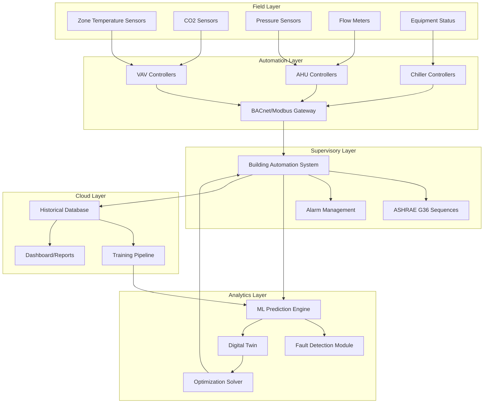
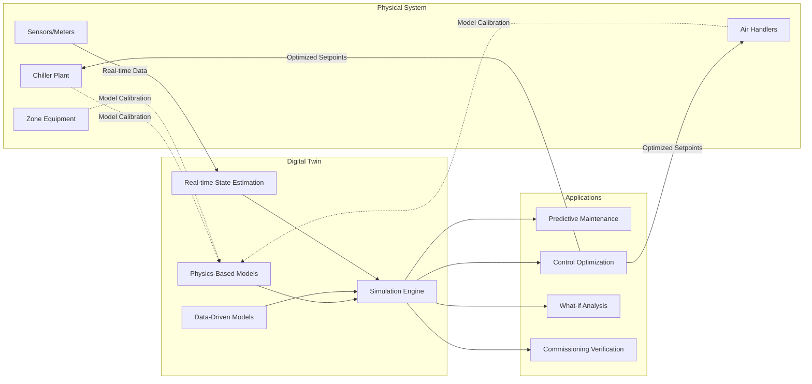

## Overview of Intelligent HVAC Control Systems

Modern HVAC systems increasingly leverage machine learning (ML), artificial intelligence (AI), and advanced automation to achieve superior energy efficiency, occupant comfort, and system reliability. These technologies enable predictive control strategies that anticipate building loads, detect equipment faults before failure, and optimize multi-zone operations in real-time. ASHRAE Guideline 36 establishes high-performance sequences of operation for HVAC systems, providing a framework for implementing advanced control strategies.

The integration of digital twins—virtual replicas of physical HVAC systems—creates unprecedented opportunities for simulation-based optimization, commissioning verification, and lifecycle performance monitoring. Combined with cloud-based analytics and edge computing, these systems transform reactive maintenance into proactive optimization.

## Machine Learning for HVAC Optimization

### Predictive Load Forecasting

ML algorithms predict thermal loads by analyzing historical patterns, weather forecasts, occupancy schedules, and building thermal characteristics. Common approaches include:

**Time-series regression models:**

$$\hat{Q}_{t+h} = \beta_0 + \sum_{i=1}^{p} \beta_i Q_{t-i} + \sum_{j=1}^{q} \gamma_j T_{amb,t-j} + \sum_{k=1}^{r} \delta_k O_{t-k} + \epsilon$$

Where:
- $\hat{Q}_{t+h}$ = predicted cooling/heating load at time $t+h$ (kW)
- $Q_{t-i}$ = historical load values (autoregressive terms)
- $T_{amb,t-j}$ = ambient temperature history (°F or °C)
- $O_{t-k}$ = occupancy indicator variables
- $\beta_i, \gamma_j, \delta_k$ = model coefficients
- $\epsilon$ = error term

**Neural network approaches** use multiple hidden layers to capture nonlinear relationships between inputs (weather, time-of-day, occupancy) and outputs (zone temperatures, equipment loads).

### Model Predictive Control (MPC)

MPC optimizes HVAC operation over a prediction horizon by solving:

$$\min_{u(t)} \sum_{k=0}^{N-1} \left[ \alpha \cdot E(k) + \beta \cdot D(k) \right]$$

Subject to:
- $T_{min} \leq T_{zone}(k) \leq T_{max}$ (comfort constraints)
- $0 \leq u_{cool}(k) \leq u_{cool,max}$ (equipment capacity limits)
- $x(k+1) = f(x(k), u(k), d(k))$ (system dynamics)

Where:
- $E(k)$ = energy consumption at time step $k$
- $D(k)$ = thermal discomfort penalty
- $u(k)$ = control inputs (damper positions, valve positions, fan speeds)
- $\alpha, \beta$ = weighting factors for energy vs. comfort
- $N$ = prediction horizon length

MPC enables pre-cooling strategies that leverage thermal mass during low electricity price periods and minimize peak demand charges.

## Control System Architecture

## Fault Detection and Diagnostics (FDD)

### Statistical Approaches

Automated FDD identifies deviations from expected performance using residual analysis:

$$r(t) = y_{measured}(t) - y_{predicted}(t)$$

Fault detection trigger:

$$|r(t)| > \mu_r + 3\sigma_r$$

Where $\mu_r$ is the mean residual and $\sigma_r$ is the standard deviation during normal operation.

### Common HVAC Faults Detected by AI

| Fault Type | Indicators | Detection Method |
|-----------|-----------|------------------|
| Stuck damper | Constant airflow despite command changes | Actuator position vs. measured flow correlation |
| Refrigerant leak | Decreasing subcooling, increasing superheat | Thermodynamic state analysis |
| Fouled coil | Increasing pressure drop, decreasing capacity | Heat transfer effectiveness trend |
| Sensor drift | Inconsistent readings vs. correlated sensors | Comparative statistical analysis |
| Simultaneous heating/cooling | High energy use, low efficiency | Energy balance violations |

### Rule-Based vs. Data-Driven FDD

**Rule-based systems** encode expert knowledge:
- IF (T_supply > T_setpoint + 5°F) AND (valve_position > 95%) THEN "insufficient cooling capacity"

**Data-driven approaches** use classification algorithms:
- Support Vector Machines (SVM) classify operating states as normal or faulty
- Random forests identify feature importance for fault isolation
- Autoencoders detect anomalies in high-dimensional sensor data

## Digital Twin Implementation

Digital twins combine:
1. **Physics-based models**: Energy balance equations, thermodynamic cycles
2. **Data-driven models**: ML models trained on operational data
3. **Hybrid approaches**: Physics-informed neural networks that respect conservation laws

## Predictive Maintenance Strategies

### Remaining Useful Life (RUL) Estimation

ML models predict component failure probability:

$$P(failure|t) = 1 - e^{-\lambda(t)}$$

Where $\lambda(t)$ is the hazard function learned from features including:
- Vibration signatures (bearing wear)
- Oil analysis (compressor degradation)
- Runtime hours under load
- Start/stop cycle counts
- Operating conditions (temperature, pressure extremes)

### Maintenance Cost Optimization

Determine optimal maintenance timing:

$$C_{total} = C_{preventive} \cdot P(maintain) + C_{failure} \cdot P(failure) + C_{downtime} \cdot E[downtime]$$

The maintenance schedule minimizes total expected cost while maintaining reliability targets.

## ASHRAE Guideline 36 Integration

Guideline 36 provides advanced sequences for:
- **Zone control**: Dual-maximum logic with trim and respond
- **AHU control**: Supply air temperature reset based on zone demands
- **Economizer control**: Integrated differential dry-bulb and enthalpy logic
- **Demand control ventilation**: CO2-based outdoor air modulation

AI systems enhance these sequences by:
1. Learning optimal reset schedules from building-specific performance
2. Adapting control parameters to changing occupancy patterns
3. Coordinating multiple systems for whole-building optimization
4. Identifying deviations from prescribed sequences as potential faults

## Implementation Considerations

**Data requirements:**
- Minimum 1-year historical data for seasonal pattern learning
- 1-5 minute sampling intervals for dynamic response characterization
- Comprehensive sensor coverage (temperature, flow, power, pressure)

**Computing infrastructure:**
- Edge devices for real-time control (latency < 1 second)
- Cloud platforms for training, long-term storage, multi-site analytics
- Secure communication protocols (TLS, VPN)

**Performance metrics:**
- Energy savings: 10-30% typical for optimized control vs. baseline
- Fault detection rate: >90% for major equipment issues
- False alarm rate: <5% to maintain operator confidence

**Validation:**
- Compare predicted vs. measured performance using NMBE and CV(RMSE) per ASHRAE Guideline 14
- A/B testing of control strategies on similar zones/buildings
- Continuous model retraining to prevent degradation

## Future Directions

Emerging capabilities include:
- **Federated learning**: Train models across multiple buildings without sharing raw data
- **Reinforcement learning**: Agents learn optimal policies through interaction with building environments
- **Transfer learning**: Apply knowledge from one building to accelerate commissioning of new installations
- **Explainable AI**: Provide operators with interpretable reasons for AI-driven decisions

The convergence of IoT sensors, low-cost computing, and advanced algorithms positions intelligent HVAC control as a cornerstone of high-performance, sustainable building operation.
