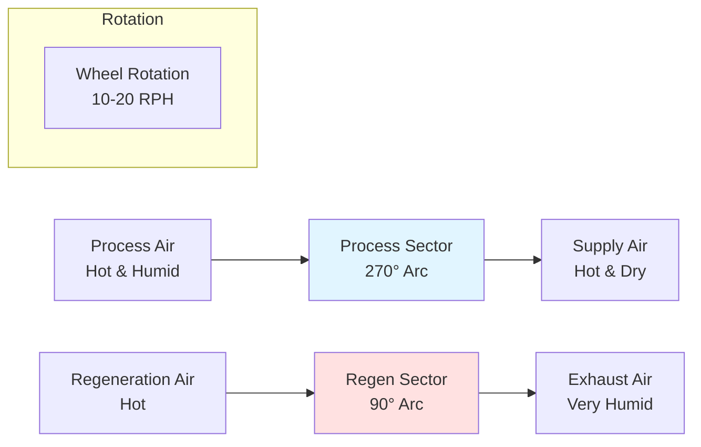
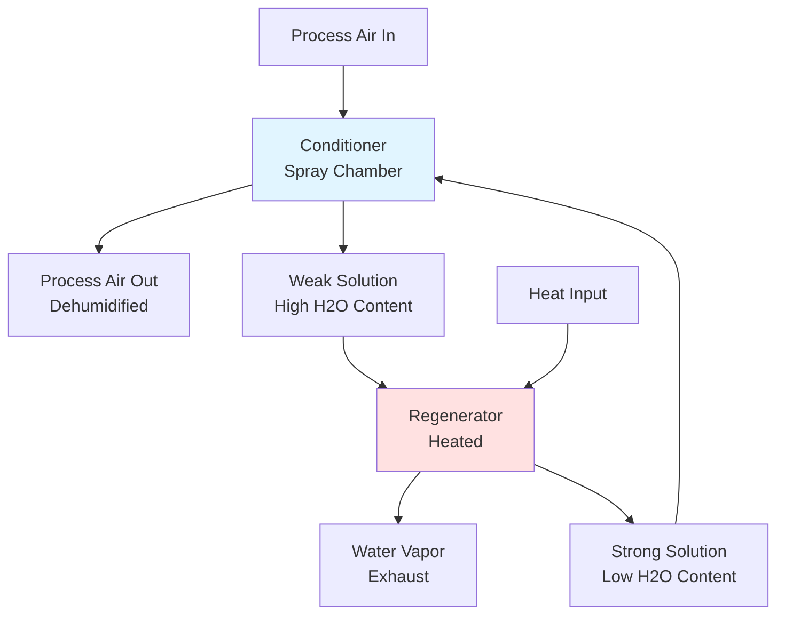

Desiccant technology provides superior moisture removal capabilities in HVAC applications by employing hygroscopic materials that adsorb or absorb water vapor from air through physical and chemical mechanisms. Unlike conventional vapor compression systems that condense moisture by cooling air below its dew point, desiccant systems remove moisture at controlled temperatures, enabling independent control of sensible and latent cooling loads.

## Physical Principles of Moisture Sorption

Desiccant materials attract and hold water molecules through two fundamental mechanisms:

**Adsorption** occurs when water vapor molecules adhere to the surface of solid desiccants through van der Waals forces. The process is governed by isotherms that relate equilibrium moisture content to relative humidity at constant temperature:

$$W_e = f(\phi, T)$$

where $W_e$ is equilibrium moisture content (kg water/kg desiccant), $\phi$ is relative humidity (decimal), and $T$ is temperature (K).

**Absorption** involves water vapor dissolving into the bulk structure of liquid desiccants, following Raoult's Law for vapor pressure depression:

$$P_v = x_w \cdot P_{sat}(T)$$

where $P_v$ is vapor pressure of the solution, $x_w$ is mole fraction of water, and $P_{sat}(T)$ is saturation pressure of pure water at temperature $T$.

The moisture removal rate from process air is determined by the mass transfer driving force:

$$\dot{m}_w = h_m \cdot A \cdot \rho_a \cdot (W_1 - W_2)$$

where $h_m$ is mass transfer coefficient (m/s), $A$ is contact area (m²), $\rho_a$ is air density (kg/m³), and $W_1$, $W_2$ are humidity ratios at inlet and outlet (kg water/kg dry air).

## Solid Desiccant Systems

Solid desiccant wheels represent the most common configuration in commercial HVAC applications. The rotating wheel contains a honeycomb matrix impregnated with hygroscopic material.

### Common Desiccant Materials

| Material | Moisture Capacity | Regeneration Temp | Applications |
|----------|-------------------|-------------------|--------------|
| Silica Gel | 35-40% by weight | 90-150°C | General HVAC, low humidity |
| Molecular Sieves | 20-25% by weight | 180-260°C | Ultra-low dew points |
| Lithium Chloride | 15-20% by weight | 65-95°C | Low temp regeneration |
| Activated Alumina | 15-20% by weight | 120-200°C | Industrial applications |

### Desiccant Wheel Operation

The wheel rotates continuously through two or three air streams:

The psychrometric process for the process air stream shows temperature rise with moisture removal:

$$h_2 = h_1 - \Delta h_{ads}$$

where $h_1$ and $h_2$ are inlet and outlet enthalpies (kJ/kg), and $\Delta h_{ads}$ is heat of adsorption released to the air stream, typically 2500-2800 kJ/kg water removed.

The outlet temperature increase is approximated by:

$$T_2 = T_1 + \frac{\Delta h_{ads} \cdot (W_1 - W_2)}{c_p}$$

where $c_p$ is specific heat of air (approximately 1.006 kJ/kg·K).

## Regeneration Methods

Effective regeneration is critical for continuous operation. The energy required for regeneration is:

$$Q_{regen} = \dot{m}_a \cdot c_p \cdot (T_{regen} - T_{ambient}) + \dot{m}_w \cdot h_{fg}$$

where $\dot{m}_a$ is regeneration air mass flow (kg/s), $T_{regen}$ is regeneration temperature (°C), and $h_{fg}$ is latent heat of vaporization (2450 kJ/kg at 20°C).

**Heat Sources for Regeneration:**
- Natural gas burners (direct or indirect firing)
- Electric resistance heaters
- Heat recovery from building systems
- Solar thermal collectors
- Waste heat from generators or process equipment
- Heat pump condenser heat

ASHRAE Standard 139 provides testing methods for rating desiccant dehumidifiers and establishes performance metrics including moisture removal capacity (MRC) and coefficient of performance (COP).

## Liquid Desiccant Systems

Liquid desiccant systems employ concentrated salt solutions (typically lithium chloride, lithium bromide, or calcium chloride) that contact air directly or through membranes.

### System Configuration

The equilibrium vapor pressure relationship governs performance:

$$\ln\left(\frac{P_v}{P_{sat}}\right) = -\nu \cdot \phi \cdot \frac{m}{M_w}$$

where $\nu$ is van't Hoff factor, $\phi$ is osmotic coefficient, $m$ is molality (mol/kg water), and $M_w$ is molecular weight of water.

## Hybrid Desiccant-Vapor Compression Systems

Integrating desiccant technology with conventional vapor compression systems enables optimized energy performance by decoupling sensible and latent loads.

**Configuration 1: Series Arrangement**
Desiccant wheel handles latent load, followed by cooling coil for sensible cooling. This prevents overcooling and reheating penalties.

**Configuration 2: Parallel Arrangement**
Desiccant system operates during high latent load conditions; vapor compression handles sensible load and moderate latent loads.

The total cooling coefficient of performance for hybrid systems:

$$\text{COP}_{system} = \frac{Q_{sensible} + Q_{latent}}{W_{compressor} + Q_{regen}/\eta_{heat}}$$

where $W_{compressor}$ is compressor power, $Q_{regen}$ is regeneration heat, and $\eta_{heat}$ is thermal efficiency of heat source.

## Performance Metrics and Applications

ASHRAE Standard 62.1 ventilation requirements often impose high latent loads due to outdoor air introduction. Desiccant systems excel in:

- High ventilation rate applications (hospitals, laboratories)
- Low humidity requirements (pharmaceuticals, museums)
- 100% outdoor air systems
- Hot-humid climates with year-round latent loads
- Supermarket refrigeration (preventing frost formation)
- Indoor swimming pools (moisture control)

Typical performance ranges:
- Moisture removal: 5-15 g/kg air
- Regeneration temperatures: 65-150°C
- Thermal COP: 0.5-1.2 (thermal energy basis)
- Face velocities: 2.0-3.5 m/s for solid wheels

The economic viability depends on the cost differential between thermal energy (for regeneration) and electrical energy (for conventional cooling), availability of waste heat, and the magnitude of latent cooling loads relative to total HVAC loads.

---

**References:**
- ASHRAE Standard 139: Method of Testing for Rating Desiccant Dehumidifiers Utilizing Heat for the Regeneration Process
- ASHRAE Handbook—HVAC Systems and Equipment, Chapter on Desiccant Dehumidification
- ASHRAE Standard 62.1: Ventilation for Acceptable Indoor Air Quality
