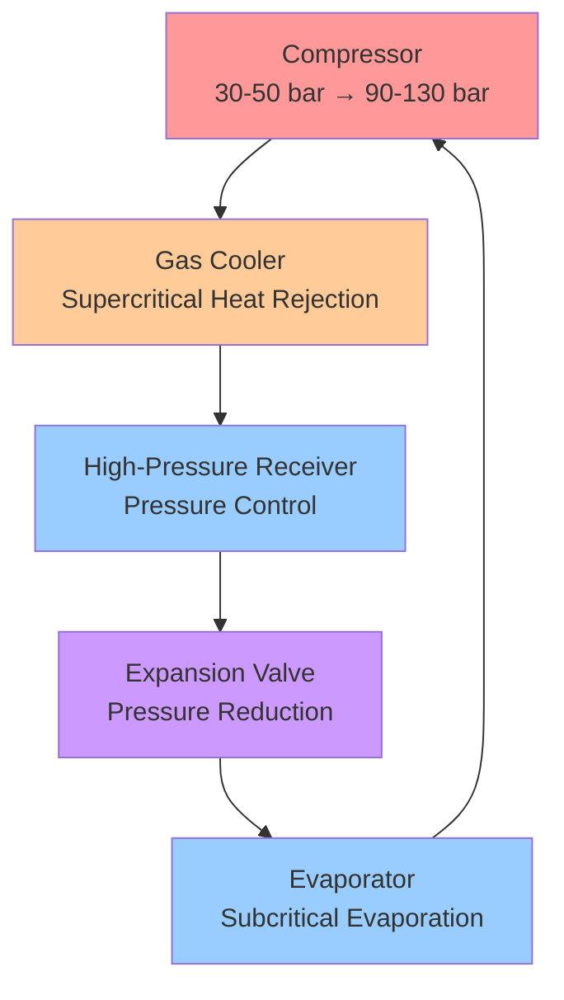
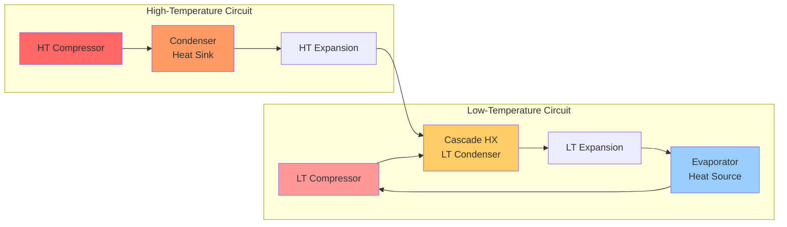

Heat pump technology has advanced significantly with innovations in refrigerant selection, compressor technology, and cycle configurations that extend operating ranges and improve efficiency. These developments address traditional limitations while achieving coefficient of performance (COP) values previously unattainable in conventional vapor-compression systems.

## CO2 Transcritical Cycles

Carbon dioxide (R744) operates as a natural refrigerant in transcritical cycles where the high-side pressure exceeds the critical point (73.8 bar at 31.1°C). Unlike subcritical cycles with isothermal condensation, CO2 rejects heat through supercritical gas cooling, creating unique thermodynamic advantages.

### Thermodynamic Characteristics

The transcritical cycle operates with:
- Evaporation at subcritical pressure (typically 30-50 bar)
- Compression to supercritical pressure (90-130 bar)
- Heat rejection through gas cooling rather than phase change
- Expansion through a throttling device with significant irreversibility

The COP for transcritical CO2 heat pumps is calculated as:

$$\text{COP}_{\text{heating}} = \frac{Q_h}{W_{\text{comp}}} = \frac{\dot{m} (h_2 - h_3)}{\dot{m} (h_2 - h_1)}$$

Where:
- $h_1$ = enthalpy at compressor inlet (evaporator outlet)
- $h_2$ = enthalpy at compressor discharge (isentropic or actual)
- $h_3$ = enthalpy after gas cooler
- $\dot{m}$ = refrigerant mass flow rate

### Performance Optimization

The gas cooler pressure significantly affects system performance. The optimal discharge pressure $P_{\text{opt}}$ maximizes COP and typically occurs at:

$$P_{\text{opt}} \approx 2.7 \cdot T_{\text{gc,out}} - 7.0 \text{ [bar, °C]}$$

This correlation (based on empirical data) shows that optimal pressure increases linearly with gas cooler outlet temperature. Electronic expansion valves with high-side pressure control are essential for maintaining optimal conditions across varying loads.

### Advantages of R744 Systems

CO2 transcritical heat pumps provide:
- **Superior hot water production**: Glide temperature during gas cooling matches sensible heating loads efficiently
- **Environmental benefits**: GWP = 1, zero ozone depletion potential
- **High volumetric capacity**: Reduces compressor displacement requirements by 4-6× compared to R134a
- **Safety**: Non-flammable, non-toxic (A1 classification per ASHRAE 34)
- **Cold climate performance**: Maintains capacity at outdoor temperatures below -25°C

Commercial water heating applications achieve COP values of 3.5-4.5 when heating water from 10°C to 90°C, exceeding conventional heat pump performance in high-temperature-lift applications.

## Cascade Heat Pump Systems

Cascade systems employ two separate refrigeration circuits operating at different temperature levels, connected through an intermediate heat exchanger (cascade condenser/evaporator). This configuration enables extreme temperature lifts exceeding 100K while maintaining acceptable compressor pressure ratios.

### System Architecture

### Performance Analysis

The overall system COP represents the series efficiency of both stages:

$$\text{COP}_{\text{cascade}} = \frac{Q_h}{W_{\text{LT}} + W_{\text{HT}}} = \frac{Q_h}{Q_h \left(\frac{1}{\text{COP}_{\text{HT}}}\right) + Q_h \left(\frac{1}{\text{COP}_{\text{LT}}}\right) - Q_h}$$

For cascade systems with matched capacities at the intermediate heat exchanger:

$$\frac{1}{\text{COP}_{\text{cascade}}} \approx \frac{1}{\text{COP}_{\text{LT}}} + \frac{1}{\text{COP}_{\text{HT}}} - 1$$

The intermediate temperature $T_{\text{int}}$ optimization balances the pressure ratios of both circuits. For maximum COP with ideal cycles:

$$T_{\text{int,opt}} = \sqrt{T_{\text{evap}} \cdot T_{\text{cond}}}$$

Where temperatures are in absolute units (Kelvin).

Cascade systems are specified in ASHRAE 15 for applications requiring refrigerants with different safety classifications or temperature requirements exceeding single-stage capabilities.

## Variable Speed Compressor Technology

Inverter-driven compressors modulate capacity from 10-100% by varying motor speed, eliminating the efficiency losses associated with on-off cycling and improving part-load performance where systems operate 80-95% of annual runtime.

### Capacity and Power Modulation

Compressor capacity scales approximately linearly with speed:

$$\dot{Q} \propto N \cdot \eta_v$$

Where $N$ is compressor speed and $\eta_v$ is volumetric efficiency. Power consumption follows a cubic relationship at constant pressure ratio:

$$W \propto N^3$$

This creates favorable part-load COP characteristics. At 50% capacity, power consumption drops to approximately 40-45% of full load, increasing COP by 15-25% compared to rated conditions.

### Performance Benefits

Variable speed technology provides:
- **Improved seasonal efficiency**: HSPF improvements of 25-40% over single-speed units
- **Enhanced comfort**: Eliminates temperature swings from cycling
- **Reduced inrush current**: Soft-start capability reduces electrical demand
- **Extended operating range**: Maintains heating capacity at lower outdoor temperatures
- **Noise reduction**: Lower speeds decrease compressor and fan noise by 6-10 dB

ASHRAE 116 and AHRI 210/240 testing standards include part-load rating points at 82°F and 62°F outdoor conditions to capture variable-speed efficiency advantages.

## Cold Climate Heat Pumps

Advanced heat pumps maintain heating capacity and efficiency at outdoor temperatures down to -25°C through enhanced vapor injection, optimized refrigerant selection, and improved heat exchanger design.

### Enhanced Vapor Injection (EVI)

EVI systems inject intermediate-pressure refrigerant into the compression process, effectively creating a two-stage compression cycle within a single scroll or rotary compressor.

The injection process:
1. Flash gas is generated through an economizer heat exchanger or flash tank
2. Vapor is injected into a mid-compression port
3. Additional refrigerant mass flow increases heating capacity
4. Intermediate cooling reduces discharge temperature

Heating capacity improvement with EVI:

$$\frac{Q_{\text{EVI}}}{Q_{\text{standard}}} = \frac{\dot{m}_{\text{main}} + \dot{m}_{\text{inj}}}{\dot{m}_{\text{main}}} \cdot \frac{h_{\text{cond,out}} - h_{\text{evap,in}}}{h_{\text{cond,out}} - h_{\text{evap,in}}}$$

Capacity increases of 15-30% at -15°C outdoor temperature are typical with 10-15% COP improvement compared to single-stage compression.

### Design Requirements

Cold climate heat pump design per ASHRAE 205 includes:
- **Compressor selection**: Scroll or rotary compressors with EVI ports rated to 4.5+ pressure ratio
- **Refrigerants**: R410A or R32 with sufficient pressure differential at low temperatures
- **Heat exchanger sizing**: Oversized outdoor coils (20-30% larger fin area) to maintain capacity
- **Defrost optimization**: Demand-based defrost with reverse-cycle duration under 90 seconds
- **Subcooling control**: 8-12°C subcooling maintained through TXV or EXV modulation

Systems meeting NEEP (Northeast Energy Efficiency Partnerships) cold climate specifications maintain minimum COP of 1.75 at -15°C and 70% capacity at -25°C compared to 8.3°C rated capacity.

## Integration and Standards Compliance

Modern heat pump innovations must comply with:
- **ASHRAE 15**: Safety standard for refrigeration systems
- **ASHRAE 34**: Refrigerant safety classifications and concentration limits
- **ASHRAE 37**: Methods of testing for rating electrically driven unitary heat pumps
- **AHRI 210/240**: Performance rating of unitary heat pumps and air conditioners
- **ISO 13256-1**: Water-source heat pump testing and rating
- **EN 14511**: European heat pump testing standard (often referenced for cold climate performance)

These innovations collectively extend heat pump application ranges while improving efficiency, enabling electrification of heating loads previously served by combustion equipment and expanding heat pump viability in extreme climate zones.

## Components

- High Temperature Heat Pumps Industrial
- Transcritical Co2 Heat Pumps
- Hybrid Heat Pump Systems
- Air To Water Heat Pumps High Efficiency
- Ground Source Heat Pump Advancements
- Thermally Driven Heat Pumps
- Absorption Heat Pumps Industrial
- Chemical Heat Pumps
