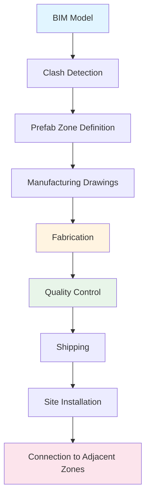
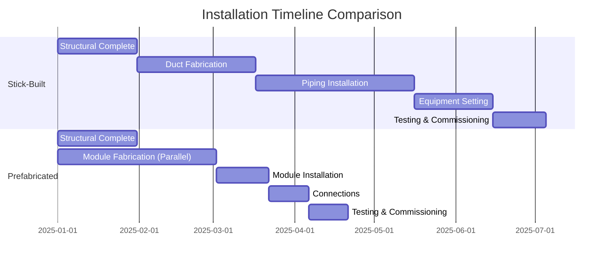

## Fundamentals of Prefabricated HVAC Systems

Prefabrication and modular construction represent a paradigm shift in HVAC installation methodology, transferring assembly operations from the field to controlled manufacturing environments. This approach reduces on-site labor requirements by 40-60% while improving quality consistency through standardized manufacturing processes.

The physics of thermal performance remains unchanged, but the execution methodology fundamentally alters installation timelines, quality assurance protocols, and lifecycle maintenance accessibility.

### Manufacturing Environment Advantages

Controlled factory conditions provide temperature stability, precision tooling access, and quality control checkpoints that field conditions cannot replicate. Welded and brazed connections undergo immediate leak testing. Insulation application occurs in clean, dry environments preventing moisture entrapment that leads to thermal performance degradation.

Temperature-controlled assembly prevents thermal expansion issues during fabrication. A copper pipe brazed joint created at 70°F factory conditions versus variable field temperatures exhibits superior metallurgical bonding consistency.

## Types of Prefabricated HVAC Components

### Mechanical Equipment Modules

**Rooftop Packaged Systems**: Factory-assembled air handling units, condensing units, and controls reduce field connection points from hundreds to dozens. Electrical terminations, refrigerant circuits, and control wiring complete before shipping.

**Plantroom Modules**: Complete boiler rooms, chiller plants, or pump stations assembled on structural frames. Piping, valves, instrumentation, and electrical systems installed per approved drawings before delivery.

**Fan Coil Assemblies**: Multiple fan coil units mounted on common distribution headers with balancing valves, isolation valves, and instrumentation pre-installed.

### Piping and Ductwork Assemblies

**Pipe Spools**: Prefabricated pipe sections with fittings, hangers, insulation, and identification tags installed. Length optimization reduces field joints by 60-70%.

**Duct Sections**: Elbows, transitions, and straight runs fabricated with reinforcement, access doors, and volume dampers installed. Insulation and vapor barriers applied in controlled conditions.

## Design Coordination Requirements

### Building Information Modeling Integration

Prefabrication demands precise 3D coordination before manufacturing. ASHRAE Guideline 41 emphasizes dimensional accuracy requirements for modular systems. Tolerance stackup analysis identifies potential interference conditions before fabrication.

Coordination zones define prefabrication boundaries:

### Dimensional Tolerance Management

Field tolerances typically range ±1 inch for structural elements. Prefabricated modules require ±0.25 inch tolerance control. Connection interfaces must accommodate cumulative building tolerances while maintaining precise internal dimensions.

The thermal expansion coefficient relationship:

$$\Delta L = \alpha \cdot L_0 \cdot \Delta T$$

Where:
- $\Delta L$ = length change (inches)
- $\alpha$ = coefficient of thermal expansion (in/in·°F)
- $L_0$ = original length (inches)
- $\Delta T$ = temperature change (°F)

For copper pipe: $\alpha = 9.8 \times 10^{-6}$ in/in·°F

A 40-foot copper pipe experiencing 50°F temperature change expands:

$$\Delta L = 9.8 \times 10^{-6} \times 480 \times 50 = 0.235 \text{ inches}$$

Prefabrication design must accommodate this expansion through expansion loops or flexible connections at module boundaries.

## Quality Control Advantages

### Factory Testing Protocols

| Test Type | Field Capability | Factory Capability | Improvement Factor |
|-----------|------------------|--------------------|--------------------|
| Pressure Testing | Visual inspection | Digital logging, 24hr hold | 3-5x detection |
| Leak Detection | Soap bubbles | Helium mass spectrometry | 1000x sensitivity |
| Electrical Testing | Continuity | Hi-pot, insulation resistance | Complete verification |
| Flow Balancing | Rough approximation | Calibrated flow stations | Precise setpoints |
| Vibration Testing | Post-installation | Pre-shipping analysis | Early problem detection |
| Insulation Integrity | Visual | Infrared thermography | Quantified performance |

### Hydronic System Prefabrication

Factory-assembled hydronic systems undergo full pressure testing at 1.5× design pressure for minimum 24 hours. Automated data logging documents pressure stability confirming zero leakage before insulation application.

Flow testing uses calibrated test stands measuring actual flow rates versus design. Balancing valves pre-set to calculated positions. The pressure drop relationship:

$$\Delta P = f \cdot \frac{L}{D} \cdot \frac{\rho V^2}{2}$$

Where:
- $\Delta P$ = pressure drop (lbf/ft²)
- $f$ = friction factor (dimensionless)
- $L$ = pipe length (ft)
- $D$ = pipe diameter (ft)
- $\rho$ = fluid density (lbm/ft³)
- $V$ = fluid velocity (ft/s)

Prefabricated assemblies arrive with documented pressure drop values, eliminating field calculation uncertainties.

## Installation Efficiency Metrics

### Labor Productivity Improvements

Traditional stick-built installation: 8-12 labor hours per ton of cooling capacity

Prefabricated system installation: 3-5 labor hours per ton of cooling capacity

Productivity improvement: 60-70% reduction in field labor

### Schedule Compression

Concurrent manufacturing during building construction compresses critical path schedules. Foundation-to-mechanical-startup timelines reduce from 18-24 months to 12-16 months for commercial projects.

Critical path activities shift from sequential to parallel:

## Economic Analysis

### First Cost Considerations

| Cost Component | Stick-Built | Prefabricated | Variance |
|----------------|-------------|---------------|----------|
| Material Cost | Baseline | +5 to +8% | Manufacturing overhead |
| Field Labor | Baseline | -50 to -60% | Reduced site hours |
| Equipment Rental | Baseline | -30 to -40% | Shorter duration |
| Quality Defects | 2-4% of cost | 0.5-1% of cost | Improved QC |
| Schedule Impact | Risk variable | Predictable | Reduced contingency |
| **Total Installed Cost** | **Baseline** | **-5 to -15%** | **Project-dependent** |

### Lifecycle Cost Benefits

Improved installation quality reduces maintenance callbacks by 40-50% during first operational year. Documented testing provides commissioning baseline data improving troubleshooting efficiency.

Standardized designs enable spare parts inventory optimization. Replacement modules ship pre-configured reducing downtime from days to hours.

## Transportation and Logistics

### Dimensional Constraints

Highway transportation limits:
- Width: 8.5 ft (102 inches) without permits
- Height: 13.5 ft typical clearance
- Length: 53 ft trailer standard
- Weight: 80,000 lbs gross vehicle weight

Design modules within these constraints or plan permit routing. Module weight distribution affects shipping cost and crane selection.

### Rigging and Installation

Lifting lug design follows ASME B30.20 standards. Load calculation includes:

$$W_{total} = W_{equipment} + W_{piping} + W_{insulation} + W_{fluid} + SF$$

Where $SF$ = safety factor (minimum 1.5 per OSHA)

## Standardization and Repeatability

### Design Catalog Development

Organizations developing prefabrication programs create standardized designs for common applications:

- **Typical VAV terminal unit assemblies**: 5-7 standard configurations cover 80% of applications
- **Pump modules**: Primary, secondary, and tertiary pump arrangements with standard piping configurations
- **Fan coil risers**: Vertical riser assemblies serving multiple floors with branch connections

Standardization reduces engineering hours per project by 30-40% while improving cost predictability.

## Integration with Sustainability Goals

Prefabrication supports green building objectives through:

1. **Waste Reduction**: Factory material optimization reduces waste by 30-50% versus field cutting
2. **Energy Efficiency**: Controlled insulation application eliminates thermal bridges
3. **Quality Consistency**: Factory testing ensures design performance achievement
4. **Embodied Carbon**: Optimized material usage and reduced rework lower embodied carbon footprint

ASHRAE Standard 189.1 recognizes prefabrication as a strategy for achieving high-performance building goals through improved quality control and reduced construction waste.

## Implementation Challenges

### Design Phase Requirements

Earlier design freeze requirements challenge traditional design-bid-build delivery. Design-assist or design-build delivery methods better accommodate prefabrication schedules.

Commitment to equipment and material selections occurs 3-6 months earlier than conventional projects. Owner decision-making must align with accelerated timelines.

### Site Access and Crane Coverage

Large modules require adequate crane capacity and site access. Urban sites with restricted laydown areas or crane boom radius limitations may require smaller module sizing, reducing prefabrication advantages.

### Interface Coordination

Module boundaries create connection interfaces requiring careful coordination. Field connection points need accessible locations with adequate clearance for welding, brazing, or mechanical coupling.

Connection standardization reduces field complexity. Common interfaces repeated across modules enable crew familiarity and installation speed.

## Future Development Trends

Advanced manufacturing techniques including robotic welding, automated insulation application, and integrated sensor installation continue improving prefabrication capabilities. Digital twin technology links factory production data with building management systems, providing as-built documentation automatically.

Mass customization principles enable economical one-off designs using parametric modeling and flexible manufacturing systems. The distinction between standardized and custom prefabrication diminishes as manufacturing technology advances.

---

**References:**
- ASHRAE Guideline 41-2023: Design and Construction of Modular HVAC Systems
- ASME B30.20: Below-the-Hook Lifting Devices
- OSHA 1926 Subpart CC: Cranes and Derricks in Construction
