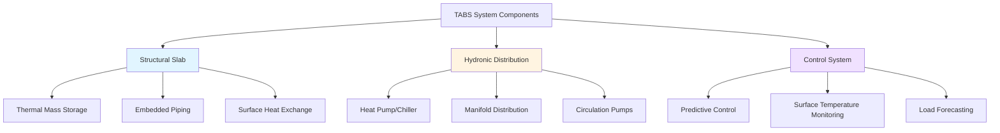
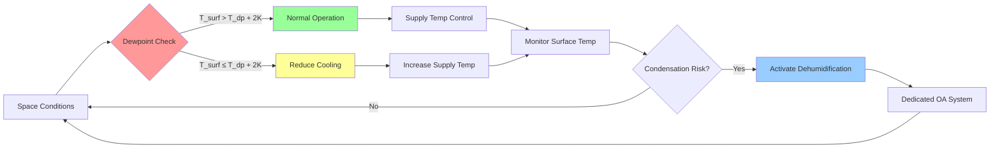

## Overview of Innovative Radiant Technologies

Modern radiant systems represent a paradigm shift from conventional air-based HVAC, leveraging thermal radiation and surface heat transfer to achieve superior comfort with reduced energy consumption. Unlike forced-air systems that heat or cool air masses, radiant systems condition occupants and surfaces directly through electromagnetic radiation in the infrared spectrum.

The fundamental heat transfer from radiant surfaces follows the Stefan-Boltzmann law for thermal radiation, combined with convective components:

$$q_{total} = q_{rad} + q_{conv} = \epsilon \sigma A (T_s^4 - T_{mrt}^4) + h_c A (T_s - T_a)$$

Where:
- $q_{total}$ = total heat transfer rate (W)
- $\epsilon$ = surface emissivity (typically 0.9 for building materials)
- $\sigma$ = Stefan-Boltzmann constant (5.67 × 10⁻⁸ W/m²·K⁴)
- $A$ = surface area (m²)
- $T_s$ = surface temperature (K)
- $T_{mrt}$ = mean radiant temperature (K)
- $h_c$ = convective heat transfer coefficient (W/m²·K)
- $T_a$ = air temperature (K)

## Thermally Active Building Systems (TABS)

TABS integrate hydronic piping directly into structural concrete slabs, creating massive thermal storage elements. These systems exploit the thermal mass of concrete (typical density 2,400 kg/m³, specific heat 880 J/kg·K) to provide load shifting and dynamic response.

### Heat Transfer Characteristics

The transient heat conduction through concrete slabs follows Fourier's second law:

$$\frac{\partial T}{\partial t} = \alpha \nabla^2 T$$

Where thermal diffusivity $\alpha = k/(\rho c_p)$ determines response time. For concrete with thermal conductivity $k$ = 1.4 W/m·K, the thermal penetration depth over 24 hours reaches approximately 0.3 m.

### Design Considerations

**Pipe Spacing and Layout:**
- Typical spacing: 150-300 mm
- Pipe diameter: 15-20 mm PE-X or PE-RT
- Embedment depth: 50-100 mm from surface
- Supply temperature range: 16-26°C (cooling), 28-35°C (heating)

**Performance Metrics:**

| Parameter | Cooling Mode | Heating Mode |
|-----------|--------------|--------------|
| Heat flux | 30-50 W/m² | 40-80 W/m² |
| Surface temperature | 19-22°C | 24-28°C |
| Supply/return ΔT | 2-4 K | 5-10 K |
| Thermal response | 3-6 hours | 2-4 hours |
| Water flow rate | 15-25 L/h·m² | 20-30 L/h·m² |

## Capillary Tube Mats

Capillary systems employ fine-bore tubes (3-5 mm diameter) arranged in dense networks (10-30 mm spacing) within thin layers (15-25 mm). The high surface area per unit volume enables exceptional heat transfer rates.

### Thermal Performance

Heat transfer effectiveness depends on tube spacing and material conductivity:

$$q = \frac{T_f - T_{surf}}{R_{total}} = \frac{T_f - T_{surf}}{\frac{1}{h_i \pi d_i L} + \frac{\ln(d_o/d_i)}{2\pi k_{pipe} L} + R_{plaster}}$$

Where:
- $T_f$ = fluid temperature (K)
- $d_i$, $d_o$ = inner and outer tube diameters (m)
- $L$ = tube length per unit area (m/m²)
- $R_{plaster}$ = plaster layer thermal resistance (m²·K/W)

**Advantages of Capillary Systems:**
- High heat transfer density: 80-150 W/m² cooling, 100-180 W/m² heating
- Minimal thickness: 15-25 mm total system depth
- Low water content: 0.7-1.2 L/m² reduces thermal inertia
- Rapid response: 15-45 minute reaction time
- Lightweight: suitable for retrofit applications

## Radiant Panels and Dynamic Systems

### Metal Radiant Panels

Prefabricated metal panels (aluminum or copper) provide controlled surface temperatures with rapid response. Heat transfer from embedded tubes to panel surface follows:

$$q = \frac{\Delta T}{R_{contact} + \frac{t}{k_{panel}A}}$$

Panel conductivity (aluminum: 205 W/m·K) ensures uniform surface temperatures within ±0.5 K across panel width.

### Phase Change Material (PCM) Integration

Advanced radiant panels incorporate PCMs (typical melting point 18-24°C, latent heat 150-250 kJ/kg) for passive thermal regulation. Energy storage capacity:

$$Q_{storage} = m_{PCM}(c_p \Delta T + h_{fg})$$

Where $h_{fg}$ represents latent heat of fusion during phase transition.

## Control Strategies and Condensation Prevention

Radiant cooling requires dewpoint monitoring to prevent surface condensation. Critical surface temperature:

$$T_{surf,min} = T_{dp} + \Delta T_{safety}$$

Where $\Delta T_{safety}$ = 1-2 K provides operational margin.

## System Integration and Best Practices

**ASHRAE Standard 55 Compliance:**
- Asymmetric radiation limits for thermal comfort
- Floor surface temperature: 19-29°C acceptable range
- Radiant temperature asymmetry: <10 K for vertical surfaces, <5 K for ceiling/floor

**Hybrid System Configuration:**
Combining radiant systems with dedicated outdoor air systems (DOAS) optimizes performance:
- Radiant handles sensible loads (60-80% of total)
- DOAS provides ventilation and latent control
- Decoupled temperature and humidity control

**Energy Performance:**
Radiant systems achieve 25-40% energy savings versus conventional VAV through:
- Reduced fan energy (no ductwork pressure losses)
- Elevated cooling supply temperatures (18-20°C vs. 7-12°C for chilled water)
- Enhanced heat pump COP (4.5-6.5 vs. 3.0-4.5)
- Thermal storage load shifting to off-peak hours

## Design Methodology

1. **Load Calculation:** Determine radiant and convective load components separately
2. **Surface Selection:** Ceiling (40-60 W/m²), floor (60-100 W/m²), or wall mounting
3. **Pipe Layout:** Optimize spacing using finite element thermal modeling
4. **Hydraulic Design:** Size for Reynolds number >4,000 (turbulent flow)
5. **Control Design:** Implement predictive algorithms for thermal mass systems
6. **Condensation Analysis:** Verify dewpoint margins under peak humidity conditions

Innovative radiant systems provide thermally comfortable, energy-efficient environments through physics-based surface conditioning. Proper design requires integrated analysis of heat transfer mechanisms, building thermal mass, and control strategies aligned with occupancy patterns and climate conditions.
