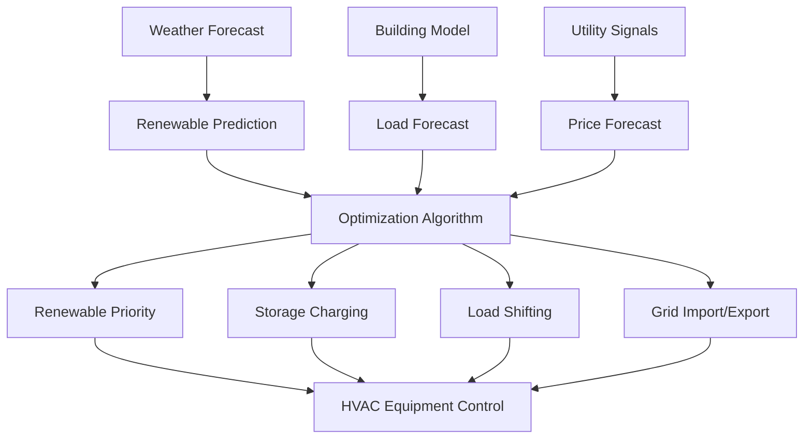

Advanced renewable energy integration transforms HVAC systems from passive energy consumers into dynamic, multi-source platforms that leverage solar, wind, geothermal, and biomass resources. This integration requires sophisticated control strategies, thermal storage coordination, and grid interaction protocols that maximize renewable utilization while maintaining comfort and reliability.

## Fundamental Principles of Renewable Integration

The effectiveness of renewable integration depends on matching variable renewable availability with building thermal loads through storage, load shifting, and supplementary energy sources.

### Energy Balance with Multiple Sources

The instantaneous energy balance for a renewable-integrated HVAC system:

$$Q_{load} = Q_{renewable} + Q_{storage,discharge} + Q_{conventional} - Q_{storage,charge}$$

Where:
- $Q_{load}$ = building heating or cooling demand (kW)
- $Q_{renewable}$ = renewable energy supplied directly (kW)
- $Q_{storage,discharge}$ = energy released from thermal storage (kW)
- $Q_{conventional}$ = supplementary conventional energy (kW)
- $Q_{storage,charge}$ = energy directed to storage (kW)

### Renewable Fraction Calculation

The renewable energy fraction quantifies system sustainability:

$$f_{renewable} = \frac{\int_0^t Q_{renewable} \, dt}{\int_0^t (Q_{renewable} + Q_{conventional}) \, dt}$$

Systems achieving $f_{renewable} > 0.70$ demonstrate high renewable penetration with effective storage and control strategies.

## Solar Thermal Integration Strategies

Solar thermal collectors provide direct heating or drive absorption chillers for cooling applications.

### Solar Collector Performance

Instantaneous collector efficiency under operating conditions:

$$\eta_{collector} = \eta_0 - a_1 \frac{(T_{in} - T_{ambient})}{G_T} - a_2 \frac{(T_{in} - T_{ambient})^2}{G_T}$$

Where:
- $\eta_0$ = optical efficiency (typically 0.65-0.80)
- $a_1$ = first-order heat loss coefficient (W/m²·K)
- $a_2$ = second-order heat loss coefficient (W/m²·K²)
- $T_{in}$ = collector inlet temperature (°C)
- $T_{ambient}$ = ambient temperature (°C)
- $G_T$ = total solar irradiance (W/m²)

ASHRAE Standard 93 establishes testing protocols for solar collector thermal performance.

### Solar-Assisted Heat Pump Systems

Solar thermal collectors pre-heat refrigerant or heat pump source fluid, improving coefficient of performance:

$$COP_{solar-assisted} = \frac{Q_{delivered}}{W_{compressor} - Q_{solar,useful}}$$

Typical COP improvements range from 15-40% compared to air-source operation during solar availability.

## Geothermal Heat Pump Integration

Ground-source heat pumps extract or reject heat to the earth, providing highly efficient heating and cooling.

### Ground Heat Exchanger Sizing

The required borehole length for vertical ground heat exchangers:

$$L_{total} = \frac{Q_{peak} \cdot R_{effective} \cdot (T_{in} - T_{ground})}{(T_{fluid,avg} - T_{ground})}$$

Where:
- $L_{total}$ = total borehole length (m)
- $Q_{peak}$ = peak heat rejection or extraction (W)
- $R_{effective}$ = effective thermal resistance (m·K/W)
- $T_{ground}$ = undisturbed ground temperature (°C)
- $T_{fluid,avg}$ = average fluid temperature (°C)

ASHRAE Handbook - HVAC Applications Chapter 35 provides comprehensive ground-source design guidance.

### Hybrid Ground-Source Systems

Hybrid systems combine ground heat exchangers with supplemental heat rejection (cooling towers) or heat sources (boilers) to reduce ground loop size:

$$L_{hybrid} = L_{full} \cdot (1 - f_{supplemental})$$

Where $f_{supplemental}$ represents the fraction of peak load handled by supplemental equipment, typically 0.20-0.40.

## Wind Energy Integration

Wind energy primarily supplies electrical power to HVAC equipment, with integration focused on load management and storage coordination.

### Wind-Powered Heat Pump Operation

Wind turbine output varies with wind speed according to the power curve:

$$P_{wind} = \begin{cases}
0 & v < v_{cut-in} \\
\frac{1}{2} \rho A v^3 C_p \eta_{generator} & v_{cut-in} \leq v < v_{rated} \\
P_{rated} & v_{rated} \leq v < v_{cut-out} \\
0 & v \geq v_{cut-out}
\end{cases}$$

Where:
- $\rho$ = air density (kg/m³)
- $A$ = turbine swept area (m²)
- $v$ = wind speed (m/s)
- $C_p$ = power coefficient (theoretical maximum 0.593)
- $\eta_{generator}$ = generator efficiency

Integration strategies prioritize operating thermal storage charging during high wind periods.

## Thermal Energy Storage Coordination

Thermal storage decouples renewable energy availability from building loads, increasing renewable utilization.

### Storage Sizing for Renewable Systems

Required storage capacity to achieve target renewable fraction:

$$V_{storage} = \frac{Q_{excess} \cdot \Delta t}{\rho c_p \Delta T \cdot \eta_{storage}}$$

Where:
- $V_{storage}$ = storage tank volume (m³)
- $Q_{excess}$ = excess renewable capacity (kW)
- $\Delta t$ = storage duration (s)
- $\rho$ = storage fluid density (kg/m³)
- $c_p$ = specific heat capacity (J/kg·K)
- $\Delta T$ = storage temperature differential (K)
- $\eta_{storage}$ = storage efficiency (typically 0.85-0.95)

## Comparative Performance of Renewable Systems

| Renewable Source | Typical Efficiency | Capacity Factor | Storage Requirement | Capital Cost |
|------------------|-------------------|-----------------|---------------------|--------------|
| Solar Thermal | 40-70% | 0.15-0.25 | High (6-12 hr) | $200-400/m² |
| Geothermal HP | COP 3.5-5.0 | 0.95-1.00 | Low (2-4 hr) | $2,500-4,000/kW |
| Solar PV + HP | 15-22% PV | 0.15-0.25 | High (8-16 hr) | $150-250/m² |
| Wind + HP | 25-45% turbine | 0.20-0.40 | High (12-24 hr) | $1,500-3,000/kW |
| Biomass Boiler | 75-85% | 0.90-1.00 | Low (4-8 hr) | $300-600/kW |

## Advanced Control Strategies

Optimal renewable integration requires predictive control algorithms that forecast renewable availability, building loads, and utility pricing.

### Model Predictive Control

MPC optimizes renewable utilization over prediction horizon $t_p$:

$$\min_{u(t)} \int_0^{t_p} [C_{energy}(t) + C_{demand}(t) - R_{export}(t)] \, dt$$

Subject to comfort constraints, equipment capacity limits, and storage state-of-charge bounds.

## Grid-Interactive Efficient Buildings

Advanced renewable-integrated HVAC systems participate in grid services through demand response and energy export.

### Demand Flexibility Metric

The demand flexibility factor quantifies load-shifting capability:

$$DF = \frac{Q_{storage,available} + Q_{shifted,max}}{Q_{peak,design}}$$

Systems with $DF > 2.0$ provide substantial grid flexibility for renewable integration at utility scale.

### Net-Zero Energy Performance

Achieving net-zero energy requires annual renewable generation to equal or exceed HVAC consumption:

$$\int_0^{8760} (E_{renewable} - E_{HVAC}) \, dt \geq 0$$

Properly designed systems with thermal storage achieve net-zero performance while maintaining grid stability through controlled export profiles.

## Biomass Integration

Biomass boilers and combined heat and power systems provide dispatchable renewable energy with thermal storage synergy.

### Biomass CHP Sizing

Optimal biomass CHP capacity balances thermal and electrical loads:

$$\dot{m}_{fuel} = \frac{Q_{thermal}}{\eta_{thermal} \cdot LHV} = \frac{P_{electrical}}{\eta_{electrical} \cdot LHV}$$

Where LHV is fuel lower heating value (MJ/kg) and $\eta_{thermal}/\eta_{electrical}$ ratio typically ranges 1.5-2.5.

## Implementation Considerations

Successful renewable integration requires:

- **Accurate load forecasting** using building thermal models and occupancy patterns
- **Weather prediction integration** for solar and wind resource forecasting
- **Thermal storage optimization** balancing storage size against renewable variability
- **Hybrid system design** combining complementary renewable sources
- **Grid interconnection compliance** meeting IEEE 1547 standards for distributed generation
- **Performance monitoring** tracking renewable fraction and system efficiency
- **Maintenance protocols** for diverse renewable equipment types

Systems integrating multiple renewable sources with thermal storage and predictive controls achieve renewable fractions exceeding 80% while reducing annual energy costs by 60-75% compared to conventional HVAC systems.

---

*This content reflects established engineering principles and ASHRAE standards for renewable energy integration in HVAC applications.*
