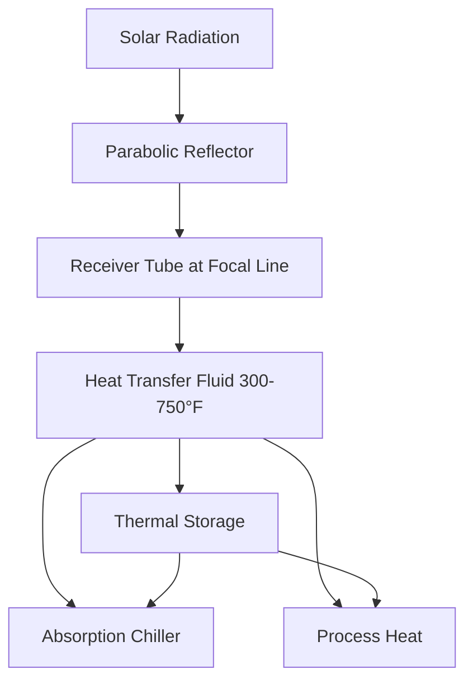
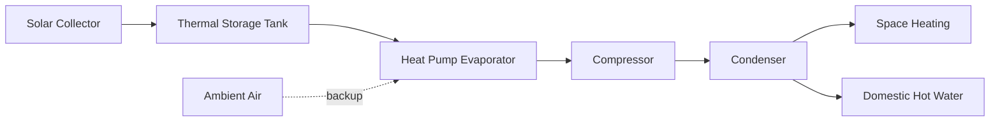

## Solar Energy Fundamentals for HVAC

Solar energy equipment converts incident solar radiation into thermal or electrical energy for HVAC system operation. The fundamental energy relationship governs all solar HVAC applications:

$$Q_{solar} = I_t \cdot A_c \cdot \eta_{collector} \cdot \tau$$

Where:
- $Q_{solar}$ = usable solar energy (Btu or kJ)
- $I_t$ = total solar irradiance on collector surface (Btu/hr·ft² or W/m²)
- $A_c$ = collector aperture area (ft² or m²)
- $\eta_{collector}$ = collector efficiency (dimensionless)
- $\tau$ = operating time period (hr)

ASHRAE Standard 93 establishes performance testing procedures for solar collectors, defining efficiency curves based on operating temperature differential and incident radiation.

## Solar Thermal Collector Types

Solar thermal collectors convert sunlight directly into heat for HVAC applications including space heating, domestic hot water, and absorption cooling.

### Flat-Plate Collectors

Flat-plate collectors consist of an absorber plate with integral flow passages, transparent cover glazing, and insulated backing. The thermal efficiency follows:

$$\eta_{fp} = F_R(\tau\alpha) - F_R U_L \frac{(T_i - T_a)}{I_t}$$

Where:
- $F_R$ = heat removal factor (dimensionless)
- $\tau\alpha$ = transmittance-absorptance product (dimensionless)
- $U_L$ = overall heat loss coefficient (Btu/hr·ft²·°F or W/m²·K)
- $T_i$ = inlet fluid temperature (°F or °C)
- $T_a$ = ambient air temperature (°F or °C)

| Collector Type | Efficiency Range | Operating Temp | Applications |
|----------------|------------------|----------------|--------------|
| Single-glazed flat-plate | 40-60% | 80-140°F | Pool heating, low-temp processes |
| Double-glazed flat-plate | 50-70% | 100-180°F | Space heating, domestic hot water |
| Selective surface flat-plate | 60-75% | 120-200°F | DHW, radiant heating |

### Evacuated Tube Collectors

Evacuated tube collectors eliminate convective heat losses through vacuum insulation between absorber and glass envelope. These achieve higher efficiency at elevated temperatures:

$$\eta_{etc} = a_0 - a_1 \frac{(T_m - T_a)}{I_t} - a_2 \frac{(T_m - T_a)^2}{I_t}$$

Where $a_0$, $a_1$, and $a_2$ are empirically determined collector coefficients, and $T_m$ is mean fluid temperature.

Evacuated tubes maintain efficiency above 50% at temperature differentials exceeding 150°F, enabling:
- High-temperature water production for absorption chillers
- Steam generation for industrial processes
- Year-round operation in cold climates

### Concentrating Collectors

Concentrating collectors use reflective or refractive optics to focus solar radiation onto smaller absorber areas, achieving concentration ratios from 5:1 to over 100:1.

The optical efficiency depends on reflectance, absorptance, and geometric concentration:

$$\eta_{optical} = \rho \cdot \gamma \cdot \alpha \cdot \frac{1}{C}$$

Where $\rho$ is mirror reflectance, $\gamma$ is intercept factor, $\alpha$ is absorber absorptance, and $C$ is concentration ratio.

## Photovoltaic Systems for HVAC

Photovoltaic (PV) systems generate electricity directly from solar radiation using semiconductor junction technology. HVAC applications include:

### Direct PV-Powered Equipment

DC-powered compressors, fans, and pumps operate directly from PV arrays without inverter losses. The system power balance:

$$P_{array} = P_{motor} + P_{controller} + P_{losses}$$

Maximum power point tracking (MPPT) controllers optimize array voltage to match motor characteristics across varying irradiance conditions.

### Grid-Tied PV Systems

Grid-connected systems offset HVAC electrical consumption through net metering arrangements. The annual energy offset:

$$E_{offset} = \sum_{i=1}^{8760} P_{array,i} \cdot \eta_{inverter} \cdot \eta_{system}$$

Where summation occurs over all hours in the year, accounting for inverter efficiency (typically 95-98%) and system losses from soiling, shading, and temperature effects.

## Hybrid Solar Technologies

### PV-Thermal (PVT) Collectors

PVT collectors combine photovoltaic electricity generation with thermal heat recovery from the PV module backside. The combined efficiency:

$$\eta_{total} = \eta_{electrical} + \eta_{thermal} \cdot \frac{Q_{th}}{Q_{el}}$$

Total efficiency exceeds 70% when thermal energy serves useful purposes, compared to 15-25% for PV-only systems.

### Solar-Assisted Heat Pumps

Solar collectors preheat refrigerant or serve as evaporator heat sources, improving heat pump COP by 15-40%. Three primary configurations exist:

| Configuration | Description | Typical COP Improvement |
|---------------|-------------|------------------------|
| Series | Collector heats storage, heat pump extracts from storage | 20-30% |
| Parallel | Collector and heat pump independently charge storage | 15-25% |
| Direct expansion | Refrigerant evaporates directly in collector | 30-40% |

## System Integration and Controls

Solar HVAC systems require sophisticated controls to manage multiple energy sources and storage components. Control strategies prioritize solar contribution to maximize fossil fuel offset while maintaining comfort conditions.

The instantaneous solar fraction:

$$SF = \frac{Q_{solar,delivered}}{Q_{solar,delivered} + Q_{auxiliary}}$$

Annual system performance depends on solar fraction, auxiliary energy efficiency, and parasitic pump/fan power consumption.

## Performance Prediction Methods

ASHRAE Standard 90.1 Appendix G provides calculation methods for solar energy system performance in whole-building energy modeling. The f-Chart method predicts long-term solar heating system performance based on dimensionless parameters correlating solar contribution to load and collector characteristics.

For cooling applications, the TRNSYS simulation environment models transient solar thermal systems including absorption chillers, desiccant dehumidifiers, and thermal storage. Validation studies demonstrate prediction accuracy within 10% of measured performance for properly characterized systems.

## Economic Considerations

Solar HVAC systems involve high initial capital costs offset by reduced operating expenses. Simple payback periods range from 8-25 years depending on:
- Local solar resource (insolation levels)
- Displaced energy costs (electricity, natural gas, or fuel oil)
- System efficiency and capacity factor
- Available incentives and tax credits

Life-cycle cost analysis per ASHRAE Standard 90.1 accounts for equipment life (20-30 years for thermal collectors, 25+ years for PV), maintenance requirements, and energy cost escalation rates to determine economic viability.