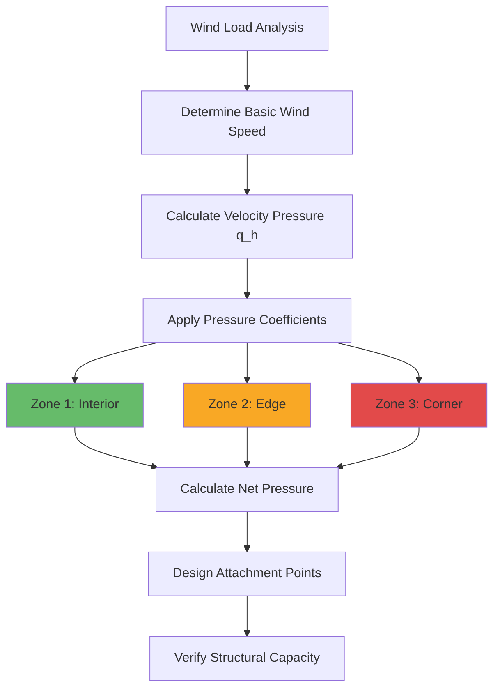

Building integration of solar thermal systems extends beyond simply mounting collectors on available surfaces. Successful integration requires coordination between structural capacity, architectural aesthetics, solar access optimization, and HVAC system functionality. The physical integration must address wind and snow loads, thermal expansion, waterproofing, and long-term durability while maximizing energy collection and minimizing installation costs.

## Structural Load Considerations

Solar collectors impose dead loads, live loads, and dynamic wind loads on building structures. Proper structural analysis ensures safety and prevents premature failure of both the mounting system and the supporting structure.

### Dead Load Analysis

Collector dead loads include the weight of collector assemblies, mounting hardware, piping, insulation, and heat transfer fluid. Typical values per unit collector area:

| Component | Load (kg/m²) | Notes |
|-----------|--------------|-------|
| Flat plate collector | 15-25 | Including glazing and housing |
| Evacuated tube array | 20-30 | Manifold contributes significantly |
| Mounting rails/frames | 5-10 | Aluminum or galvanized steel |
| Piping and fluid | 3-8 | Varies with system design |
| Snow retention | 0-100+ | Climate dependent |
| **Total dead load** | **25-170** | Design for maximum combination |

The concentrated load at mounting points must be verified against local structural capacity. For roof-mounted arrays, penetrations through the roof membrane require proper flashing and structural reinforcement to transfer loads to primary structural members (rafters, trusses, or roof beams).

### Wind Load Calculations

Wind loads dominate the structural design for roof-mounted and ground-mounted arrays. ASCE 7 provides the framework for calculating wind pressures on solar collectors based on building height, exposure category, and local wind speeds.

The design wind pressure on a tilted collector surface is:

$$p = q_h \left[ (GC_p) - (GC_{pi}) \right]$$

Where:
- $q_h$ = velocity pressure at mean roof height (Pa)
- $GC_p$ = external pressure coefficient (varies with location on roof)
- $GC_{pi}$ = internal pressure coefficient (typically ±0.18 for enclosed buildings)

Velocity pressure depends on basic wind speed and exposure:

$$q_h = 0.613 K_h K_{zt} K_d V^2$$

Where:
- $K_h$ = velocity pressure exposure coefficient (height and exposure dependent)
- $K_{zt}$ = topographic factor (1.0 for flat terrain)
- $K_d$ = wind directionality factor (0.85 for buildings)
- $V$ = basic wind speed (m/s)

**Critical Design Zones:**

Arrays mounted parallel to roof surfaces experience lower wind loads than tilted arrays. ASCE 7 identifies higher pressure zones at roof edges, corners, and ridges where $GC_p$ values increase by 50-100%. Collectors in these zones require enhanced attachment.

### Snow Load Considerations

In cold climates, snow accumulation on collectors must be analyzed for both uniform and drift loading conditions. The flat plate design snow load is:

$$p_f = 0.7 C_e C_t I_s p_g$$

Where:
- $C_e$ = exposure factor (0.9-1.2 depending on terrain)
- $C_t$ = thermal factor (1.0 for unheated structures, reduced for heated)
- $I_s$ = importance factor (1.0-1.2)
- $p_g$ = ground snow load (kPa)

Collector tilt angles above 30° promote snow shedding, but create sliding snow hazards and potential impact loads on lower building elements. Arrays with tilt angles below 15° may retain snow throughout the heating season, negating energy collection during peak demand periods.

Snow guards or retention systems prevent sudden avalanche events but increase structural loading. The retained snow load can reach:

$$p_{snow} = p_g \times 1.5 \text{ to } 2.0$$

This factor accounts for densification and ice formation over extended retention periods.

## Roof-Mounted Collector Arrays

Roof mounting provides the most common integration approach, offering unobstructed solar access and minimal land use. Three mounting strategies dominate:

### Ballasted Systems

Ballasted mounts use dead weight to resist wind uplift without roof penetrations. The required ballast mass per mounting point is:

$$m_{ballast} = \frac{F_{uplift} - F_{dead}}{g \mu}$$

Where:
- $F_{uplift}$ = design wind uplift force (N)
- $F_{dead}$ = weight of collectors and mounting (N)
- $g$ = gravitational acceleration (9.81 m/s²)
- $\mu$ = coefficient of friction (typically 0.3-0.5 for EPDM membrane)

**Advantages:**
- No roof penetrations or waterproofing concerns
- Rapid installation and removal
- Suitable for leased buildings or temporary installations

**Limitations:**
- Restricted to low-slope roofs (<7°)
- Significant added structural load (50-150 kg/m² ballast)
- Not viable on structurally limited roofs
- Limited tilt adjustment range

### Mechanically Attached Systems

Mechanical attachments penetrate the roofing membrane to anchor directly to structural members. Proper flashing and sealant application maintains waterproof integrity.

**Attachment Point Spacing:**

$$s = \sqrt{\frac{4 F_{allow}}{p_{net}}}$$

Where:
- $s$ = spacing between attachment points (m)
- $F_{allow}$ = allowable load per attachment (N)
- $p_{net}$ = net design pressure on collector (Pa)

Typical attachment spacings range from 0.6 to 1.8 m depending on wind loads and structural capacity.

**Flashing Requirements:**
- Curb-mounted flashing for penetrations through single-ply membranes
- Pitch pans or boot flashings for smaller penetrations
- Sealant compatibility verified with membrane material
- Regular inspection and maintenance per ASHRAE 191

### Integrated Rack Systems

Continuous rail systems distribute loads across multiple attachment points and provide structural continuity for large arrays. Rails run parallel to roof slope, with cross-members supporting collector frames.

The rail span between supports follows beam deflection limits:

$$\delta_{max} = \frac{5wL^4}{384EI} \leq \frac{L}{240}$$

Where:
- $w$ = distributed load (N/m)
- $L$ = span between supports (m)
- $E$ = elastic modulus of rail material (Pa)
- $I$ = moment of inertia of rail cross-section (m⁴)

Aluminum extrusions with $I$ = 10-40 cm⁴ typically limit spans to 1.5-2.5 m under combined dead and wind loads.

## Building-Integrated Photovoltaic/Thermal (BIPV/T)

BIPV/T systems combine photovoltaic electricity generation with thermal energy recovery, functioning as both building envelope and energy conversion system. The hybrid collector absorbs solar radiation, converts a fraction to electricity, and captures waste heat for HVAC applications.

### Energy Balance

The BIPV/T energy balance accounts for electrical and thermal output:

$$\eta_{total} = \eta_{elec} + \eta_{thermal}$$

Where electrical efficiency is:

$$\eta_{elec} = \eta_{ref} \left[1 - \beta(T_{cell} - T_{ref})\right]$$

And thermal efficiency follows:

$$\eta_{thermal} = F_R(\tau\alpha)_{thermal} - F_R U_L \frac{T_{f,in} - T_a}{G_T}$$

Parameters:
- $\eta_{ref}$ = reference PV efficiency at 25°C (typically 0.15-0.22)
- $\beta$ = temperature coefficient (-0.004 to -0.005 K⁻¹)
- $T_{cell}$ = cell operating temperature (°C)
- $(\tau\alpha)_{thermal}$ = effective transmittance-absorptance for thermal collection

The PV cells reach elevated temperatures (60-80°C) under solar radiation, reducing electrical efficiency by 15-25% compared to rated values. Extracting heat via forced circulation maintains lower cell temperatures, improving electrical output while providing useful thermal energy.

### BIPV/T Configuration Types

**Glazed vs Unglazed:**

| Configuration | Electrical Efficiency | Thermal Efficiency | Application |
|--------------|----------------------|-------------------|-------------|
| Unglazed | 14-18% | 30-50% | Low-temp applications, summer cooling |
| Single glazed | 12-16% | 45-65% | Year-round DHW, moderate heating |
| Double glazed | 10-14% | 50-70% | Space heating, high-temp applications |

Glazing reduces electrical efficiency through reflection losses and higher cell temperatures but dramatically improves thermal performance by reducing convective heat loss.

**Air vs Liquid Collectors:**

Air-based BIPV/T systems circulate ventilation air behind PV panels, preheating outdoor air for building HVAC systems. The heat transfer coefficient for air is relatively low (10-25 W/m²·K), limiting thermal extraction.

Liquid-based systems achieve heat transfer coefficients of 100-400 W/m²·K using copper tubing or aluminum channels bonded to the PV back surface. The improved heat extraction lowers cell temperature, increasing electrical output by 5-10% while delivering thermal energy at useful temperatures (40-70°C).

### Integration Challenges

1. **Thermal expansion:** BIPV/T panels experience temperature swings of 80-100°C from cold winter nights to summer stagnation. Expansion joints and flexible connections accommodate movement.

2. **Moisture management:** Condensation forms on cold panels during nighttime operation. Drainage paths and vapor barriers prevent moisture infiltration into building envelope.

3. **Electrical/thermal coordination:** Optimizing PV output requires low temperatures; thermal optimization requires high temperatures. Control strategies balance competing objectives based on economic value of electricity vs heat.

## Facade Integration

Vertical facade mounting integrates collectors into building walls, serving as cladding, shading devices, or curtain wall elements. The vertical orientation reduces summer heat gain while improving winter collection when sun angles are low.

### Optical Performance at Vertical Orientation

At latitude φ, a south-facing vertical surface receives annual solar radiation approximately:

$$H_{vertical} \approx 0.6 \times H_{horizontal}$$

However, winter radiation collection improves relative to horizontal surfaces:

$$\frac{H_{vertical,winter}}{H_{horizontal,winter}} \approx 1.2 \text{ to } 1.5$$

This relationship makes facade integration attractive for heating-dominated climates where winter energy demand peaks.

### Spandrel Panel Replacement

Non-vision spandrel panels in curtain wall systems present ideal facade integration opportunities. Solar thermal panels replace conventional insulated metal panels, maintaining thermal performance while adding energy collection.

**Performance Comparison:**

| Panel Type | U-value (W/m²·K) | Energy Collection | Cost Factor |
|------------|------------------|-------------------|-------------|
| Standard spandrel | 0.3-0.5 | None | 1.0× |
| Insulated metal panel | 0.2-0.3 | None | 1.2× |
| Solar thermal panel | 0.4-0.8 | 200-400 kWh/m²·yr | 3.0-4.5× |

The higher U-value during non-collection periods (night, cloudy conditions) must be offset by useful energy collection to achieve net energy benefit.

### Balcony Integration

Balcony parapets, railings, and ceiling soffits provide additional vertical mounting surfaces in multi-family residential buildings. South-facing balconies receive substantial solar radiation without interfering with views or occupant use.

Mounting considerations include:
- Accessibility for maintenance and inspection
- Drainage of condensate and rainwater
- Clearances for safety railings and egress paths
- Protection from occupant contact with hot surfaces

## Ground-Mounted and Canopy Systems

When roof space is unavailable or inadequate, ground-mounted arrays and canopy structures provide alternative integration strategies.

### Ground-Mounted Array Design

Ground arrays offer unlimited tilt angle adjustment and simplified maintenance access. The foundation design must resist overturning moments from wind loads:

$$M_{overturn} = F_{wind} \times h_{centroid}$$

Where $h_{centroid}$ is the height to the center of wind pressure. Concrete pier foundations or helical screw piles provide resistance through:

$$M_{resist} = W_{foundation} \times d_{lever}$$

The safety factor against overturning should exceed 1.5 for permanent installations.

### Solar Canopy Applications

Canopies over parking areas, walkways, or outdoor equipment serve dual functions: weather protection and energy collection. The structure must support collector dead loads plus snow and wind loads while maintaining adequate clearance (minimum 2.4 m for vehicular access, 2.1 m for pedestrian).

Canopy structures excel in applications requiring shade during summer while permitting winter sun penetration. The optimum tilt angle balances year-round energy collection with summer shading:

$$\beta_{canopy} = \phi - 10° \text{ to } \phi + 10°$$

Where φ is the site latitude.

## Shading Analysis and Optimization

Even partial shading severely degrades solar thermal system performance. A comprehensive shading analysis identifies obstructions and quantifies energy losses.

### Solar Path Diagrams

The solar altitude angle α and azimuth angle γ at any time are:

$$\sin(\alpha) = \sin(\delta)\sin(\phi) + \cos(\delta)\cos(\phi)\cos(h)$$

$$\sin(\gamma) = \frac{\cos(\delta)\sin(h)}{\cos(\alpha)}$$

Where:
- $\delta$ = solar declination angle (degrees)
- $\phi$ = site latitude (degrees)
- $h$ = hour angle (degrees)

Plotting these equations for the 21st day of each month creates a solar path diagram showing the sun's trajectory across the sky dome. Overlaying building profiles, trees, and terrain features reveals shading periods.

### Shading Factor Calculation

The shading factor SF represents the fraction of time the collector receives unshaded radiation:

$$SF = \frac{\sum(I_t \times A_{unshaded})}{\sum(I_t \times A_{total})}$$

Collectors should maintain SF > 0.80 during the primary heating season (October-March in Northern Hemisphere). Values below 0.70 generally render the installation uneconomic.

### Typical Obstruction Sources

1. **Adjacent buildings:** Minimum spacing = 2.5 × building height for unrestricted solar access
2. **Trees:** Deciduous trees provide less impact than evergreens; maintain clearance > 1.5 × mature height
3. **Mechanical equipment:** Rooftop HVAC units, parapet walls, penthouses require setbacks of 1.5-3 m
4. **Self-shading:** Row spacing in tilted arrays must prevent winter shading

The row spacing to prevent self-shading at winter solstice is:

$$d = \frac{L \cos(\beta)}{\tan(\alpha_{min})} + L \sin(\beta)$$

Where:
- $d$ = spacing between rows (m)
- $L$ = collector length (m)
- $\beta$ = tilt angle (degrees)
- $\alpha_{min}$ = minimum acceptable solar altitude (typically 20-25°)

## Installation Standards and Best Practices

ASHRAE Standard 90.1 Section 6.4.4 establishes minimum requirements for solar thermal system installation:

- Collectors must be oriented within 45° of true south (Northern Hemisphere) or true north (Southern Hemisphere)
- Tilt angle must be within 20° of optimum for latitude and application
- Shading factor must exceed 0.75 during the primary heating/cooling season
- Mounting structure must comply with applicable building codes for structural loads
- System must include overheat protection and freeze protection appropriate to climate

Successful building integration requires collaboration between HVAC designers, structural engineers, and architects from the early design phase. Integration decisions made during schematic design have far greater impact than optimization attempts during construction documentation or installation phases.

The physical integration of solar thermal equipment transforms passive building surfaces into active energy collection systems, reducing fossil fuel consumption while maintaining structural integrity and architectural quality.
