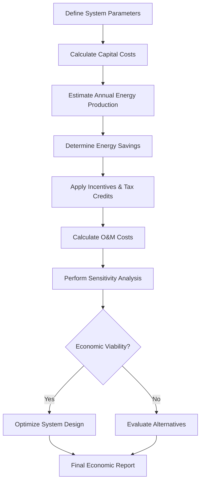

## Overview

Economic viability of solar HVAC systems depends on initial capital costs, operating expenses, energy savings, maintenance requirements, and available incentives. This analysis examines lifecycle costs, return on investment metrics, and sensitivity to key economic parameters for both solar thermal and photovoltaic-powered systems.

## Economic Metrics Framework

### Simple Payback Period

The simple payback period (SPP) represents the time required to recover initial investment through energy savings:

$$SPP = \frac{C_0 - I}{S_{annual}}$$

Where:
- $C_0$ = Initial capital cost ($)
- $I$ = Incentives and rebates ($)
- $S_{annual}$ = Annual energy cost savings ($/year)

### Net Present Value

Net present value (NPV) accounts for time value of money over the system lifetime:

$$NPV = \sum_{t=1}^{n} \frac{S_t - M_t}{(1+r)^t} - C_0 + \frac{SV}{(1+r)^n}$$

Where:
- $S_t$ = Energy savings in year t
- $M_t$ = Maintenance costs in year t
- $r$ = Discount rate (typically 3-8%)
- $n$ = System lifetime (years)
- $SV$ = Salvage value

### Internal Rate of Return

The internal rate of return (IRR) is the discount rate at which NPV equals zero:

$$0 = \sum_{t=1}^{n} \frac{CF_t}{(1+IRR)^t} - C_0$$

Where $CF_t$ represents net cash flow in year t. IRR values exceeding 8-12% typically indicate favorable investments.

## Capital Cost Components

### Solar Thermal Systems

| Component | Cost Range ($/ft²) | Percentage of Total |
|-----------|-------------------|---------------------|
| Collectors (flat plate) | $30-60 | 35-45% |
| Collectors (evacuated tube) | $60-100 | 40-50% |
| Storage tanks | $8-15 | 15-20% |
| Heat exchangers | $5-10 | 8-12% |
| Piping and insulation | $6-12 | 10-15% |
| Controls and instrumentation | $4-8 | 5-10% |
| Installation labor | $15-30 | 20-25% |

Total installed cost for solar thermal systems ranges from $80-150/ft² of collector area.

### Photovoltaic-Powered Systems

| Component | Cost Range ($/W_DC) | Percentage of Total |
|-----------|---------------------|---------------------|
| PV modules | $0.30-0.50 | 25-35% |
| Inverters | $0.15-0.25 | 10-15% |
| Racking and mounting | $0.20-0.35 | 15-20% |
| Electrical BOS | $0.15-0.25 | 10-15% |
| Installation labor | $0.40-0.70 | 30-40% |
| Permitting and inspection | $0.05-0.10 | 3-5% |

Total installed cost for grid-tied PV systems ranges from $1.25-2.15/W_DC.

## Levelized Cost of Energy

The levelized cost of energy (LCOE) represents the total lifecycle cost per unit of energy delivered:

$$LCOE = \frac{\sum_{t=1}^{n} \frac{C_0 + M_t + F_t}{(1+r)^t}}{\sum_{t=1}^{n} \frac{E_t}{(1+r)^t}}$$

Where:
- $F_t$ = Fuel costs in year t (applicable to hybrid systems)
- $E_t$ = Energy production in year t

For solar thermal systems, LCOE typically ranges from $0.04-0.12/kWh thermal, depending on location and system design.

## Economic Analysis Process

## Performance-Based Incentives

### Federal Investment Tax Credit

The federal ITC provides a percentage-based credit on installed system costs:

$$ITC_{value} = C_0 \times ITC_{rate}$$

For commercial solar thermal and PV systems, the ITC rate has historically ranged from 10-30%, subject to legislative changes.

### State and Utility Incentives

| Incentive Type | Typical Range | Impact on Economics |
|----------------|---------------|---------------------|
| Upfront rebates | $0.50-2.00/W or $/ft² | Reduces initial capital by 10-30% |
| Production-based incentives | $0.02-0.10/kWh | Improves cash flow over 5-10 years |
| Accelerated depreciation (MACRS) | 5-year schedule | Reduces tax burden by 15-25% |
| Net metering credits | Retail rate offset | Increases savings by 20-40% |
| Renewable energy certificates | $10-50/MWh | Additional revenue stream |

## Operating and Maintenance Costs

Annual O&M costs for solar HVAC systems:

$$C_{O\&M} = C_{routine} + C_{repairs} + C_{replacement} + C_{insurance}$$

Typical O&M costs range from 0.5-2% of initial capital cost annually.

### Solar Thermal O&M

- Collector cleaning: $0.50-1.50/ft²/year
- Glycol replacement: Every 3-5 years
- Pump maintenance: $200-500/year
- Control system calibration: $300-600/year

### Photovoltaic O&M

- Panel cleaning (if required): $0.10-0.30/W/year
- Inverter replacement: Expected at 10-15 years
- Monitoring system: $100-300/year
- Electrical inspections: $200-400/year

## Sensitivity Analysis Parameters

Economic viability responds to several key variables:

### Energy Price Escalation

Future energy costs significantly impact lifecycle economics. Assuming electricity price escalation rate $e$:

$$S_t = S_1 \times (1+e)^{t-1}$$

Typical escalation rates range from 2-5% annually. Higher escalation rates improve solar economics substantially.

### System Degradation

Solar system performance degrades over time. For PV systems:

$$E_t = E_1 \times (1-d)^{t-1}$$

Where degradation rate $d$ typically ranges from 0.3-0.8% per year for crystalline silicon modules.

### Discount Rate Impact

| Discount Rate | Effect on NPV | Typical Application |
|---------------|---------------|---------------------|
| 3% | Higher NPV values | Municipal/government projects |
| 5% | Moderate NPV | Non-profit organizations |
| 7% | Lower NPV | Commercial building owners |
| 10%+ | Significantly reduced NPV | Private equity requirements |

## Geographic Economic Variation

Solar HVAC economics vary substantially by location due to:

1. **Solar resource availability**: Insolation levels directly impact energy production
2. **Utility rate structures**: Higher electricity costs improve payback
3. **Local incentive programs**: Regional variations affect total economics
4. **Climate-specific loads**: Cooling-dominated climates favor certain technologies
5. **Installation labor costs**: Regional wage differences affect capital costs

Annual capacity factor for solar thermal systems ranges from 15-40% depending on location and application.

## Comparative Economic Analysis

### Solar Thermal vs. Conventional Heating

For space heating and domestic hot water applications:

| Metric | Solar Thermal | Natural Gas | Electric Resistance |
|--------|---------------|-------------|---------------------|
| Capital cost | $8,000-15,000 | $3,000-5,000 | $1,500-3,000 |
| LCOE ($/kWh thermal) | $0.04-0.12 | $0.03-0.06 | $0.08-0.15 |
| Simple payback | 8-15 years | Baseline | N/A |
| 25-year NPV (7% discount) | $5,000-20,000 | $0 | Negative |

### PV-Powered vs. Grid-Powered HVAC

For air conditioning applications:

| Metric | PV + Grid-Tied AC | Conventional AC |
|--------|-------------------|-----------------|
| Capital cost premium | +$8,000-15,000 | Baseline |
| Annual energy cost | 30-70% reduction | $800-2,000 |
| Simple payback | 6-12 years | N/A |
| IRR | 8-18% | N/A |

## Design Optimization for Economics

### Solar Fraction Optimization

The optimal solar fraction balances capital cost against energy savings:

$$SF = \frac{Q_{solar}}{Q_{total}}$$

Economic optimization typically yields solar fractions of 40-70% for thermal systems. Higher solar fractions require disproportionately larger collector areas with diminishing marginal returns.

### Storage Sizing Impact

Storage volume affects both capital cost and system performance. Optimal storage capacity:

$$V_{storage} = 1.5 \text{ to } 3.0 \times Q_{daily} \times \frac{1}{\rho c_p \Delta T}$$

Larger storage improves utilization but increases capital cost, requiring economic optimization.

## Risk Considerations

Economic analyses must account for:

- **Technology risk**: Performance may deviate from projections
- **Policy risk**: Incentive programs may change or expire
- **Energy price volatility**: Savings assumptions may not materialize
- **Maintenance uncertainty**: Actual O&M costs may exceed estimates
- **Integration complexity**: Retrofit applications may encounter unforeseen costs

Monte Carlo simulation techniques can quantify uncertainty ranges for economic metrics, providing confidence intervals for decision-making.

## ASHRAE Standards Reference

ASHRAE 173-2010 provides methods for testing solar thermal systems, enabling accurate performance predictions required for economic analysis. ASHRAE 90.1 establishes baseline energy performance for economic comparisons.

Economic analyses should use weather data from ASHRAE climatic design conditions and typical meteorological year (TMY) datasets for location-specific projections.
