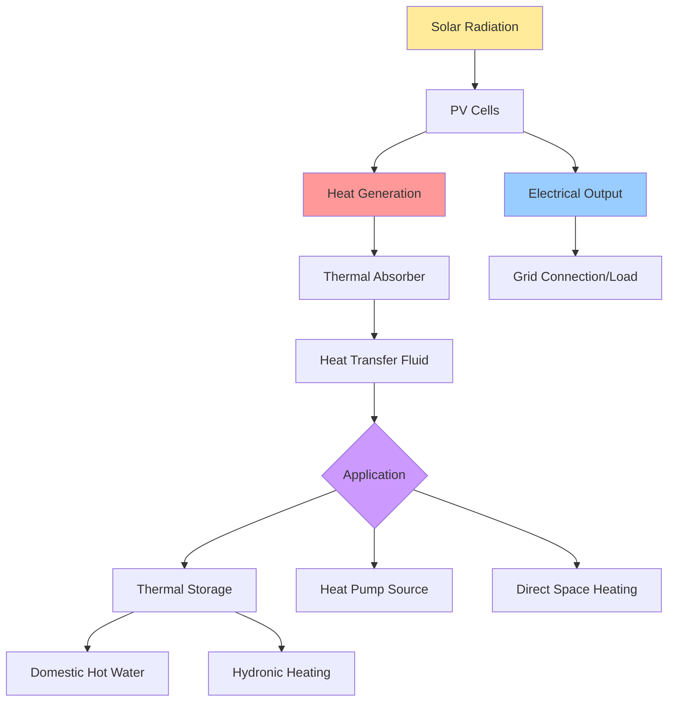

## Overview

Photovoltaic-thermal (PVT) hybrid collectors simultaneously generate electrical power through photovoltaic conversion and capture thermal energy from cooling the PV cells. This dual-function approach addresses the fundamental challenge that PV cell efficiency decreases with temperature, typically losing 0.4-0.5% efficiency per degree Celsius above 25°C. By actively removing heat from the PV surface, PVT systems maintain higher electrical output while producing useful thermal energy for space heating, domestic hot water, or process applications.

The combined energy output significantly improves total solar energy utilization compared to separate PV and thermal collectors occupying the same area. ASHRAE Standard 93 provides testing procedures for thermal collector performance, while IEEE 1547 governs grid-connected PV systems.

## Fundamental Operating Principles

### Heat Transfer Mechanisms

PVT collectors exploit three heat transfer modes to extract thermal energy:

**Conduction** through the PV module substrate transfers heat from the cell layer to the thermal absorber plate. Thermal conductivity of the bonding material (typically 0.2-1.5 W/m·K) determines the temperature gradient between cell and absorber.

**Convection** from the absorber to the heat transfer fluid removes thermal energy. For liquid-cooled systems, forced convection with Reynolds numbers above 2300 ensures turbulent flow and heat transfer coefficients of 300-1000 W/m²·K. Air-cooled systems achieve 10-50 W/m²·K depending on air velocity.

**Radiation** losses from the collector surface to the environment follow the Stefan-Boltzmann law. Low-emissivity coatings (ε < 0.15) minimize radiation losses while maintaining high solar absorptivity.

### Electrical-Thermal Coupling

The instantaneous PV cell temperature under operating conditions:

$$T_{cell} = T_{ambient} + \frac{G \cdot (1 - \eta_{PV})}{\alpha} - \frac{\dot{q}_{thermal}}{A \cdot \alpha}$$

where $G$ is solar irradiance (W/m²), $\eta_{PV}$ is photovoltaic conversion efficiency, $\alpha$ is the overall heat transfer coefficient (W/m²·K), and $\dot{q}_{thermal}$ is the thermal energy removal rate.

The coupled efficiency represents total energy output:

$$\eta_{PVT} = \eta_{PV} + \eta_{thermal} = \eta_{PV,ref}[1 - \beta(T_{cell} - 25)] + \frac{\dot{m} c_p (T_{out} - T_{in})}{G \cdot A}$$

where $\beta$ is the temperature coefficient (typically -0.0045/°C for crystalline silicon), $\dot{m}$ is mass flow rate, and $c_p$ is specific heat capacity.

## System Configurations

### Liquid-Based PVT Collectors

**Sheet-and-tube design** bonds copper or aluminum tubing to the PV module backside. Tube spacing of 100-150 mm balances pressure drop against temperature uniformity. Water-glycol mixtures (25-50% glycol) provide freeze protection while maintaining heat transfer performance.

**Channel flow configuration** uses rectangular channels machined into aluminum extrusion, providing uniform heat extraction across the entire PV area. Hydraulic diameter of 8-12 mm optimizes the ratio of heat transfer to pumping power.

**Direct-flow design** allows water to flow directly against the PV back surface in a sealed enclosure. This maximizes heat transfer coefficients but requires careful water chemistry control to prevent corrosion.

### Air-Based PVT Collectors

Air flows through a channel behind the PV module, typically 25-100 mm deep. Surface enhancement through fins, corrugations, or matrix materials increases the effective heat transfer area by factors of 2-5, compensating for air's lower heat capacity.

Air velocity between 2-4 m/s balances thermal performance against fan power consumption. The thermal efficiency:

$$\eta_{thermal,air} = F_R \left[\tau\alpha - U_L\frac{(T_{in} - T_{ambient})}{G}\right]$$

where $F_R$ is the heat removal factor (0.4-0.7 for air systems), $\tau\alpha$ is the transmittance-absorptance product, and $U_L$ is the overall loss coefficient (3-6 W/m²·K).

### Concentrating PVT Systems

Low-concentration designs (2-10× concentration) use reflectors or Fresnel lenses to increase solar flux on the PV cells. The concentrated design requires active tracking and enhanced cooling, but achieves electrical efficiencies of 20-28% combined with thermal efficiencies of 40-55%.

## Performance Comparison

| Configuration | Electrical Efficiency | Thermal Efficiency | Total Efficiency | Fluid Temperature | Applications |
|--------------|---------------------|-------------------|-----------------|------------------|--------------|
| Liquid PVT | 12-16% | 45-65% | 60-75% | 30-70°C | DHW, space heating |
| Air PVT | 10-14% | 30-50% | 45-60% | 25-45°C | Space heating, ventilation |
| Concentrating PVT | 20-28% | 40-55% | 65-80% | 50-100°C | Process heat, cooling |
| Separate PV + Solar Thermal | 15-18% + 60-70% | Combined 75-85% (requires 2× area) | - | Varies | Maximum energy density |

## System Integration

### Thermal Storage Interface

Stratified storage tanks maintain temperature layering, with PVT return water entering at the appropriate level based on temperature. A typical 300-liter tank provides 50-70 kWh thermal storage capacity with 40°C temperature differential.

The charging rate must balance PVT output with load demand:

$$\dot{Q}_{storage} = \dot{m}_{PVT} c_p (T_{PVT,out} - T_{tank,avg}) - UA_{tank}(T_{tank,avg} - T_{ambient})$$

### Heat Pump Integration

PVT collectors serve as enhanced evaporator sources for heat pumps, providing 5-15°C higher source temperatures than ambient air. This increases heat pump COP by 15-30% compared to air-source operation. The combined system coefficient of performance:

$$COP_{system} = \frac{\dot{Q}_{heating} + W_{PV}}{W_{pump} + W_{circulation} - W_{PV}}$$

### Building HVAC Coupling

Series connection supplies PVT thermal output to building heating systems. Optimal flow rates of 15-30 L/h·m² balance thermal extraction against pumping power. Variable-speed pumps modulate flow based on available solar radiation and load requirements.

Parallel connection with conventional heating allows the PVT system to preheat the heating fluid, reducing auxiliary energy consumption by 40-70% depending on climate and load profiles.

## Control Strategies

### Temperature-Based Control

Differential controllers activate circulation when collector temperature exceeds storage temperature by 5-8°C. Hysteresis of 2-3°C prevents short cycling. High-limit shutdown protects against stagnation temperatures exceeding 95°C in liquid systems.

### Maximum Power Point Tracking Integration

MPPT algorithms continuously adjust PV operating voltage to extract maximum electrical power while maintaining acceptable cell temperatures. Combined PV-thermal optimization maximizes the weighted sum:

$$J = w_e \cdot P_{electric} + w_t \cdot \dot{Q}_{thermal}$$

where weighting factors $w_e$ and $w_t$ reflect economic values of electricity versus thermal energy (typically 2.5-4.0 based on utility rates).

### Predictive Control

Model-predictive control uses weather forecasts and building load predictions to optimize flow rates and storage charging cycles. This approach improves seasonal energy output by 8-15% compared to conventional differential control.

## Performance Monitoring

Key performance indicators track system effectiveness:

- **Primary energy ratio (PER)**: Total PVT energy output divided by equivalent primary energy input from conventional sources (target: PER > 2.5)
- **Exergy efficiency**: Ratio of delivered exergy to incident solar exergy, accounting for temperature-dependent energy quality (15-25% for typical systems)
- **Capacity factor**: Actual annual energy output divided by theoretical maximum at rated conditions (25-40% for most climates)

## Design Considerations

### Sizing Methodology

PVT array sizing balances investment cost against energy offset. A common approach sizes thermal capacity to meet 60-80% of summer domestic hot water load, resulting in collector areas of 0.015-0.025 m² per liter of daily hot water consumption.

Electrical capacity targets 40-60% of average daytime electrical load to minimize grid export in systems without feed-in tariffs.

### Orientation and Tilt

Optimal tilt for maximum annual combined energy output:

$$\beta_{opt} = 0.9 \times \phi + 15° \times \frac{Q_{winter}}{Q_{annual}}$$

where $\phi$ is latitude and the second term adjusts for heating-dominated applications requiring winter emphasis.

Azimuth deviation from south reduces annual output by approximately 1% per 5° deviation up to ±30°.

### Material Selection

Aluminum frames provide corrosion resistance and thermal conductivity of 200-250 W/m·K. Copper tubes offer superior heat transfer but require isolation from aluminum components to prevent galvanic corrosion.

Ethylene propylene diene monomer (EPDM) gaskets withstand stagnation temperatures while maintaining weather sealing over 20-year service life.

## Economic Analysis

Payback periods for PVT systems range from 8-15 years depending on electricity costs, thermal load matching, and available incentives. The levelized cost of combined energy:

$$LCOE_{combined} = \frac{C_{capital} \cdot CRF + C_{O\&M,annual}}{E_{electric,annual}/c_e + E_{thermal,annual}/c_t}$$

where $CRF$ is capital recovery factor and $c_e$, $c_t$ are conversion factors normalizing electricity and thermal energy to equivalent units.

Systems achieve economic viability when displaced energy costs exceed $0.12-0.18/kWh equivalent.

## Future Development Directions

Spectral splitting technologies separate solar radiation into wavelengths optimized for PV conversion (400-1100 nm) and thermal absorption (>1100 nm), potentially increasing combined efficiency to 85-90%.

Nanofluid heat transfer fluids containing 1-5% nanoparticles increase thermal conductivity by 20-40% and heat transfer coefficients by 15-25%, enabling higher operating temperatures and improved heat pump integration.

Building-integrated PVT (BIPVT) systems serve as both building envelope and energy generator, offsetting facade costs while providing thermal insulation, reducing net system cost by 30-50%.
