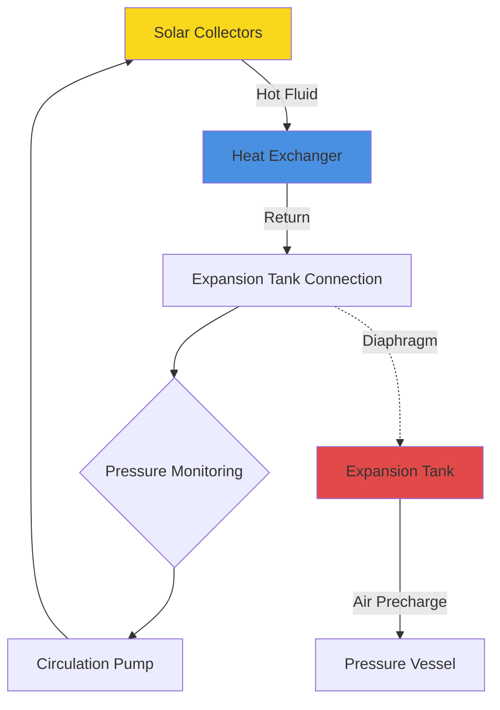
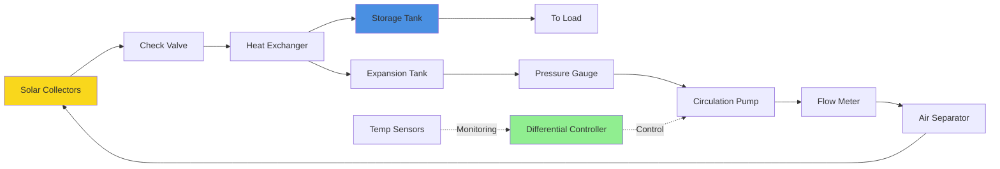

Solar thermal systems require properly sized and configured auxiliary components to transfer, store, and control thermal energy efficiently. Component selection directly impacts system reliability, efficiency, and operational longevity. This analysis covers the critical equipment that transforms solar collectors into functional heating systems.

## Heat Exchangers

Heat exchangers transfer thermal energy from the collector loop to potable water or building heating systems. The primary design challenge involves balancing heat transfer effectiveness against pressure drop and parasitic pumping energy.

### Heat Transfer Fundamentals

Heat exchanger performance follows the effectiveness-NTU relationship:

$$\varepsilon = \frac{Q_{actual}}{Q_{max}} = \frac{\dot{m} c_p (T_{out} - T_{in})}{\dot{m} c_p (T_{hot,in} - T_{cold,in})}$$

Where:
- $\varepsilon$ = heat exchanger effectiveness (dimensionless)
- $Q_{actual}$ = actual heat transfer rate (W)
- $Q_{max}$ = maximum possible heat transfer (W)
- $\dot{m}$ = mass flow rate (kg/s)
- $c_p$ = specific heat capacity (J/kg·K)

The number of transfer units (NTU) relates to physical size and flow configuration:

$$NTU = \frac{UA}{C_{min}}$$

Where:
- $U$ = overall heat transfer coefficient (W/m²·K)
- $A$ = heat transfer surface area (m²)
- $C_{min}$ = minimum capacitance rate $= \dot{m} c_p$ (W/K)

For counterflow configuration:

$$\varepsilon = \frac{1 - exp[-NTU(1-C_r)]}{1 - C_r \cdot exp[-NTU(1-C_r)]}$$

Where $C_r = C_{min}/C_{max}$ is the capacitance ratio.

### Configuration Types

**External Heat Exchanger:**

Separate vessel positioned between collector loop and storage tank. Common types include:

- **Plate-and-frame**: Stainless steel plates create turbulent flow paths, achieving effectiveness $\varepsilon$ = 0.70-0.85 with compact footprint
- **Shell-and-tube**: Copper tubes in steel shell, effectiveness $\varepsilon$ = 0.50-0.70, suitable for high-pressure applications
- **Brazed plate**: Copper-brazed stainless steel, effectiveness $\varepsilon$ = 0.60-0.75, economical for residential systems

**Immersed Coil:**

Copper or stainless steel coil submerged in storage tank. Heat transfer governed by:

$$Q = UA \Delta T_{lm}$$

Where $\Delta T_{lm}$ is log mean temperature difference:

$$\Delta T_{lm} = \frac{(T_{f,in} - T_{tank}) - (T_{f,out} - T_{tank})}{ln\left(\frac{T_{f,in} - T_{tank}}{T_{f,out} - T_{tank}}\right)}$$

**Design Criteria:**

| Parameter | External HX | Immersed Coil |
|-----------|-------------|---------------|
| Effectiveness (ε) | 0.65-0.85 | 0.40-0.60 |
| Pressure drop | 5-15 kPa | 2-8 kPa |
| Cost | Higher | Lower |
| Maintenance | Serviceable | Fixed installation |
| Freezing risk | External piping | Protected by tank |

ASHRAE design recommendation: External heat exchangers should achieve minimum effectiveness $\varepsilon$ = 0.50 to maintain acceptable collector loop temperatures. Each 0.10 reduction in effectiveness increases collector temperature by 5-8°C, reducing system efficiency by 3-5%.

## Expansion Tanks

Closed-loop solar systems require expansion tanks to accommodate thermal expansion of heat transfer fluid. Tank sizing must account for extreme temperature ranges from ambient to stagnation conditions.

### Volume Calculation

The required expansion volume derives from fluid thermal expansion:

$$V_{exp} = V_{system} \times (\rho_{cold} / \rho_{hot} - 1)$$

Where:
- $V_{system}$ = total system fluid volume (L)
- $\rho_{cold}$ = fluid density at fill temperature (kg/m³)
- $\rho_{hot}$ = fluid density at maximum temperature (kg/m³)

For solar systems, calculate using stagnation temperature (180-280°C depending on collector type):

$$V_{tank} = \frac{V_{exp} \times (P_{max} + P_{atm})}{(P_{max} - P_{initial})} \times 1.25$$

The 1.25 safety factor accounts for uncertainty in system volume and ensures adequate vapor space.

**Example Calculation:**

System parameters:
- Collector area: 20 m²
- System volume: 120 liters (6 L/m² typical)
- Fluid: 40% propylene glycol
- Fill temperature: 20°C ($\rho$ = 1030 kg/m³)
- Stagnation temperature: 200°C ($\rho$ = 890 kg/m³)
- Maximum pressure: 600 kPa gauge
- Initial pressure: 100 kPa gauge

$$V_{exp} = 120 \times (1030/890 - 1) = 18.9 \text{ L}$$

$$V_{tank} = \frac{18.9 \times (600 + 101)}{(600 - 100)} \times 1.25 = 33.2 \text{ L}$$

Select 35-liter expansion tank.

### Tank Configuration

**Installation Requirements:**

1. **Location**: Connect to coldest part of system (pump suction side) to minimize temperature exposure to diaphragm
2. **Precharge pressure**: Set to 70-80% of system static pressure
3. **Pressure relief**: Install 600-800 kPa relief valve on collector side of check valve
4. **Air elimination**: Automatic air vents at high points prevent vapor lock

## Heat Transfer Fluids

Heat transfer fluids must provide freeze protection, corrosion inhibition, and thermal stability across operating temperature range -40°C to 200°C.

### Propylene Glycol Solutions

Propylene glycol (PG) solutions represent the standard choice for solar thermal systems due to non-toxic formulation suitable for potential potable water contact.

**Concentration Selection:**

| Temperature Protection | PG Concentration | Specific Heat @ 80°C | Viscosity @ 0°C |
|------------------------|------------------|----------------------|-----------------|
| -10°C | 25% | 4.0 kJ/kg·K | 3.2 mPa·s |
| -20°C | 35% | 3.8 kJ/kg·K | 5.8 mPa·s |
| -30°C | 45% | 3.6 kJ/kg·K | 11.5 mPa·s |
| -40°C | 50% | 3.5 kJ/kg·K | 18.2 mPa·s |

The thermal penalty from glycol use appears in three forms:

**Reduced Heat Capacity:**

$$Q = \dot{m} c_{p,glycol} \Delta T$$

40% PG mixture exhibits 10% lower specific heat than water, requiring 10% higher flow rate for equivalent heat transfer.

**Increased Viscosity:**

Pressure drop increases with viscosity per Darcy-Weisbach equation:

$$\Delta P = f \frac{L}{D} \frac{\rho V^2}{2}$$

Where friction factor $f$ depends on Reynolds number:

$$Re = \frac{\rho V D}{\mu}$$

Higher viscosity reduces Reynolds number, increasing friction factor and pumping power.

**Reduced Convective Heat Transfer:**

Nusselt number correlation for turbulent flow:

$$Nu = 0.023 Re^{0.8} Pr^{0.4}$$

Lower Reynolds number and Prandtl number modifications reduce heat transfer coefficient by 10-15% compared to water.

### Thermal Degradation

Glycol solutions degrade when exposed to oxygen at elevated temperatures, forming organic acids that corrode system components and reduce pH. Degradation rate accelerates exponentially above 150°C:

**Useful Life Estimation:**

- 120°C exposure: 15-20 years
- 150°C exposure: 8-12 years
- 180°C exposure: 3-5 years
- 200°C exposure: 1-2 years

Systems experiencing regular stagnation require biennial fluid analysis and pH monitoring. Replace fluid when pH drops below 7.0 or reserve alkalinity depletes.

## Circulation Pumps

Solar system pumps must overcome collector pressure drop, heat exchanger resistance, and piping friction while minimizing parasitic energy consumption.

### Pump Sizing

Total system head:

$$H_{total} = H_{collector} + H_{HX} + H_{pipe} + H_{elevation}$$

Flow rate derives from collector area and temperature rise:

$$\dot{m} = \frac{Q_{solar}}{c_p \Delta T}$$

Standard design values: 15-25 L/hr per m² collector area, corresponding to 8-12°C temperature rise.

**Pump Selection Parameters:**

| System Size | Flow Rate | Head | Power | Type |
|-------------|-----------|------|-------|------|
| <30 m² | 300-600 L/hr | 2-4 m | 40-80 W | Inline circulator |
| 30-100 m² | 600-2000 L/hr | 3-6 m | 80-180 W | Inline/close-coupled |
| >100 m² | 2000-6000 L/hr | 5-10 m | 180-500 W | Base-mounted |

### Variable Speed Control

Variable frequency drives optimize energy consumption by modulating flow based on available solar radiation. Control strategy:

$$\dot{m} = \dot{m}_{max} \times \left(\frac{G_T}{G_{rated}}\right)^{0.5}$$

Where:
- $G_T$ = current irradiance (W/m²)
- $G_{rated}$ = rated irradiance (typically 800 W/m²)

This proportional control maintains approximately constant temperature rise while reducing pump energy by 30-50% compared to fixed-speed operation.

## Differential Controllers

Differential temperature controllers activate circulation when collector temperature exceeds storage temperature by set threshold, preventing heat loss during low-radiation periods.

### Control Logic

Basic algorithm:

$$\text{ON if: } T_{collector} > T_{storage} + \Delta T_{on}$$
$$\text{OFF if: } T_{collector} < T_{storage} + \Delta T_{off}$$

Typical settings:
- $\Delta T_{on}$ = 8-12°C (turn-on differential)
- $\Delta T_{off}$ = 3-5°C (turn-off differential)
- $T_{max}$ = 95-110°C (overheat protection)

**Advanced Features:**

1. **Maximum temperature limit**: Prevents storage overheating
2. **Anti-freeze protection**: Circulates during freezing conditions for drainback systems
3. **Collector cooling**: Evening circulation to prevent stagnation
4. **Priority switching**: Manages multiple storage zones
5. **Boiler lockout**: Disables auxiliary heat when solar available

### Sensor Placement

**Collector Sensor:**
- Location: Return manifold or outlet pipe
- Type: RTD or thermistor, accuracy ±1°C
- Mounting: Immersion well or surface-bonded with thermal compound
- Critical: Sensor must not be affected by stagnant fluid when pump stops

**Storage Sensor:**
- Location: Lower third of tank for differential measurement
- Avoid: Near coil inlet where measurements reflect collector loop temperature
- Multiple sensors: Track stratification in larger tanks (>1000 L)

## System Integration

Proper component integration ensures reliable, efficient solar thermal operation:

**Critical Integration Points:**

1. **Check valve** after collectors prevents reverse thermosiphoning, pressure drop <5 kPa
2. **Flow meter** enables commissioning verification and performance monitoring
3. **Air separator** removes entrained air that reduces heat transfer and causes cavitation
4. **Pressure gauge** monitors system pressure, identifies leaks or expansion issues
5. **Isolation valves** at each component enable service without system drainage

## Standards and Performance

**Applicable Standards:**
- **ASHRAE 90.1-2022**: Section 6.3.3 - Solar thermal system requirements
- **ASHRAE 93-2010**: Collector testing procedures (informative for system design)
- **ASHRAE 191-2020**: Monitoring and performance verification protocols
- **SRCC OG-300**: Solar thermal system certification program

**Design Verification:**

System efficiency metric:

$$\eta_{system} = \frac{Q_{delivered}}{A_c \times H_T} \times 100\%$$

Annual system efficiency target: 30-45% based on collector type and climate. Component losses typically account for:
- Heat exchanger: 5-10% reduction from unity effectiveness
- Piping: 2-5% for insulated exterior runs
- Controls: 1-3% from differential settings and cycling losses
- Pumping: Parasitic energy ratio should remain below 5% of delivered energy

Properly specified and configured components transform solar collectors into complete thermal systems achieving 20-70% annual solar fractions for heating applications. Success requires attention to heat transfer fundamentals, accurate sizing calculations, and integration of controls that respond to dynamic solar availability.
