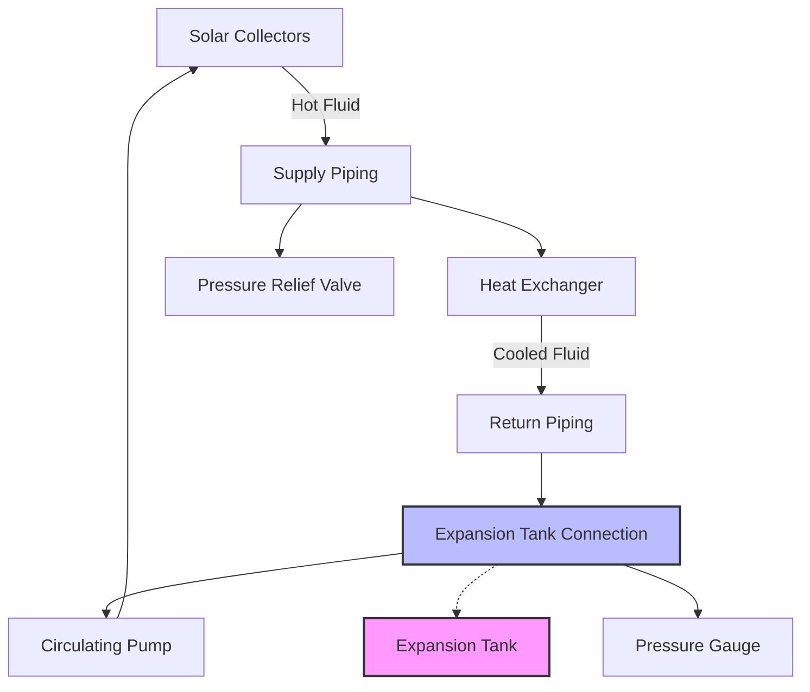

## Thermal Expansion Fundamentals

Expansion tanks accommodate volumetric changes in solar thermal system fluid caused by temperature variations. As solar collectors heat the heat transfer fluid, thermal expansion increases system pressure. Without proper expansion volume, excessive pressures develop, triggering pressure relief valve discharge or component failure.

The coefficient of volumetric expansion governs fluid volume change with temperature:

$$\Delta V = V_0 \beta \Delta T$$

where $\Delta V$ is volume change (gal), $V_0$ is initial fluid volume (gal), $\beta$ is volumetric expansion coefficient (1/°F), and $\Delta T$ is temperature change (°F).

For propylene glycol solutions commonly used in solar thermal systems, the expansion coefficient varies with concentration and temperature. A 50% propylene glycol solution exhibits $\beta \approx 0.00055$ per °F, significantly higher than pure water at $\beta \approx 0.00021$ per °F.

## Expansion Tank Types

### Diaphragm Expansion Tanks

Diaphragm tanks separate system fluid from compressed air using a flexible membrane. The diaphragm prevents air absorption into the fluid, eliminating the need for periodic air recharging. These tanks dominate modern solar thermal applications due to reliability and minimal maintenance.

The tank features a fixed air charge on one side of the diaphragm and system fluid on the other. As fluid expands, the diaphragm compresses the air cushion, increasing system pressure according to the ideal gas law:

$$P_1 V_1 = P_2 V_2$$

### Compression Tanks

Older compression tanks allow direct contact between air and system fluid. Air gradually dissolves into the fluid, requiring periodic recharging. These tanks are rarely specified for new solar installations due to maintenance requirements and potential for air entrainment in the system.

## Tank Sizing Methodology

Proper expansion tank sizing requires calculating the acceptance volume—the fluid volume the tank must accommodate between minimum and maximum system pressures.

### ASHRAE Sizing Approach

Per ASHRAE Handbook—HVAC Systems and Equipment Chapter 14, the required tank volume is:

$$V_t = \frac{V_s \times \Delta V_{ratio} - 3}{1 - \frac{P_1}{P_2}}$$

where:
- $V_t$ = expansion tank volume (gal)
- $V_s$ = total system fluid volume (gal)
- $\Delta V_{ratio}$ = fluid volume expansion ratio (dimensionless)
- $P_1$ = minimum system pressure (psia)
- $P_2$ = maximum system pressure (psia)

The constant 3 gallons accounts for system volume in piping and components not subject to heating.

### System Fluid Volume Calculation

Total system volume includes:

- **Collector array**: Panel internal volume from manufacturer data
- **Piping network**: Calculate from pipe diameter and length
- **Heat exchanger**: Tube-side volume for solar loop
- **Expansion tank connection piping**: Typically 1-2 gallons

Collector fluid volume typically ranges from 0.15 to 0.35 gallons per square foot of collector area, depending on absorber design.

## Pressure Parameters

### Minimum System Pressure

The minimum pressure $P_1$ must exceed the static head of the highest point in the system plus a safety margin:

$$P_1 = \frac{h \times \rho}{144} + P_{atm} + P_{safety}$$

where $h$ is elevation difference (ft), $\rho$ is fluid density (lb/ft³), and pressures are in psia. A safety margin of 3-5 psi prevents cavitation and ensures positive pressure throughout the system.

### Maximum System Pressure

Maximum pressure is determined by the lowest-rated system component, typically:

- Pressure relief valve setting minus 10%
- Collector maximum working pressure
- Heat exchanger pressure rating
- Pressure gauge maximum scale

Standard solar thermal systems operate at maximum pressures of 30-50 psig (45-65 psia).

## Glycol Solution Considerations

| Property | Water | 30% PG | 50% PG |
|----------|-------|---------|---------|
| Expansion Coefficient (1/°F) | 0.00021 | 0.00041 | 0.00055 |
| Density at 60°F (lb/gal) | 8.33 | 8.54 | 8.70 |
| Freezing Point (°F) | 32 | 7 | -28 |
| Viscosity Ratio (vs. Water) | 1.0 | 1.8 | 3.5 |

Propylene glycol solutions require larger expansion tanks due to higher thermal expansion coefficients. A 50% glycol system expanding from 40°F to 220°F experiences approximately 12% volume increase compared to 6% for water.

## Installation Requirements

### Location and Mounting

Install expansion tanks on the supply side of the circulating pump to maintain constant pump inlet pressure. The tank connection point should be:

- Upstream of any check valves or shutoff valves
- Connected via tee fitting with no intervening valves
- Positioned to allow gravity drainage during service
- Accessible for inspection and pressure gauge reading

Mount diaphragm tanks vertically with the connection at the bottom to prevent air accumulation in the fluid chamber.

### Pre-Charge Pressure

Set tank pre-charge pressure to match the minimum system pressure:

$$P_{precharge} = P_1 = \frac{h \times \rho}{144} + P_{atm} + P_{safety}$$

Verify pre-charge annually using a standard tire pressure gauge when the system is cold and depressurized. Pre-charge pressure 2-3 psi below calculated value indicates diaphragm failure or slow air leak.

## System Integration

The expansion tank connects to the system at a point of minimal pressure fluctuation—between the heat exchanger outlet and pump inlet. This location experiences the least pressure variation during pump operation, allowing the tank to function primarily as a thermal expansion reservoir rather than compensating for pump-induced pressure changes.

## Maintenance and Troubleshooting

### Performance Indicators

Monitor these parameters quarterly:

- Tank pre-charge pressure (when system cold)
- System operating pressure at various temperatures
- Pressure relief valve discharge frequency
- Fluid level in sight glass (if equipped)

### Common Failure Modes

**Diaphragm rupture**: System pressure drops below pre-charge, fluid appears at air valve, tank feels uniformly cold. Replace tank immediately.

**Air charge loss**: Gradual pressure decline over weeks, tank feels warm throughout. Recharge to specification or replace if leak persists.

**Undersized tank**: Pressure relief valve opens during high solar gain periods, system loses fluid. Calculate correct size and install larger unit.

## Performance Verification

After installation and system fill, verify proper expansion tank operation:

1. Record cold system pressure with pump off
2. Operate system until collectors reach stagnation temperature
3. Verify hot system pressure remains below relief valve setting
4. Calculate acceptance volume used: $V_{used} = V_t \times (1 - \frac{P_1}{P_2})$
5. Compare to calculated expansion volume requirement

If hot pressure approaches relief valve setting, the tank is undersized or pre-charge pressure is incorrect.

## Design Considerations for High-Temperature Systems

Solar thermal systems capable of stagnation temperatures exceeding 350°F require special attention to expansion volume. The fluid expansion between 40°F ambient and 350°F stagnation can reach 15-18% for glycol solutions, substantially larger than typical heating system expansion.

Evacuated tube collectors and high-efficiency flat plate collectors in high-insolation climates regularly achieve these temperatures during no-flow conditions. Size expansion tanks for worst-case stagnation temperature, not normal operating temperature.

## Code and Standards Compliance

ASHRAE Standard 90.1 requires hydronic systems to include expansion tanks sized per accepted engineering methods. The International Mechanical Code (IMC) Section 1005 mandates expansion tanks for all closed-loop hydronic systems subject to temperature variation.

Pressure relief valves, required per ASME Section IV for systems exceeding 160°F, must discharge at pressures below the maximum working pressure of any system component. The expansion tank prevents normal thermal expansion from triggering relief valve operation, which would otherwise result in gradual fluid loss and system depressurization.
