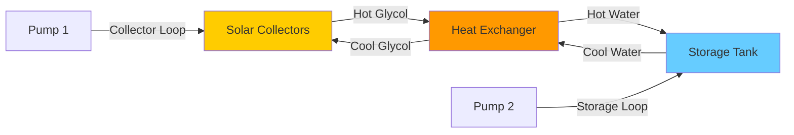

# Heat Exchangers for Solar Thermal Systems

Heat exchangers in solar thermal systems serve as the critical interface between the collector loop and the building's heating or cooling distribution system. These devices transfer thermal energy while maintaining hydraulic separation between fluid circuits, enabling freeze protection, corrosion control, and system optimization.

## Heat Transfer Fundamentals

The heat transfer rate in a solar heat exchanger follows the fundamental relationship:

$$Q = UA \cdot \Delta T_{lm}$$

where:
- $Q$ = heat transfer rate (W)
- $U$ = overall heat transfer coefficient (W/m²·K)
- $A$ = heat transfer surface area (m²)
- $\Delta T_{lm}$ = log mean temperature difference (K)

The log mean temperature difference for counterflow arrangements is calculated as:

$$\Delta T_{lm} = \frac{(T_{h,in} - T_{c,out}) - (T_{h,out} - T_{c,in})}{\ln\left(\frac{T_{h,in} - T_{c,out}}{T_{h,out} - T_{c,in}}\right)}$$

## Heat Exchanger Types

### Plate Heat Exchangers

Brazed or gasketed plate heat exchangers dominate solar thermal applications due to their compact design and high effectiveness. The corrugated plate geometry creates turbulent flow at low Reynolds numbers, increasing the convective heat transfer coefficient.

**Advantages:**
- Effectiveness values of 0.85 to 0.95
- Compact footprint (10-20% of shell-and-tube equivalent)
- Easy capacity adjustment by adding plates
- High turbulence minimizes fouling

**Limitations:**
- Pressure limitations (typically 30 bar maximum for brazed units)
- Temperature constraints (150-200°C maximum depending on gasket material)
- Higher pressure drop than shell-and-tube designs

### Shell-and-Tube Heat Exchangers

Shell-and-tube configurations provide robustness for high-pressure or high-temperature solar applications, particularly in concentrating solar thermal systems.

**Design considerations:**
- Tube-side fluid selection: place scaling fluid on tube side for easier cleaning
- Baffle spacing: 0.2 to 1.0 shell diameter for optimal heat transfer
- TEMA standards govern mechanical design

### Coil-in-Tank Heat Exchangers

Immersed coil heat exchangers integrate directly into thermal storage tanks, eliminating external heat exchange equipment.

The natural convection coefficient on the tank side is significantly lower than forced convection in external exchangers:

$$h_{nat} = C \cdot \left(\frac{k}{L}\right) \cdot (Gr \cdot Pr)^n$$

where $Gr$ is the Grashof number and typical values of $h_{nat}$ range from 200-800 W/m²·K compared to 2000-8000 W/m²·K for forced convection.

## Performance Metrics

### Heat Exchanger Effectiveness

Effectiveness quantifies the ratio of actual heat transfer to maximum possible heat transfer:

$$\varepsilon = \frac{Q_{actual}}{Q_{max}} = \frac{C_{min}(T_{out} - T_{in})}{C_{min}(T_{h,in} - T_{c,in})}$$

where $C_{min}$ is the minimum heat capacity rate ($\dot{m} \cdot c_p$) of the two fluids.

The effectiveness-NTU method relates effectiveness to the number of transfer units:

$$NTU = \frac{UA}{C_{min}}$$

For counterflow heat exchangers with equal capacity rates ($C_r = 1$):

$$\varepsilon = \frac{NTU}{1 + NTU}$$

### Approach Temperature

The approach temperature difference quantifies how closely the outlet temperature of the cold fluid approaches the inlet temperature of the hot fluid. Lower approach temperatures indicate better heat exchanger performance but require larger surface areas.

ASHRAE Handbook - HVAC Systems and Equipment recommends approach temperatures of 2-5°C for plate heat exchangers and 5-10°C for shell-and-tube designs in solar applications.

## Heat Exchanger Comparison

| Type | Effectiveness | Pressure Drop | Cost Factor | Typical Applications |
|------|--------------|---------------|-------------|---------------------|
| Brazed Plate | 0.90-0.95 | High | 1.0 | Residential, small commercial |
| Gasketed Plate | 0.85-0.92 | High | 1.3 | Large commercial, easy maintenance |
| Shell-and-Tube | 0.70-0.85 | Low | 1.8 | High temperature, high pressure |
| Coil-in-Tank | 0.60-0.75 | Low | 0.6 | Integrated storage systems |
| Double-Wall | 0.75-0.85 | Medium | 2.5 | Potable water heating |

## Sizing Methodology

### Required Heat Transfer Area

The design process begins with determining the required heat transfer rate based on collector array output:

$$A_{HX} = \frac{Q_{design}}{U \cdot \Delta T_{lm}}$$

The overall heat transfer coefficient $U$ accounts for convective resistances on both sides plus the conductive resistance of the wall:

$$\frac{1}{U} = \frac{1}{h_{hot}} + \frac{t}{k_{wall}} + \frac{1}{h_{cold}}$$

For glycol-water solutions at 50°C with turbulent flow in a plate heat exchanger:
- $h_{hot}$ = 3000-6000 W/m²·K (collector loop side)
- $h_{cold}$ = 3000-6000 W/m²·K (load side)
- $U$ = 1500-3000 W/m²·K (overall)

### Pressure Drop Considerations

Excessive pressure drop in the heat exchanger increases pumping energy and can reduce solar collector efficiency. The total system pressure drop should not exceed 50-70 kPa for typical residential systems.

## Solar Heat Exchanger Configuration

## Fluid Selection and Properties

### Collector Loop Fluids

**Propylene Glycol Solutions (30-50% by volume):**
- Freeze protection to -20°C to -35°C
- Viscosity increases reduce heat transfer coefficient by 15-30%
- Specific heat reduction of 10-15% compared to water
- Requires annual testing and 5-7 year replacement

**Water:**
- Used in drainback systems or freeze-tolerant climates
- Maximum heat transfer performance
- No degradation or replacement requirements

### Heat Transfer Coefficient Correction

The Dittus-Boelter equation for turbulent flow shows viscosity effects:

$$Nu = 0.023 \cdot Re^{0.8} \cdot Pr^{0.3}$$

For 50% propylene glycol at 50°C compared to water:
- Viscosity: 3.5 times higher
- Reynolds number: 3.5 times lower
- Heat transfer coefficient: approximately 60-70% of water value

## Material Selection

### Corrosion Considerations

Solar thermal systems experience stagnation temperatures exceeding 150°C, which accelerates corrosion in heat exchangers. Material compatibility is governed by:

- **Copper alloys:** suitable for glycol solutions with proper inhibitors
- **Stainless steel 316:** required for systems with poor water quality or high chloride content
- **Aluminum:** limited to specialized low-temperature applications

### Freeze Protection

External heat exchangers isolate the collector loop, allowing antifreeze solutions to circulate through collectors while maintaining pure water in storage. This configuration:
- Eliminates potable water contamination concerns
- Enables use of toxic but efficient ethylene glycol in non-potable loops
- Provides overheat protection through pressure relief in isolated collector loop

## Integration with Storage

The heat exchanger penalty factor accounts for the temperature difference across the heat exchanger:

$$F_R = \frac{1}{1 + \frac{F'_R \cdot A_c \cdot U_L}{2 \cdot \varepsilon \cdot \dot{m} \cdot c_p}}$$

where:
- $F'_R$ = collector heat removal factor
- $A_c$ = collector area (m²)
- $U_L$ = collector heat loss coefficient (W/m²·K)
- $\varepsilon$ = heat exchanger effectiveness

A heat exchanger effectiveness below 0.5 can reduce solar system efficiency by 20-30%, making proper sizing critical.

## Control Strategies

Differential temperature controllers activate the collector pump when:

$$T_{collector} > T_{storage} + \Delta T_{on}$$

Typical $\Delta T_{on}$ values range from 5-10°C. The heat exchanger adds thermal resistance that must be overcome, requiring higher collector temperatures before useful energy transfer begins.

## Performance Monitoring

Key performance indicators for solar heat exchangers include:

1. **Approach temperature:** monitored continuously to detect fouling
2. **Pressure drop:** increases indicate scaling or debris accumulation
3. **Effectiveness:** calculated from temperature measurements and flow rates

ASHRAE Standard 90.1 requires commissioning verification that heat exchanger performance matches design specifications within 10%.

## Maintenance Requirements

**Annual Inspection:**
- Glycol concentration and pH testing
- Pressure drop measurement across heat exchanger
- Visual inspection for leaks or corrosion

**5-Year Service:**
- Glycol replacement in collector loop
- Heat exchanger cleaning if fouling detected
- Gasket replacement (gasketed plate units)

Proper maintenance preserves heat exchanger effectiveness above 0.85 for the 20-25 year system lifetime, ensuring optimal solar thermal system performance.
