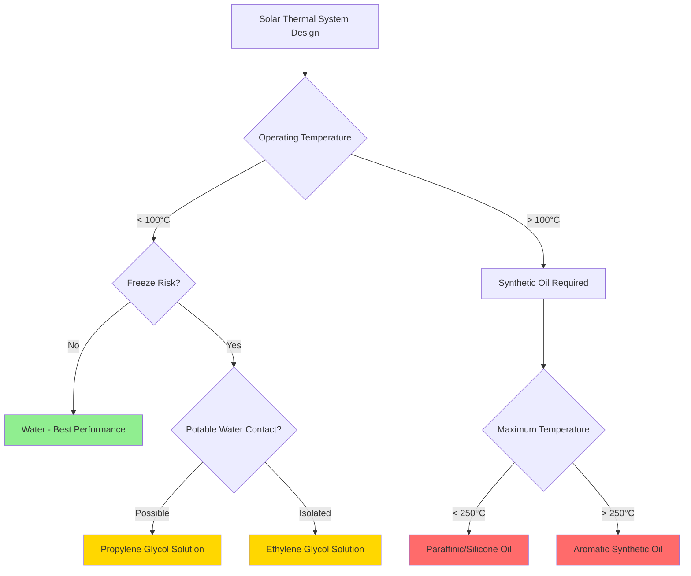

## Introduction

Heat transfer fluids (HTFs) serve as the medium for transporting thermal energy from solar collectors to storage tanks or heat exchangers in solar thermal systems. The selection of an appropriate HTF directly impacts system efficiency, freeze protection capability, operating temperature range, and maintenance requirements. This analysis examines the thermophysical properties, performance characteristics, and selection criteria for HTFs in solar thermal HVAC applications.

## Fundamental Heat Transfer Fluid Properties

### Thermal Performance Parameters

The effectiveness of an HTF depends on several thermophysical properties that govern heat transfer and pumping power requirements.

**Heat capacity** determines the energy transported per unit mass:

$$Q = \dot{m} \cdot c_p \cdot \Delta T$$

Where:
- Q = heat transfer rate (W)
- $\dot{m}$ = mass flow rate (kg/s)
- $c_p$ = specific heat capacity (J/kg·K)
- ΔT = temperature difference (K)

**Thermal conductivity** influences convective heat transfer coefficients:

$$h = \frac{Nu \cdot k}{D_h}$$

Where:
- h = convective heat transfer coefficient (W/m²·K)
- Nu = Nusselt number (dimensionless)
- k = thermal conductivity (W/m·K)
- $D_h$ = hydraulic diameter (m)

**Viscosity** determines pumping power and flow regime characteristics. The Reynolds number defines the transition between laminar and turbulent flow:

$$Re = \frac{\rho \cdot v \cdot D_h}{\mu}$$

Where:
- Re = Reynolds number (dimensionless)
- ρ = fluid density (kg/m³)
- v = flow velocity (m/s)
- μ = dynamic viscosity (Pa·s)

## Common Heat Transfer Fluids

### Water

Pure water provides excellent thermal properties for solar thermal systems in freeze-free climates:

| Property | Value (20°C) | Units |
|----------|--------------|-------|
| Specific heat | 4,186 | J/kg·K |
| Thermal conductivity | 0.598 | W/m·K |
| Density | 998 | kg/m³ |
| Dynamic viscosity | 0.001 | Pa·s |
| Operating range | 0 to 100 | °C |

Water offers the highest specific heat capacity and lowest cost but requires freeze protection in cold climates. ASHRAE Standard 90.1 requires freeze protection for systems exposed to ambient temperatures below 4°C (40°F).

### Propylene Glycol Solutions

Propylene glycol (PG) mixed with water provides freeze protection while maintaining acceptable thermal performance. The mixture concentration determines the freeze point:

| PG Concentration | Freeze Point | Burst Protection | $c_p$ (20°C) | Viscosity Ratio |
|------------------|--------------|------------------|--------------|-----------------|
| 20% by volume | -7°C (19°F) | -4°C (25°F) | 4,050 J/kg·K | 1.8× |
| 30% by volume | -13°C (9°F) | -9°C (16°F) | 3,950 J/kg·K | 2.4× |
| 40% by volume | -21°C (-6°F) | -15°C (5°F) | 3,850 J/kg·K | 3.5× |
| 50% by volume | -33°C (-27°F) | -23°C (-9°F) | 3,700 J/kg·K | 5.8× |

Propylene glycol is non-toxic, making it suitable for systems with potential potable water contamination. The reduced specific heat and increased viscosity require larger pumps and heat exchangers compared to water systems.

### Ethylene Glycol Solutions

Ethylene glycol (EG) offers superior freeze protection and lower viscosity than propylene glycol at equivalent concentrations:

| EG Concentration | Freeze Point | $c_p$ (20°C) | Viscosity Ratio |
|------------------|--------------|--------------|-----------------|
| 30% by volume | -14°C (7°F) | 3,900 J/kg·K | 2.0× |
| 40% by volume | -23°C (-9°F) | 3,750 J/kg·K | 2.8× |
| 50% by volume | -37°C (-35°F) | 3,600 J/kg·K | 4.2× |

Ethylene glycol provides better heat transfer characteristics but is toxic, requiring double-wall heat exchangers when used in systems connected to potable water circuits per ASHRAE Standard 90.2.

### Synthetic Thermal Oils

High-temperature solar thermal systems operating above 120°C require synthetic oils with extended thermal stability:

| Fluid Type | Temperature Range | $c_p$ (100°C) | Thermal Stability |
|------------|-------------------|---------------|-------------------|
| Paraffinic oil | -10 to 300°C | 2,200 J/kg·K | Good |
| Aromatic oil | 0 to 350°C | 2,100 J/kg·K | Excellent |
| Silicone fluid | -40 to 250°C | 1,900 J/kg·K | Outstanding |

These fluids enable higher collector operating temperatures but require specialized system components and handling procedures due to flammability concerns.

## Fluid Selection Criteria

### System Design Impact

The HTF selection affects multiple system parameters:

**Pump sizing:** Higher viscosity fluids require increased pumping power. The pressure drop in piping follows the Darcy-Weisbach equation:

$$\Delta P = f \cdot \frac{L}{D_h} \cdot \frac{\rho \cdot v^2}{2}$$

Where f increases with fluid viscosity in laminar and transitional flow regimes.

**Heat exchanger sizing:** Reduced thermal conductivity and specific heat require larger heat transfer surface areas to maintain equivalent performance.

**Expansion tank sizing:** Glycol solutions exhibit greater thermal expansion coefficients than water, requiring larger expansion vessels.

**Corrosion inhibitors:** All glycol solutions require inhibitor packages to prevent corrosion of system metals. ASHRAE Standard 147 specifies testing protocols for corrosion inhibitor effectiveness.

## Fluid Degradation and Maintenance

### Thermal Degradation

Extended exposure to elevated temperatures causes HTF breakdown. Glycol oxidation produces organic acids that reduce pH and accelerate corrosion:

- Maximum recommended operating temperature: 120°C for PG, 135°C for EG
- Stagnation temperatures in evacuated tube collectors can exceed 200°C
- Overheat protection controls are essential to prevent fluid degradation

### Monitoring Requirements

Regular fluid testing maintains system performance:

| Parameter | Test Frequency | Action Threshold |
|-----------|----------------|------------------|
| pH | Annually | < 7.0 |
| Reserve alkalinity | Annually | < 50% of initial |
| Specific gravity | Annually | ±5% of target |
| Visual inspection | Annually | Discoloration/sediment |

Fluid replacement is required when pH drops below acceptable limits or reserve alkalinity depletes, typically every 5-10 years depending on operating conditions.

## Conclusion

Heat transfer fluid selection significantly influences solar thermal system performance, maintenance requirements, and lifecycle costs. Water provides optimal thermal properties where freeze protection is unnecessary. Propylene glycol solutions offer the best balance of freeze protection, safety, and performance for most HVAC applications in freezing climates. Ethylene glycol delivers superior heat transfer characteristics in isolated systems. High-temperature applications above 120°C require synthetic oils with appropriate thermal stability. Proper fluid selection, system design integration, and maintenance protocols ensure reliable long-term operation of solar thermal HVAC systems.
