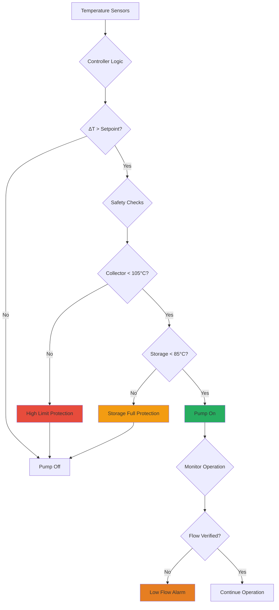

Circulation pumps and control systems represent critical components in active solar thermal systems, directly affecting system efficiency, reliability, and parasitic energy consumption. Proper pump sizing and control strategy implementation determine whether collected solar energy exceeds the electrical energy required for fluid circulation.

## Fundamental Operating Principles

Solar thermal circulation systems operate on temperature differential control. The controller activates the circulation pump when the collector temperature exceeds the storage temperature by a predetermined setpoint, typically 5-10°C. This ensures that circulating fluid adds net thermal energy to storage rather than extracting heat during unfavorable conditions.

The basic control logic follows:

$$\Delta T_{on} = T_{collector} - T_{storage} \geq \Delta T_{set,on}$$

$$\Delta T_{off} = T_{collector} - T_{storage} \leq \Delta T_{set,off}$$

Where:
- $T_{collector}$ = temperature at collector outlet or absorber plate (°C)
- $T_{storage}$ = temperature in solar storage tank (°C)
- $\Delta T_{set,on}$ = differential to start pump (typically 7-10°C)
- $\Delta T_{set,off}$ = differential to stop pump (typically 3-5°C)

The hysteresis between on and off setpoints prevents short-cycling, which accelerates pump wear and increases parasitic energy consumption.

## Pump Sizing Methodology

Proper pump selection requires calculating the total system head and determining the optimal flow rate based on collector area and type.

### Flow Rate Requirements

ASHRAE 90.1 and manufacturer specifications provide flow rate guidelines:

**For flat plate collectors:**

$$\dot{m} = 0.015 \text{ to } 0.020 \frac{\text{kg}}{\text{s} \cdot \text{m}^2} \times A_c$$

**For evacuated tube collectors:**

$$\dot{m} = 0.010 \text{ to } 0.015 \frac{\text{kg}}{\text{s} \cdot \text{m}^2} \times A_c$$

Where $A_c$ = gross collector area (m²)

Higher flow rates improve heat transfer but increase pumping energy. The optimal flow rate maximizes the ratio of thermal energy collected to parasitic pumping energy.

### System Head Calculation

Total dynamic head comprises static elevation, friction losses, and component pressure drops:

$$H_{total} = H_{static} + H_{friction} + H_{components}$$

**Static Head:**
The vertical distance from pump centerline to highest point in collector array plus the vertical return distance.

**Friction Losses:**
Darcy-Weisbach equation applies for turbulent flow (Re > 4000):

$$H_f = f \frac{L}{D} \frac{v^2}{2g}$$

Where:
- $f$ = friction factor (0.02-0.04 for copper tube)
- $L$ = pipe length (m)
- $D$ = inside diameter (m)
- $v$ = fluid velocity (m/s)
- $g$ = gravitational acceleration (9.81 m/s²)

For glycol solutions, viscosity increases significantly at low temperatures. The Reynolds number determines flow regime:

$$Re = \frac{\rho v D}{\mu}$$

At 0°C, 40% propylene glycol exhibits viscosity approximately 2.5 times that of water, increasing friction losses proportionally in laminar flow conditions.

**Component Pressure Drops:**

| Component | Pressure Drop (kPa) |
|-----------|---------------------|
| Flat plate collector | 3-8 per unit |
| Evacuated tube collector | 2-5 per unit |
| Heat exchanger (plate) | 10-35 |
| Strainer | 3-7 |
| Check valve | 5-12 |
| Flow meter | 5-15 |
| Balancing valve | 8-20 |

### Pump Power Calculation

The theoretical hydraulic power requirement:

$$P_{hydraulic} = \frac{\dot{m} \times g \times H_{total}}{\rho}$$

Accounting for pump efficiency:

$$P_{electric} = \frac{P_{hydraulic}}{\eta_{pump}} = \frac{\dot{m} \times g \times H_{total}}{\rho \times \eta_{pump}}$$

Where $\eta_{pump}$ ranges from 0.25-0.45 for small circulators to 0.60-0.75 for larger multi-stage pumps.

## Pump Types and Selection

### Wet Rotor Circulators

Integrated pump-motor units where the rotor operates immersed in the heat transfer fluid. These dominate residential and light commercial solar applications due to compact size, quiet operation, and ability to handle glycol solutions.

**Characteristics:**
- Power range: 20-200 W
- Head capability: 2-8 m
- Flow rates: 5-80 L/min
- Efficiency: 15-35% at design point
- Suitable for systems up to 20 m² collector area

**Temperature Limits:**
Standard wet rotor pumps tolerate continuous fluid temperatures to 110°C. High-temperature versions rated to 130°C serve pressurized systems where stagnation protection relies on expansion volume rather than boil-off.

### Three-Speed Circulators

Traditional circulators offer three fixed speed settings selected via mechanical switch or electrical input. While simple and robust, these provide minimal efficiency optimization across varying solar conditions.

### Variable Speed (ECM) Pumps

Electronically commutated motor pumps adjust speed continuously to maintain constant differential pressure or proportional pressure control. Advanced models incorporate automatic adaptation algorithms that optimize operating point based on system characteristics.

**Performance Comparison:**

| Pump Type | Efficiency Range | Annual Energy | Control Flexibility |
|-----------|-----------------|---------------|---------------------|
| Single speed | 15-30% | 180-350 kWh/yr | None |
| Three speed | 18-32% | 120-280 kWh/yr | Manual/seasonal |
| Variable ECM | 25-45% | 60-140 kWh/yr | Continuous automatic |

For a typical 10 m² residential system, upgrading from single-speed to variable-speed circulation reduces parasitic energy by 100-200 kWh annually, improving the effective solar coefficient of performance (SCOP).

### Photovoltaic-Direct Pumps

DC brushless pumps powered directly by dedicated photovoltaic panels eliminate controller requirements and grid connection. PV output naturally correlates with solar thermal availability—pump speed increases with solar intensity.

**Design Considerations:**

$$P_{PV} \geq \frac{P_{pump,rated}}{\eta_{MPPT}} \times SF$$

Where:
- $P_{PV}$ = PV panel peak power (W)
- $P_{pump,rated}$ = pump power at design flow (W)
- $\eta_{MPPT}$ = maximum power point tracking efficiency (0.92-0.97)
- $SF$ = safety factor (1.2-1.5) for off-peak operation

PV-direct systems eliminate standby controller consumption (3-8 W continuous) and provide inherent power outage resilience. However, they require careful matching of PV voltage to pump motor characteristics.

## Differential Controllers

The differential temperature controller serves as the system brain, processing sensor inputs and controlling pump operation, valve positioning, and safety functions.

### Sensor Placement

**Collector Sensor:**
Mount at the hottest point in collector array—typically outlet header or absorber plate pocket. For multi-row arrays, place sensor at the outlet of the row receiving maximum solar exposure. Avoid locations affected by stagnant fluid pockets or conductive heat transfer from mounting hardware.

**Storage Sensor:**
Position at lower third of storage tank where return fluid enters. This location responds to actual stored energy rather than stratified hot upper layer, preventing premature pump shutdown when useful heat remains collectible.

**Additional Sensors:**
- High-limit collector sensor: Shuts down circulation at 95-105°C to prevent fluid degradation
- Freeze protection sensor: Activates circulation during near-freezing conditions (drainback systems)
- Outdoor ambient sensor: Enables freeze protection strategies and predictive algorithms

### Control Algorithms

**Basic Differential Control:**
Simple on/off operation based on fixed temperature differentials. Suitable for systems without significant thermal mass between collector and storage.

**Proportional Speed Control:**
Variable speed pumps modulate flow rate proportional to temperature differential:

$$\text{Speed}(\%) = K_p \times (\Delta T - \Delta T_{set})$$

Where $K_p$ = proportional gain (typically 5-10%/°C)

Higher differentials indicate strong solar conditions warranting increased flow. This strategy maximizes instantaneous efficiency by operating collectors near optimal temperature rise.

**Adaptive Algorithms:**
Advanced controllers incorporate learning algorithms that adjust setpoints based on historical performance, weather forecasting integration, and load prediction. These can improve annual solar fraction by 3-7% compared to fixed setpoint control.

### Safety and Protection Features

Modern controllers integrate multiple protection layers:

**Critical Protection Functions:**

1. **High-Limit Cutoff** - Prevents fluid degradation and overpressure by stopping circulation when collector exceeds maximum rated temperature

2. **Storage Over-Temperature** - Protects against scalding risk and pressure relief activation by preventing heat addition to fully charged storage

3. **Flow Verification** - Monitors actual fluid circulation via flow switch or temperature rate-of-change to detect pump failure or blockage

4. **Freeze Protection** - Activates circulation or drain initiation when collector temperature approaches freezing in drainback systems

5. **Sensor Fault Detection** - Identifies open/short circuit sensor failures and defaults to safe operating mode

## Parasitic Energy Optimization

The parasitic energy ratio quantifies the electrical energy consumed relative to thermal energy delivered:

$$PER = \frac{E_{parasitic}}{Q_{delivered}}$$

Where:
- $E_{parasitic}$ = annual pump and control electricity (kWh)
- $Q_{delivered}$ = annual thermal energy to load (kWh)

Well-designed systems achieve PER < 0.02 (2% parasitic energy). Poor pump sizing or control strategies can exceed PER = 0.10, eliminating economic viability.

**Optimization Strategies:**

| Strategy | PER Reduction | Implementation |
|----------|---------------|----------------|
| Variable speed pumps | 30-50% | Replace fixed-speed circulators |
| Increased ΔT setpoint | 10-20% | Raise from 5°C to 8-10°C |
| Night shutdown relay | 15-25% | Hard cutoff during no-sun hours |
| Photovoltaic-direct | 40-60% | Eliminate AC-powered controller |
| Proper pipe sizing | 10-15% | Minimize friction head loss |

## Integration with Building Automation

Solar thermal controllers integrate with building automation systems via standard protocols:

- **BACnet MS/TP** - Native support in commercial controllers for BMS integration
- **Modbus RTU/TCP** - Common industrial protocol for data exchange
- **0-10 VDC** - Analog speed control for pump modulation
- **Dry contact** - Simple enable/disable signals

Integration enables demand-side management where solar charging prioritizes periods of low building load or high utility rates. Advanced strategies include predictive pre-heating before occupancy and solar thermal-driven absorption chiller operation.

## Standards and Specifications

- **ASHRAE 90.1** Section 6.5.4 - Solar thermal system requirements including pump controls and temperature sensors
- **ASHRAE 191** - Standard for Monitoring Solar Thermal Systems
- **SRCC OG-300** - Solar Rating and Certification Corporation operating guidelines for solar water heating systems
- **Hydraulic Institute Standards** - Pump selection, installation, and efficiency requirements
- **NFPA 70 (NEC)** Article 694 - Electrical requirements for solar thermal equipment

Proper selection and configuration of circulation pumps and controllers ensures that solar thermal systems deliver net positive energy contribution throughout their 20-25 year service life. Success requires matching pump capacity to system hydraulic characteristics while implementing control strategies that activate circulation only when net thermal gain exceeds parasitic consumption.
