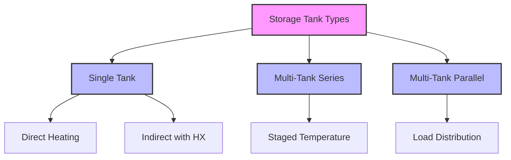
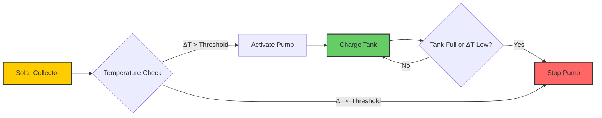

## Overview

Solar thermal storage tanks decouple solar energy collection from building load demands, enabling continuous HVAC operation despite intermittent solar radiation. The storage tank functions as a thermal capacitor, accumulating energy during high-insolation periods and releasing it when collector output falls below load requirements. Tank performance depends critically on thermal stratification, insulation effectiveness, and charge/discharge control strategies.

## Fundamental Heat Transfer Principles

### Energy Balance

The transient energy balance for a storage tank is:

$$\rho V c_p \frac{dT}{dt} = \dot{Q}_{solar} - \dot{Q}_{load} - \dot{Q}_{loss}$$

where $\rho$ = water density (kg/m³), $V$ = tank volume (m³), $c_p$ = specific heat (J/kg·K), $T$ = average tank temperature (K), $\dot{Q}_{solar}$ = collector heat input (W), $\dot{Q}_{load}$ = heat delivery to load (W), and $\dot{Q}_{loss}$ = standby heat loss (W).

### Standby Heat Loss

Heat loss from an insulated storage tank follows:

$$\dot{Q}_{loss} = UA(T_{tank} - T_{ambient})$$

where $U$ = overall heat transfer coefficient (W/m²·K), $A$ = tank surface area (m²). The U-value depends on insulation thickness and thermal conductivity:

$$U = \frac{1}{\frac{1}{h_i} + \frac{t_1}{k_1} + \frac{t_2}{k_2} + \frac{1}{h_o}}$$

with $h_i$ and $h_o$ = interior and exterior convection coefficients (W/m²·K), $t$ = insulation layer thickness (m), $k$ = thermal conductivity (W/m·K).

## Thermal Stratification

### Stratification Dynamics

Thermal stratification—the vertical temperature gradient within the tank—is critical for solar system efficiency. Hot water naturally rises while cold water sinks, creating distinct temperature layers. The degree of stratification is quantified by the stratification number:

$$St = \frac{T_{top} - T_{bottom}}{T_{mean} - T_{ambient}}$$

Values of St > 0.7 indicate strong stratification, while St < 0.3 represents fully mixed conditions.

### Richardson Number

The stability of stratification is characterized by the Richardson number:

$$Ri = \frac{g \beta \Delta T H}{v^2}$$

where $g$ = gravitational acceleration (9.81 m/s²), $\beta$ = thermal expansion coefficient (1/K), $\Delta T$ = temperature difference (K), $H$ = tank height (m), $v$ = characteristic velocity (m/s). Ri > 1 indicates stable stratification.

## Tank Sizing Methodology

### Volume Calculation

ASHRAE 90.1 and ASHRAE Applications Handbook provide sizing guidance. The minimum storage volume is:

$$V = \frac{Q_{daily} \times D}{c_p \rho \Delta T_{usable}}$$

where $Q_{daily}$ = daily energy demand (J), $D$ = days of storage, $\Delta T_{usable}$ = usable temperature difference (K).

For residential solar water heating, typical sizing is 50-75 liters per square meter of collector area. For commercial systems, 25-50 liters per m² is common due to more consistent load profiles.

### Aspect Ratio

Height-to-diameter ratio affects stratification. Optimal ratios range from 2:1 to 4:1. Tall, slender tanks promote stratification but increase pumping pressure drop. The relationship between aspect ratio (AR) and stratification efficiency ($\eta_{strat}$) is empirically:

$$\eta_{strat} = 1 - e^{-0.3 \times AR}$$

## Tank Configuration Types

### Comparison of Tank Types

| Configuration | Stratification Quality | Space Requirements | First Cost | Complexity | Application |
|---------------|------------------------|-------------------|------------|------------|-------------|
| Single vertical tank | Good to excellent | Moderate | Low | Low | Residential, small commercial |
| Multiple tanks in series | Excellent | High | Moderate | Moderate | Large systems with varying loads |
| Tank with internal HX | Good | Low | Moderate | Low | Closed-loop antifreeze systems |
| Pressurized tank | Moderate | Low | High | Moderate | High-rise buildings |
| Atmospheric tank | Excellent | High | Low | Low | Large commercial systems |

## Design Features for Enhanced Performance

### Inlet/Outlet Configuration

Proper port placement is essential for maintaining stratification:

- **Solar inlet**: Located 75-85% of tank height for closed-loop systems
- **Solar return**: Bottom connection with diffuser
- **Load supply**: Top 90-95% of tank height
- **Load return**: Lower third with stratification device

### Stratification Devices

Multiple technologies enhance or preserve stratification:

- **Diffusers**: Reduce inlet jet velocity to prevent mixing
- **Fabric stratifiers**: Flexible membranes that create physical separation
- **Baffles**: Horizontal plates that impede vertical flow
- **Inlet pipes with perforations**: Distribute flow evenly

The effectiveness of a diffuser is characterized by its mixing factor:

$$MF = \frac{\Delta T_{actual}}{\Delta T_{ideal}}$$

Values approaching 1.0 indicate minimal mixing.

## Insulation Requirements

### Heat Loss Analysis

ASHRAE Standard 90.1 mandates minimum R-values for storage tanks. For solar applications, higher insulation levels are economically justified. The payback period for additional insulation is:

$$PBP = \frac{C_{insulation}}{\Delta Q_{loss} \times \eta_{sys} \times C_{energy} \times H_{annual}}$$

where $C_{insulation}$ = incremental insulation cost, $\Delta Q_{loss}$ = reduction in heat loss rate, $\eta_{sys}$ = system efficiency, $C_{energy}$ = energy cost, $H_{annual}$ = annual operating hours.

### Recommended R-Values

| Tank Volume (L) | Climate Zone | Minimum R-Value (m²·K/W) | Typical Insulation Thickness (mm) |
|-----------------|--------------|--------------------------|-----------------------------------|
| < 500 | All | 2.1 | 75-100 |
| 500-2000 | Heating dominant | 2.6 | 100-125 |
| 500-2000 | Moderate | 2.1 | 75-100 |
| > 2000 | Heating dominant | 3.5 | 125-150 |
| > 2000 | Moderate | 2.6 | 100-125 |

## Material Selection

### Tank Construction

Material selection balances corrosion resistance, thermal expansion, and cost:

- **Glass-lined steel**: Excellent corrosion resistance, requires anode replacement
- **Stainless steel**: Long life, high cost, suitable for high-temperature applications
- **Polymer-lined steel**: Good corrosion protection, temperature limited to 90°C
- **Concrete**: Very large volumes (>10,000 L), requires liner

### Corrosion Protection

Solar storage tanks operate at elevated temperatures that accelerate corrosion. Protection methods include:

- Sacrificial anode rods (magnesium or aluminum)
- Impressed current cathodic protection
- Corrosion inhibitors in system fluid
- pH control (maintain 7.5-8.5)

## Integration with Solar Collectors

### Temperature Control

Collector outlet temperature must be controlled to prevent overheating:

$$T_{col,out} = T_{tank,top} + \frac{\dot{Q}_{col}}{\dot{m} c_p}$$

When $T_{col,out}$ exceeds design limits (typically 95-110°C for glycol systems), flow modulation or heat rejection is required.

### Charging Strategies

The differential temperature controller activates circulation when:

$$\Delta T = T_{collector} - T_{tank,low} > \Delta T_{on}$$

Typical $\Delta T_{on}$ = 8-10°C, $\Delta T_{off}$ = 3-5°C.

## Performance Metrics

### Storage Efficiency

The overall storage efficiency over a charging/discharging cycle is:

$$\eta_{storage} = \frac{Q_{delivered}}{Q_{stored}} = 1 - \frac{\int \dot{Q}_{loss} dt}{Q_{stored}}$$

Well-designed tanks achieve $\eta_{storage}$ = 0.85-0.95 over 24-hour cycles.

### Exergy Analysis

The exergy (available work) stored in a tank at temperature T is:

$$Ex = mc_p\left[(T - T_0) - T_0\ln\frac{T}{T_0}\right]$$

where $T_0$ = ambient temperature (K). This metric accounts for the quality of stored energy, not just quantity.

## Maintenance and Monitoring

Critical monitoring points include:

- Temperature sensors at multiple heights (minimum 3 locations)
- Pressure relief valve testing (annually)
- Anode rod inspection (annually for glass-lined tanks)
- Sediment flushing (annually or semi-annually)
- Insulation integrity (visual inspection annually)

Temperature sensor placement at 10%, 50%, and 90% of tank height enables stratification monitoring and fault detection.

## Standards and Code Requirements

- **ASHRAE 90.1**: Energy efficiency requirements for thermal storage
- **ASHRAE 62.1**: Legionella control for domestic hot water storage
- **ASME Section VIII**: Pressure vessel design for pressurized tanks
- **NSF/ANSI 61**: Potable water contact materials
- **SRCC OG-300**: Solar thermal system certification

Tanks storing water above 60°C require Legionella mitigation through periodic pasteurization cycles or continuous recirculation.

---

*This content reflects established engineering principles for solar thermal storage tank design and operation as documented in ASHRAE handbooks and industry standards.*