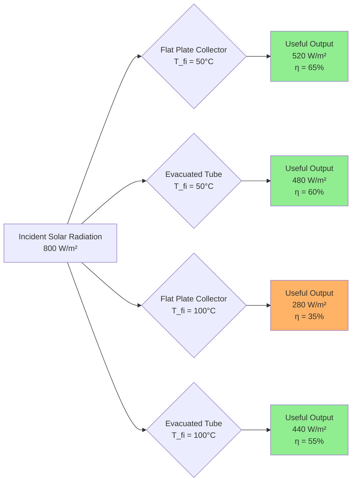

Solar thermal collectors convert incident solar radiation into thermal energy for HVAC applications including space heating, domestic hot water, absorption cooling, and process heating. The fundamental challenge in collector design involves maximizing solar energy absorption while minimizing thermal losses to the environment.

## Collector Classification

Solar thermal collectors are classified by concentration ratio, operating temperature range, and tracking requirements:

| Collector Type | Concentration Ratio | Operating Temp (°C) | Tracking Required |
|----------------|---------------------|---------------------|-------------------|
| Flat plate | 1 | 30-80 | No |
| Evacuated tube | 1 | 50-150 | No |
| Compound parabolic (CPC) | 1.5-5 | 60-180 | Optional |
| Parabolic trough | 15-45 | 150-400 | Single-axis |
| Parabolic dish | 100-1000 | 400-1500 | Two-axis |
| Central receiver | 300-1500 | 500-1200 | Two-axis |

HVAC applications predominantly utilize non-concentrating collectors (flat plate and evacuated tube) due to their ability to capture diffuse radiation, eliminate tracking mechanisms, and operate effectively in diverse climates.

## Fundamental Energy Balance

The thermal performance of any solar collector follows the energy balance equation:

$$Q_u = A_c [G_T (\tau\alpha) - U_L(T_c - T_a)]$$

Where:
- $Q_u$ = useful energy gain (W)
- $A_c$ = collector gross area (m²)
- $G_T$ = total solar irradiance on collector plane (W/m²)
- $\tau\alpha$ = transmittance-absorptance product
- $U_L$ = overall heat loss coefficient (W/m²·K)
- $T_c$ = average collector temperature (°C)
- $T_a$ = ambient air temperature (°C)

The term $G_T(\tau\alpha)$ represents absorbed solar energy, while $U_L(T_c - T_a)$ quantifies thermal losses through conduction, convection, and radiation.

## Optical Properties

The optical efficiency of a solar collector depends on the interaction between incident radiation and collector materials through transmission, absorption, and reflection processes.

**Glazing Transmittance:**
Solar radiation must penetrate the glazing material before reaching the absorber. Low-iron tempered glass achieves transmittance values:

$$\tau = \tau_r \cdot \tau_a \cdot \tau_d$$

Where:
- $\tau_r$ = transmittance accounting for reflection losses (≈ 0.92 for single glazing)
- $\tau_a$ = transmittance accounting for absorption in glass (≈ 0.98)
- $\tau_d$ = transmittance accounting for scattering and defects (≈ 0.99)

Typical single-glazed systems achieve $\tau$ = 0.90, while double-glazed configurations reduce to $\tau$ = 0.82 due to additional reflection and absorption losses.

**Absorber Absorptance:**
The absorber plate coating determines the fraction of incident radiation converted to thermal energy. Selective coatings maximize solar absorptance ($\alpha$) in the visible spectrum (0.3-0.7 μm) while minimizing thermal emittance ($\varepsilon$) in the infrared spectrum (>2.5 μm).

Common selective coating technologies include:

| Coating Type | Absorptance (α) | Emittance (ε) | α/ε Ratio | Stability Temp (°C) |
|--------------|-----------------|---------------|-----------|---------------------|
| Black paint | 0.95 | 0.90 | 1.06 | 100 |
| Black chrome | 0.95 | 0.10 | 9.5 | 250 |
| Black nickel | 0.93 | 0.08 | 11.6 | 200 |
| Cermet (Al-N) | 0.96 | 0.05 | 19.2 | 400 |
| TiNOₓ | 0.95 | 0.04 | 23.8 | 450 |

The effective transmittance-absorptance product accounts for multiple reflections between glazing and absorber:

$$(\tau\alpha) = \frac{\tau \alpha}{1-(1-\alpha)\rho_d}$$

Where $\rho_d$ is the diffuse reflectance of the glazing (≈ 0.16 for glass).

## Heat Loss Mechanisms

Thermal losses from the collector to the environment occur through three distinct mechanisms operating in parallel.

**Top Loss (Convection and Radiation):**
The top loss coefficient combines convective heat transfer to ambient air and radiative exchange with the sky:

$$U_t = \left[\frac{1}{h_c + h_r}\right]^{-1}$$

Convective heat transfer coefficient varies with wind speed:

$$h_c = 5.7 + 3.8V_w$$

Where $V_w$ = wind speed (m/s).

Radiative heat transfer between absorber and glazing follows:

$$h_r = \varepsilon \sigma \frac{(T_p^2 + T_g^2)(T_p + T_g)}{(1/\varepsilon_p + 1/\varepsilon_g - 1)}$$

Where:
- $\varepsilon_p$ = absorber emittance
- $\varepsilon_g$ = glazing emittance (≈ 0.88 for glass)
- $\sigma$ = Stefan-Boltzmann constant (5.67×10⁻⁸ W/m²·K⁴)
- $T_p$, $T_g$ = absorber and glazing absolute temperatures (K)

**Bottom and Edge Losses:**
Conductive losses through insulation are calculated from:

$$U_b = \frac{k}{L}$$

Where $k$ = thermal conductivity of insulation (W/m·K) and $L$ = insulation thickness (m). Standard designs employ 50-100 mm of mineral wool ($k$ ≈ 0.04 W/m·K) or polyurethane foam ($k$ ≈ 0.025 W/m·K), yielding $U_b$ = 0.4-0.8 W/m²·K.

The overall loss coefficient combines components:

$$U_L = U_t + U_b + U_e$$

Typical values for flat plate collectors: $U_L$ = 3.5-5.0 W/m²·K.

## Collector Efficiency

ASHRAE Standard 93 defines the instantaneous thermal efficiency as the ratio of useful energy gain to incident solar radiation:

$$\eta = \frac{Q_u}{A_c G_T} = F_R(\tau\alpha) - F_R U_L \frac{T_{fi} - T_a}{G_T}$$

The heat removal factor ($F_R$) accounts for the temperature rise of the heat transfer fluid and non-ideal heat transfer from absorber to fluid:

$$F_R = \frac{\dot{m} c_p}{A_c U_L}\left[1 - \exp\left(-\frac{A_c U_L F'}{\dot{m} c_p}\right)\right]$$

Where:
- $\dot{m}$ = mass flow rate (kg/s)
- $c_p$ = specific heat of fluid (J/kg·K)
- $F'$ = collector efficiency factor

The efficiency equation is linear in the reduced temperature variable:

$$T^* = \frac{T_{fi} - T_a}{G_T}$$

Plotting efficiency versus $T^*$ yields a straight line with:
- Y-intercept = $F_R(\tau\alpha)$ (optical efficiency)
- Slope = $-F_R U_L$ (heat loss coefficient)

**Performance Comparison at G_T = 800 W/m², T_a = 20°C:**

At low operating temperatures ($T^*$ < 0.05), flat plate collectors achieve comparable or superior efficiency to evacuated tubes. At elevated temperatures ($T^*$ > 0.10), evacuated tubes maintain significantly higher efficiency due to reduced convective losses.

## Flat Plate Collector Design

Flat plate collectors consist of a dark absorber plate with integral or attached flow passages, transparent glazing, and insulated enclosure. The absorber geometry significantly impacts thermal and hydraulic performance.

**Flow Configuration Options:**

1. **Tube-and-sheet**: Copper tubes bonded to aluminum or copper sheet
2. **Tube-in-strip**: Flow passages formed by roll-bonding metal strips
3. **Serpentine**: Single continuous tube following zigzag pattern
4. **Parallel flow**: Multiple risers connected to inlet/outlet headers

The fin efficiency relates heat transfer from the absorber sheet to the fluid tubes:

$$F = \frac{\tanh[m(W/2)]}{m(W/2)}$$

Where:
- $W$ = spacing between tubes (m)
- $m = \sqrt{U_L/(k_p \delta)}$
- $k_p$ = absorber thermal conductivity (W/m·K)
- $\delta$ = absorber thickness (m)

For copper absorbers ($k_p$ = 385 W/m·K, $\delta$ = 0.5 mm, $W$ = 120 mm), fin efficiency exceeds 0.95, ensuring effective heat collection across the entire plate area.

## Incidence Angle Modifier

The optical properties of glazing and absorber vary with solar incidence angle. The incidence angle modifier (IAM) quantifies efficiency degradation at non-normal incidence:

$$K_{\tau\alpha}(\theta) = \frac{(\tau\alpha)_\theta}{(\tau\alpha)_n}$$

Where $\theta$ = angle between solar beam and collector normal.

ASHRAE 93 testing determines IAM at incidence angles of 30°, 45°, and 60°. A common empirical relationship:

$$K_{\tau\alpha}(\theta) = 1 - b_0\left(\frac{1}{\cos\theta} - 1\right)$$

Typical values: $b_0$ = 0.10-0.15 for single-glazed flat plates, $b_0$ = 0.05-0.08 for evacuated tubes with cylindrical absorbers.

## Testing and Certification

ASHRAE Standard 93-2010 specifies test procedures for determining thermal performance. Testing occurs under controlled conditions:

- Solar irradiance: 800-1000 W/m² on collector plane
- Incidence angle: <30° during efficiency testing
- Wind speed: 2.2-4.5 m/s
- Ambient temperature: Varied to achieve range of $(T_{fi} - T_a)$

The Solar Rating and Certification Corporation (SRCC) administers OG-100 certification, requiring:
- Performance testing per ASHRAE 93
- Durability testing (thermal cycling, rain penetration, impact resistance)
- Materials evaluation
- Quality assurance inspection

SRCC ratings provide standardized performance data at specified operating conditions, enabling comparison across manufacturers.

## Collector Selection Criteria

Selection of collector type depends on application requirements and local climate conditions:

**Flat Plate Collectors Preferred When:**
- Operating temperatures < 70°C (domestic hot water, pool heating)
- High proportion of diffuse radiation (cloudy climates)
- Low-cost solutions required ($200-400/m²)
- Simple installation and maintenance priorities
- Roof-mounted residential applications

**Evacuated Tube Collectors Preferred When:**
- Operating temperatures > 80°C (absorption cooling, process heat)
- Cold ambient temperatures with heating loads
- Limited roof area requires maximum output per m²
- Snow accumulation problematic for flat surfaces
- Higher capital investment acceptable ($400-700/m²)

**Decision Matrix:**

| Parameter | Flat Plate Advantage | Evacuated Tube Advantage |
|-----------|----------------------|--------------------------|
| Cost per m² | ✓ | |
| Low temp efficiency | ✓ | |
| High temp efficiency | | ✓ |
| Cold climate | | ✓ |
| Diffuse radiation | ✓ | |
| Wind resistance | | ✓ |
| Snow shedding | | ✓ |
| Overheating protection | ✓ | |
| Replacement costs | ✓ | |

## Integration Considerations

Effective integration of solar collectors into HVAC systems requires attention to hydraulic, thermal, and control design:

**Flow Rate Selection:**
Optimal flow rate balances high heat removal (high flow) against pumping energy (low flow). Standard practice: 0.015-0.020 kg/s per m² collector area.

**Heat Transfer Fluid:**
- Water: Lowest cost, best thermal properties, requires freeze protection
- Propylene glycol (30-50%): Freeze protection to -30°C, reduced heat transfer
- Ethylene glycol: Superior thermal performance, toxic, avoid in potable systems

**Pressure Drop:**
Total pressure drop through collector array must not exceed pump capacity. Series-connected collectors accumulate pressure drop linearly; parallel arrays reduce per-branch flow but complicate balancing.

**Stagnation Protection:**
During power outage or low load conditions, collectors reach stagnation temperature (150-250°C). Systems require:
- Pressure relief valves rated for stagnation conditions
- Expansion tanks sized for complete fluid vaporization scenario
- High-temperature piping materials and fittings
- Glycol formulations stable at maximum temperature

ASHRAE Standard 90.1 requires overheat protection for all solar thermal systems exceeding 6 m² collector area.

## Standards and References

- **ASHRAE 93-2010**: Methods of Testing to Determine the Thermal Performance of Solar Collectors
- **ASHRAE 90.1-2019**: Energy Standard for Buildings Except Low-Rise Residential Buildings
- **ASHRAE 191-2020**: Standard for Monitoring Solar Thermal Systems
- **ISO 9806**: Solar Energy — Solar Thermal Collectors — Test Methods
- **SRCC OG-100**: Operating Guidelines and Minimum Standards for Certifying Solar Collectors

Solar thermal collectors provide proven technology for reducing fossil fuel consumption in HVAC applications. Successful implementation requires understanding the physics governing optical efficiency and thermal losses, proper selection based on operating temperature requirements, and integration design addressing freeze protection, overheating, and controls.
