## Concentration Principles

Concentrating solar thermal collectors use reflective or refractive optics to focus direct normal irradiance (DNI) onto a small receiver area, achieving flux densities 10-1000 times higher than non-concentrating collectors. This concentration enables operating temperatures from 150°C to over 500°C, suitable for industrial process heat, power generation, and double-effect absorption cooling.

The fundamental concentration ratio quantifies the optical system performance:

$$C = \frac{A_{aperture}}{A_{receiver}}$$

Where:
- C = geometric concentration ratio (dimensionless)
- A_aperture = total reflective/refractive area (m²)
- A_receiver = absorber surface area (m²)

The maximum theoretical concentration follows from the second law of thermodynamics and is limited by the acceptance angle:

$$C_{max} = \frac{1}{\sin^2 \theta_a}$$

For θ_a = 0.27° (solar angular radius), C_max ≈ 46,200 for three-dimensional concentration (point focus) and C_max ≈ 215 for two-dimensional concentration (line focus).

## Parabolic Trough Collectors

Parabolic trough collectors (PTC) represent the most mature concentrating technology for HVAC applications. The parabolic reflector focuses DNI onto an evacuated receiver tube positioned along the focal line.

### Optical Geometry

The parabola geometry follows:

$$y^2 = 4fx$$

Where f is the focal length. The rim angle φ_r defines the parabola depth relative to aperture width:

$$\phi_r = \tan^{-1}\left(\frac{W}{4f}\right)$$

Typical rim angles range from 70° to 90°. The concentration ratio for a parabolic trough:

$$C = \frac{W}{d_{tube} + 2\delta}$$

Where:
- W = aperture width (m)
- d_tube = receiver tube outer diameter (m)
- δ = tracking error allowance (m)

Practical concentration ratios: 15-80 for single-axis tracking PTCs.

### Receiver Tube Construction

```mermaid
graph LR
    subgraph "PTC Receiver Tube Cross-Section"
        A[Selective Coating<br/>α > 0.95, ε < 0.10] --> B[Steel Absorber Tube<br/>70-100mm OD]
        B --> C[Vacuum Annulus<br/>10⁻⁴ to 10⁻⁵ Pa]
        C --> D[Glass Envelope<br/>115-125mm OD]
        D --> E[Anti-Reflective Coating<br/>τ > 0.96]
    end

    style A fill:#2c3e50
    style B fill:#7f8c8d
    style C fill:#ecf0f1
    style D fill:#3498db
```

The evacuated receiver minimizes convective losses while maintaining structural integrity at operating temperatures of 300-400°C. The selective absorber coating achieves high solar absorptance (α > 0.95) and low thermal emittance (ε < 0.10 at 400°C).

### Thermal Performance

The useful heat gain per unit aperture area:

$$Q_u = A_{ap} [G_{DNI} \eta_o - U_L(T_r - T_a)]$$

Where:
- G_DNI = direct normal irradiance (W/m²)
- η_o = optical efficiency (typically 0.70-0.75)
- U_L = receiver heat loss coefficient (W/m·K per unit length)
- T_r = receiver temperature (K)
- T_a = ambient temperature (K)

The optical efficiency accounts for reflectance losses, glass transmittance, and geometric factors:

$$\eta_o = \rho \tau \gamma \alpha K(\theta)$$

Where:
- ρ = mirror reflectance (0.93-0.95 for silver-backed glass)
- τ = glass envelope transmittance (0.96)
- γ = intercept factor (0.92-0.98)
- α = absorber absorptance (0.95)
- K(θ) = incidence angle modifier

**Typical Performance Parameters:**

| Parameter | Value | Operating Condition |
|-----------|-------|-------------------|
| Peak efficiency | 65-72% | Normal incidence, 300°C |
| Operating temp range | 150-400°C | Heat transfer fluid limit |
| Concentration ratio | 25-80 | Standard designs |
| Thermal loss | 150-350 W/m | At 350°C receiver temp |
| Annual efficiency | 45-55% | Including tracking losses |

### Tracking Systems

Single-axis tracking orients the collector to maintain the sun's position perpendicular to the parabola axis. North-south axis orientation maximizes annual energy collection but experiences cosine losses:

$$G_{effective} = G_{DNI} \cos(\theta_z)$$

Where θ_z is the zenith angle component perpendicular to collector axis.

East-west tracking eliminates seasonal declination effects but reduces summer performance. The optimal orientation depends on latitude and load profile.

## Linear Fresnel Reflectors

Linear Fresnel reflectors (LFR) approximate parabolic concentration using multiple flat or slightly curved mirror segments that track independently to focus on an elevated fixed receiver.

### Cost-Efficiency Trade-off

LFR systems reduce costs through:
- Flat mirror segments (lower manufacturing cost)
- Fixed receiver structure (eliminates flexible hoses)
- Reduced wind loading (closer to ground)
- Simplified tracking mechanism

Performance penalties include:
- Lower concentration ratio (15-40 vs. 25-80 for PTC)
- Cosine losses from flat mirrors
- Blocking and shading between mirror rows

The optical efficiency for LFR:

$$\eta_{o,LFR} = \rho \tau \gamma \alpha \cos(\theta_t) f_{block} f_{shade}$$

Where:
- θ_t = tracking angle for each mirror segment
- f_block = blocking factor (0.85-0.95)
- f_shade = shading factor (0.90-0.98)

Typical LFR optical efficiency: 55-65% compared to 70-75% for PTC.

### Secondary Concentrator

Many LFR designs incorporate a compound parabolic concentrator (CPC) as a secondary reflector around the receiver tube. The CPC increases the effective acceptance angle, reducing tracking precision requirements:

$$\theta_{accept} = \sin^{-1}\left(\frac{1}{C_{secondary}}\right)$$

A secondary concentration ratio of 1.5-2.0 allows ±1° tracking tolerance while maintaining intercept factors above 0.90.

## Parabolic Dish Collectors

Parabolic dish systems achieve the highest concentration ratios (500-3000) through three-dimensional point focus geometry. The two-axis tracking maintains normal incidence throughout the day.

### Concentration Performance

The dish concentration ratio:

$$C = \frac{\pi D^2 / 4}{\pi d_{rec}^2 / 4} = \left(\frac{D}{d_{rec}}\right)^2$$

For a 10m diameter dish with 0.15m receiver diameter:

$$C = \left(\frac{10}{0.15}\right)^2 = 4444$$

This extreme concentration produces receiver temperatures exceeding 800°C, enabling Stirling engine integration or supercritical steam generation.

### Intercept Factor

Not all reflected radiation reaches the receiver due to optical imperfections and sun shape. The intercept factor γ relates to tracking error σ_track, mirror slope error σ_slope, and receiver angular subtense:

$$\gamma = \exp\left[-\frac{(\theta_{rec}/2)^2}{2(\sigma_{total}^2 + \sigma_{sun}^2)}\right]$$

Where:

$$\sigma_{total} = \sqrt{4\sigma_{slope}^2 + \sigma_{track}^2}$$

For σ_slope = 2 mrad, σ_track = 1 mrad, and θ_rec = 20 mrad, intercept factor γ ≈ 0.97.

## Direct Normal Irradiance Requirements

Concentrating collectors respond only to DNI—the portion of solar radiation arriving from the sun's direct beam. Diffuse and circumsolar radiation cannot be focused and represents lost energy.

The relationship between global horizontal irradiance (GHI), DNI, and diffuse horizontal irradiance (DHI):

$$GHI = DNI \cos(\theta_z) + DHI$$

Concentrating collectors require locations with high DNI annual totals:
- Excellent: >2400 kWh/m²·yr (southwestern US, Middle East, North Africa)
- Good: 2000-2400 kWh/m²·yr (Spain, Australia, South Africa)
- Marginal: 1600-2000 kWh/m²·yr (southern France, southern Italy)
- Poor: <1600 kWh/m²·yr (northern Europe, northeastern US)

Cloud cover, humidity, and aerosol loading dramatically reduce DNI while having minimal impact on diffuse radiation, making concentrating systems unsuitable for humid or frequently cloudy climates.

## Heat Transfer Fluids

High-temperature operation requires specialized heat transfer fluids:

**Synthetic Oil (Therminol VP-1, Dowtherm A)**
- Temperature range: 12-400°C
- Thermal stability: decomposes above 400°C
- Vapor pressure: low (<100 kPa at 400°C)
- Requires nitrogen blanketing
- Standard for commercial PTC systems

**Molten Salt (60% NaNO₃, 40% KNO₃)**
- Temperature range: 238-565°C (liquid phase)
- Excellent thermal stability
- High heat capacity: 1550 J/kg·K
- Low vapor pressure
- Freeze protection required below 238°C
- Enables thermal energy storage integration

**Water/Steam**
- Direct steam generation in receiver
- Temperature range: 100-500°C at elevated pressure
- No heat exchanger losses
- Two-phase flow complications
- Used in some LFR designs

The heat transfer fluid selection impacts system efficiency through the collector heat removal factor F_R:

$$F_R = \frac{\dot{m} c_p}{A_{ap} U_L} \left[1 - \exp\left(-\frac{A_{ap} U_L}{\dot{m} c_p}\right)\right]$$

Higher fluid thermal capacitance improves F_R but increases pumping power requirements.

## HVAC Applications

### Process Heating

Concentrating collectors supply industrial process heat at temperatures unattainable with flat plate or evacuated tube collectors:

| Application | Temperature Range | Collector Type |
|-------------|------------------|----------------|
| Food processing | 120-180°C | PTC, LFR |
| Textile dyeing | 140-200°C | PTC, LFR |
| Chemical production | 180-300°C | PTC |
| Desalination (MED) | 60-90°C multiple stages | LFR with low-temp optimization |
| Steam generation | 180-350°C | PTC, LFR |

### Absorption Cooling

Double-effect LiBr-water absorption chillers require generator temperatures of 140-180°C, matching PTC and high-performance LFR output. The solar cooling coefficient of performance:

$$COP_{solar} = \eta_{collector} \times COP_{chiller}$$

For η_collector = 0.55 and COP_chiller = 1.2:

$$COP_{solar} = 0.55 \times 1.2 = 0.66$$

This compares favorably to photovoltaic-driven vapor compression (η_PV × COP_VC = 0.18 × 3.5 = 0.63) in high-DNI regions, particularly when considering electrical transmission losses and peak demand charges.

## Standards and Testing

**ASHRAE 93-2010** testing procedures apply to concentrating collectors with modifications for tracking requirements. Key metrics include:

- Instantaneous efficiency at normal incidence
- Incidence angle modifier K(θ)
- Time constant for thermal response
- Intercept factor verification

**ASTM E905** provides specific test methods for tracking collectors including:
- Optical efficiency determination
- Thermal loss characterization at elevated temperatures
- Tracking accuracy measurement

Per **ASHRAE 90.1-2019** Section 6.5.5, concentrating solar thermal systems must incorporate:
- Overpressure protection rated for stagnation conditions
- Freeze protection for heat transfer fluids
- Automatic defocusing during equipment malfunction
- Thermal expansion accommodation in piping

## Performance Comparison

| Collector Type | Concentration Ratio | Operating Temp | Annual Efficiency | DNI Requirement | Capital Cost |
|---------------|-------------------|----------------|------------------|----------------|-------------|
| Parabolic Trough | 25-80 | 150-400°C | 45-55% | High | $200-350/m² |
| Linear Fresnel | 15-40 | 120-300°C | 35-45% | High | $150-250/m² |
| Parabolic Dish | 500-3000 | 300-800°C | 55-70% | Very High | $300-500/m² |
| Evacuated Tube | 1 | 50-150°C | 40-60% | Low-Medium | $400-700/m² |

Concentrating collectors achieve economic viability when high-temperature thermal energy commands premium value—either displacing expensive fossil fuels in process heating or enabling high-efficiency thermodynamic cycles unavailable to non-concentrating technologies. The strict DNI requirements limit deployment to arid and semi-arid regions with annual DNI exceeding 2000 kWh/m².
