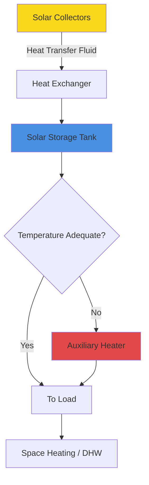

Solar thermal systems convert solar radiation into useful thermal energy for space heating, domestic hot water, and process heating applications. Unlike photovoltaic systems that generate electricity, solar thermal collectors directly capture heat, achieving significantly higher conversion efficiencies for thermal applications—typically 50-70% compared to 15-20% for PV panels.

## Fundamental Heat Transfer Mechanisms

Solar thermal collectors operate on three heat transfer principles:

1. **Absorption** - Solar radiation strikes the absorber plate, converting photon energy to thermal energy
2. **Conduction** - Heat transfers from the absorber to the heat transfer fluid (water or glycol mixture)
3. **Convection** - Fluid circulates to transport thermal energy to storage or loads

The efficiency challenge involves maximizing absorption while minimizing thermal losses to the environment through convection, conduction, and radiation.

## Flat Plate Collectors

Flat plate collectors represent the most common solar thermal technology for HVAC applications. The basic construction includes:

- **Glazing** - Low-iron tempered glass with high solar transmittance (τ ≈ 0.90-0.92)
- **Absorber plate** - Copper or aluminum with selective coating (α ≈ 0.95, ε ≈ 0.05)
- **Flow tubes** - Bonded to absorber for heat transfer fluid circulation
- **Insulation** - Minimizes rear and edge losses (typically R-10 to R-20)
- **Housing** - Weather-resistant enclosure

The instantaneous collector efficiency follows the ASHRAE 93 standard relationship:

$$\eta = F_R(\tau\alpha) - F_R U_L \frac{T_{f,i} - T_a}{G_T}$$

Where:
- $F_R$ = heat removal factor (typically 0.85-0.95)
- $\tau\alpha$ = transmittance-absorptance product (≈ 0.80-0.85)
- $U_L$ = overall heat loss coefficient (W/m²·K)
- $T_{f,i}$ = fluid inlet temperature (°C)
- $T_a$ = ambient temperature (°C)
- $G_T$ = total solar irradiance on collector plane (W/m²)

Performance degrades as fluid temperature increases relative to ambient conditions. Flat plate collectors perform optimally when the temperature differential $(T_{f,i} - T_a)$ remains below 40°C, making them ideal for domestic hot water and low-temperature space heating.

**Typical Performance Parameters:**
| Parameter | Value | Conditions |
|-----------|-------|------------|
| Peak efficiency | 70-80% | No temperature rise |
| $F_R(\tau\alpha)$ | 0.70-0.78 | ASHRAE 93 test |
| $F_R U_L$ | 3.5-4.5 W/m²·K | Tested value |
| Operating range | 30-80°C | Efficient operation |
| Stagnation temp | 150-200°C | No flow condition |

## Evacuated Tube Collectors

Evacuated tube collectors (ETC) achieve superior performance at elevated temperatures through vacuum insulation. Each tube consists of:

- **Inner absorption tube** - Selective coating on glass or metal substrate
- **Outer glass tube** - Creates vacuum envelope (≈10⁻⁴ Pa)
- **Heat pipe or direct flow** - Energy transfer mechanism
- **Manifold** - Connects tubes and houses heat exchanger

The vacuum eliminates convective and conductive losses, leaving only radiative losses governed by:

$$Q_{loss} = A \varepsilon \sigma (T_s^4 - T_a^4)$$

Where:
- $\varepsilon$ = emittance of selective surface (≈ 0.05)
- $\sigma$ = Stefan-Boltzmann constant (5.67×10⁻⁸ W/m²·K⁴)
- $T_s$ = surface temperature (K)
- $T_a$ = ambient temperature (K)

This configuration maintains high efficiency at temperature differentials exceeding 80°C, enabling applications in absorption cooling, industrial process heat, and high-temperature space heating.

**ETC vs Flat Plate Comparison:**
| Characteristic | Flat Plate | Evacuated Tube |
|----------------|------------|----------------|
| Low temp efficiency | 65-75% | 55-70% |
| High temp efficiency | 30-40% | 50-65% |
| Cost per m² | $200-400 | $400-700 |
| Wind/convection loss | Moderate | Minimal |
| Snow shedding | Poor | Excellent |
| Optimal application | DHW, low-temp heat | Absorption cooling, process heat |

## System Sizing Methodology

Solar thermal system sizing balances collector area, storage volume, and load requirements to achieve target solar fraction. The solar fraction (SF) represents the proportion of total heating load supplied by solar energy:

$$SF = \frac{Q_{solar}}{Q_{load}}$$

The f-Chart method, developed at the University of Wisconsin and adopted in ASHRAE design procedures, predicts monthly solar fraction using two dimensionless parameters:

$$X = \frac{F_R U_L A_c (T_{ref} - T_a)\Delta t}{L}$$

$$Y = \frac{F_R (\tau\alpha)_n A_c \overline{H_T} N}{L}$$

Where:
- $A_c$ = collector area (m²)
- $\Delta t$ = time period (typically 1 month)
- $L$ = monthly heating load (J)
- $\overline{H_T}$ = average daily radiation on collector (J/m²·day)
- $N$ = number of days in month
- $T_{ref}$ = reference temperature (100°C for liquid systems)

The monthly solar fraction correlates to X and Y through empirically derived relationships validated against detailed simulations.

**Design Guidelines:**
- **Collector area:** 0.5-1.0 m² per 50 liters daily hot water demand
- **Storage volume:** 50-100 liters per m² collector area
- **Flow rate:** 0.01-0.02 kg/s per m² collector area
- **Piping insulation:** Minimum R-4 (RSI-0.7) for outdoor runs
- **Tilt angle:** Latitude ± 15° for year-round performance

## Integration with Conventional Systems

Solar thermal systems supplement conventional heating equipment through several configurations:

**Series Configuration:**
Cold water enters solar storage first, then flows to auxiliary heater only when additional temperature boost is required. This maximizes solar contribution and minimizes auxiliary fuel consumption.

**Parallel Configuration:**
Solar and auxiliary systems operate independently with mixing valves controlling final delivery temperature. Provides redundancy but may reduce solar fraction.

**Critical Integration Considerations:**

1. **Overheat protection** - Implement temperature relief valves and dump loads for stagnation conditions
2. **Freeze protection** - Use glycol mixtures (30-50% propylene glycol) in freezing climates or drainback systems
3. **Legionella control** - Maintain storage above 60°C or implement periodic pasteurization cycles per ASHRAE 188
4. **Differential control** - Activate circulation when collector temperature exceeds storage by 5-10°C
5. **Heat exchanger sizing** - Effectiveness ≥ 0.4 to minimize collector temperature penalty

## Performance Monitoring

ASHRAE Standard 191 provides monitoring protocols for installed solar thermal systems. Key performance metrics include:

$$\text{System Efficiency} = \frac{Q_{delivered}}{A_c \times H_T}$$

$$\text{Parasitic Power Ratio} = \frac{E_{pump}}{Q_{delivered}}$$

Properly designed systems achieve annual solar fractions of 40-70% for domestic hot water and 20-40% for combined space and water heating in favorable climates. Economic viability improves in applications with high fossil fuel costs, available incentives, and consistent year-round loads.

## Standards and References

- **ASHRAE 93** - Methods of Testing to Determine the Thermal Performance of Solar Collectors
- **ASHRAE 90.1** - Energy Standard for Buildings (solar thermal system requirements)
- **ASHRAE 191** - Standard for Monitoring Solar Thermal Systems
- **SRCC OG-100** - Solar Rating and Certification Corporation operating guidelines and certification procedures for solar collectors
- **ICC SRCC TM-1** - Test Methods and Minimum Standards for Certifying Solar Thermal Collectors

Solar thermal technology provides proven, cost-effective renewable heating when properly sized and integrated with conventional HVAC systems. Success requires understanding collector physics, accurate load analysis, and careful attention to system controls and safety provisions.
