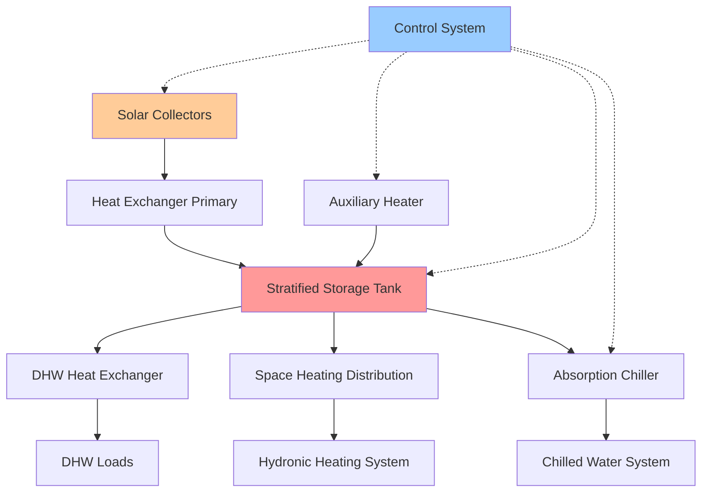

Combined solar thermal systems integrate multiple functions—space heating, domestic hot water (DHW), and potentially cooling—into unified configurations that maximize solar fraction and improve economic viability. These systems require sophisticated control strategies and thermal management to balance competing demands across varying load profiles.

## System Architecture

Combined systems typically employ a central thermal storage tank with stratification enhancement to serve multiple loads at different temperature requirements. The fundamental energy balance for a multi-function solar thermal system:

$$Q_{solar} = Q_{heating} + Q_{DHW} + Q_{cooling,thermal} + Q_{losses} + \Delta U_{storage}$$

where $Q_{solar}$ represents collected solar energy, individual Q terms represent thermal demands, and $\Delta U_{storage}$ accounts for storage energy change.

### Configuration Types

**Series Configuration:**
Solar collectors charge storage, which sequentially supplies heating, DHW, and cooling loads through dedicated heat exchangers. This arrangement provides maximum thermal stratification but requires larger storage volumes.

**Parallel Configuration:**
Loads draw directly from collectors when available, with storage providing buffering and backup. This reduces storage requirements but compromises stratification and control precision.

**Hybrid Configuration:**
DHW receives priority direct heating from collectors, while space heating and cooling utilize storage-mediated delivery. This balances DHW temperature requirements (140-160°F) against lower temperature space heating needs (90-140°F).

## Thermal Storage Design

Storage tank sizing for combined systems requires analysis of load diversity and temporal mismatch between collection and demand. The storage capacity calculation:

$$V_{storage} = \frac{(Q_{heating,daily} + Q_{DHW,daily}) \times f_{solar} \times t_{autonomy}}{\rho c_p \Delta T_{usable}}$$

where:
- $V_{storage}$ = storage volume (ft³)
- $Q_{daily}$ = daily thermal demand (Btu/day)
- $f_{solar}$ = target solar fraction (dimensionless)
- $t_{autonomy}$ = desired storage duration (days)
- $\rho$ = water density (62.4 lbm/ft³)
- $c_p$ = specific heat (1.0 Btu/lbm·°F)
- $\Delta T_{usable}$ = usable temperature difference (°F)

**Stratification Enhancement:**

Thermal stratification maintains high-temperature zones for DHW and absorption cooling while preserving lower temperatures for efficient collector operation and space heating. Key stratification devices:

- **Internal baffles:** Horizontal plates reduce convective mixing
- **Diffuser inlets:** Low-velocity distribution preserves temperature layers
- **External heat exchangers:** Eliminate internal coil-induced convection
- **Temperature-based charging:** Control valves direct flow to appropriate tank levels

The Richardson number characterizes stratification stability:

$$Ri = \frac{g \beta \Delta T H}{u^2}$$

Maintain $Ri > 10$ to ensure stable stratification, where $g$ is gravitational acceleration, $\beta$ is thermal expansion coefficient, $\Delta T$ is vertical temperature difference, $H$ is tank height, and $u$ is characteristic velocity.

## Load Management and Control

Combined systems require hierarchical control strategies that prioritize loads based on temperature requirements and time-criticality.

### Control Hierarchy

| Priority | Load Type | Temperature Range | Control Strategy |
|----------|-----------|-------------------|------------------|
| 1 | DHW | 140-160°F | Direct solar when available, auxiliary backup |
| 2 | Absorption Cooling | 160-200°F | Schedule-based with storage pre-heating |
| 3 | Space Heating | 90-140°F | Storage-based with weather compensation |
| 4 | Storage Charging | Variable | Differential control with stratification logic |

**Differential Temperature Control:**

Collector pump activation based on temperature differential between collector outlet and storage:

$$\Delta T_{on} = T_{collector} - T_{storage,return} > \Delta T_{threshold,on}$$

Typical thresholds: $\Delta T_{on}$ = 15-20°F, $\Delta T_{off}$ = 5-7°F (hysteresis prevents cycling).

**Load Scheduling:**

For systems with absorption cooling, pre-heating storage to elevated temperatures (180-200°F) during high insolation periods enables cooling operation during peak afternoon demand. The required storage energy:

$$Q_{preheat} = \dot{Q}_{cooling} \times COP_{absorption}^{-1} \times t_{cooling}$$

where $\dot{Q}_{cooling}$ is cooling capacity, $COP_{absorption}$ is chiller coefficient of performance (typically 0.6-0.8), and $t_{cooling}$ is cooling period duration.

## Performance Metrics

### Solar Fraction

The solar fraction quantifies the proportion of total thermal load supplied by solar energy:

$$f_{solar} = \frac{Q_{solar,delivered}}{Q_{total,load}} = 1 - \frac{Q_{auxiliary}}{Q_{total,load}}$$

Combined systems typically achieve $f_{solar}$ = 0.4-0.7 in moderate climates, with variation based on collector area, storage volume, and load matching.

### System Efficiency

Overall system efficiency accounts for collection, storage, and distribution losses:

$$\eta_{system} = \eta_{collector} \times \eta_{storage} \times \eta_{distribution}$$

| Component | Typical Efficiency | Loss Mechanisms |
|-----------|-------------------|------------------|
| Collectors | 0.40-0.70 | Optical, convective, radiative |
| Storage | 0.85-0.95 | Standby heat loss, mixing |
| Distribution | 0.90-0.98 | Piping heat loss, pump work |
| **Overall** | **0.30-0.60** | **Compound losses** |

## Seasonal Performance Optimization

Combined systems experience significant seasonal variation in load composition and collector performance.

**Summer Operation:**
- DHW and cooling dominate
- High insolation enables elevated storage temperatures
- Risk of stagnation requires overheat protection

**Winter Operation:**
- Space heating becomes primary load
- Lower insolation and collector efficiency
- Increased auxiliary energy consumption

**Transition Seasons:**
- Optimal matching between collection and heating loads
- Peak solar fraction achievement
- Minimal auxiliary energy required

The annual solar fraction weighted by load distribution:

$$f_{solar,annual} = \frac{\sum_{i=1}^{12} (Q_{solar,i})}{\sum_{i=1}^{12} (Q_{load,i})}$$

## Trigeneration Systems

Advanced combined systems integrate power generation alongside heating and cooling, creating solar trigeneration configurations. Photovoltaic-thermal (PV/T) collectors generate electricity while capturing waste heat for thermal loads:

$$\eta_{combined} = \eta_{electrical} + \eta_{thermal,recovered}$$

Typical performance: $\eta_{electrical}$ = 0.15-0.20, $\eta_{thermal}$ = 0.45-0.60, yielding $\eta_{combined}$ = 0.60-0.80.

The power generation offsets parasitic pump and control loads, improving net system performance and enabling grid-independent operation during optimal conditions.

## Design Considerations per ASHRAE Standards

ASHRAE Standard 90.1 requires proper insulation and control integration for solar thermal systems. Key requirements:

- **Storage tanks:** Minimum R-12.5 insulation
- **Piping:** Minimum 1-inch insulation on outdoor runs
- **Collector loop:** Freeze protection in climates below 32°F design temperature
- **Controls:** Automatic storage temperature limiting to prevent scalding (maximum 140°F DHW delivery)

ASHRAE Standard 62.1 ventilation requirements apply to mechanical rooms housing combined system equipment, with particular attention to glycol vapor concentration monitoring in closed-loop antifreeze systems.

## Economic Analysis

Combined systems benefit from shared infrastructure costs (collectors, storage, controls) distributed across multiple loads. The incremental cost-effectiveness:

$$LCOE_{combined} < LCOE_{heating} + LCOE_{DHW} + LCOE_{cooling}$$

due to economies of scale and improved capacity utilization. Typical payback periods range 8-15 years depending on local energy costs, incentives, and solar resource availability.

**Optimization Strategy:**

Size collectors and storage to maximize shoulder-season performance when heating and cooling loads overlap minimally, allowing DHW production to utilize full system capacity. This approach yields superior economics compared to oversizing for peak winter heating or summer cooling demands. The optimal collector area balances first cost against annual solar fraction:

$$A_{collector,optimal} = f\left(\frac{Q_{annual,total}}{I_{annual,total}}, C_{collector}, C_{auxiliary}, f_{solar,target}\right)$$

Year-round utilization maintains collector productivity above 60%, preventing the economic penalty of seasonal idling that affects single-function systems. This continuous operation distributes capital costs across maximum annual energy delivery, improving the levelized cost of energy and accelerating return on investment.
