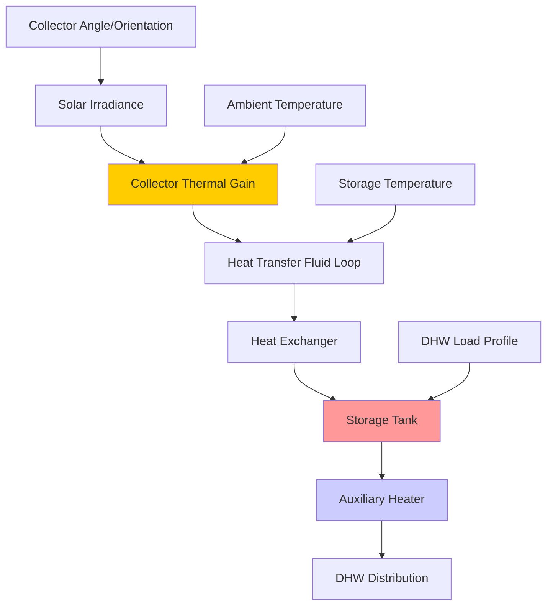

Solar thermal domestic hot water (DHW) systems convert solar radiation directly into thermal energy for water heating, providing one of the most cost-effective applications of solar energy in buildings. These systems achieve thermal conversion efficiencies of 40-70%, significantly higher than photovoltaic panels, and offer simple payback periods of 5-12 years depending on climate and conventional fuel costs.

## System Configurations

Solar DHW systems employ four primary configurations, each suited to specific climates and applications.

### Direct Circulation Systems

Direct (open-loop) systems pump potable water directly through collectors. These systems offer simplicity and efficiency but require freeze protection, limiting application to climates with minimal freezing risk (ASHRAE climate zones 1-3). Check valves prevent reverse thermosiphoning at night, and tempering valves protect against scalding.

### Indirect Circulation Systems

Indirect (closed-loop) systems circulate a heat transfer fluid—typically propylene glycol solution—through collectors and a heat exchanger. The heat exchanger transfers energy to potable water in the storage tank. These systems protect against freezing and are suitable for all climates. The heat exchanger introduces a 5-15% efficiency penalty compared to direct systems.

### Drainback Systems

Drainback systems use water as the heat transfer fluid but automatically drain collectors when the pump stops, providing inherent freeze protection without glycol. These systems require proper pipe pitch (minimum 1/4 inch per foot) and collector mounting to ensure complete drainage. The drainback reservoir must accommodate the entire collector array volume plus piping.

### Thermosiphon Systems

Passive thermosiphon systems rely on natural convection—hot water rises from collectors to an elevated storage tank. These systems eliminate pumps and controls but require the storage tank to be positioned above collectors with sufficient elevation difference (minimum 12 inches) to generate adequate circulation. Application is limited to single-story buildings or installations where tank elevation is achievable.

## Heat Transfer and Sizing Calculations

The useful energy gain from a solar collector is determined by the Hottel-Whillier-Bliss equation:

$$Q_u = A_c F_R[(\tau\alpha)I_T - U_L(T_{in} - T_a)]$$

Where:
- $Q_u$ = useful energy gain (Btu/hr)
- $A_c$ = collector gross area (ft²)
- $F_R$ = collector heat removal factor (dimensionless, typically 0.85-0.95)
- $\tau\alpha$ = transmittance-absorptance product (typically 0.75-0.85)
- $I_T$ = total solar irradiance on collector plane (Btu/hr·ft²)
- $U_L$ = overall heat loss coefficient (Btu/hr·ft²·°F)
- $T_{in}$ = collector inlet temperature (°F)
- $T_a$ = ambient air temperature (°F)

Collector efficiency varies with operating conditions:

$$\eta = F_R(\tau\alpha) - F_R U_L \frac{(T_{in} - T_a)}{I_T}$$

This linear relationship shows efficiency decreases as collector temperature rises above ambient or as solar irradiance decreases. High-performance collectors exhibit steep slopes (high $F_R(\tau\alpha)$) and shallow efficiency decline (low $F_R U_L$).

### System Sizing Methodology

ASHRAE Standard 90.1 provides solar fraction calculations, but detailed sizing follows the f-chart method. Daily hot water demand determines storage and collector area:

$$V_{storage} = (1.5 \text{ to } 2.0) \times V_{daily}$$

Collector area sizing for 60-80% solar fraction in favorable climates:

$$A_c = \frac{Q_{daily}}{F_R(\tau\alpha) \times H_T \times 0.6}$$

Where $H_T$ is the daily total solar radiation on the collector plane (Btu/day·ft²) and 0.6 represents a conservative system efficiency factor.

## Storage Tank Design

Thermal storage tanks for solar DHW systems require stratification to maximize collector efficiency. Stratification maintains cold water at the bottom (collector inlet), enabling higher collector efficiency, while hot water accumulates at the top for domestic use.

| Storage Configuration | Advantages | Disadvantages |
|----------------------|------------|---------------|
| Single tank with internal HX | Compact, freeze-protected | Lower stratification, HX fouling risk |
| External HX with single tank | Easy HX maintenance | Reduced stratification, pump parasitic |
| Two-tank series | Excellent stratification, backup separation | Space requirements, higher cost |
| Tank-in-tank | Good stratification, compact | Limited to smaller capacities |

Tank height-to-diameter ratios of 2:1 to 3:1 promote stratification. Inlet diffusers reduce mixing during charge cycles. Solar preheat tanks should provide sufficient volume for 1-2 days of storage to accommodate cloudy periods and optimize solar contribution.

## System Performance Parameters

### Solar Fraction

Solar fraction (SF) represents the portion of total DHW energy provided by solar:

$$SF = \frac{Q_{solar}}{Q_{total}} = \frac{Q_{total} - Q_{auxiliary}}{Q_{total}}$$

Design targets typically range from 60-80%. Higher solar fractions increase system cost without proportional benefit due to diminishing returns during low-insolation periods. Oversizing for 90%+ solar fraction results in summer stagnation and reduced cost-effectiveness.

## Control Strategies

Differential temperature controllers activate circulation pumps when collector temperature exceeds storage temperature by a set differential (typically 15-20°F on-differential, 5-7°F off-differential). This prevents heat loss from storage to cold collectors while ensuring pump activation when useful gain is available.

Advanced controls incorporate:
- High-limit protection (180-200°F collector limit)
- Freeze protection activation (38-42°F sensor temperature)
- Auxiliary heater lockout during solar availability
- Recirculation for drainback system priming

## Installation Considerations

Collector mounting requires consideration of structural loads, waterproofing, and optimal orientation. South-facing installations (in northern hemisphere) at tilt angles equal to latitude ± 15° maximize annual energy collection. Roof-integrated mounting reduces wind loads but complicates maintenance access.

Piping must be sized for proper flow rates—typically 0.02-0.03 gpm per square foot of collector area. Excessive flow rates improve heat removal but increase pumping energy; insufficient flow reduces efficiency. Insulation thickness should be 1-2 inches for all piping, with special attention to outdoor runs and heat exchanger connections.

Expansion tanks accommodate thermal expansion of the heat transfer fluid. Sizing follows standard hydronic practices but must account for higher operating temperatures (up to 250°F during stagnation conditions).

## Performance Monitoring

ASHRAE Standard 191P establishes performance monitoring protocols for solar thermal systems. Key parameters include:
- Collector inlet and outlet temperatures
- Flow rates through collector loop
- Solar irradiance on collector plane
- Storage tank temperatures at multiple heights
- Auxiliary energy consumption

Annual monitoring verifies that systems achieve design solar fractions and identifies degradation from fouling, leaks, or control failures.

## Code Requirements

ASHRAE Standard 90.1 mandates solar-ready provisions for certain building types, including roof space, structural capacity, and conduit pathways. Local codes may require solar DHW systems for new construction. International Plumbing Code (IPC) and Uniform Plumbing Code (UPC) govern installation practices, including backflow prevention, pressure relief, and thermal expansion control.

Proper commissioning per ASHRAE Guideline 1.1 ensures system operates as designed, with verification of control sequences, flow rates, and safety functions before occupancy.
