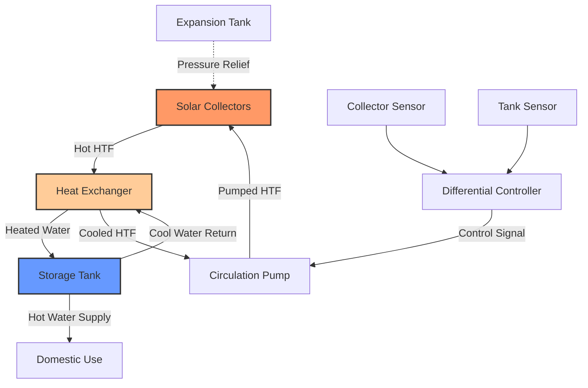

# Active Solar Domestic Hot Water Systems

Active solar domestic hot water (DHW) systems use pumps and controllers to circulate heat transfer fluid through solar collectors, transferring captured solar energy to potable water storage. These systems achieve higher efficiency than passive designs through optimized fluid flow rates, heat exchange configurations, and intelligent control strategies.

## System Configurations

### Direct Circulation Systems

Direct circulation systems pump potable water directly through solar collectors. This configuration minimizes heat exchange losses but restricts application to freeze-free climates or requires drain-down protection.

**Energy Balance:**

$$Q_{useful} = \dot{m} c_p (T_{out} - T_{in}) = A_c \eta_c I_T$$

Where:
- $Q_{useful}$ = useful energy gain (W)
- $\dot{m}$ = mass flow rate (kg/s)
- $c_p$ = specific heat of water, 4,186 J/(kg·K)
- $T_{out}, T_{in}$ = collector outlet/inlet temperatures (°C)
- $A_c$ = collector area (m²)
- $\eta_c$ = collector efficiency (dimensionless)
- $I_T$ = total solar irradiance (W/m²)

### Indirect Circulation Systems

Indirect systems employ a closed-loop heat transfer fluid circuit separated from potable water by a heat exchanger. This configuration provides freeze protection through antifreeze solutions and prevents scale formation in collectors.

**Heat Exchanger Effectiveness:**

$$\varepsilon = \frac{Q_{actual}}{Q_{maximum}} = \frac{T_{h,in} - T_{h,out}}{T_{h,in} - T_{c,in}}$$

Where:
- $\varepsilon$ = heat exchanger effectiveness (0.4-0.8 typical)
- $T_{h,in}, T_{h,out}$ = hot fluid inlet/outlet temperatures (°C)
- $T_{c,in}$ = cold fluid inlet temperature (°C)

### Drainback Systems

Drainback systems drain the collector loop when the pump stops, eliminating freeze and overheat risks. The system requires elevated storage tanks or vacuum breakers and operates with water as the heat transfer fluid.

**Drainback Tank Sizing:**

$$V_{drainback} = V_{collectors} + V_{piping} + V_{safety}$$

Where:
- $V_{drainback}$ = drainback reservoir volume (L)
- $V_{collectors}$ = internal collector volume (L)
- $V_{piping}$ = piping volume in drainback zone (L)
- $V_{safety}$ = safety margin, typically 20% (L)

## System Component Design

### Collector Array Sizing

Collector area directly impacts solar fraction, the portion of annual DHW energy provided by solar. ASHRAE 90.1 and local energy codes may specify minimum solar fractions for renewable energy compliance.

**Recommended Collector Area:**

$$A_c = \frac{f_{solar} \cdot Q_{annual}}{I_{annual} \cdot \eta_{system}}$$

Where:
- $f_{solar}$ = target solar fraction (0.5-0.8 typical)
- $Q_{annual}$ = annual DHW energy demand (kWh/year)
- $I_{annual}$ = annual solar irradiation (kWh/m²/year)
- $\eta_{system}$ = overall system efficiency (0.3-0.5 typical)

| Climate Zone | Collector Area per Person (m²) | Expected Solar Fraction |
|--------------|-------------------------------|------------------------|
| Hot-Dry (Phoenix) | 0.8-1.2 | 0.70-0.85 |
| Hot-Humid (Miami) | 1.0-1.5 | 0.65-0.80 |
| Mixed (St. Louis) | 1.5-2.0 | 0.50-0.70 |
| Cold (Minneapolis) | 2.0-2.5 | 0.40-0.60 |
| Marine (Seattle) | 1.8-2.3 | 0.45-0.65 |

### Circulation Pump Selection

Pump flow rates balance collector efficiency against parasitic energy consumption. ASHRAE Standard 90.2 recommends flow rates of 0.01-0.02 kg/(s·m²) collector area for liquid systems.

**Pump Head Calculation:**

$$H_{total} = \Delta P_{collectors} + \Delta P_{piping} + \Delta P_{HX} + \Delta P_{fittings}$$

Where:
- $H_{total}$ = total system head (Pa)
- $\Delta P$ terms represent pressure drops through components (Pa)

Typical system pressure drops:

| Component | Pressure Drop (kPa) |
|-----------|-------------------|
| Flat Plate Collectors (per panel) | 5-15 |
| Evacuated Tube Collectors (per panel) | 3-10 |
| Plate Heat Exchanger | 20-50 |
| Piping (per 10m equivalent length) | 2-8 |
| Valves and Fittings | 5-20 |

### Storage Tank Configuration

Storage capacity affects system performance by providing thermal mass for temporal energy storage. Undersized tanks reduce solar fraction through early morning temperature rise; oversized tanks increase standby losses.

**Recommended Storage Volume:**

$$V_{storage} = 50-75 \text{ L/m² collector area}$$

Two-tank systems separate solar preheat from auxiliary heating, improving stratification and solar contribution. Single-tank systems with auxiliary heating elements require careful control to prevent auxiliary energy displacement of solar gains.

## Control Strategies

### Differential Temperature Controller

The differential controller activates circulation when collector temperature exceeds storage temperature by a setpoint differential (ΔT), typically 5-10°C. This prevents heat loss to collectors during low-radiation periods.

**Control Logic:**

$$\text{Pump ON if: } T_{collector} > T_{storage} + \Delta T_{on}$$
$$\text{Pump OFF if: } T_{collector} < T_{storage} + \Delta T_{off}$$

Where:
- $\Delta T_{on}$ = on differential, typically 7-10°C
- $\Delta T_{off}$ = off differential, typically 3-5°C

Hysteresis between on/off differentials prevents cycling and extends pump life.

### Overheat Protection

Systems require high-temperature protection to prevent boiling, pressure buildup, and glycol degradation. Protection methods include:

- **Temperature limit shutdown**: Disable pump when storage exceeds 85-90°C
- **Heat rejection**: Activate auxiliary heat dump or nighttime cooling
- **Drainback activation**: Drain collectors when stagnation temperatures approach limits

## Performance Metrics

### Solar Fraction

Solar fraction quantifies renewable energy contribution:

$$f_{solar} = 1 - \frac{Q_{auxiliary}}{Q_{total}}$$

Where:
- $Q_{auxiliary}$ = auxiliary energy input (kWh/year)
- $Q_{total}$ = total DHW energy demand (kWh/year)

### System Efficiency

Annual system efficiency accounts for collector performance, heat exchange losses, storage losses, and parasitic energy:

$$\eta_{annual} = \frac{Q_{delivered}}{I_{total} \cdot A_c}$$

Where:
- $Q_{delivered}$ = net delivered solar energy (kWh/year)
- $I_{total}$ = total annual irradiation on collector plane (kWh/m²/year)

## Freeze Protection Methods

### Closed Loop Glycol Systems

Propylene glycol solutions (25-50% by volume) provide freeze protection to -20°C to -50°C. Glycol concentration must account for lowest expected ambient temperature with safety margin.

**Freeze Point Depression:**

Consult propylene glycol freeze point curves. Example concentrations:

| Glycol Concentration (% vol) | Freeze Point (°C) | Burst Point (°C) |
|------------------------------|------------------|------------------|
| 25% | -12 | -15 |
| 35% | -20 | -23 |
| 45% | -29 | -32 |
| 50% | -34 | -37 |

Glycol systems require annual testing and replacement every 3-5 years due to thermal degradation.

### Drainback Protection

Drainback systems automatically drain when circulation stops, eliminating antifreeze requirements. Design considerations include:

- Minimum 1-2% pipe slope for complete drainage
- Air elimination from collector headers
- Pump sizing for initial fill against gravity head
- Drainback reservoir with air volume

## Installation Requirements

### Piping Insulation

ASHRAE Standard 90.1 mandates minimum R-3 to R-5 insulation for outdoor solar piping. Heat loss from uninsulated piping significantly reduces system efficiency.

**Piping Heat Loss:**

$$Q_{loss} = \frac{2\pi k L (T_{fluid} - T_{ambient})}{\ln(r_o/r_i)}$$

Where:
- $k$ = insulation thermal conductivity (W/(m·K))
- $L$ = pipe length (m)
- $r_o, r_i$ = outer/inner insulation radii (m)

### Roof Mounting

Collector mounting must withstand wind loads per ASCE 7 and provide adequate drainage. Optimal tilt angle approximates latitude for year-round performance or latitude ± 15° for seasonal optimization.

### Tempering Valve Scald Protection

Solar DHW systems can produce delivery temperatures exceeding 70°C. ASHRAE Standard 90.2 and plumbing codes require thermostatic mixing valves to limit outlet temperature to 49-60°C for scald prevention.

**Tempering Valve Mixing:**

$$\dot{m}_{total} T_{mixed} = \dot{m}_{hot} T_{hot} + \dot{m}_{cold} T_{cold}$$

Where:
- $\dot{m}$ terms represent mass flow rates (kg/s)
- $T$ terms represent temperatures (°C)

## Auxiliary Backup Heating

Auxiliary heating provides DHW during periods of insufficient solar radiation. Integration strategies include:

| Configuration | Advantages | Disadvantages |
|--------------|-----------|---------------|
| Two-tank series | Maximum solar stratification | Higher cost, space requirements |
| Single-tank dual-element | Lower cost, compact | Auxiliary can displace solar |
| External tankless | Unlimited capacity | No storage backup |
| Heat pump auxiliary | High efficiency | Higher initial cost |

Tank-in-tank designs position solar preheat storage within auxiliary tank, combining benefits of two-tank systems in single vessel footprint.

## Maintenance Requirements

Active systems require periodic maintenance:

- Glycol concentration testing (annual)
- Pump operation verification (quarterly)
- System pressure check (quarterly)
- Sensor calibration (annual)
- Heat exchanger inspection (5-year intervals)
- Collector glazing cleaning (as needed, climate-dependent)

Properly maintained active solar DHW systems achieve 15-25 year service life with component replacements extending operation beyond initial design life.

## Economic Considerations

System payback depends on auxiliary fuel costs, solar resource, and installation costs. Federal tax credits (Investment Tax Credit) and state incentives significantly affect project economics. Life cycle cost analysis per ASHRAE 90.1 should account for energy escalation, maintenance costs, and replacement reserves.

Active solar DHW systems represent mature, proven technology for reducing fossil fuel consumption in residential and commercial applications while meeting increasingly stringent energy code requirements.
