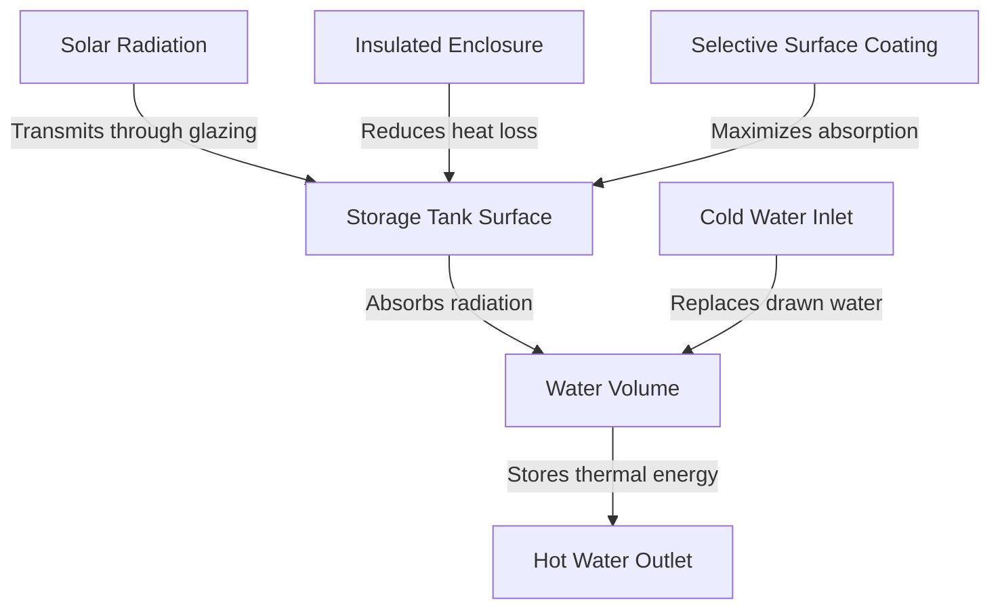

## Overview

Passive solar domestic hot water (DHW) systems operate without mechanical pumps or electrical controls, relying entirely on natural convection, gravity, and solar radiation to heat and circulate water. These systems offer exceptional reliability, minimal maintenance requirements, and energy-free operation while achieving solar fractions of 40-80% in appropriate climates.

## Thermosiphon Systems

### Operating Principles

Thermosiphon systems exploit buoyancy-driven flow created by density differences between heated and cooled water. As solar collectors absorb radiation and heat the working fluid, density decreases and the heated fluid rises naturally to the storage tank positioned above the collector array.

**Natural Convection Flow Rate:**

$$
\dot{m} = \frac{A_c \cdot \rho \cdot g \cdot \beta \cdot \Delta T \cdot H}{f \cdot L / D + \Sigma K}
$$

Where:
- $\dot{m}$ = mass flow rate (kg/s)
- $A_c$ = collector flow area (m²)
- $\rho$ = fluid density (kg/m³)
- $g$ = gravitational acceleration (9.81 m/s²)
- $\beta$ = volumetric thermal expansion coefficient (K⁻¹)
- $\Delta T$ = temperature difference between collector outlet and tank inlet (K)
- $H$ = vertical height between collector and tank (m)
- $f$ = friction factor (dimensionless)
- $L/D$ = pipe length-to-diameter ratio
- $\Sigma K$ = sum of minor loss coefficients

### System Configuration Requirements

Critical design parameters ensure reliable thermosiphon operation:

| Parameter | Requirement | Rationale |
|-----------|-------------|-----------|
| Tank elevation above collector | Minimum 0.3 m (12 in) | Ensures adequate driving head |
| Optimal elevation | 0.5-1.0 m (20-40 in) | Maximizes circulation rate |
| Pipe slope | Minimum 1:40 (1.4°) | Prevents vapor lock |
| Riser tube diameter | 19-25 mm (3/4-1 in) | Balances flow rate and heat loss |
| Storage tank insulation | R-12 to R-20 (SI: RSI 2.1-3.5) | Minimizes standby losses |

### Performance Characteristics

Thermosiphon system efficiency depends on solar radiation intensity, ambient conditions, and system configuration:

**Daily Thermal Output:**

$$
Q_{daily} = A_c \cdot H_t \cdot \eta_c - (UA)_{tank} \cdot (T_{tank} - T_{amb}) \cdot 24
$$

Where:
- $Q_{daily}$ = net daily thermal energy (Wh)
- $A_c$ = collector area (m²)
- $H_t$ = daily total solar radiation on collector plane (Wh/m²)
- $\eta_c$ = collector efficiency (fraction)
- $(UA)_{tank}$ = tank heat loss coefficient (W/K)
- $T_{tank}$ = average tank temperature (°C)
- $T_{amb}$ = ambient temperature (°C)

## Batch Collectors (Integral Collector-Storage)

### Design Configurations

Batch collectors combine collection and storage in a single insulated enclosure. Multiple cylindrical or rectangular tanks sit within a glazed, insulated box where they directly absorb solar radiation.

### Heat Transfer Analysis

Energy balance for batch collector system:

**Instantaneous Energy Balance:**

$$
\rho V c_p \frac{dT}{dt} = A_a \cdot I_t \cdot \tau \alpha - U_L \cdot A_a (T_{tank} - T_{amb}) - \dot{m}_{draw} c_p (T_{tank} - T_{mains})
$$

Where:
- $\rho$ = water density (kg/m³)
- $V$ = storage volume (m³)
- $c_p$ = specific heat capacity (J/kg·K)
- $dT/dt$ = rate of temperature change (K/s)
- $A_a$ = absorber area (m²)
- $I_t$ = incident solar radiation (W/m²)
- $\tau$ = glazing transmittance (fraction)
- $\alpha$ = absorber absorptance (fraction)
- $U_L$ = overall heat loss coefficient (W/m²·K)
- $\dot{m}_{draw}$ = hot water draw rate (kg/s)
- $T_{mains}$ = cold water supply temperature (°C)

### Sizing Guidelines

Batch collector systems require careful sizing to balance daytime collection and overnight heat loss:

| Climate Zone | Storage Volume per m² Collector | Typical System Size |
|--------------|----------------------------------|---------------------|
| Hot-dry | 50-75 L/m² | 150-300 L total |
| Warm-humid | 60-80 L/m² | 200-350 L total |
| Temperate | 70-100 L/m² | 250-400 L total |
| Cold | Not recommended | Use active systems |

## Freeze Protection Strategies

Passive systems in freezing climates require protection mechanisms:

### Drain-Back Approach

System drains automatically when circulation stops or temperatures approach freezing. Collector must slope minimum 1:25 (2.3°) toward drain point.

### Recirculation Valve

Temperature-activated valve allows heated tank water to circulate through collectors during near-freezing conditions, preventing ice formation.

### Phase-Change Materials

Encapsulated PCM in collector absorber plate stores latent heat and prevents water from freezing during short cold periods.

## Performance Comparison

| System Type | Solar Fraction | Initial Cost | Maintenance | Freeze Risk | Climate Suitability |
|-------------|----------------|--------------|-------------|-------------|---------------------|
| Thermosiphon | 60-80% | Medium | Very Low | Medium-High | Frost-free to mild freeze |
| Batch Collector | 40-60% | Low-Medium | Very Low | High | Frost-free only |
| Active Direct | 70-90% | High | Medium | High | With freeze protection |
| Active Indirect | 60-85% | High | Medium-High | Low | All climates |

## Design Standards and References

ASHRAE Standard 90.2 establishes performance requirements for solar water heating systems. Test procedures follow ASHRAE Standard 95 and ISO 9459 for collector and system thermal performance characterization.

**Collector Efficiency Equation (ASHRAE 93):**

$$
\eta = F_R(\tau\alpha) - F_R U_L \frac{(T_{in} - T_{amb})}{I_t}
$$

Where:
- $F_R$ = collector heat removal factor
- $(\tau\alpha)$ = transmittance-absorptance product
- $U_L$ = overall heat loss coefficient (W/m²·K)
- $T_{in}$ = collector inlet temperature (°C)

## Installation Considerations

Passive systems require minimal installation complexity but demand attention to:

- **Structural support:** Storage tanks add 200-400 kg load
- **Roof penetrations:** Proper flashing prevents water infiltration
- **Collector orientation:** Due south ±15° optimal (Northern Hemisphere)
- **Tilt angle:** Latitude +10° to 15° maximizes winter performance
- **Pipe insulation:** Minimum R-3 (SI: RSI 0.5) on all exposed piping
- **Pressure relief:** Code-required T&P valve at 150 kPa (10 bar)

## Economic Analysis

Passive solar DHW systems offer attractive simple payback periods in appropriate applications:

- **Thermosiphon systems:** 3-7 years depending on fuel costs
- **Batch collectors:** 2-5 years in high-insolation regions
- **Operating costs:** Near zero (no pumps or controls)
- **Maintenance:** Periodic inspection, minimal component replacement

The elimination of pumps, controllers, and sensors significantly reduces both initial complexity and lifetime maintenance requirements compared to active solar thermal systems.
