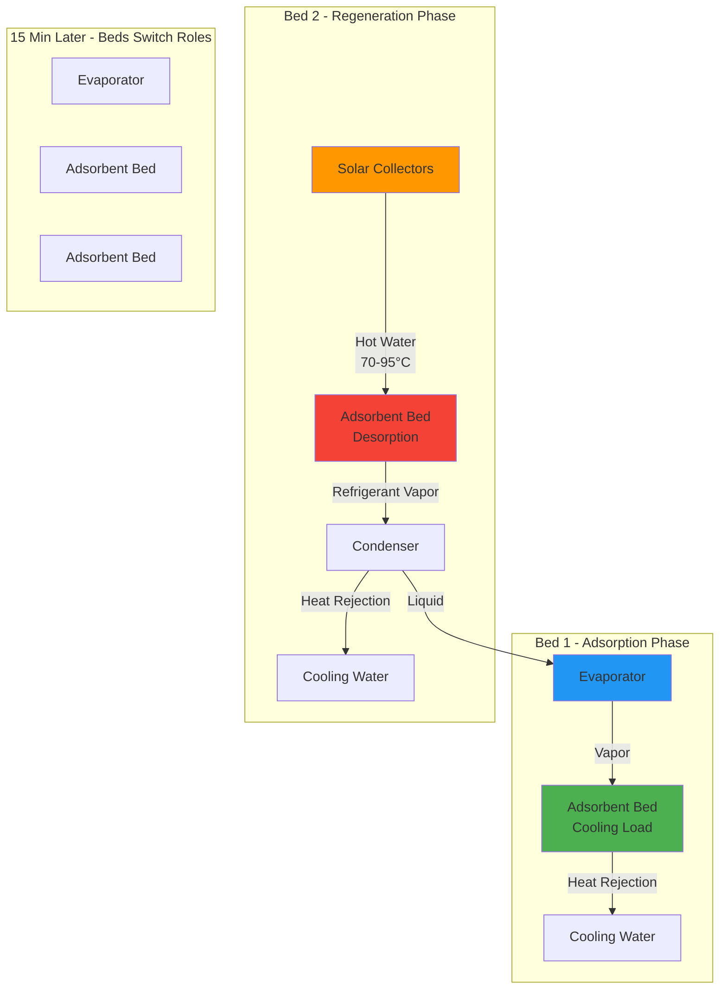
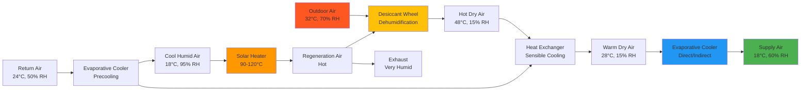
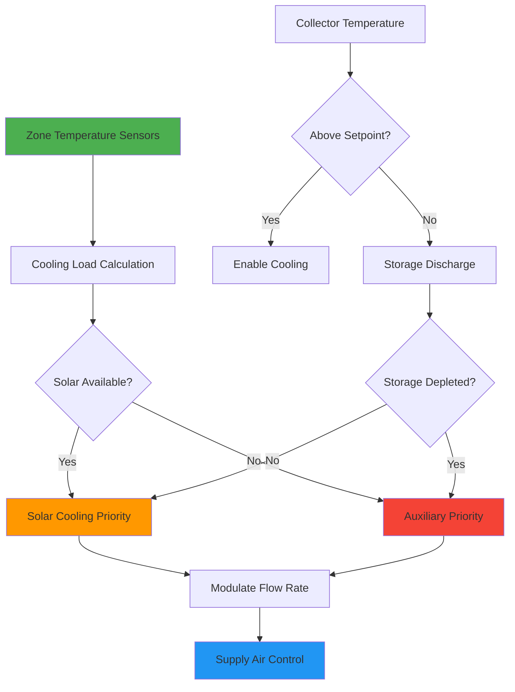

Solar cooling systems convert solar thermal energy into useful cooling capacity, addressing the fundamental paradox that peak cooling demand coincides with maximum solar availability. Unlike photovoltaic-powered compression systems, thermally-driven cooling technologies directly utilize collected thermal energy, eliminating electrical conversion losses and reducing peak electrical demand during critical summer periods.

## Thermodynamic Basis for Solar Cooling

Conventional vapor compression refrigeration requires high-grade electrical energy to drive the mechanical compressor. Solar thermal cooling substitutes this electrical work with thermal energy, operating on fundamentally different thermodynamic principles.

The theoretical maximum coefficient of performance for any heat-driven refrigeration cycle is limited by Carnot efficiency:

$$\text{COP}_{Carnot} = \frac{T_e}{T_g - T_e} \cdot \frac{T_g - T_c}{T_c}$$

Where:
- $T_e$ = evaporator absolute temperature (K)
- $T_g$ = generator (heat source) absolute temperature (K)
- $T_c$ = condenser/heat rejection absolute temperature (K)

For typical conditions ($T_e$ = 280 K, $T_g$ = 360 K, $T_c$ = 305 K):

$$\text{COP}_{Carnot} = \frac{280}{360-280} \cdot \frac{360-305}{305} = 3.5 \cdot 0.18 = 0.63$$

Practical systems achieve 60-80% of this theoretical limit, yielding operational COP values of 0.4-0.8 for thermally-driven cycles.

## Solar Cooling Technology Categories

Solar thermal cooling encompasses three primary technology families, distinguished by their thermodynamic cycles and working fluids.

### Absorption Refrigeration Systems

Absorption systems employ liquid absorbent-refrigerant pairs to create a thermal compressor. The most common configurations are:

**Single-Effect Cycles:**
- Required collector temperature: 70-95°C
- Thermal COP: 0.65-0.75
- Working pairs: LiBr-H₂O (air conditioning), NH₃-H₂O (sub-zero applications)
- Suitable collectors: evacuated tubes, high-performance flat plates

**Double-Effect Cycles:**
- Required collector temperature: 140-180°C
- Thermal COP: 1.1-1.3
- Working pairs: LiBr-H₂O exclusively
- Suitable collectors: evacuated tubes, parabolic troughs, compound parabolic concentrators

The cooling capacity relationship to solar input:

$$Q_{cooling} = Q_{solar} \cdot \eta_{collector} \cdot \text{COP}_{absorption}$$

For a single-effect system with 60% collector efficiency and 0.70 COP:

$$Q_{cooling} = Q_{solar} \cdot 0.60 \cdot 0.70 = 0.42 \cdot Q_{solar}$$

This indicates 1 kW of incident solar radiation produces approximately 420 W of cooling capacity under design conditions.

### Adsorption Refrigeration Systems

Adsorption systems use solid adsorbent materials (silica gel, zeolites, activated carbon) that physically bond refrigerant molecules to their surface. The cycle operates in batch mode with paired beds alternating between adsorption and regeneration phases.

**Key Performance Characteristics:**

| Parameter | Value | Notes |
|-----------|-------|-------|
| Regeneration temperature | 65-95°C | Lower than absorption |
| Thermal COP | 0.4-0.6 | Lower than absorption |
| Cycle time | 10-30 minutes | Batch operation |
| Cooling capacity modulation | Poor | Step changes only |
| Operating pressure | 0.6-2 kPa | Deep vacuum required |

The instantaneous cooling power during adsorption phase:

$$\dot{Q}_{cooling} = \dot{m}_{ref} \cdot h_{fg} = \frac{m_{ads} \cdot \Delta x}{t_{cycle}} \cdot h_{fg}$$

Where:
- $m_{ads}$ = adsorbent mass (kg)
- $\Delta x$ = change in adsorbate concentration (kg refrigerant/kg adsorbent)
- $t_{cycle}$ = cycle duration (s)
- $h_{fg}$ = latent heat of refrigerant (kJ/kg)

For silica gel-water with $\Delta x$ = 0.15 kg/kg over 600 s cycle:

$$\dot{Q}_{cooling} = \frac{100 \text{ kg} \cdot 0.15}{600 \text{ s}} \cdot 2450 \text{ kJ/kg} = 61.3 \text{ kW}$$

### Desiccant Evaporative Cooling

Solar desiccant systems remove moisture from ventilation air through hygroscopic materials, enabling subsequent evaporative cooling to achieve supply air conditions without mechanical refrigeration.

**Solid Desiccant Wheel Configuration:**

The psychrometric process involves three distinct state changes:

1. **Desiccant dehumidification** (constant enthalpy approximation):
   $$W_2 = W_1 - \Delta W$$
   $$T_2 = T_1 + \frac{\Delta W \cdot h_{ads}}{c_p}$$

2. **Sensible heat exchange** (constant humidity ratio):
   $$T_3 = T_2 - \varepsilon_{HX}(T_2 - T_{cool})$$

3. **Evaporative cooling** (constant wet-bulb approximation):
   $$T_4 = T_3 - \varepsilon_{evap}(T_3 - T_{wb,3})$$

Combined system COP on thermal basis:

$$\text{COP}_{thermal} = \frac{h_a - h_g}{Q_{regen}}$$

Where $h_a$ = outdoor air enthalpy, $h_g$ = supply air enthalpy.

## Solar Collector Integration Strategies

Matching collector technology to system requirements is essential for achieving target performance and economic viability.

### Temperature-Dependent Collector Selection

**Collector Performance Equation (ASHRAE 93):**

$$\eta = F_R(\tau\alpha) - F_R U_L \frac{T_{f,avg} - T_a}{G_T}$$

| Application | Required Temp | $(T_{f,avg} - T_a)/G_T$ | Collector Choice | Expected $\eta$ |
|-------------|--------------|-------------------------|------------------|-----------------|
| Desiccant regeneration | 80-100°C | 0.06-0.08 | Evacuated tube | 55-65% |
| Single-effect absorption | 85-95°C | 0.07-0.09 | Evacuated tube | 50-60% |
| Adsorption cooling | 70-90°C | 0.05-0.07 | Flat plate/ETC | 60-70% |
| Double-effect absorption | 160-180°C | 0.14-0.18 | Parabolic trough | 45-55% |

The temperature parameter $(T_{f,avg} - T_a)/G_T$ directly determines collector efficiency. Higher operating temperatures demand concentrating collectors to maintain acceptable efficiency.

### Thermal Storage Integration

Solar cooling systems benefit from thermal storage in two configurations:

**Hot Storage (Pre-Generator):**
Stores high-temperature fluid from collectors for continuous chiller operation during cloud transients or evening peak cooling.

$$V_{hot} = \frac{Q_{cooling} \cdot t_{autonomy}}{\text{COP} \cdot \rho c_p \Delta T \cdot \eta_{storage}}$$

For 100 kW cooling, 3 hours autonomy, COP = 0.7, $\Delta T$ = 15 K:

$$V_{hot} = \frac{100 \text{ kW} \cdot 3 \text{ h} \cdot 3600 \text{ s/h}}{0.7 \cdot 1000 \text{ kg/m}^3 \cdot 4.18 \text{ kJ/kg·K} \cdot 15 \text{ K} \cdot 0.9} = 27.4 \text{ m}^3$$

**Cold Storage (Post-Chiller):**
Stores chilled water produced during peak solar availability for use during peak cooling loads.

$$V_{cold} = \frac{Q_{load,peak} \cdot t_{discharge}}{\rho c_p \Delta T \cdot \eta_{discharge}}$$

Cold storage requires larger volumes due to limited temperature differential (typically 6-8 K for chilled water).

## System-Level Performance Metrics

### Solar Fraction

The fraction of annual cooling energy supplied by solar:

$$SF = \frac{\sum Q_{solar,cooling}}{\sum Q_{total,cooling}}$$

Achievable solar fractions depend on climate, system sizing, and auxiliary cooling capacity:
- Oversized systems: SF = 0.90-1.0 (excessive capital cost)
- Optimally sized: SF = 0.60-0.80 (economic optimum)
- Undersized systems: SF = 0.40-0.60 (missed solar opportunity)

### Primary Energy Ratio

Comparison to conventional electric vapor compression:

$$\text{PER} = \frac{\text{COP}_{VC}}{\text{COP}_{thermal}/\eta_{solar}}$$

Where $\eta_{solar}$ is the annual average solar collector efficiency. For typical values (COP$_{VC}$ = 3.0, COP$_{thermal}$ = 0.7, $\eta_{solar}$ = 0.55):

$$\text{PER} = \frac{3.0}{0.7/0.55} = \frac{3.0}{1.27} = 2.36$$

This indicates the solar thermal system consumes 2.36 times more primary energy per unit cooling than a conventional chiller, if both solar thermal and grid electricity have equal primary energy factors. However, accounting for typical grid electricity primary energy factor of 3.0:

$$\text{PER}_{corrected} = \frac{3.0 \cdot 3.0}{0.7/0.55} = \frac{9.0}{1.27} = 7.1$$

The solar system demonstrates substantial primary energy savings when properly accounting for generation and transmission losses.

## Economic Performance Evaluation

### Levelized Cost of Cooling

Total lifecycle cost per unit of cooling delivered:

$$\text{LCOC} = \frac{C_{capital} \cdot \text{CRF} + C_{O\&M,annual}}{\sum_{annual} Q_{cooling}}$$

Where the capital recovery factor:

$$\text{CRF} = \frac{i(1+i)^n}{(1+i)^n - 1}$$

**Representative Cost Structure (2025):**

| Component | Cost | Unit |
|-----------|------|------|
| Solar collectors (evacuated tube) | $400-600 | $/m² |
| Thermal storage | $300-500 | $/m³ |
| Single-effect absorption chiller | $500-800 | $/kW cooling |
| Double-effect absorption chiller | $700-1000 | $/kW cooling |
| Adsorption chiller | $800-1200 | $/kW cooling |
| Balance of system | $200-400 | $/kW cooling |

For a 100 kW single-effect system with 200 m² collectors, 20 m³ storage:
- Collectors: $110,000
- Chiller: $65,000
- Storage: $8,000
- Balance: $30,000
- **Total: $213,000** or $2,130/kW

At 15% CRF (8% interest, 15 years), $8,000 annual O&M, 500 hours/year full-load operation:

$$\text{LCOC} = \frac{\$213,000 \cdot 0.15 + \$8,000}{100 \text{ kW} \cdot 500 \text{ h}} = \frac{\$39,950}{50,000 \text{ kWh}} = \$0.80/\text{kWh}$$

This compares to conventional electric cooling at approximately $0.10-0.25/kWh depending on electricity rates, indicating solar thermal cooling requires favorable conditions for economic viability.

## Design Procedures and Optimization

### Sizing Methodology

1. **Determine design cooling load** using ASHRAE load calculation procedures (Chapter 18, Fundamentals)

2. **Establish solar resource** from TMY3 data or ASHRAE Clear Sky model:
   $$G_{T} = G_{bn} \cos\theta + G_{d} \left(\frac{1+\cos\beta}{2}\right) + G_g \rho_{ground} \left(\frac{1-\cos\beta}{2}\right)$$

3. **Select collector area** to meet target solar fraction:
   $$A_c = \frac{SF \cdot Q_{annual,cooling}}{\text{COP}_{thermal} \cdot \eta_{collector,avg} \cdot H_{annual}}$$

4. **Size thermal storage** for desired autonomy (typically 2-4 hours)

5. **Specify auxiliary cooling** to handle deficit periods

### Control Strategies

Effective control maximizes solar contribution while ensuring occupant comfort:

**Cascade Control Architecture:**

**Key Control Parameters:**
- Collector enable: $T_{collector} > T_{storage} + 5\text{K}$
- Chiller enable: $T_{hot} > T_{generator,min} + 3\text{K}$
- Auxiliary enable: $T_{zone} > T_{setpoint} + 0.5\text{K}$ with solar insufficient
- Storage charge priority: When $\text{SOC} < 50\%$ and cooling load satisfied

## ASHRAE Standards and Design References

**ASHRAE 90.1 - Energy Standard for Buildings Except Low-Rise Residential Buildings**
- Section 6.4.1.1: Minimum efficiency requirements for absorption chillers
- Section 6.5.6: Solar thermal system credit methodology

**ASHRAE Handbook - HVAC Systems and Equipment**
- Chapter 18: Absorption cooling, adsorption cooling
- Chapter 41: Solar energy systems, collector performance

**ASHRAE Handbook - Fundamentals**
- Chapter 14: Climatic design information (solar radiation data)
- Chapter 18: Nonresidential cooling and heating load calculations

**ASHRAE Standard 93**
- Methods of Testing to Determine the Thermal Performance of Solar Collectors

**ASHRAE Standard 191**
- Method of Test for Measuring Energy Use and Energy Efficiency of Solar Thermal Collectors

## Application Suitability Analysis

Solar cooling achieves optimal techno-economic performance when multiple favorable conditions align:

**Favorable Conditions:**
- High direct normal irradiance (>5 kWh/m²/day annual average)
- Coincident cooling loads with solar availability
- High electricity costs or time-of-use rates with peak summer pricing
- Available roof/land area for collector installation
- Consistent year-round cooling loads
- High latent loads suited to desiccant technology
- Access to low-cost thermal energy for regeneration (waste heat, cogeneration)

**Challenging Conditions:**
- Humid climates with extensive cloud cover
- Short cooling seasons (low annual utilization)
- Low electricity costs
- Space-constrained sites
- Peak cooling loads occurring during morning/evening hours
- Applications requiring rapid capacity modulation

The technology selection decision tree prioritizes matching system characteristics to application requirements, ensuring thermodynamic, economic, and operational viability throughout the 15-25 year system lifetime.

---

Solar cooling technology represents a thermodynamically sound approach to reducing peak electrical demand and primary energy consumption in cooling-dominated buildings. Success requires careful integration of collector technology, thermal storage, and cooling equipment with building loads and control strategies. When properly designed for suitable applications, solar cooling systems achieve 60-80% solar fractions with primary energy savings of 40-60% compared to conventional electric vapor compression systems.
