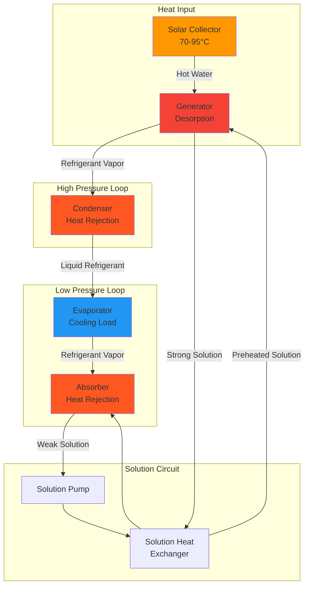
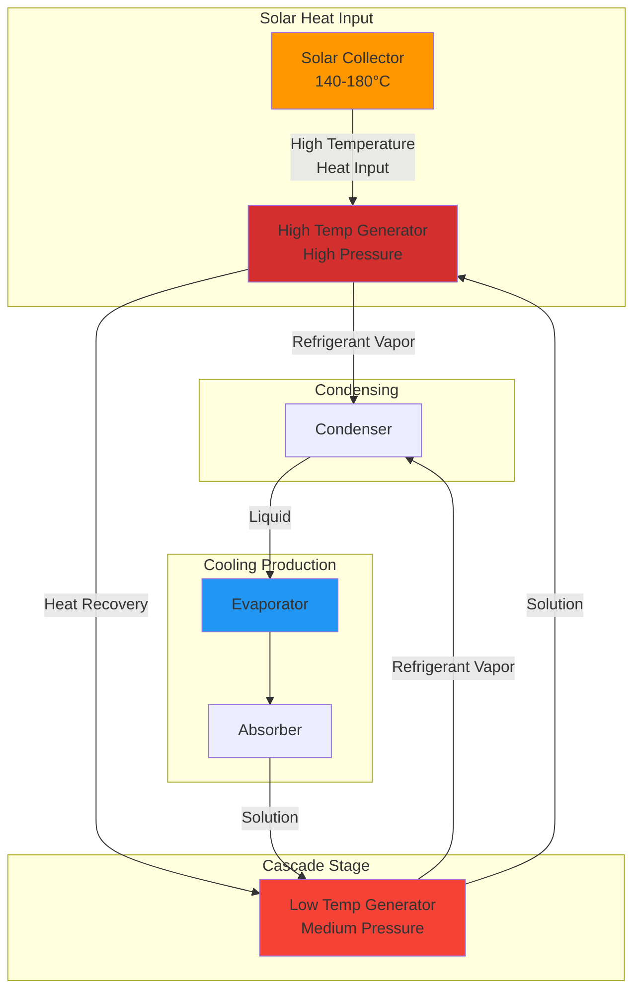

## Fundamentals of Solar Absorption Cooling

Solar absorption cooling converts thermal energy from solar collectors into cooling capacity through a thermally-driven refrigeration cycle. Unlike vapor compression systems that require high-grade electrical energy, absorption systems operate on low to medium-grade thermal energy (70-200°C), making them ideal for solar thermal integration.

The absorption cycle substitutes the mechanical compressor with a thermal compressor consisting of an absorber, generator, solution pump, and heat exchanger. This fundamental difference enables direct coupling with solar thermal collectors.

## Working Fluid Pairs

Two primary refrigerant-absorbent combinations dominate solar absorption applications:

### LiBr-Water Systems

**Configuration:** Water serves as refrigerant; lithium bromide (LiBr) as absorbent

**Characteristics:**
- Evaporator temperatures: 3-10°C
- Generator temperatures: 70-95°C (single effect), 140-180°C (double effect)
- Operating pressure: Deep vacuum (0.6-7 kPa)
- High COP: 0.7-0.8 (single effect), 1.1-1.3 (double effect)
- **Limitation:** Cannot produce temperatures below 0°C (water freezing point)
- Crystallization risk at high LiBr concentrations

**Applications:** Air conditioning, process cooling above 0°C

### Ammonia-Water Systems

**Configuration:** Ammonia (NH₃) serves as refrigerant; water as absorbent

**Characteristics:**
- Evaporator temperatures: -60 to +10°C
- Generator temperatures: 120-180°C
- Operating pressure: Elevated (200-2000 kPa)
- Lower COP: 0.5-0.7
- Requires rectifier column (water volatility)

**Applications:** Ice production, cold storage, low-temperature applications

## Single Effect Absorption Cycle

**Energy Balance - Generator:**

$$Q_g = \dot{m}_r h_{fg} + \dot{m}_s (h_{s,out} - h_{s,in})$$

Where:
- $Q_g$ = Generator heat input (kW)
- $\dot{m}_r$ = Refrigerant mass flow rate (kg/s)
- $h_{fg}$ = Latent heat of vaporization (kJ/kg)
- $\dot{m}_s$ = Solution mass flow rate (kg/s)

**Coefficient of Performance:**

$$COP = \frac{Q_e}{Q_g} = \frac{\text{Cooling capacity}}{\text{Heat input}}$$

For single effect LiBr-water systems:

$$COP_{SE} = 0.65 - 0.75$$

Practical values depend on:
- Generator temperature (higher $T_g$ → lower COP)
- Evaporator temperature (lower $T_e$ → lower COP)
- Cooling water temperature (higher $T_{cw}$ → lower COP)

## Double Effect Absorption Cycle

Double effect systems employ two generators operating at different pressure levels, extracting additional work from the heat source. The high-temperature generator (HTG) operates at 140-180°C, while the low-temperature generator (LTG) operates at 70-95°C using heat rejected from the HTG.

**Double Effect COP:**

$$COP_{DE} = 1.1 - 1.3$$

The performance improvement stems from cascading heat recovery:

$$Q_{LTG} = Q_{HTG,reject}$$

**Heat balance across both generators:**

$$Q_{solar} = Q_{HTG} = Q_e \left(\frac{1}{COP_{DE}}\right)$$

## Solar Collector Coupling

### Temperature Matching

Critical requirement: Solar collector outlet temperature must exceed minimum generator temperature with sufficient margin for heat exchanger approach.

| System Type | Generator Temp | Required Collector Temp | Collector Type |
|-------------|---------------|------------------------|----------------|
| Single Effect LiBr | 75-90°C | 85-100°C | Evacuated tube, flat plate |
| Double Effect LiBr | 145-175°C | 160-190°C | Evacuated tube, parabolic trough |
| NH₃-H₂O Single | 120-150°C | 135-165°C | Evacuated tube |

### System Configuration

**Direct coupling:** Solar loop directly supplies generator

$$\dot{m}_{solar} c_p (T_{out} - T_{in}) = Q_g$$

**Indirect coupling with storage:** Thermal storage buffer decouples solar availability from cooling demand

$$V_{storage} = \frac{Q_{cooling} \times t_{autonomy}}{\rho c_p \Delta T \times \eta_{storage}}$$

Where:
- $V_{storage}$ = Storage tank volume (m³)
- $t_{autonomy}$ = Hours of operation without solar input
- $\eta_{storage}$ = Storage efficiency (0.85-0.95)

### Performance Optimization

**Solar fraction:** Portion of annual cooling load met by solar energy

$$SF = \frac{Q_{solar,delivered}}{Q_{cooling,total}}$$

Typical solar fractions: 60-80% for well-designed systems in high-insolation climates.

## Heat Rejection Requirements

Absorption systems reject heat at three points: condenser, absorber, and (for double effect) LTG. Total heat rejection exceeds cooling capacity:

$$Q_{rejection} = Q_g + Q_e$$

For COP = 0.7:

$$Q_{rejection} = 1.43 \times Q_e + Q_e = 2.43 \times Q_e$$

**Cooling tower sizing:**

$$\dot{m}_{cw} = \frac{Q_{rejection}}{c_p \Delta T_{cw}}$$

Standard approach: 5-7°C rise across cooling water circuit.

## ASHRAE Design Guidelines

**ASHRAE Standard 90.1** addresses absorption chiller efficiency requirements in Section 6.4.1.1. Minimum efficiency ratings:

- Single effect, air-cooled: COP ≥ 0.60
- Single effect, water-cooled: COP ≥ 0.70
- Double effect, indirect-fired: COP ≥ 1.00

**ASHRAE Handbook - HVAC Systems and Equipment (Chapter 18)** provides detailed absorption system design procedures including:
- Refrigerant property tables for LiBr-water and NH₃-H₂O
- Part-load performance curves
- Crystallization prevention strategies
- Purge system requirements for air-cooled systems

## System Integration Considerations

**Capacity modulation:** Absorption chillers modulate by varying generator heat input. Turndown ratios of 10-100% are achievable with staged or continuous modulation.

**Parasitic loads:** Solution pump power is minimal (1-2% of cooling capacity), but cooling tower fans and pumps consume 3-5% of cooling output.

**Thermal inertia:** Large refrigerant and solution volumes provide inherent storage, smoothing short-term solar transients without dedicated thermal storage.

**Crystallization protection:** LiBr systems require dilution cycles when extended shutdown occurs at elevated ambient temperatures. Solution concentration must remain below saturation limits.

## Economic and Environmental Performance

Solar absorption cooling eliminates electric compression work, reducing peak electrical demand during summer cooling periods. This demand reduction provides significant utility cost savings in time-of-use rate structures.

Primary energy ratio (PER) compares total primary energy consumption to conventional systems:

$$PER = \frac{E_{electric,conventional}}{E_{thermal,solar} / \eta_{solar} + E_{parasitic}}$$

Values exceeding 1.2 indicate favorable primary energy performance relative to conventional electric chillers, particularly when solar thermal efficiency remains above 50%.
