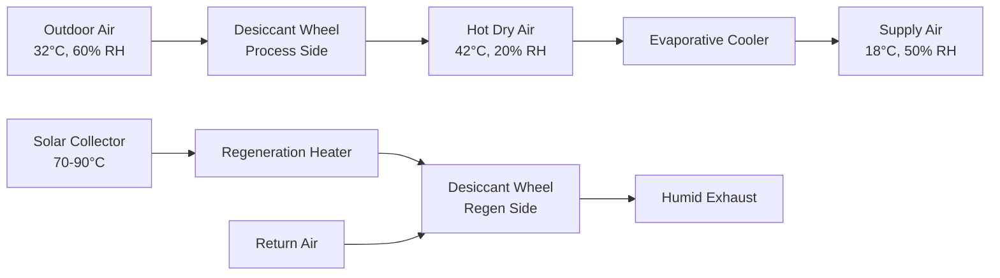
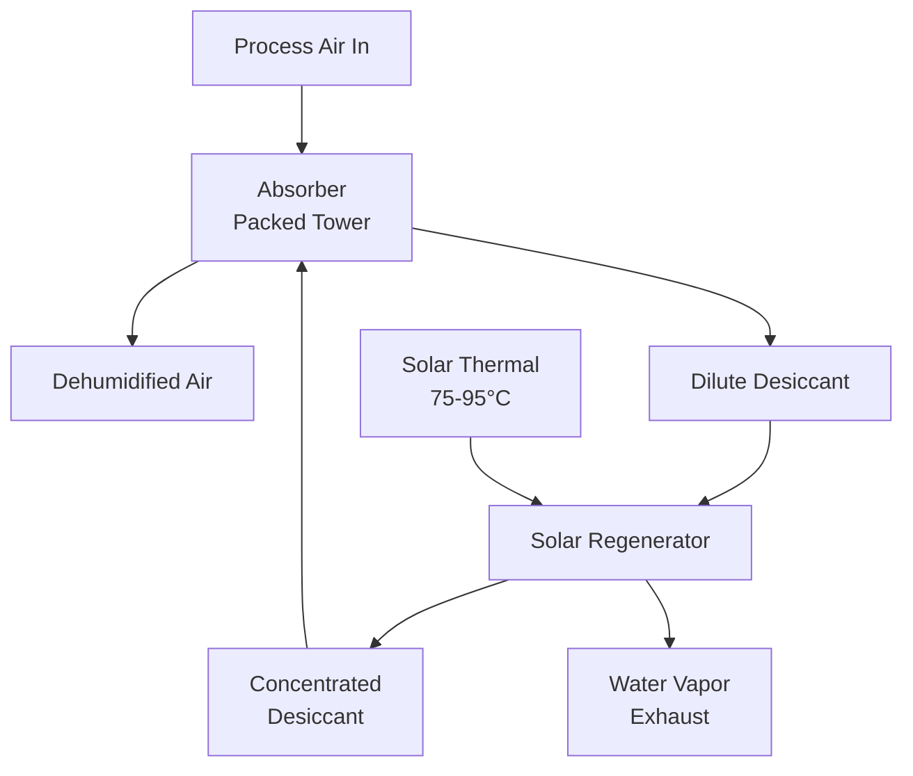

## Overview

Solar desiccant cooling systems integrate hygroscopic materials with solar thermal energy to provide simultaneous dehumidification and sensible cooling. These systems exploit the thermodynamic properties of desiccants—substances with high moisture affinity—that absorb water vapor from air, releasing heat in the process. Solar thermal collectors supply the regeneration energy required to drive absorbed moisture from the desiccant, completing the thermodynamic cycle.

The fundamental advantage lies in converting low-grade thermal energy (70-95°C) from solar collectors into cooling capacity, eliminating vapor-compression electricity demand while addressing latent loads directly.

## Thermodynamic Principles

### Desiccant Dehumidification Process

The moisture removal process follows sorption thermodynamics. When air contacts the desiccant surface, water vapor transfers from the humid air to the desiccant according to the vapor pressure differential:

$$
\dot{m}_w = h_m A_s (P_{v,air} - P_{v,desiccant})
$$

Where:
- $\dot{m}_w$ = moisture transfer rate (kg/s)
- $h_m$ = mass transfer coefficient (kg/s·m²·Pa)
- $A_s$ = desiccant surface area (m²)
- $P_{v,air}$ = vapor pressure in air (Pa)
- $P_{v,desiccant}$ = vapor pressure at desiccant surface (Pa)

The adsorption process is exothermic, releasing the latent heat of condensation plus heat of adsorption:

$$
q_{ads} = \dot{m}_w (h_{fg} + \Delta h_{ads})
$$

Where:
- $q_{ads}$ = heat release during adsorption (W)
- $h_{fg}$ = latent heat of vaporization (2440 kJ/kg at 25°C)
- $\Delta h_{ads}$ = differential heat of adsorption (200-400 kJ/kg)

This heat release elevates air temperature during dehumidification, typically 10-15°C for silica gel and 15-25°C for lithium chloride systems.

### Regeneration Energy Requirements

Solar thermal energy drives desiccant regeneration by reversing the sorption equilibrium. The required thermal energy per kg of water removed:

$$
Q_{regen} = \dot{m}_w \left( h_{fg,regen} + \Delta h_{ads} + c_p \Delta T_{sensible} \right)
$$

Where:
- $Q_{regen}$ = regeneration heat input (kJ/kg)
- $h_{fg,regen}$ = latent heat at regeneration temperature
- $c_p \Delta T_{sensible}$ = sensible heating of desiccant and air

Typical regeneration energy ranges from 3000-4500 kJ/kg water removed, depending on regeneration temperature and desiccant type.

## System Configurations

### Solid Desiccant Wheel Systems

Rotary desiccant wheels contain silica gel or molecular sieve material structured in a honeycomb matrix. The wheel rotates continuously between process and regeneration airstreams:

**Performance Parameters:**

| Parameter | Typical Range | Units |
|-----------|---------------|-------|
| Wheel rotation speed | 8-20 | rev/hr |
| Face velocity | 2.0-3.5 | m/s |
| Moisture removal | 6-12 | g/kg dry air |
| Regeneration temperature | 70-90 | °C |
| Thermal COP | 0.5-0.8 | - |

### Liquid Desiccant Systems

Liquid desiccants (lithium chloride, lithium bromide, calcium chloride) contact air in packed towers or spray chambers. The concentrated solution absorbs moisture, becoming diluted, then solar heat regenerates the solution:

**Liquid Desiccant Comparison:**

| Desiccant | Concentration | Regen Temp | Vapor Pressure | Corrosivity |
|-----------|---------------|------------|----------------|-------------|
| LiCl | 35-42% | 65-85°C | Very Low | High |
| LiBr | 45-55% | 70-90°C | Low | Moderate |
| CaCl₂ | 38-45% | 75-95°C | Moderate | Very High |

## Solar Thermal Integration

### Collector Requirements

Solar desiccant systems require intermediate-temperature collectors producing 70-95°C output. Evacuated tube collectors (ETCs) provide optimal performance due to higher efficiency at elevated temperatures:

**Collector Efficiency Comparison:**

| Collector Type | Peak Efficiency | Efficiency at 80°C | Cost Factor |
|----------------|-----------------|---------------------|-------------|
| Flat plate | 75-80% | 35-45% | 1.0× |
| Evacuated tube | 65-75% | 50-65% | 1.8-2.5× |
| Compound parabolic | 70-75% | 55-70% | 2.0-3.0× |

### Thermal Storage Integration

Solar fraction optimization requires thermal storage to buffer collector output variability. Storage tank sizing follows:

$$
V_{storage} = \frac{Q_{cooling,daily} \cdot t_{storage}}{c_p \rho \Delta T \cdot \eta_{storage}}
$$

Where:
- $V_{storage}$ = storage volume (m³)
- $Q_{cooling,daily}$ = daily cooling energy demand (kWh)
- $t_{storage}$ = storage duration (hours)
- $\eta_{storage}$ = storage efficiency (0.85-0.95)

Typical installations use 50-100 liters per m² of collector area for daily storage.

## Performance Metrics

### Coefficient of Performance

Solar desiccant system COP accounts for both thermal and electrical inputs:

$$
COP_{thermal} = \frac{Q_{cooling}}{Q_{solar} + Q_{parasitic,thermal}}
$$

$$
COP_{electrical} = \frac{Q_{cooling}}{W_{fans} + W_{pumps}}
$$

Thermal COP typically ranges 0.5-0.8, while electrical COP exceeds 10-20 due to minimal compressor loads.

### Solar Fraction

The proportion of regeneration energy supplied by solar collectors:

$$
SF = \frac{Q_{solar,useful}}{Q_{regen,total}}
$$

Well-designed systems achieve solar fractions of 0.60-0.85 in sunny climates, with auxiliary heating providing backup during low-insolation periods.

## Application Considerations

### Climate Suitability

Solar desiccant cooling performs optimally in hot-humid climates where:
- Latent loads exceed 30% of total cooling
- Solar insolation exceeds 5 kWh/m²·day
- Ambient humidity ratios exceed 12 g/kg

ASHRAE Standard 62.1 ventilation air requirements in humid climates create substantial latent loads ideally matched to desiccant capabilities.

### Integration with Conventional Systems

Hybrid configurations combine desiccant dehumidification with vapor-compression sensible cooling:

**System Comparison:**

| Configuration | Latent Handling | Sensible Handling | Electrical Use | Complexity |
|---------------|-----------------|-------------------|----------------|------------|
| Desiccant only | Excellent | Poor | Very Low | Low |
| Hybrid | Excellent | Excellent | Moderate | High |
| Conventional | Poor | Excellent | High | Low |

### Economic Analysis

Initial capital costs for solar desiccant systems range $800-1500 per kW cooling capacity, 2-3× conventional systems. However, operational savings in hot-humid climates with high electricity costs yield payback periods of 8-15 years.

ASHRAE Standard 90.1 energy models demonstrate 40-60% source energy reduction compared to conventional systems in favorable applications.

## Design Guidelines

### Sizing Methodology

1. **Calculate peak latent load** from ASHRAE psychrometric analysis
2. **Determine moisture removal rate** based on process air conditions
3. **Size desiccant component** for required dehumidification capacity
4. **Calculate regeneration energy** from thermodynamic requirements
5. **Size solar collector array** for target solar fraction
6. **Design thermal storage** for load profile matching

### Control Strategies

Optimal performance requires:
- Modulating regeneration temperature based on ambient humidity
- Variable wheel speed or solution flow based on moisture load
- Solar collector tracking for maximum thermal gain
- Hybrid system sequencing to minimize auxiliary energy

## Future Developments

Advanced materials research focuses on composite desiccants with enhanced moisture capacity and lower regeneration temperatures (55-70°C), enabling flat-plate collector use and improving thermal COP to 1.0-1.2.

Integration with photovoltaic-thermal (PVT) collectors producing both electricity and thermal energy represents a promising pathway for improved overall system efficiency and economics.

---

**References:**
- ASHRAE Handbook—HVAC Systems and Equipment, Chapter 24: Desiccant Dehumidification and Pressure Drying Equipment
- ASHRAE Standard 90.1: Energy Standard for Buildings Except Low-Rise Residential Buildings
- ASHRAE Standard 62.1: Ventilation for Acceptable Indoor Air Quality