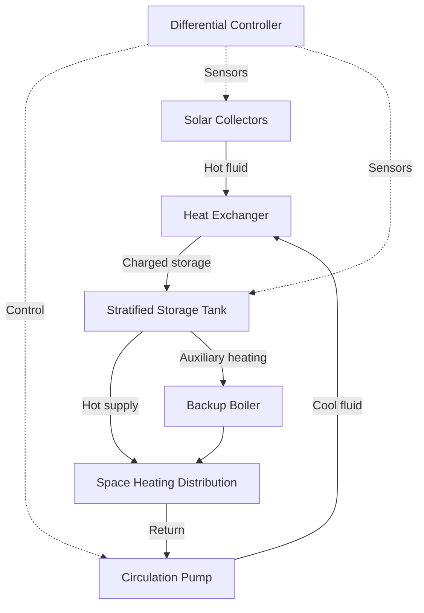

## Overview

Solar space heating systems convert solar radiation into useful thermal energy for building heating applications. These systems reduce conventional heating loads through passive architectural features or active mechanical collection and distribution, achieving solar fractions of 30-70% in properly designed installations.

The fundamental energy conversion follows:

$$Q_{useful} = A_c F_R[(\tau\alpha)I_T - U_L(T_i - T_a)]$$

Where:
- $Q_{useful}$ = useful energy gain (W)
- $A_c$ = collector area (m²)
- $F_R$ = heat removal factor (dimensionless)
- $\tau\alpha$ = transmittance-absorptance product (dimensionless)
- $I_T$ = total incident radiation (W/m²)
- $U_L$ = overall loss coefficient (W/m²·K)
- $T_i$ = inlet fluid temperature (K)
- $T_a$ = ambient temperature (K)

## System Classification

### Active Solar Heating Systems

Active systems employ mechanical equipment to collect, store, and distribute solar thermal energy.

**Key Components:**
- Solar collectors (flat plate or evacuated tube)
- Heat transfer fluid circulation pumps
- Thermal storage tanks (typically 50-75 L per m² of collector)
- Heat exchangers
- Distribution system (hydronic or forced air)
- Differential temperature controllers

**System Types:**

| System Type | Heat Transfer Fluid | Distribution Method | Freeze Protection | Typical Efficiency |
|-------------|---------------------|---------------------|-------------------|-------------------|
| Direct liquid | Water | Hydronic | Drainback/glycol | 35-50% |
| Indirect liquid | Glycol/water | Heat exchanger to hydronic | Inherent | 30-45% |
| Air systems | Air | Forced air ducts | Not required | 25-40% |
| Drainback | Water | Hydronic with drainback tank | Gravity drainback | 35-50% |

### Passive Solar Heating Systems

Passive systems utilize building envelope design to capture, store, and distribute solar energy without mechanical equipment.

**Direct Gain Systems:**
- Solar radiation enters through south-facing glazing
- Thermal mass (concrete, masonry, water) absorbs and stores energy
- Heat releases during non-solar periods through natural convection and radiation

Effective aperture area calculation:

$$A_{eff} = A_g \times \tau \times LCR$$

Where $A_g$ is glazing area, $\tau$ is transmittance, and $LCR$ is the load collector ratio.

**Indirect Gain Systems:**
- Thermal storage wall (Trombe wall or water wall) positioned between glazing and space
- Wall thickness typically 200-400 mm for masonry
- Thermocirculation vents enable convective heat transfer

**Isolated Gain Systems:**
- Sunspaces and attached greenhouses capture solar energy
- Thermal isolation from main building allows temperature float
- Common wall thermal mass transfers energy to conditioned space

## Collector Performance Analysis

Solar collector efficiency varies with operating conditions according to the Hottel-Whillier-Bliss equation:

$$\eta = F_R(\tau\alpha) - F_R U_L \frac{(T_i - T_a)}{I_T}$$

Performance parameters for common collector types:

| Collector Type | $F_R(\tau\alpha)$ | $F_R U_L$ (W/m²·K) | Stagnation Temp (°C) | Cost ($/m²) |
|----------------|-------------------|---------------------|----------------------|-------------|
| Single glazed flat plate | 0.70-0.75 | 4.5-6.0 | 90-120 | 150-250 |
| Double glazed flat plate | 0.65-0.70 | 3.0-4.0 | 110-140 | 200-300 |
| Evacuated tube | 0.65-0.72 | 1.0-2.0 | 180-250 | 400-600 |
| Unglazed collector | 0.85-0.90 | 15-25 | 40-60 | 50-100 |

The collector tilt angle for maximum annual space heating energy collection approximates:

$$\beta = \phi + 15°$$

Where $\phi$ is the latitude. For winter-dominant heating, increase by an additional 10-15°.

## Thermal Storage Integration

Thermal storage decouples collection from load and provides energy during non-solar periods. Storage capacity sizing follows:

$$V_{storage} = \frac{A_c \times Q_{daily} \times \tau_{storage}}{\rho c_p \Delta T}$$

Design parameters:
- Storage period ($\tau_{storage}$): 1-3 days for residential applications
- Temperature differential ($\Delta T$): 10-20 K for liquid systems
- Volume ratio: 50-100 L of water per m² of collector area

**Storage Configuration:**

Stratification effectiveness significantly impacts system performance. Temperature gradient within storage should maintain:

$$\frac{dT}{dz} \geq 5 \text{ K/m}$$

Where $z$ is the vertical height coordinate.

## System Sizing Methodology

Solar fraction represents the percentage of heating load supplied by solar energy:

$$SF = 1 - \frac{Q_{aux}}{Q_{load}}$$

The f-Chart method (ASHRAE Standard 93) provides monthly solar fraction estimates based on dimensionless parameters:

**Dimensionless absorbed radiation:**

$$X = \frac{A_c F_R U_L (T_{ref} - T_a)\Delta t}{Q_{load}}$$

**Dimensionless collector gain:**

$$Y = \frac{A_c F_R (\tau\alpha) \overline{H_T}}{Q_{load}}$$

Where $T_{ref}$ = 100°C reference temperature, $\Delta t$ = time period, and $\overline{H_T}$ = monthly average daily radiation on collector.

Economic optimum occurs when marginal cost of additional collector area equals the present value of fuel savings. System sizing typically targets SF = 40-60% for cost-effectiveness in most climates.

## Distribution System Integration

### Hydronic Distribution

Low-temperature radiant floor systems match solar collector output temperatures (30-50°C) more effectively than conventional radiators requiring 60-80°C.

Flow rate calculation for collector loop:

$$\dot{m} = \frac{Q_{useful}}{c_p \Delta T_{design}}$$

Design temperature rise across collectors: 5-10 K for optimal heat removal factor.

### Forced Air Distribution

Air-based systems integrate with conventional ducted heating. Collector-to-storage airflow rates:

$$\dot{V} = \frac{A_c \times 10-15 \text{ L/s per m²}}{1}$$

Rock bed thermal storage specific volume: 0.2-0.3 m³ per m² of collector area.

## Control Strategies

Differential temperature controllers activate circulation when:

$$T_{collector} \geq T_{storage} + \Delta T_{on}$$

Typical settings:
- $\Delta T_{on}$ = 5-8 K (pump on)
- $\Delta T_{off}$ = 2-3 K (pump off)
- High limit: 90-95°C (collector protection)

Advanced control sequences include:
- Collector freeze protection (drainback activation or glycol circulation)
- Over-temperature protection (heat rejection or circulation increase)
- Load-prioritized storage charging
- Auxiliary heating lockout during solar availability

## Design Considerations per ASHRAE Standards

**ASHRAE Standard 90.2** specifies passive solar design criteria:
- South-facing glazing area: 7-12% of conditioned floor area
- Thermal mass: minimum 6× glazing area
- Night insulation recommended for R-value improvement

**ASHRAE Standard 93** defines collector testing procedures:
- Steady-state thermal performance testing
- Time constant determination
- Incident angle modifier characterization

**ASHRAE Handbook—HVAC Applications Chapter 35** provides detailed design guidance for solar energy applications including shading analysis, load calculations, and economic evaluation methodologies.

System performance monitoring should track:
- Solar fraction achieved versus design
- Collector efficiency at various operating conditions
- Storage temperature stratification
- Parasitic energy consumption (pumps, controls)

Proper commissioning verifies sensor calibration, control sequences, flow balancing, and storage charging profiles to ensure design performance achievement.

## Performance Optimization

Key optimization strategies:
- Minimize piping thermal losses (insulation R-value ≥ 1.0 m²·K/W)
- Maximize collector tilt and azimuth alignment (±15° tolerance)
- Implement load-side temperature reset based on outdoor conditions
- Schedule auxiliary heating to prevent storage depletion
- Annual maintenance of glazing transmittance and selective coating integrity

Well-designed solar space heating systems provide reliable, low-carbon thermal energy with 20-30 year system lifespans and simple payback periods of 8-15 years depending on conventional fuel costs and local solar resource availability.
