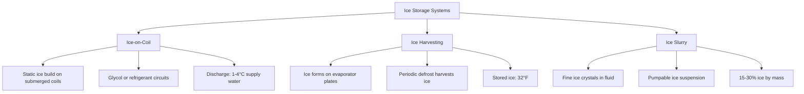
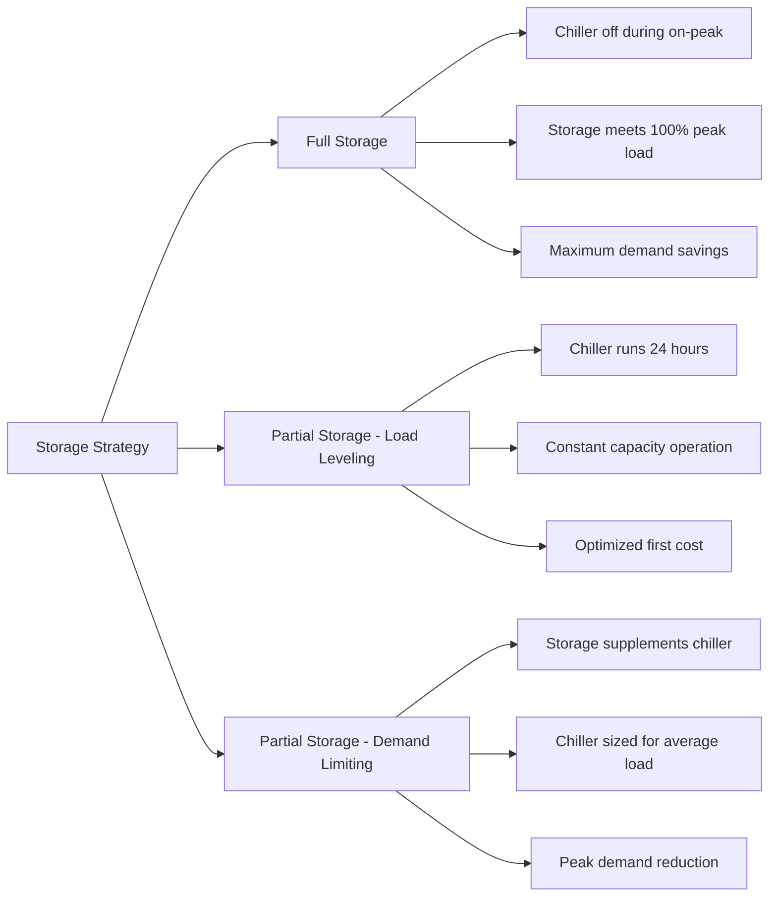

## Overview of Thermal Energy Storage

Thermal energy storage (TES) systems decouple cooling production from consumption, enabling utilities to shift electrical demand away from peak periods. These systems store cooling capacity during off-peak hours when electricity rates are lower and equipment operates more efficiently, then discharge during peak demand periods.

The fundamental principle involves storing sensible heat (temperature change) or latent heat (phase change) in storage media. Advanced TES systems achieve energy densities ranging from 10 kWh/m³ for sensible chilled water storage to over 80 kWh/m³ for ice-based latent storage.

## Ice-Based Thermal Storage

### Physical Principles

Ice storage exploits water's latent heat of fusion (334 kJ/kg) to achieve high energy density in compact volumes. During charging, a chiller produces ice or an ice-water mixture at temperatures between -10°C and 0°C. During discharge, warm return water melts the ice, absorbing thermal energy.

The total storage capacity combines sensible and latent components:

$$Q_{total} = m_{water} \cdot c_p \cdot \Delta T_{sensible} + m_{ice} \cdot h_{fusion}$$

Where:
- $Q_{total}$ = total cooling capacity (kJ)
- $m_{water}$ = mass of water (kg)
- $c_p$ = specific heat of water (4.18 kJ/kg·K)
- $\Delta T_{sensible}$ = temperature change during sensible cooling (K)
- $m_{ice}$ = mass of ice formed (kg)
- $h_{fusion}$ = latent heat of fusion (334 kJ/kg)

### Ice Storage Configurations

### Design Calculations

For a commercial building requiring 500 ton-hours of storage:

$$V_{tank} = \frac{Q_{required}}{\rho_{water} \cdot \left(c_p \cdot \Delta T + f_{ice} \cdot h_{fusion}\right)}$$

Assuming 85% ice fraction during full charge:

$$V_{tank} = \frac{500 \text{ ton-hr} \times 12{,}660 \text{ kJ/ton-hr}}{1000 \text{ kg/m}^3 \times \left(4.18 \times 10 + 0.85 \times 334\right)} = 21.8 \text{ m}^3$$

This represents approximately 60% volume reduction compared to equivalent chilled water storage.

## Chilled Water Storage

### Stratified Storage Tanks

Chilled water storage relies on thermal stratification—density differences maintain distinct warm and cold water layers. The Richardson number quantifies stratification stability:

$$Ri = \frac{g \cdot \beta \cdot \Delta T \cdot H}{u^2}$$

Where:
- $Ri$ = Richardson number (dimensionless)
- $g$ = gravitational acceleration (9.81 m/s²)
- $\beta$ = thermal expansion coefficient (°C⁻¹)
- $\Delta T$ = temperature difference between layers (°C)
- $H$ = tank height (m)
- $u$ = characteristic velocity (m/s)

Stable stratification requires $Ri > 10$. Diffuser design maintains low inlet velocities (< 0.05 m/s) to prevent mixing.

Storage capacity for chilled water systems:

$$Q_{storage} = \rho \cdot V \cdot c_p \cdot \Delta T \cdot \eta_{thermal}$$

For a 5,000 m³ tank with 12°C differential and 85% thermal efficiency:

$$Q_{storage} = 1000 \times 5000 \times 4.18 \times 12 \times 0.85 = 213{,}000 \text{ MJ} = 59{,}200 \text{ kWh}$$

## Phase Change Materials (PCM)

### Material Selection Criteria

PCM systems leverage materials with phase transition temperatures aligned with HVAC applications (typically 5-25°C for cooling). Selection criteria include:

| Property | Requirement | Typical Values |
|----------|-------------|----------------|
| Melting point | Application-specific | 8-15°C (cooling) |
| Latent heat | > 150 kJ/kg | 150-250 kJ/kg |
| Thermal conductivity | > 0.5 W/m·K | 0.2-0.6 W/m·K |
| Subcooling | < 2°C | 0.5-3°C |
| Cycle stability | > 10,000 cycles | Material-dependent |

### PCM Storage Capacity

The effective thermal conductivity determines charge/discharge rates:

$$\frac{dQ}{dt} = k_{eff} \cdot A \cdot \frac{\Delta T}{\delta}$$

Where:
- $\frac{dQ}{dt}$ = heat transfer rate (W)
- $k_{eff}$ = effective thermal conductivity (W/m·K)
- $A$ = heat transfer area (m²)
- $\Delta T$ = temperature difference (K)
- $\delta$ = characteristic length (m)

Enhanced PCM systems incorporate metal matrices, graphite additives, or microencapsulation to increase thermal conductivity from typical values of 0.2 W/m·K to 2-5 W/m·K.

## Seasonal Underground Thermal Energy Storage

### Aquifer Thermal Energy Storage (ATES)

ATES systems inject thermally conditioned water into aquifers during one season and extract it during opposite seasons. The stored thermal energy follows:

$$Q_{seasonal} = \rho_{water} \cdot V_{aquifer} \cdot c_p \cdot \Delta T \cdot \eta_{recovery}$$

Recovery efficiency typically ranges from 50-70% for seasonal storage, accounting for thermal losses to surrounding geology and incomplete hydraulic recovery.

### Borehole Thermal Energy Storage (BTES)

BTES consists of vertical boreholes (50-200 m deep) containing heat exchangers. Heat diffuses into surrounding soil/rock. The thermal diffusion length over time $t$ is:

$$\delta_{thermal} = \sqrt{4 \alpha t}$$

Where $\alpha$ is thermal diffusivity (m²/s). For a 6-month storage cycle in granite ($\alpha \approx 1.2 \times 10^{-6}$ m²/s):

$$\delta_{thermal} = \sqrt{4 \times 1.2 \times 10^{-6} \times 15{,}552{,}000} = 8.6 \text{ m}$$

This calculation determines minimum borehole spacing to prevent thermal interference.

## Demand Shifting Strategies

### Full Storage vs. Partial Storage

### Economic Analysis

The demand charge savings for partial storage:

$$\text{Savings} = \Delta kW_{demand} \times \text{Rate}_{\$/kW} \times 12 \text{ months} + \Delta kWh \times \text{Rate}_{\$/kWh}$$

ASHRAE Standard 90.1 provides calculation procedures for demonstrating energy cost savings through TES implementation.

## Control Strategies and Optimization

Advanced control sequences maximize economic benefit:

1. **Priority charging**: Complete ice/cold water production during lowest-cost periods
2. **Discharge optimization**: Release stored cooling to minimize peak demand charges
3. **Inventory management**: Maintain minimum reserve for unexpected loads
4. **Weather-based prediction**: Adjust charging based on next-day forecasts

The state of charge (SOC) during discharge follows:

$$\text{SOC}(t) = \text{SOC}_0 - \int_0^t \frac{\dot{Q}_{load}(\tau)}{Q_{total}} d\tau$$

Where $\dot{Q}_{load}$ represents the instantaneous cooling load met by storage.

## Design Standards and References

**ASHRAE Standards:**
- ASHRAE Guideline 36: High-Performance Sequences of Operation for HVAC Systems (storage integration)
- ASHRAE Standard 90.1: Energy Standard for Buildings (TES credits)
- ASHRAE Applications Handbook, Chapter 51: Thermal Storage

**Key Design Parameters:**
- Minimum tank insulation: R-10 to R-20 (climate-dependent)
- Maximum charge/discharge rates: 0.1-0.3 of total capacity per hour
- Temperature differentials: 10-16°C for chilled water, 8-12°C for ice systems
- Safety factors: 1.1-1.15 for storage capacity sizing

Advanced thermal energy storage represents a critical technology for grid flexibility, renewable energy integration, and operational cost reduction in modern HVAC systems.
