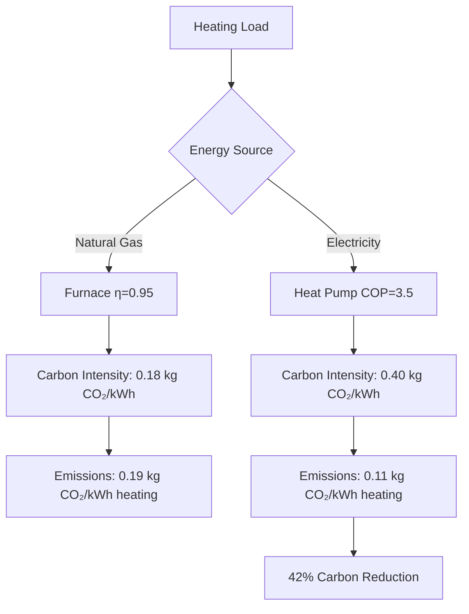
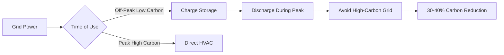

# Carbon Reduction Strategies in HVAC Systems

Carbon reduction in HVAC systems addresses both operational carbon emissions from energy consumption and embodied carbon from equipment manufacturing and refrigerant use. HVAC systems typically represent 40-60% of building energy consumption, making them the primary target for decarbonization efforts.

## Carbon Emission Sources

HVAC systems contribute to carbon emissions through three primary pathways:

**Operational Carbon**: Energy consumed during system operation converts to carbon emissions based on grid electricity carbon intensity. This represents the largest contribution over equipment lifetime.

**Embodied Carbon**: Manufacturing, transportation, and installation of HVAC equipment releases carbon. Equipment-intensive systems like variable refrigerant flow have higher embodied carbon than simpler approaches.

**Refrigerant Carbon**: Direct emissions from refrigerant leakage and indirect emissions from energy penalties due to refrigerant properties combine to create significant climate impact.

## Operational Carbon Reduction

### Energy Efficiency Optimization

The relationship between energy consumption and carbon emissions follows:

$$
\text{Carbon Emissions} = E_{\text{annual}} \times \text{EF}_{\text{grid}} \times \eta_{\text{transmission}}
$$

Where:
- $E_{\text{annual}}$ = annual energy consumption (kWh)
- $\text{EF}_{\text{grid}}$ = grid emission factor (kg CO₂/kWh)
- $\eta_{\text{transmission}}$ = transmission efficiency factor

Key efficiency strategies include:

| Strategy | Carbon Reduction Potential | Implementation Cost | Payback Period |
|----------|---------------------------|---------------------|----------------|
| High-efficiency chillers (COP 6.5+) | 25-35% | High | 8-12 years |
| Heat pump systems | 40-60% | Medium-High | 5-10 years |
| Demand-controlled ventilation | 15-25% | Low-Medium | 2-4 years |
| Advanced controls optimization | 10-20% | Medium | 3-5 years |
| Energy recovery ventilation | 20-30% | Medium | 4-7 years |
| Variable speed drives | 15-25% | Low-Medium | 2-4 years |

### Load Reduction Through Design

Reducing heating and cooling loads directly decreases carbon emissions. The cooling load reduction equation:

$$
Q_{\text{reduced}} = Q_{\text{baseline}} - \left(Q_{\text{envelope}} + Q_{\text{ventilation}} + Q_{\text{internal}}\right)_{\text{improved}}
$$

Building envelope improvements reduce transmitted loads:

$$
Q_{\text{envelope}} = U \times A \times \Delta T
$$

Where lower U-values (improved insulation) directly reduce $Q_{\text{envelope}}$ and corresponding carbon emissions.

## Electrification and Fuel Switching

### Heat Pump Deployment

Replacing fossil fuel heating with electric heat pumps reduces carbon emissions in grids with carbon intensity below 0.5 kg CO₂/kWh. The carbon emission comparison:

$$
\text{Carbon}_{\text{fossil}} = \frac{Q_{\text{heating}}}{\eta_{\text{furnace}}} \times \text{EF}_{\text{fuel}}
$$

$$
\text{Carbon}_{\text{heat pump}} = \frac{Q_{\text{heating}}}{\text{COP}_{\text{HP}}} \times \text{EF}_{\text{electric}}
$$

For heat pumps to reduce carbon emissions:

$$
\frac{Q_{\text{heating}}}{\text{COP}_{\text{HP}}} \times \text{EF}_{\text{electric}} < \frac{Q_{\text{heating}}}{\eta_{\text{furnace}}} \times \text{EF}_{\text{fuel}}
$$

## Refrigerant Management

### Low-GWP Refrigerant Selection

Refrigerant global warming potential (GWP) determines direct emission impact. ASHRAE Standard 34 categorizes refrigerants by safety and environmental properties.

| Refrigerant | GWP (100-year) | Application | Status |
|-------------|----------------|-------------|--------|
| R-410A | 2,088 | Residential/Light Commercial | Phase-down |
| R-32 | 675 | Residential/Light Commercial | Transitional |
| R-454B | 466 | Residential/Light Commercial | Low-GWP Alternative |
| R-513A | 631 | Chillers | Low-GWP Alternative |
| R-1234ze | 7 | Chillers | Ultra-low GWP |
| R-744 (CO₂) | 1 | Commercial Refrigeration | Natural Refrigerant |
| R-717 (Ammonia) | 0 | Industrial | Natural Refrigerant |

Total equivalent warming impact (TEWI) combines direct and indirect emissions:

$$
\text{TEWI} = \text{GWP} \times L_{\text{annual}} \times n + \text{GWP} \times m \times (1-\alpha) + n \times E_{\text{annual}} \times \beta
$$

Where:
- $L_{\text{annual}}$ = annual leakage rate (kg/year)
- $n$ = system lifetime (years)
- $m$ = refrigerant charge (kg)
- $\alpha$ = recovery factor at end-of-life
- $E_{\text{annual}}$ = annual energy consumption (kWh)
- $\beta$ = emission factor for electricity generation (kg CO₂/kWh)

### Leak Prevention and Recovery

Refrigerant containment reduces direct emissions. ASHRAE Standard 15 requires leak detection for charges exceeding threshold values. Strategies include:

- Quarterly leak inspections for systems above 50 lb charge
- Automatic leak detection systems
- Brazed connections instead of mechanical fittings
- Proper evacuation and recovery during maintenance
- End-of-life refrigerant reclamation

## Renewable Energy Integration

### On-site Generation

Photovoltaic solar generation reduces operational carbon by displacing grid electricity:

$$
\text{Carbon Avoided} = E_{\text{PV}} \times \text{EF}_{\text{grid}} \times (1 - f_{\text{curtailment}})
$$

Peak cooling loads align with peak solar generation, creating favorable synergy for carbon reduction.

### Thermal Energy Storage

Thermal storage shifts HVAC energy consumption to periods of lower grid carbon intensity or higher renewable generation:

$$
Q_{\text{storage}} = m \times c_p \times \Delta T \times \eta_{\text{storage}}
$$

For ice storage:

$$
Q_{\text{storage}} = m \times h_{\text{fusion}} \times \eta_{\text{storage}}
$$

Where $h_{\text{fusion}}$ = 334 kJ/kg for water provides high energy density.

## Control Optimization

Advanced control strategies reduce carbon emissions through intelligent operation:

**Demand Response**: Reduce HVAC loads during high grid carbon intensity periods by pre-cooling or temporarily relaxing setpoints within comfort bounds.

**Predictive Controls**: Machine learning algorithms predict optimal equipment staging based on weather forecasts, occupancy patterns, and grid carbon intensity forecasts.

**Trim and Respond**: Reset supply temperatures, static pressures, and flow rates based on actual zone demands rather than design conditions:

$$
T_{\text{supply,reset}} = T_{\text{supply,design}} + \Delta T_{\text{reset}}(1 - \text{Load Fraction})
$$

## Performance Verification

ASHRAE Guideline 14 provides measurement and verification protocols for carbon reduction validation. Normalized metered energy consumption (NMEC) approaches quantify savings:

$$
\text{Savings} = \left(\text{Baseline Energy} - \text{Reporting Period Energy}\right) \pm \text{Adjustments}
$$

Carbon reduction verification requires:

- Continuous energy metering at 15-minute intervals
- Outdoor air temperature recording
- Occupancy or operational parameter tracking
- Statistical analysis with coefficient of variation of root mean squared error (CV-RMSE) below 25%

Accurate carbon accounting translates measured energy savings to carbon reductions using marginal or average grid emission factors appropriate to the analysis boundary.

## Pathway to Net Zero

Achieving net-zero carbon HVAC systems requires combining multiple strategies:

1. **Maximize efficiency**: Deploy highest-efficiency equipment and controls
2. **Electrify systems**: Replace fossil fuel systems with heat pumps
3. **Select low-GWP refrigerants**: Minimize direct emissions
4. **Integrate renewable energy**: On-site generation or power purchase agreements
5. **Implement storage**: Shift loads to low-carbon periods
6. **Optimize operation**: Continuous commissioning and performance monitoring

The carbon reduction pathway follows diminishing returns, with initial efficiency improvements providing the highest cost-effectiveness before requiring renewable energy integration for full decarbonization.
